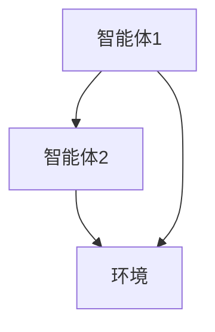
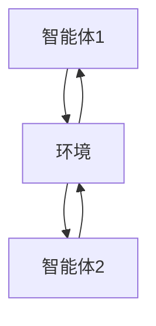
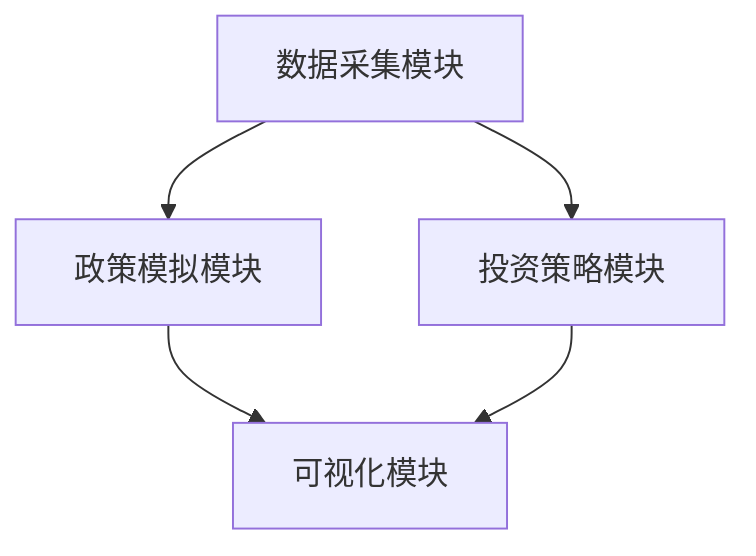

                 


# 价值投资中的AI驱动政策影响分析：多智能体系统的优势

## 关键词：价值投资、AI驱动、政策影响分析、多智能体系统、系统优势

## 摘要：本文深入探讨了价值投资中AI驱动政策影响分析的多智能体系统的优势。通过分析政策对金融市场的影响，结合多智能体系统的分布式计算和动态模拟特点，展示了其在政策风险评估、政策模拟和优化中的应用。文章从背景、算法、系统架构到项目实战，全面解析了多智能体系统在价值投资中的优势，为投资者和政策制定者提供了新的视角。

---

# 第1章: 价值投资与多智能体系统概述

## 1.1 价值投资的基本概念

### 1.1.1 价值投资的定义

价值投资是一种基于对公司内在价值的分析，以低于其内在价值的价格购买股票的投资策略。其核心在于寻找市场估值低于其实际价值的公司。

$$
\text{内在价值} = \frac{\text{未来现金流的现值}}{（1 + r)^n}
$$

其中，r为贴现率，n为时间跨度。

### 1.1.2 价值投资的核心理念

- **安全边际**：购买价格低于内在价值，以降低风险。
- **长期视角**：关注公司的长期盈利能力，而非短期市场波动。
- **逆向思维**：在市场恐慌时寻找机会，在市场狂热时保持冷静。

### 1.1.3 价值投资在现代金融中的地位

价值投资是投资策略的重要组成部分，尤其在应对市场不确定性时表现出色。然而，传统价值投资依赖人工分析，效率低下且难以量化政策影响。

---

## 1.2 多智能体系统的定义与特点

### 1.2.1 多智能体系统的定义

多智能体系统（Multi-Agent System, MAS）是由多个智能体（Agent）组成的分布式系统，智能体能够通过环境和与其他智能体的交互来感知和适应环境。

### 1.2.2 多智能体系统的核心特点

| 特性 | 描述 |
|------|------|
| 分布式 | 每个智能体独立决策，无中心控制 |
| 协作性 | 智能体之间可以协作以实现共同目标 |
| 反应性 | 能够实时感知环境变化并做出反应 |
| 动态性 | 系统状态随时间变化而变化 |

### 1.2.3 多智能体系统与传统AI的区别

- **传统AI**：基于规则或模型的单一智能体。
- **多智能体系统**：多个智能体协作，适用于复杂环境。



---

## 1.3 价值投资与政策影响的关联

### 1.3.1 政策对金融市场的基本影响

政策变化（如税率调整、行业监管）直接影响市场参与者的行为和市场结构。

### 1.3.2 价值投资中的政策分析需求

价值投资者需要评估政策变化对公司基本面的影响，以调整投资策略。

### 1.3.3 多智能体系统在政策分析中的优势

多智能体系统能够模拟政策变化对市场参与者的复杂交互，帮助投资者理解政策影响。

---

## 1.4 本章小结

本章介绍了价值投资的基本概念和多智能体系统的定义及特点，并探讨了政策影响分析的必要性及多智能体系统的优势。

---

# 第2章: AI驱动政策影响分析的背景

## 2.1 政策分析的传统方法

### 2.1.1 定量分析方法

通过统计模型（如回归分析）预测政策效果。

### 2.1.2 定性分析方法

通过专家访谈和案例分析理解政策影响。

### 2.1.3 传统政策分析的局限性

- 数据依赖性强，难以模拟复杂交互。
- 静态模型难以捕捉动态变化。

---

## 2.2 AI技术在政策分析中的应用

### 2.2.1 AI在经济预测中的应用

利用机器学习模型预测经济指标（如GDP增长率）。

### 2.2.2 AI在政策模拟中的应用

通过模拟不同政策情景，预测其对经济和社会的影响。

### 2.2.3 AI在政策优化中的应用

基于AI优化算法，寻找最佳政策组合。

---

## 2.3 多智能体系统在政策影响分析中的优势

### 2.3.1 多智能体系统的分布式计算优势

- 每个智能体代表一个市场参与者，能够独立决策。
- 系统整体行为是各智能体行为的叠加结果。

### 2.3.2 多智能体系统的动态模拟优势

- 能够实时模拟政策变化对市场的影响。
- 适用于复杂系统的动态分析。

### 2.3.3 多智能体系统的复杂系统建模优势

- 能够捕捉复杂系统的非线性关系。
- 适用于多个市场参与者互动的场景。

---

## 2.4 本章小结

本章探讨了传统政策分析的局限性，以及AI技术在政策分析中的应用，并重点分析了多智能体系统的优势。

---

# 第3章: 价值投资中的政策影响分析

## 3.1 政策对价值投资的影响路径

### 3.1.1 宏观政策对市场的影响

- 货币政策影响市场利率和流动性。
- 财政政策影响政府支出和税收。

### 3.1.2 微观政策对投资的影响

- 产业政策影响行业竞争格局。
- 监管政策影响市场参与者的行为。

### 3.1.3 政策不确定性对价值投资的影响

政策不确定性增加了市场的波动性和投资风险。

---

## 3.2 价值投资中的政策风险分析

### 3.2.1 政策风险的定义

政策风险是指政策变化对公司价值或市场环境产生不利影响的可能性。

### 3.2.2 政策风险的量化方法

- 利用历史数据回归模型预测政策风险。
- 通过情景分析模拟不同政策情景下的风险。

### 3.2.3 政策风险对投资决策的影响

- 影响资产配置决策。
- 影响个股选择策略。

---

## 3.3 多智能体系统在政策影响分析中的应用

### 3.3.1 多智能体系统在政策模拟中的应用

- 模拟不同政策情景对市场的影响。
- 通过智能体交互模拟市场参与者的反应。

### 3.3.2 多智能体系统在政策优化中的应用

- 利用多智能体系统优化政策组合。
- 通过模拟实验寻找最佳政策。

### 3.3.3 多智能体系统在政策风险评估中的应用

- 通过智能体行为分析评估政策风险。
- 提供实时风险预警。

---

## 3.4 本章小结

本章分析了政策对价值投资的影响路径，探讨了政策风险的量化方法，并展示了多智能体系统在政策影响分析中的应用优势。

---

# 第4章: 多智能体系统的算法原理

## 4.1 多智能体系统的核心算法

### 4.1.1 协作与竞争机制

- 协作：智能体之间共享信息，共同完成任务。
- 竞争：智能体之间竞争资源，优化决策。



### 4.1.2 分布式决策算法

- 每个智能体基于局部信息做出决策。
- 系统整体行为由各智能体决策的叠加形成。

### 4.1.3 动态交互算法

- 智能体实时感知环境变化，动态调整决策。
- 适用于复杂动态环境的政策影响分析。

---

## 4.2 多智能体系统的实现步骤

### 4.2.1 定义智能体

- 确定智能体的类型（如投资者、监管机构）。
- 设定智能体的目标和决策规则。

### 4.2.2 环境建模

- 定义市场环境（如价格、供需）。
- 设定政策变化情景。

### 4.2.3 智能体交互

- 智能体感知环境，做出决策。
- 环境状态更新，影响后续决策。

---

## 4.3 价值投资中的多智能体系统实现

### 4.3.1 智能体设计

- 投资者智能体：基于价值投资策略选择资产。
- 监管机构智能体：模拟政策变化。

### 4.3.2 政策模拟

- 模拟不同政策情景下的市场反应。
- 分析政策对投资策略的影响。

### 4.3.3 政策优化

- 通过多智能体系统优化政策组合。
- 提供最佳政策建议。

---

## 4.4 本章小结

本章详细讲解了多智能体系统的算法原理，并展示了其在价值投资中的实现步骤。

---

# 第5章: 价值投资中的多智能体系统架构设计

## 5.1 系统功能设计

### 5.1.1 数据采集模块

- 收集市场数据（如股价、政策变化）。
- 数据预处理（如清洗、特征提取）。

### 5.1.2 政策模拟模块

- 模拟不同政策情景下的市场反应。
- 提供政策影响分析报告。

### 5.1.3 投资策略模块

- 基于多智能体系统优化投资策略。
- 提供投资建议。

### 5.1.4 可视化模块

- 可视化政策模拟结果。
- 提供直观的决策支持。

---

## 5.2 系统架构设计

### 5.2.1 系统模块划分

- 数据采集模块、政策模拟模块、投资策略模块、可视化模块。



### 5.2.2 模块交互设计

- 数据采集模块提供数据支持。
- 政策模拟模块模拟政策情景。
- 投资策略模块优化投资策略。
- 可视化模块展示分析结果。

---

## 5.3 系统接口设计

### 5.3.1 数据接口

- 数据输入接口：接收市场数据和政策情景。
- 数据输出接口：提供模拟结果和分析报告。

### 5.3.2 用户接口

- 用户输入接口：接收用户输入的政策情景。
- 用户输出接口：展示可视化结果和投资建议。

---

## 5.4 系统交互设计

### 5.4.1 系统流程

1. 用户输入政策情景。
2. 数据采集模块获取市场数据。
3. 政策模拟模块模拟市场反应。
4. 投资策略模块优化投资策略。
5. 可视化模块展示结果。

---

## 5.5 本章小结

本章详细设计了价值投资中的多智能体系统架构，包括功能模块、系统架构和交互设计。

---

# 第6章: 价值投资中的多智能体系统项目实战

## 6.1 环境安装与配置

### 6.1.1 环境要求

- Python 3.8+
- 安装必要的库（如numpy、pandas、matplotlib）。

### 6.1.2 安装步骤

```bash
pip install numpy pandas matplotlib
```

---

## 6.2 系统核心实现

### 6.2.1 智能体类的定义

```python
class Agent:
    def __init__(self, strategy):
        self.strategy = strategy
```

### 6.2.2 政策模拟的实现

```python
def policy_simulation(policy):
    # 模拟政策对市场的影响
    return result
```

### 6.2.3 投资策略的实现

```python
def investment_strategy(prices, policy):
    # 基于价值投资策略选择资产
    return portfolio
```

---

## 6.3 代码实现与解读

### 6.3.1 数据采集

```python
import pandas as pd
data = pd.read_csv('market_data.csv')
```

### 6.3.2 政策模拟

```python
def simulate_policy(policy):
    # 模拟政策对市场的影响
    return result
```

### 6.3.3 投资策略

```python
def value_investing(data):
    # 基于价值投资策略选择资产
    return portfolio
```

---

## 6.4 实际案例分析

### 6.4.1 案例背景

- 模拟政府政策变化（如税收调整）对股市的影响。
- 分析政策变化对价值投资策略的影响。

### 6.4.2 案例分析

```python
policy_change = {'tax': 10%}
result = simulate_policy(policy_change)
portfolio = value_investing(data)
```

### 6.4.3 案例结果

- 政策变化导致部分行业股价下跌。
- 价值投资者应调整资产配置。

---

## 6.5 本章小结

本章通过实际案例展示了多智能体系统在价值投资中的应用，并详细解读了系统的核心代码。

---

# 第7章: 总结与展望

## 7.1 本章总结

本文通过分析政策对价值投资的影响，展示了多智能体系统在政策影响分析中的优势。从算法原理到系统架构，再到项目实战，全面解析了多智能体系统的应用。

## 7.2 对未来研究的展望

- 探索更多智能体系统在金融领域的应用。
- 提高系统的实时性和准确性。

## 7.3 最佳实践 Tips

- 在实际应用中，建议结合具体场景优化系统。
- 定期更新模型和数据，保持系统的准确性。

---

# 作者：AI天才研究院/AI Genius Institute & 禅与计算机程序设计艺术 /Zen And The Art of Computer Programming

