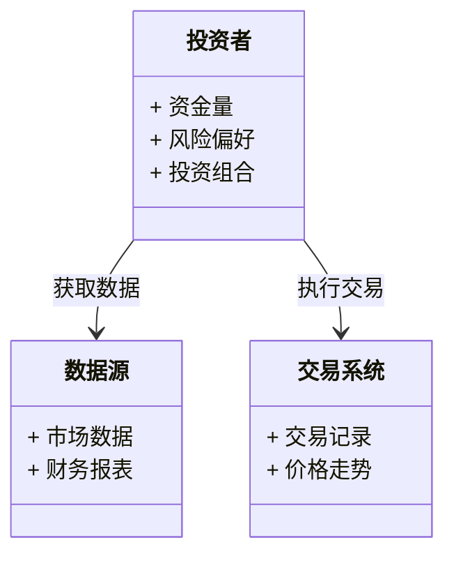

                 


# 价值投资中的AI驱动数字化转型效果分析：多智能体系统

> **关键词**：价值投资、AI驱动、数字化转型、多智能体系统、金融创新、智能决策、系统优化  
> **摘要**：本文探讨了在价值投资中，AI驱动的数字化转型如何通过多智能体系统提升投资效果。文章分析了多智能体系统的原理、架构及其在金融领域的应用，并通过实际案例展示了其在价值投资中的优势和挑战。结合数学模型和算法，文章深入解析了多智能体系统如何优化投资决策，降低风险，实现长期价值增长。

---

# 价值投资中的AI驱动数字化转型效果分析：多智能体系统

## 第1章: 价值投资与数字化转型概述

### 1.1 价值投资的基本概念
价值投资是一种长期投资策略，强调以低于内在价值的价格购买优质资产。其核心理念是寻找市场低估的公司，通过长期持有实现资本增值。价值投资注重基本面分析，包括财务报表、行业地位、竞争优势等。

### 1.2 数字化转型的背景与趋势
数字化转型是指利用数字技术改造或替代传统业务模式、流程、文化与实践，以创造新的价值。在金融领域，数字化转型通过AI、大数据和区块链等技术，提升了交易效率、风险管理和决策能力。

### 1.3 多智能体系统在金融中的应用前景
多智能体系统（MAS）由多个智能体组成，通过协同完成复杂任务。在金融领域，MAS可以模拟市场行为、优化投资组合、预测价格走势。多智能体系统的优势在于分布式决策和自主协作，适合应对复杂金融环境。

---

## 第2章: 多智能体系统的原理与架构

### 2.1 多智能体系统的核心原理
多智能体系统由多个智能体组成，每个智能体负责特定任务。智能体之间通过通信协作，实现整体目标。MAS的决策基于局部信息，通过博弈论和强化学习优化全局策略。

### 2.2 多智能体系统与价值投资的结合
在价值投资中，多智能体系统可以模拟市场参与者行为，分析价格波动，识别投资机会。智能体负责数据收集、分析和决策，通过协作优化投资组合。

### 2.3 多智能体系统的ER实体关系图
```mermaid
erDiagram
    actor 投资者 {
        <属性> 资金量
        <属性> 风险偏好
    }
    actor 数据源 {
        <属性> 市场数据
        <属性> 财务报表
    }
    actor 交易系统 {
        <属性> 交易记录
        <属性> 价格走势
    }
    投资者 --> 数据源 : 获取数据
    投资者 --> 交易系统 : 执行交易
    数据源 --> 交易系统 : 提供市场信息
```

---

## 第3章: 多智能体系统的算法原理

### 3.1 强化学习算法
强化学习通过智能体与环境交互，学习最优策略。在价值投资中，智能体通过试错优化投资决策。

```mermaid
graph TD
    A[环境] --> B[智能体]
    B --> A : 采取行动
    A --> B : 反馈奖励
```

### 3.2 博弈论模型
博弈论分析市场参与者的策略互动，帮助智能体预测市场行为。

### 3.3 Python实现强化学习算法
```python
class Agent:
    def __init__(self, state_space, action_space):
        self.state_space = state_space
        self.action_space = action_space
        # 初始化策略参数

    def act(self, state):
        # 根据策略选择动作
        return action
```

---

## 第4章: 数学模型与公式

### 4.1 收益预测模型
$$ \text{收益} = \beta \times \text{市场回报} + \alpha \times \text{残差} $$

### 4.2 风险评估模型
$$ \text{风险} = \sqrt{\frac{1}{n}\sum_{i=1}^{n}(r_i - \mu)^2} $$

---

## 第5章: 系统分析与架构设计

### 5.1 系统功能设计


### 5.2 系统架构设计
```mermaid
graph TD
    A[投资者] --> B[数据源]
    A --> C[交易系统]
    B --> C : 提供市场信息
```

---

## 第6章: 项目实战

### 6.1 环境安装
安装Python、TensorFlow和Keras库。

### 6.2 核心代码实现
```python
import numpy as np
import tensorflow as tf

model = tf.keras.Sequential([
    tf.keras.layers.Dense(64, activation='relu'),
    tf.keras.layers.Dense(1, activation='linear')
])

model.compile(optimizer='adam', loss='mean_squared_error')
```

### 6.3 实际案例分析
通过训练模型预测股票价格，优化投资组合。

---

## 第7章: 最佳实践与总结

### 7.1 小结
多智能体系统通过分布式决策和协作优化，提升了价值投资的效果。

### 7.2 注意事项
在实际应用中，需注意数据质量和模型泛化能力。

### 7.3 拓展阅读
推荐学习强化学习和博弈论在金融中的应用。

---

**作者：AI天才研究院 & 禅与计算机程序设计艺术**

