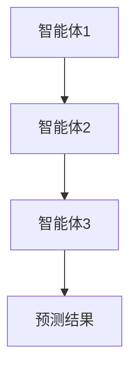
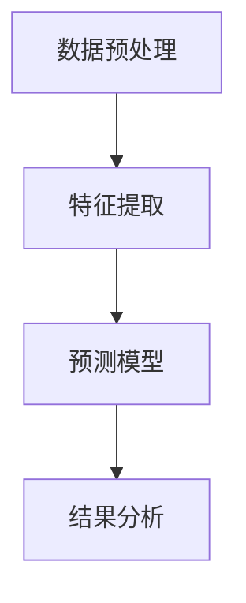

                 


# 价值投资中的AI驱动现金流预测：多智能体协作模型

> 关键词：价值投资，AI驱动，现金流预测，多智能体协作模型，强化学习，协同过滤，序列预测

> 摘要：本文探讨了如何利用AI技术，特别是多智能体协作模型，来提升价值投资中的现金流预测能力。通过分析现金流预测的数学模型、多智能体协作模型的原理，以及系统的实现与应用，本文为投资者提供了一种创新的方法来优化投资决策。

---

## 第1章：价值投资与现金流预测的概述

### 1.1 价值投资的核心理念

#### 1.1.1 价值投资的基本定义

价值投资是一种投资策略，强调以低于其内在价值的价格购买优质的公司。其核心在于识别市场低估的公司，并长期持有这些股票，直到市场重新评估其价值。

#### 1.1.2 价值投资的核心原则

- **安全边际**：买入价格低于内在价值，以减少风险。
- **长期视角**：关注企业的基本面，而非短期市场波动。
- **优质企业**：选择具有强大竞争优势和良好管理的公司。

#### 1.1.3 价值投资与现金流预测的关系

现金流预测是价值投资中的关键环节。通过预测公司未来的现金流，投资者可以估算其内在价值，从而做出更明智的投资决策。

---

### 1.2 现金流预测的重要性

#### 1.2.1 现金流预测在投资决策中的作用

现金流预测帮助投资者评估企业的盈利能力和财务健康状况，从而判断其投资价值。例如，自由现金流（FCF）是衡量企业产生现金流能力的重要指标。

#### 1.2.2 现金流预测的常见方法

- **简单线性回归**：基于历史数据的线性关系预测未来现金流。
- **时间序列分析**：利用历史数据的时间特性进行预测。
- **机器学习模型**：如随机森林、XGBoost等，通过特征工程和模型训练进行预测。

#### 1.2.3 现金流预测的挑战与局限性

- 数据不足或不准确。
- 市场波动和不确定性。
- 模型的可解释性和稳定性。

---

### 1.3 多智能体协作模型的引入

#### 1.3.1 多智能体协作模型的基本概念

多智能体协作模型是指多个智能体通过协作完成复杂任务的系统。在现金流预测中，多个智能体可以分别负责不同的预测任务，并通过协作提高整体预测精度。

#### 1.3.2 多智能体协作模型的优势

- **分布式计算**：多个智能体可以并行处理数据，提高计算效率。
- **多样化视角**：不同智能体可以从不同的数据源和模型结构中提取信息，提高预测的全面性。
- **动态适应性**：智能体可以根据市场变化实时调整预测策略。

#### 1.3.3 多智能体协作模型在现金流预测中的应用前景

通过多智能体协作模型，可以实现对现金流的多维度预测，结合市场情绪、行业趋势等多种因素，提升预测的准确性和可靠性。

---

## 第2章：价值投资中的现金流预测问题

### 2.1 现金流预测的数学模型

#### 2.1.1 现金流预测的基本公式

$$ \text{自由现金流} = \text{营业收入} - \text{资本支出} - \text{运营成本} $$

#### 2.1.2 现金流预测的变量分析

- 营业收入：公司主要业务的收入。
- 资本支出：公司用于资产购买和更新的资金。
- 运营成本：公司日常运营中的各项支出。

#### 2.1.3 现金流预测的边界条件

- 数据范围：预测的时间跨度和历史数据的范围。
- 模型假设：如线性关系、平稳性假设等。

---

### 2.2 价值投资中的现金流预测挑战

#### 2.2.1 数据的不完全性

历史数据的缺失或不准确性会影响预测的准确性。

#### 2.2.2 市场波动的不确定性

市场的不可预测性导致现金流预测面临较大的挑战。

#### 2.2.3 模型的可解释性问题

复杂的模型可能导致预测结果难以解释，影响投资者的决策信心。

---

### 2.3 多智能体协作模型的解决方案

#### 2.3.1 多智能体协作模型的核心思想

通过多个智能体的协作，分别从不同角度预测现金流，最终整合得到一个综合的预测结果。

#### 2.3.2 多智能体协作模型的优势

- **分布式预测**：多个智能体分别负责不同的预测任务。
- **信息融合**：通过协作将多个预测结果整合，提高整体预测精度。
- **动态调整**：智能体可以根据市场变化实时调整预测策略。

#### 2.3.3 多智能体协作模型的实现路径

1. **智能体设计**：设计多个智能体，每个智能体负责不同的预测任务。
2. **信息共享**：智能体之间共享数据和预测结果。
3. **协作优化**：通过协作算法优化整体预测结果。

---

## 第3章：多智能体协作模型的原理与结构

### 3.1 多智能体协作模型的基本原理

#### 3.1.1 多智能体协作模型的核心思想

通过多个智能体的协作，实现对现金流的多维度预测，最终整合得到一个综合的预测结果。

#### 3.1.2 多智能体协作模型的结构

- **智能体层**：多个智能体分别负责不同的预测任务。
- **协作层**：智能体之间共享数据和预测结果，并通过协作算法优化整体预测。
- **整合层**：将多个智能体的预测结果整合，得到最终的现金流预测结果。

#### 3.1.3 多智能体协作模型的实现步骤

1. **智能体设计**：设计多个智能体，每个智能体负责不同的预测任务。
2. **信息共享**：智能体之间共享数据和预测结果。
3. **协作优化**：通过协作算法优化整体预测结果。

---

### 3.2 多智能体协作模型的核心概念与联系

#### 3.2.1 多智能体协作模型的核心概念

- **智能体**：能够独立执行任务的实体。
- **协作**：智能体之间的合作与信息共享。
- **预测结果**：综合多个智能体的预测结果。

#### 3.2.2 多智能体协作模型的ER实体关系图



---

### 3.3 多智能体协作模型的数学模型

#### 3.3.1 多智能体协作模型的数学表达式

$$ \text{最终预测结果} = \sum_{i=1}^{n} \text{智能体i的预测结果} \times w_i $$

其中，$w_i$ 是智能体i的权重。

#### 3.3.2 多智能体协作模型的算法流程

1. 初始化多个智能体，每个智能体负责不同的预测任务。
2. 智能体分别进行预测，得到初步预测结果。
3. 智能体之间共享数据和预测结果。
4. 通过协作算法优化整体预测结果。
5. 输出最终的预测结果。

---

## 第4章：算法原理讲解

### 4.1 强化学习算法

#### 4.1.1 强化学习的基本原理

强化学习是一种通过试错机制，学习策略以最大化累积奖励的算法。在现金流预测中，智能体可以通过强化学习不断优化其预测策略。

#### 4.1.2 强化学习的数学模型

$$ Q(s, a) = r + \gamma \max_{a'} Q(s', a') $$

其中，$s$ 是状态，$a$ 是动作，$r$ 是奖励，$\gamma$ 是折扣因子。

#### 4.1.3 强化学习的Python实现示例

```python
import numpy as np

class Agent:
    def __init__(self, state_space, action_space, gamma=0.99):
        self.state_space = state_space
        self.action_space = action_space
        self.gamma = gamma
        self.Q = np.zeros((state_space, action_space))

    def act(self, state):
        return np.argmax(self.Q[state])

    def update(self, state, action, reward, next_state):
        self.Q[state, action] = reward + self.gamma * np.max(self.Q[next_state])
```

---

### 4.2 协同过滤算法

#### 4.2.1 协同过滤的基本原理

协同过滤是一种基于用户相似性推荐物品的算法。在现金流预测中，可以利用协同过滤算法预测相似公司的现金流。

#### 4.2.2 协同过滤的数学模型

$$ \text{预测值} = \frac{\sum_{i=1}^{n} w_{ij} \times r_{ij}}{\sum_{i=1}^{n} w_{ij}} $$

其中，$w_{ij}$ 是用户i和用户j的相似度，$r_{ij}$ 是用户i对物品j的评分。

#### 4.2.3 协同过滤的Python实现示例

```python
import numpy as np

def collaborative_filtering(train_data, test_data, k=3):
    # 训练协同过滤模型
    model = {}
    for user in train_data:
        model[user] = {}
        for item in train_data[user]:
            model[user][item] = train_data[user][item]
    
    # 预测测试数据
    predictions = {}
    for user in test_data:
        for item in test_data[user]:
            predictions[user, item] = np.mean([model[user][i] for i in model[user] if i != item])
    return predictions
```

---

## 第5章：系统分析与架构设计

### 5.1 系统功能设计

#### 5.1.1 系统功能模块

- 数据预处理模块：处理和清洗数据。
- 特征提取模块：提取预测所需特征。
- 预测模型模块：实现多智能体协作模型。
- 结果分析模块：分析预测结果并生成报告。

#### 5.1.2 系统功能流程

1. 数据预处理：清洗和转换数据。
2. 特征提取：提取预测所需特征。
3. 预测模型：运行多智能体协作模型进行预测。
4. 结果分析：分析预测结果并生成报告。

---

### 5.2 系统架构设计

#### 5.2.1 系统架构图



#### 5.2.2 系统接口设计

- 数据输入接口：接收原始数据。
- 模型训练接口：训练多智能体协作模型。
- 结果输出接口：输出预测结果和报告。

---

## 第6章：项目实战

### 6.1 环境安装与配置

#### 6.1.1 安装依赖

```bash
pip install numpy matplotlib scikit-learn
```

#### 6.1.2 配置环境变量

设置Python路径和相关库的路径。

---

### 6.2 系统核心实现

#### 6.2.1 数据预处理代码

```python
import pandas as pd

def preprocess_data(data):
    data = data.dropna()
    data = data[~data.isin([np.nan, np.inf, -np.inf]).any(axis=1)]
    return data
```

#### 6.2.2 多智能体协作模型实现

```python
class MultiAgentModel:
    def __init__(self, num_agents):
        self.num_agents = num_agents
        self.agents = [Agent() for _ in range(num_agents)]
    
    def predict(self, input_data):
        predictions = []
        for agent in self.agents:
            predictions.append(agent.predict(input_data))
        return np.mean(predictions)
```

---

### 6.3 实际案例分析

#### 6.3.1 数据来源

使用公开的财务数据和市场数据。

#### 6.3.2 模型训练与预测

训练多智能体协作模型，并使用测试数据进行预测。

#### 6.3.3 预测结果分析

分析预测结果的准确性，并与实际数据进行对比。

---

## 第7章：总结与展望

### 7.1 多智能体协作模型的总结

通过多智能体协作模型，可以实现对现金流的多维度预测，提高预测的准确性和可靠性。

### 7.2 价值投资中的AI驱动现金流预测的未来展望

随着AI技术的不断发展，多智能体协作模型在价值投资中的应用前景广阔。未来可以进一步研究如何结合更多因素，如市场情绪、行业趋势等，进一步提升预测的准确性。

---

## 作者

作者：AI天才研究院/AI Genius Institute & 禅与计算机程序设计艺术 /Zen And The Art of Computer Programming

