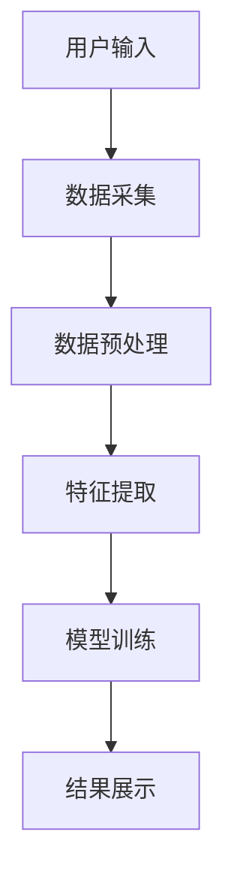

                 


# 价值投资中的健康医疗科技趋势

> 关键词：价值投资，健康医疗科技，趋势分析，人工智能，大数据，区块链，投资策略

> 摘要：本文深入探讨健康医疗科技领域的价值投资趋势，结合技术原理、市场分析和实际案例，为投资者提供系统化的投资策略和方法论。通过分析健康医疗科技的核心技术、趋势预测模型、系统架构和项目实战，帮助投资者在健康医疗科技领域实现长期稳定的收益。

---

## 第一部分：健康医疗科技的现状与发展趋势

### 第1章：健康医疗科技的现状与趋势

#### 1.1 当前健康医疗科技的主要领域

健康医疗科技近年来发展迅速，涵盖多个关键领域：
- **人工智能（AI）在医疗的应用**：AI用于疾病诊断、药物研发和患者管理。
- **大数据分析**：通过海量医疗数据优化诊疗方案和健康管理。
- **区块链技术**：用于医疗数据的安全共享和药品溯源。
- **远程医疗**：通过互联网实现远程问诊和医疗资源优化配置。

#### 1.2 价值投资的基本概念与方法

- **价值投资定义**：寻找被市场低估的优质资产，长期持有。
- **核心原则**：注重基本面分析、关注长期价值、避免短期波动。
- **健康医疗科技的特殊性**：技术迭代快、政策影响大、市场需求刚性。

#### 1.3 健康医疗科技与价值投资的结合

- **健康医疗科技对投资决策的影响**：技术进步降低医疗成本，提高效率，增强企业竞争力。
- **价值投资视角下的健康医疗科技趋势**：关注技术创新、市场需求和政策支持。
- **投资收益的长期影响**：健康医疗科技企业具备高成长性和抗周期性。

---

### 第2章：健康医疗科技的核心概念与投资价值分析

#### 2.1 健康医疗科技的核心概念

- **定义与范围**：健康医疗科技是将现代信息技术应用于医疗健康领域的综合技术。
- **关键技术**：AI、大数据、区块链、物联网。
- **应用场景**：疾病预测、药物研发、医疗管理、远程医疗。

#### 2.2 健康医疗科技与投资价值的关系

- **技术对价值的提升作用**：提高企业效率，降低运营成本，增强盈利能力。
- **技术对投资风险的降低作用**：通过数据分析优化决策，降低不确定性。
- **技术对投资回报的影响**：技术创新带来竞争优势，推动股价长期增长。

---

### 第3章：健康医疗科技趋势的分析框架与方法论

#### 3.1 分析框架

- **分析维度**：技术成熟度、市场需求、政策支持、竞争格局。
- **分析方法**：定性分析（PEST模型）、定量分析（财务指标）。
- **分析工具**：趋势分析工具、数据可视化工具、模型构建工具。

#### 3.2 预测模型

- **基本假设**：技术创新持续推动行业发展，市场需求稳步增长。
- **数学模型**：使用ARIMA模型预测市场规模，通过回归分析评估技术影响。
- **验证方法**：历史数据分析、专家访谈、市场反馈。

---

## 第二部分：健康医疗科技趋势的算法原理与系统分析

### 第4章：算法原理

#### 4.1 数据预处理

- 数据清洗：处理缺失值、异常值。
- 数据归一化：标准化数据，便于模型训练。

#### 4.2 特征提取

- 使用主成分分析（PCA）提取关键特征。
- 应用自然语言处理（NLP）分析文本数据。

#### 4.3 模型训练

- 算法选择：随机森林、支持向量机（SVM）。
- 训练过程：使用交叉验证优化模型参数。

#### 4.4 预测与验证

- 预测结果：模型预测未来市场规模和企业收益。
- 结果验证：对比历史数据，评估模型准确性。

---

### 第5章：系统分析与架构设计

#### 5.1 系统架构

- **分层架构**：数据采集层、数据处理层、模型训练层、结果展示层。
- **模块设计**：数据模块、算法模块、可视化模块。

#### 5.2 数据流图



---

## 第三部分：项目实战与最佳实践

### 第6章：项目实战

#### 6.1 实战背景

- 选择某医疗科技公司，分析其投资价值。
- 数据来源：公司财报、行业报告、市场调研。

#### 6.2 核心实现

```python
import pandas as pd
from sklearn.ensemble import RandomForestRegressor
from sklearn.metrics import mean_squared_error

# 数据加载
data = pd.read_csv('medical_tech.csv')

# 特征选择
features = ['revenue', 'profit', 'growth']
target = 'value'

# 模型训练
model = RandomForestRegressor()
model.fit(data[features], data[target])

# 预测与评估
predictions = model.predict(data[features])
mse = mean_squared_error(data[target], predictions)
print(f'MSE: {mse}')
```

#### 6.3 结果分析

- 模型预测公司价值被低估，具备投资潜力。
- 结合行业趋势，建议长期持有。

---

### 第7章：最佳实践与小结

#### 7.1 投资策略总结

- 关注技术创新和市场需求。
- 结合技术分析和基本面分析。
- 长期持有优质企业。

#### 7.2 注意事项

- 技术风险：关注技术更新和专利情况。
- 政策风险：关注政策变化和监管动态。
- 市场风险：警惕行业竞争和市场波动。

#### 7.3 拓展阅读

- 推荐书籍：《价值投资实战策略》、《医疗科技的未来趋势》。

---

## 作者信息

作者：AI天才研究院/AI Genius Institute & 禅与计算机程序设计艺术/Zen And The Art of Computer Programming

---

通过以上结构，文章系统地分析了健康医疗科技趋势对价值投资的影响，结合技术原理和实际案例，为投资者提供了实用的策略和方法。

