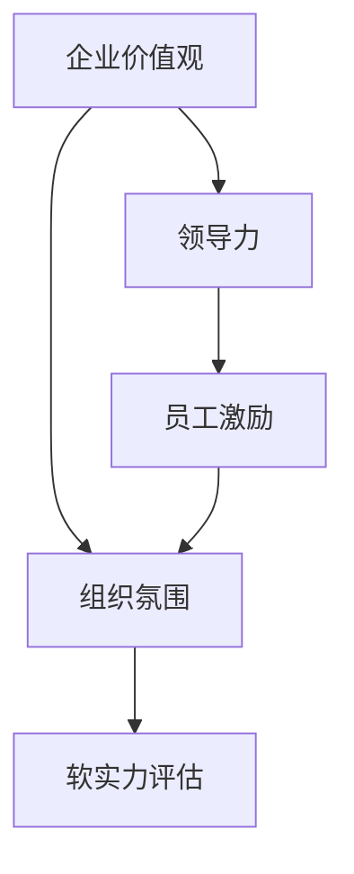
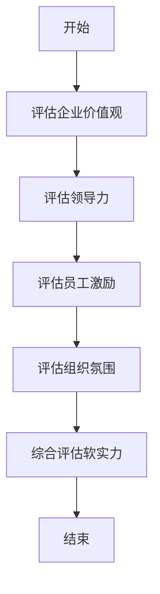

                 


# 价值投资中的公司文化：软实力的重要性

---

## 关键词：价值投资、公司文化、软实力、企业价值观、领导力、员工激励

---

## 摘要

在价值投资领域，公司的文化被视为决定其长期成功的关键因素之一。公司文化不仅影响员工的行为和公司的运作效率，还反映了公司的价值观和长期目标。在这篇文章中，我们将探讨公司文化中软实力的重要性，分析其对投资决策的影响，并通过实际案例和系统化的分析方法，揭示软实力在价值投资中的关键作用。通过本文的分析，读者将能够更好地理解公司文化在投资中的价值，并掌握如何评估和利用软实力来优化投资决策。

---

## 引言

在价值投资领域，传统的分析方法通常关注公司的财务数据、市场地位和技术优势等硬实力因素。然而，近年来，越来越多的投资专家开始意识到，公司的文化氛围和内部软实力同样是决定公司长期成功的关键因素。软实力，作为一种不可量化的但又至关重要的资产，不仅影响员工的创造力和凝聚力，还可能影响公司的战略决策和市场表现。

本文将从价值投资的角度出发，系统地探讨公司文化中软实力的重要性，分析其对投资决策的影响，并提供一套基于软实力评估的分析方法。

---

## 背景介绍

### 1. 价值投资的核心概念

价值投资是一种以基本面分析为基础的投资策略，旨在通过识别市场价格与内在价值之间的差异，找到被低估的投资标的。传统的价值投资方法关注公司的财务数据、盈利能力、市场地位和管理团队等硬实力因素。然而，随着市场竞争的加剧和企业面临的复杂环境，仅依靠硬实力分析已经无法全面评估一家公司的长期发展潜力。

### 2. 公司文化的定义与外延

公司文化是指企业在长期的经营过程中形成的共享价值观、行为规范和企业氛围。它不仅影响员工的工作态度和行为方式，还决定了公司的战略选择和应对市场变化的能力。公司文化的核心要素包括企业价值观、领导风格、员工激励机制和组织氛围等。

### 3. 软实力的定义与特征

软实力是一种不同于传统硬实力（如资本、技术、资源等）的无形资产。它主要体现在企业的文化氛围、组织结构、员工凝聚力和领导力等方面。软实力的特点在于其难以量化，但能够显著影响公司的长期表现和市场竞争力。

---

## 软实力的重要性

### 1. 软实力与价值投资的联系

在价值投资中，软实力的重要性体现在以下几个方面：

- **长期价值创造**：一家公司如果拥有积极向上的文化氛围和高效的组织结构，其员工的创造力和执行力将得到充分发挥，从而为公司创造长期价值。
- **风险管理**：软实力强的公司通常具有更强的抗压能力和内部协调能力，能够在市场波动和危机中保持稳定，降低投资风险。
- **竞争优势**：优秀的公司文化能够吸引和留住优秀人才，增强公司的核心竞争力，从而在市场竞争中占据优势地位。

### 2. 软实力的评估维度

为了全面评估公司的软实力，我们需要从以下几个维度进行分析：

- **企业价值观与使命**：公司的核心价值观和长期目标是否清晰且具有吸引力。
- **领导力风格**：公司高层的领导风格是否能够激发员工的潜力并促进团队协作。
- **员工激励机制**：公司是否建立了有效的激励机制，能够激发员工的工作热情和创造力。
- **组织氛围**：公司内部的沟通与协作是否顺畅，员工是否感到被尊重和认可。

---

## 系统分析与架构设计

### 1. 公司文化要素的类图

以下是公司文化要素的类图（使用Mermaid）：



### 2. 软实力评估流程图

以下是软实力评估的流程图（使用Mermaid）：



---

## 项目实战

### 1. 案例分析

#### 案例一：成功企业的软实力分析

以某知名科技公司为例，其公司文化的核心价值观是“创新、协作、客户至上”。公司高层采用扁平化的领导风格，鼓励员工提出创新想法，并为员工提供灵活的工作时间和绩效奖金相结合的激励机制。这种文化氛围使得公司在竞争激烈的市场中保持了持续的创新能力，并吸引了大量优秀人才。

#### 案例二：失败企业的软实力问题

某传统制造企业在转型过程中忽视了公司文化的建设，管理层采用命令式领导风格，员工激励机制单一，主要依赖绩效奖金。由于缺乏内部凝聚力和创新动力，公司在转型过程中遇到了诸多困难，市场竞争力逐渐减弱。

---

### 2. 软实力评估模型的实现

以下是软实力评估模型的Python实现代码：

```python
def assess_cultural_strength(company_data):
    # 评估企业价值观
    values_score = assess_values(company_data['values'])
    # 评估领导力
    leadership_score = assess_leadership(company_data['leadership_style'])
    # 评估员工激励
    incentive_score = assess_incentives(company_data['incentive_system'])
    # 评估组织氛围
    atmosphere_score = assess_atmosphere(company_data['organizational_atmosphere'])
    # 综合评分
    total_score = (values_score + leadership_score + incentive_score + atmosphere_score) / 4
    return total_score

def assess_values(values):
    # 评估企业价值观的函数，返回1-10分
    pass

def assess_leadership(leadership_style):
    # 评估领导力的函数，返回1-10分
    pass

def assess_incentives(incentive_system):
    # 评估激励机制的函数，返回1-10分
    pass

def assess_atmosphere(atmosphere):
    # 评估组织氛围的函数，返回1-10分
    pass
```

---

## 总结与最佳实践

### 1. 投资策略与注意事项

在实际投资中，我们需要注意以下几点：

- **结合软硬实力分析**：虽然软实力在投资中非常重要，但也不能忽视公司的财务状况和市场地位等硬实力因素。需要将软实力分析与硬实力分析相结合，才能全面评估公司的投资价值。
- **长期视角**：软实力的评估需要长期观察和动态调整。公司的文化氛围可能会随着管理层的变动和市场环境的变化而发生改变，因此需要持续关注。
- **行业差异**：不同行业的公司文化可能存在显著差异。例如，科技行业更注重创新文化，而传统制造业则更关注规范化管理和执行力。

### 2. 最佳实践 Tips

- **定期评估**：建议投资者定期对投资组合中的公司进行软实力评估，及时发现潜在问题。
- **深入调研**：在进行投资决策前，可以通过访谈、实地考察等方式深入了解公司的文化氛围和员工满意度。
- **关注管理层变动**：管理层的变动可能对公司的文化氛围产生重大影响，需要密切关注。

### 3. 未来研究方向

- **软实力与财务表现的关系**：进一步研究软实力如何影响公司的财务表现，寻找更精确的评估指标。
- **跨文化比较**：研究不同文化背景下的公司文化对投资的影响差异，探索文化多样性对公司价值的影响。
- **技术辅助评估**：利用大数据和人工智能技术，建立更高效的软实力评估模型，提高评估的准确性和效率。

---

## 作者

作者：AI天才研究院/AI Genius Institute & 禅与计算机程序设计艺术/Zen And The Art of Computer Programming

---

通过本文的分析，我们可以看到，公司文化中的软实力在价值投资中扮演着至关重要的角色。只有将软实力分析与传统的硬实力分析相结合，才能全面评估公司的投资价值。希望本文能够为投资者提供新的视角和方法，帮助他们在复杂的市场环境中做出更明智的投资决策。

