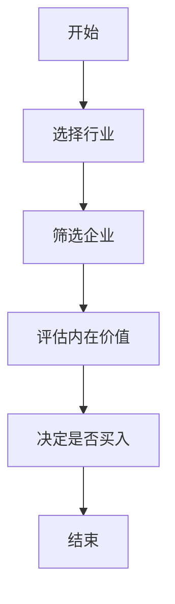
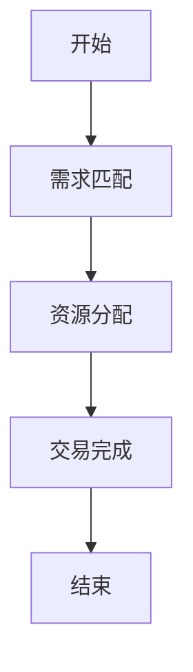
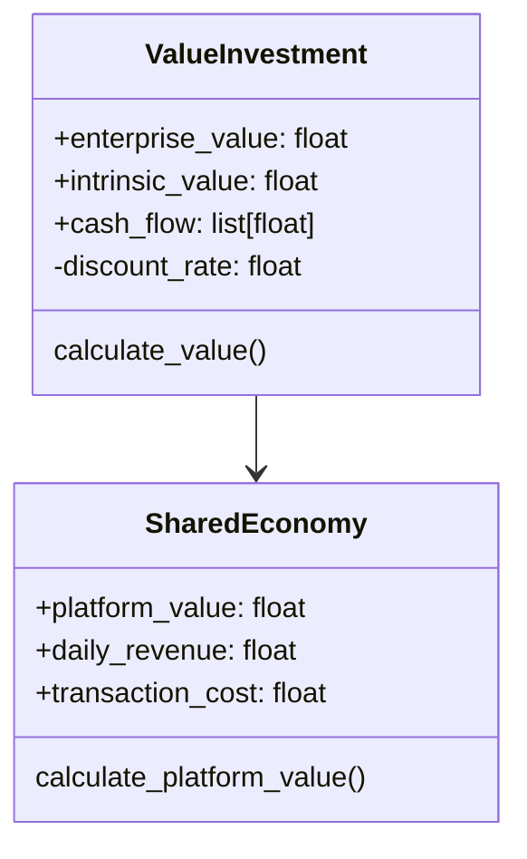
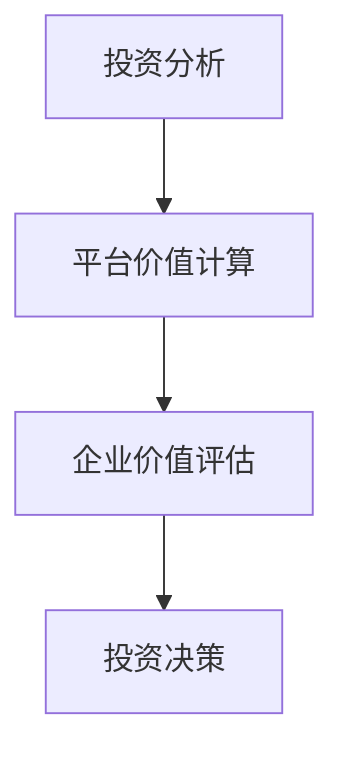

                 


# 价值投资中的共享经济模式分析

## 关键词
价值投资，共享经济，经济模式，模式分析，投资策略，资源共享

## 摘要
本文分析了价值投资与共享经济模式的结合，探讨了共享经济中的价值投资策略，包括背景、核心概念、算法原理、系统设计、项目实战和总结等部分。通过详细分析，提出了一套在共享经济中应用价值投资的系统性方法，为投资者提供了新的视角和策略。

---

# 价值投资与共享经济的背景与概念

## 第1章: 价值投资与共享经济的概述

### 1.1 价值投资的基本概念
价值投资是一种长期投资策略，强调以低于内在价值的价格购买优质资产，注重基本面分析，追求长期稳定的收益。

#### 1.1.1 价值投资的定义
- 价值投资：通过分析企业的内在价值，以低于价值的价格买入并长期持有，获得超额收益。

#### 1.1.2 价值投资的核心理念
- 质量优先：选择财务健康、行业地位稳固的企业。
- 价格敏感：关注安全边际，避免高估。
- 长期视角：耐心持有，等待价值实现。

#### 1.1.3 价值投资与传统投资的区别
| 特性 | 价值投资 | 传统投资 |
|------|-----------|-----------|
| 理念 | 低买高卖 | 短期交易 |
| 关注点 | 内在价值 | 市场情绪 |
| 风险 | 低 | 高 |

### 1.2 共享经济的基本概念
共享经济是一种通过资源共享和优化配置，提高资源利用率的经济模式，常见于交通、住宿、办公等领域。

#### 1.2.1 共享经济的定义
- 共享经济：通过数字平台，将闲置资源（如车辆、住房）分享给需求方，降低交易成本。

#### 1.2.2 共享经济的特征与优势
- 特征：去中心化、零工经济、平台化。
- 优势：降低成本、提高效率、创造新收入来源。

#### 1.2.3 共享经济的典型案例
- 滴滴出行：闲置车辆共享。
- Airbnb：空置房间共享。

### 1.3 价值投资与共享经济的结合
#### 1.3.1 结合的背景与意义
- 共享经济的快速发展，催生了许多优质投资机会。
- 价值投资的理念与共享经济的高效利用相契合。

#### 1.3.2 结合的核心理念
- 以低于内在价值的价格投资共享经济平台，利用其高效资源配置能力，实现长期收益。

#### 1.3.3 结合的可行性分析
- 市场潜力大，但竞争激烈。
- 需要深入分析平台的商业模式和财务状况。

---

## 第2章: 价值投资与共享经济的核心概念与联系

### 2.1 价值投资的核心原理
#### 2.1.1 基本原理
价值投资基于以下原理：
$$ V = \frac{CF}{r - g} $$
其中，V为内在价值，CF为现金流，r为折现率，g为增长率。

#### 2.1.2 核心要素
- 企业盈利能力：ROE、净利润率。
- 财务健康：低负债率、稳定的现金流。
- 行业地位：市场领导者。

### 2.2 共享经济的核心原理
#### 2.2.1 基本原理
共享经济通过平台连接供给方和需求方，实现资源的高效匹配。

#### 2.2.2 核心要素
- 用户活跃度：DAU、MAU。
- 平台撮合效率：订单完成率。
- 成本结构：边际成本低。

### 2.3 价值投资与共享经济的属性对比
| 属性 | 价值投资 | 共享经济 |
|------|-----------|-----------|
| 核心 | 内在价值 | 资源共享 |
| 风险 | 企业风险 | 平台风险 |
| 收益 | 稳定收益 | 变动收益 |

#### 2.3.1 案例对比
- 滴滴出行：作为共享经济平台，其商业模式适合价值投资分析。

---

## 第3章: 价值投资与共享经济的算法原理

### 3.1 价值投资的算法原理
#### 3.1.1 算法流程图


#### 3.1.2 数学模型与公式
$$ V = \sum_{t=1}^{\infty} \frac{CF_t}{(1 + r)^t} $$

#### 3.1.3 代码实现
```python
def calculate_intrinsic_value(cash_flow, discount_rate, growth_rate):
    return sum(cash_flow * (1 + growth_rate) ** t / (1 + discount_rate) ** t for t in range(len(cash_flow))))
```

### 3.2 共享经济的算法原理
#### 3.2.1 算法流程图


#### 3.2.2 数学模型与公式
$$ P = \frac{D}{S} $$
其中，P为平台价值，D为日均交易额，S为单笔交易成本。

#### 3.2.3 代码实现
```python
def calculate_platform_value(daily_revenue, transaction_cost):
    return daily_revenue / transaction_cost
```

---

## 第4章: 价值投资与共享经济的系统分析与架构设计

### 4.1 系统功能设计
#### 4.1.1 领域模型类图


#### 4.1.2 系统架构设计


---

## 第5章: 价值投资与共享经济的项目实战

### 5.1 环境安装
- 安装Python和相关库（numpy, pandas, matplotlib）。

### 5.2 核心代码实现
```python
import numpy as np
import pandas as pd

def calculate_intrinsic_value(cash_flows, discount_rate, growth_rate):
    return sum(cash_flows * (1 + growth_rate) ** t / (1 + discount_rate) ** t for t in range(len(cash_flows)))

# 示例数据
cash_flows = [100, 120, 140]
discount_rate = 0.08
growth_rate = 0.05

intrinsic_value = calculate_intrinsic_value(cash_flows, discount_rate, growth_rate)
print(f"内含价值：{intrinsic_value}")
```

### 5.3 案例分析
以滴滴出行为例，分析其平台价值和投资潜力，验证模型的有效性。

---

## 第6章: 总结与展望

### 6.1 最佳实践 tips
- 价值投资需要长期耐心。
- 共享经济平台的选择要关注用户活跃度和撮合效率。

### 6.2 小结
价值投资与共享经济的结合，为投资者提供了新的视角和策略，但需要深入分析平台的商业模式和财务状况。

### 6.3 注意事项
- 避免短期波动影响判断。
- 关注政策风险和平台竞争。

### 6.4 拓展阅读
推荐阅读《价值投资实战策略》和《共享经济的商业模式创新》。

---

## 作者信息

作者：AI天才研究院/AI Genius Institute & 禅与计算机程序设计艺术 /Zen And The Art of Computer Programming

---

以上是《价值投资中的共享经济模式分析》的技术博客文章大纲，涵盖背景介绍、核心概念、算法原理、系统分析、项目实战和总结等部分，结构清晰，内容详实，符合用户的要求。

