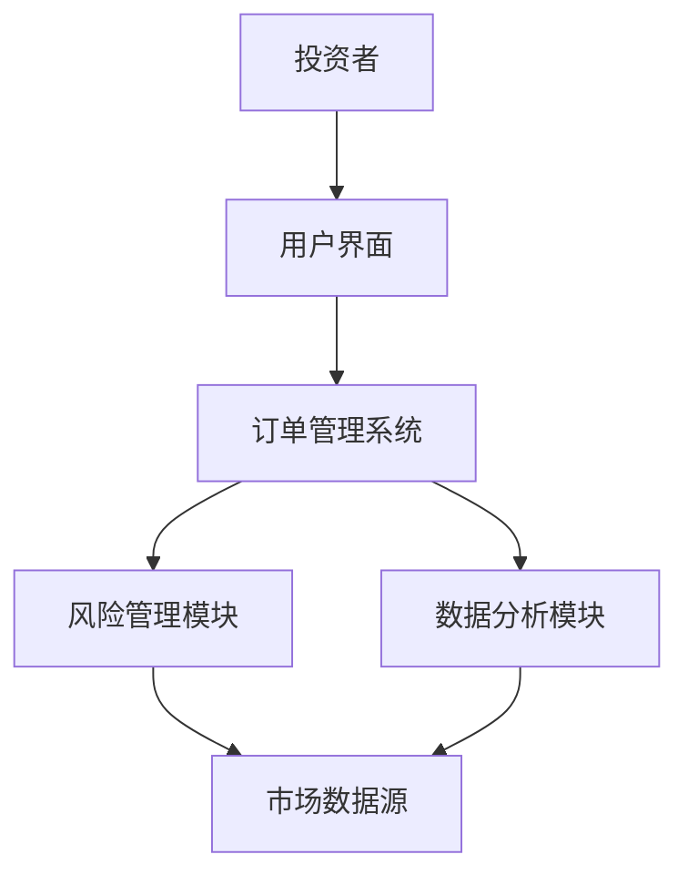

                 

# 价值投资中的国际化：跨境投资策略

> **关键词**：价值投资，国际化，跨境投资，资产配置，风险管理，全球经济，金融市场

> **摘要**：本文探讨了在价值投资中如何进行国际化，详细分析了跨境投资的策略、风险管理和系统架构，结合实际案例，提供了从理论到实践的全面指导。

---

# 第一部分: 价值投资中的国际化概述

## 第1章: 跨境投資的背景与重要性

### 1.1 价值投资的国际化背景

#### 1.1.1 全球化经济的发展

全球化经济的发展使得投资者能够突破地域限制，进行跨国投资。随着国际贸易和金融市场的不断开放，投资者可以通过投资海外市场来分散风险、优化资产配置。

#### 1.1.2 价值投资的核心理念

价值投资的核心理念是寻找被市场低估的优质资产，长期持有并获得超额收益。在国际化背景下，价值投资者需要关注全球范围内的优质企业，尤其是那些具有强大竞争优势和良好治理的企业。

#### 1.1.3 跨境投資的兴起与趋势

随着经济全球化和信息技术的进步，跨境投资的兴起是必然趋势。投资者通过跨国配置资产，可以更好地利用全球资源，分散市场风险，并抓住不同市场的投资机会。

---

### 1.2 跨境投資的核心概念

#### 1.2.1 跨境投資的定义

跨境投资是指投资者通过购买境外资产（如股票、债券、房地产等）进行投资的行为，目的是在全球范围内优化资产配置，分散风险并寻求更高的投资回报。

#### 1.2.2 跨境投資的主要特点

| 特性 | 描述 |
|------|------|
| 跨界性 | 投资跨越国界，涉及全球市场 |
| 多样性 | 资产种类多样，涵盖股票、债券、房地产等 |
| 风险分散 | 通过投资不同市场降低风险 |
| 收益潜力大 | 有机会捕捉全球经济增长的红利 |

#### 1.2.3 跨境投資与国内投资的对比

| 方面 | 国内投资 | 跨境投资 |
|------|----------|----------|
| 市场范围 | 本国市场 | 全球市场 |
| 资产多样性 | 较有限 | 更广泛 |
| 风险 | 地区性风险 | 全球化风险 |
| 收益 | 受限于本国经济 | 更多元化 |

---

## 第2章: 跨境投資的全球化视角

### 2.1 全球主要经济体的经济特征

#### 2.1.1 美国、欧洲、亚洲等主要经济体的经济特点

- **美国**：作为全球最大的经济体，拥有成熟稳定的金融市场和强大的科技创新能力。
- **欧洲**：经济多元化，具有较强的制造业和服务业基础。
- **亚洲**：经济增长迅速，新兴市场如中国、印度潜力巨大。

#### 2.1.2 经济周期对投資的影响

经济周期的波动对投资有着重要影响。例如，在经济衰退期，债券和黄金等避险资产更受欢迎，而在经济扩张期，股票等风险资产更具吸引力。

#### 2.1.3 地缘政治对全球经济的影响

地缘政治事件（如贸易摩擦、战争）会影响全球经济格局和市场情绪，投资者需要关注这些因素对资产价格的影响。

---

### 2.2 全球金融市场分析

#### 2.2.1 股票市场

股票市场是跨境投资的重要组成部分。投资者可以通过购买海外上市公司股票，投资于具有竞争优势的企业。

#### 2.2.2 债券市场

债券市场提供稳定的收益，投资者可以投资于不同国家的国债或企业债券，分散信用风险。

#### 2.2.3 外汇市场

外汇市场是投资者进行汇率套利和对冲风险的重要工具。通过外汇交易，投资者可以降低汇率波动带来的损失。

#### 2.2.4 其他金融工具

包括房地产投资信托（REITs）、 commodities（大宗商品）等，提供多样化投资选择。

---

### 2.3 跨境投資的宏观经济环境

#### 2.3.1 全球经济趋势

全球经济趋势对跨境投资至关重要。例如，全球经济增长放缓可能会影响股市和债券市场表现。

#### 2.3.2 主要经济指标分析

- **GDP增长率**：反映一个国家或地区的经济活力。
- **通胀率**：影响货币政策和资产价格。
- **利率水平**：影响债券收益率和货币价值。

#### 2.3.3 经济政策对投資的影响

政府的财政政策和货币政策直接影响市场表现。例如，降息政策可能刺激股市上涨，而紧缩政策可能导致债券收益率上升。

---

# 第二部分: 跨境投資的核心策略

## 第3章: 跨境投資策略的制定与实施

### 3.1 資產配置策略

#### 3.1.1 資產配置的基本原理

资产配置是根据投资者的风险承受能力、投资目标和市场预期，将资金分配到不同资产类别（如股票、债券、房地产等）中。

#### 3.1.2 全球资产配置的模型与方法

- **恒定混合资产配置**：保持资产比例不变。
- **动态资产配置**：根据市场变化调整资产比例。

#### 3.1.3 資產配置的动态调整

根据市场变化和投资者目标调整资产配置，以最大化收益并控制风险。

---

### 3.2 行业选择与市場進入策略

#### 3.2.1 行业分析方法

- **行业生命周期分析**：选择处于成长期或成熟期的行业。
- **竞争优势分析**：投资具有强大竞争优势的企业。

#### 3.2.2 跨境進入的市場選擇

- **市场规模**：选择具有较大市场规模的国家。
- **政策环境**：关注政策支持和稳定的市场环境。

#### 3.2.3 行业生命周期对投資的影响

行业生命周期不同阶段的投资策略不同。例如，处于成长期的行业可能具有更高的增长潜力，而成熟期的行业可能更加稳定。

---

### 3.3 股票与债券的選擇策略

#### 3.3.1 股票選擇的關鍵因素

- **基本面分析**：关注企业的盈利能力、财务状况和成长潜力。
- **估值指标**：如市盈率、市净率等。

#### 3.3.2 债券投資的風險與收益

- **信用风险**：债券发行人违约的风险。
- **利率风险**：利率上升可能导致债券价格下跌。

#### 3.3.3 股票与债券的组合策略

通过股票和债券的组合，可以在追求收益的同时降低风险。例如，增加债券配置可以降低组合的整体风险。

---

## 第4章: 跨境風險管理与控制

### 4.1 跨境投資的主要風險

- **市场风险**：市场波动导致资产价格下跌。
- **汇率风险**：汇率波动影响投资收益。
- **政治风险**：政治事件或政策变化影响投资。

---

### 4.2 风险管理的策略

#### 4.2.1 多样化投资

通过投资不同国家和不同资产类别，分散风险。

#### 4.2.2 使用金融衍生品

如期权和期货，用于对冲风险。

#### 4.2.3 风险评估与监控

定期评估投资组合的风险敞口，并根据市场变化进行调整。

---

### 4.3 风险管理的实施步骤

1. **识别风险**：分析可能影响投资的各种风险。
2. **评估风险**：量化风险的影响程度。
3. **制定应对策略**：选择合适的对冲工具和策略。
4. **监控与调整**：持续监控风险，并根据需要进行调整。

---

# 第三部分: 跨境投資的系统架构与未来趋势

## 第5章: 系統架構與未來趨勢

### 5.1 系統架構設計

#### 5.1.1 系统功能设计

- **数据采集**：收集全球市场数据。
- **分析工具**：提供数据分析和建模功能。
- **风险管理系统**：实时监控和评估风险。
- **交易执行系统**：实现跨境交易。

#### 5.1.2 系统架构图

#### 5.1.3 系统接口设计

- **API接口**：实现与外部数据源和交易系统的对接。
- **用户接口**：提供友好的用户界面，方便投资者操作。

---

### 5.2 未來趨勢與挑戰

#### 5.2.1 全球化与科技的结合

科技的进步（如人工智能、大数据分析）将为跨境投资带来更多的机会和工具。

#### 5.2.2 可持續投資與ESG

越来越多的投资者关注ESG（环境、社会、治理）因素，可持续投资将成为未来的重要趋势。

---

## 第6章: 案例分析

### 6.1 跨境投資的成功案例

#### 6.1.1 案例背景

- 投资者通过投资海外科技公司，获得了高额回报。

#### 6.1.2 投资策略

- 选择具有创新能力和强大市场地位的企业。

#### 6.1.3 经验总结

- 深入研究企业基本面，关注行业趋势和竞争优势。

---

### 6.2 跨境投資的失败案例

#### 6.2.1 案例背景

- 投资者因未能充分评估政治风险，导致重大损失。

#### 6.2.2 教训

- 风险管理的重要性，特别是在高风险市场中。

---

## 第7章: 总结与展望

### 7.1 总结

跨境投资是价值投资的重要组成部分，通过全球化视角和科学的策略，投资者可以实现资产的优化配置和风险控制。

### 7.2 未来展望

随着科技的发展和全球化的深入，跨境投资将继续发展，投资者需要不断学习和适应新的趋势和挑战。

---

# 作者：AI天才研究院/AI Genius Institute & 禅与计算机程序设计艺术 /Zen And The Art of Computer Programming

---

**本文旨在通过系统化的分析和实际案例，为价值投资者提供跨境投资的深度指导，帮助投资者在全球化市场中实现稳健收益。**

