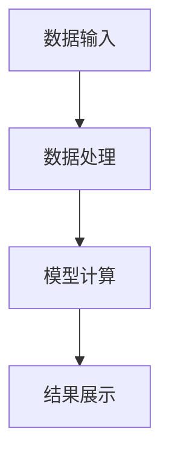
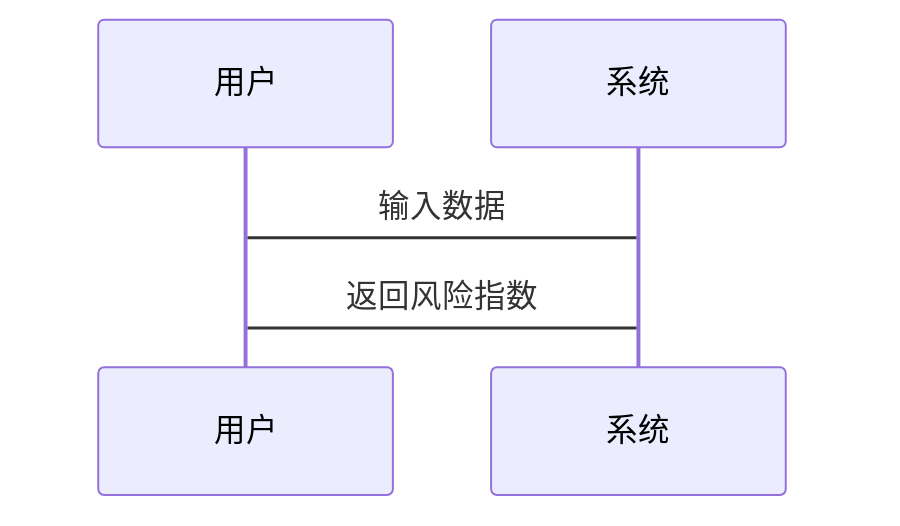

                 

# 价值投资中的地缘政治风险评估

---

## 关键词

价值投资、地缘政治风险、风险评估、投资决策、系统设计

---

## 摘要

本文探讨了在价值投资中如何评估和管理地缘政治风险。通过构建分析框架和评估模型，结合实际案例分析，展示了地缘政治风险对投资决策的影响。文章还提出了一个系统设计，帮助投资者量化和应对这些风险，优化投资策略。

---

## 第一部分：价值投资与地缘政治风险概述

### 第1章：价值投资与地缘政治风险的背景

#### 1.1 价值投资的基本概念

**1.1.1 价值投资的定义与核心理念**

价值投资是一种投资策略，强调以低于公平价值的价格购买优质的资产。其核心理念包括长期投资、安全边际和市场有效性的质疑。

**1.1.2 价值投资的历史与发展**

价值投资起源于20世纪初，代表人物包括本杰明·格雷厄姆和戴维·多德。随着时间推移，价值投资策略不断完善，结合了现代金融理论和实践。

**1.1.3 价值投资与现代投资理论的联系**

价值投资与现代投资组合理论（MPT）密切相关，强调分散投资和风险管理，以降低整体投资组合的波动性。

#### 1.2 地缘政治风险的定义与特征

**1.2.1 地缘政治风险的定义**

地缘政治风险是指由于政治、经济和社会因素引发的冲突或变化，可能影响资产价格和市场稳定性。

**1.2.2 地缘政治风险的主要特征**

- 不确定性：难以预测和量化。
- 波动性：可能导致市场剧烈波动。
- 长期影响：可能影响经济结构和投资环境。

**1.2.3 地缘政治风险的分类**

- 国际冲突：如战争、制裁等。
- 政治不稳定：政权更迭、政策变化。
- 经济制裁：贸易限制、关税变化。

#### 1.3 价值投资中的地缘政治风险评估框架

**1.3.1 价值投资与地缘政治风险的关系**

地缘政治风险可能影响企业的盈利能力、市场准入和资产价值，从而影响股票的内在价值。

**1.3.2 地缘政治风险评估框架**

- 数据收集：收集相关政治、经济和社会数据。
- 风险识别：识别潜在的地缘政治风险因素。
- 风险分析：评估这些风险对投资的影响。
- 风险应对：制定应对策略，如分散投资、调整仓位。

#### 1.4 本章小结

本章介绍了价值投资的基本概念和地缘政治风险的定义、特征及分类，强调了地缘政治风险在价值投资中的重要性。

---

## 第二部分：地缘政治风险的分析框架

### 第2章：地缘政治风险的分析维度

#### 2.1 地缘政治风险的主要影响因素

**2.1.1 国际关系与冲突**

- 国际贸易摩擦：如中美贸易战。
- 地缘政治冲突：如俄乌冲突。

**2.1.2 经济制裁与贸易政策**

- 经济制裁的影响：如限制进口或出口。
- 贸易政策变化：如关税调整。

**2.1.3 地缘政治热点地区的分析**

- 中东地区：石油资源和政治冲突。
- 亚太地区：中美竞争和区域合作。

#### 2.2 地缘政治风险的指标体系

**2.2.1 风险指标的构建与选择**

- 政治稳定性指数：衡量国家政治稳定程度。
- 经济依赖度：衡量经济对特定国家的依赖程度。
- 军事冲突风险：衡量地区冲突的可能性。

**2.2.2 风险指标的权重与评估方法**

- 层次分析法（AHP）：确定各指标的权重。
- 指数加权法：根据权重计算综合风险指数。

#### 2.3 地缘政治风险的定性与定量分析

**2.3.1 定性分析方法**

- 案例分析：分析历史事件对投资的影响。
- 专家访谈：获取专业见解和预测。

**2.3.2 定量分析方法**

- 统计回归分析：寻找风险因素与资产回报的关系。
- 风险指数模型：构建风险指数，预测市场波动。

**2.3.3 综合分析模型**

结合定性和定量方法，构建综合评估模型，提高评估的准确性和全面性。

#### 2.4 本章小结

本章分析了地缘政治风险的主要影响因素，构建了指标体系，并探讨了定性和定量分析方法，为后续模型构建奠定基础。

---

## 第三部分：地缘政治风险评估模型

### 第3章：地缘政治风险评估模型的构建

#### 3.1 风险评估模型的理论基础

**3.1.1 层次分析法（AHP）的原理与应用**

层次分析法是一种用于结构化决策问题的方法，适合处理多因素决策问题。其步骤包括目标层、准则层、方案层的构建，以及计算各层权重。

**3.1.2 模糊综合评价模型**

模糊综合评价模型适用于处理模糊性问题，通过模糊集合和模糊推理进行评价。

#### 3.2 地缘政治风险评估模型的具体实现

**3.2.1 数据收集与预处理**

收集相关数据，包括政治、经济、社会指标，并进行清洗和标准化。

**3.2.2 权重确定**

使用层次分析法确定各指标的权重，权重反映了各因素对地缘政治风险的影响程度。

**3.2.3 综合评价方法**

将各指标的得分按权重加权求和，得到综合风险指数。

#### 3.3 模型的验证与应用

**3.3.1 模型验证**

通过历史数据验证模型的有效性，评估模型的预测准确性。

**3.3.2 案例分析**

以中美贸易摩擦为例，应用模型评估其对特定行业的影响。

#### 3.4 本章小结

本章构建了地缘政治风险评估模型，并通过案例验证了其有效性，为投资者提供了量化评估工具。

---

## 第四部分：系统分析与架构设计

### 第4章：地缘政治风险评估系统的构建

#### 4.1 系统背景与目标

**4.1.1 系统背景**

随着全球化深入，地缘政治风险对投资的影响日益显著，投资者需要量化工具辅助决策。

**4.1.2 系统目标**

构建一个地缘政治风险评估系统，帮助投资者量化风险，优化投资策略。

#### 4.2 系统功能设计

**4.2.1 功能模块**

- 数据输入模块：收集政治、经济数据。
- 评估计算模块：运行评估模型，计算风险指数。
- 结果展示模块：以图表形式展示评估结果。

#### 4.3 系统架构设计

**4.3.1 系统架构图**

#### 4.4 系统接口设计

**4.4.1 数据接口**

- 输入接口：接收政治、经济指标。
- 输出接口：提供风险指数和建议。

**4.4.2 系统交互设计**

#### 4.5 本章小结

本章设计了一个地缘政治风险评估系统，包括功能模块、架构设计和接口设计，为投资者提供了一个高效的工具。

---

## 第五部分：实战与案例分析

### 第5章：地缘政治风险评估的实战应用

#### 5.1 案例背景与选择

选择中美贸易摩擦作为案例，分析其对特定行业的影响。

#### 5.2 数据收集与处理

收集中美贸易数据、关税政策变化、企业盈利数据等。

#### 5.3 风险评估与分析

应用评估模型，计算风险指数，分析其对行业和企业的影响。

#### 5.4 投资决策优化

根据评估结果，优化投资组合，如减少对高风险行业的投资，增加对低风险行业的配置。

#### 5.5 本章小结

本章通过案例分析展示了模型的应用，验证了其有效性和实用性。

---

## 第六部分：总结与展望

### 第6章：总结与未来研究方向

#### 6.1 全文总结

本文构建了地缘政治风险评估模型，设计了评估系统，并通过案例分析验证了其应用价值。

#### 6.2 未来研究方向

- 动态风险模型：考虑实时数据，提高评估的及时性。
- 多因素分析：结合其他风险因素，如市场风险、信用风险。
- 人工智能应用：利用机器学习算法，提高评估的准确性和效率。

---

## 作者

作者：AI天才研究院/AI Genius Institute & 禅与计算机程序设计艺术 /Zen And The Art of Computer Programming

---

## 参考文献

（此处列出相关参考文献）

