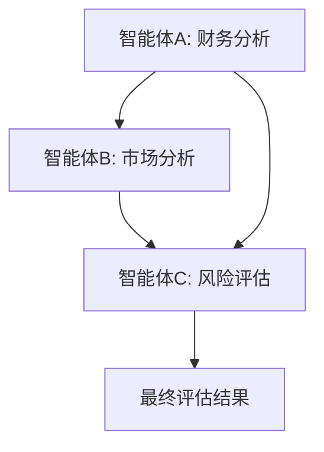
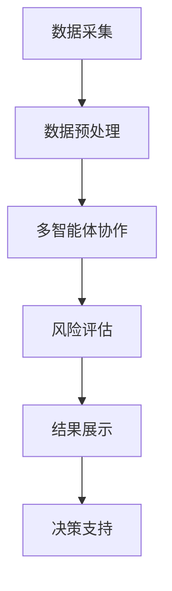
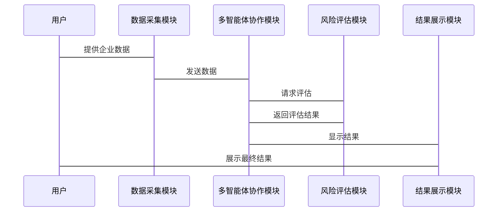

                 


# 价值投资中的多智能体AI破产风险评估系统

> 关键词：价值投资，多智能体AI，破产风险评估，金融建模，系统架构

> 摘要：本文探讨了在价值投资中利用多智能体人工智能技术进行破产风险评估的系统设计与实现。通过详细分析多智能体AI的基本原理、破产风险评估的数学模型以及系统的整体架构，本文为金融领域提供了创新的解决方案。文章还通过实际案例展示了系统的应用，为投资者提供了有效的决策支持。

---

## 第1章: 背景介绍

### 1.1 价值投资与破产风险评估的背景

#### 1.1.1 价值投资的基本概念
价值投资是一种投资策略，旨在通过分析企业的基本面，如财务状况、盈利能力和发展潜力，来寻找被市场低估的投资标的。其核心在于识别那些具有长期竞争优势且市场价格低于内在价值的企业。

#### 1.1.2 破产风险评估的重要性
破产风险评估是衡量企业财务健康状况的重要指标。通过评估企业的偿债能力、现金流状况和资产负债结构，投资者可以更好地识别潜在的财务危机，从而做出更明智的投资决策。

#### 1.1.3 多智能体AI在金融领域的应用前景
多智能体AI通过多个协作智能体的协同工作，能够处理复杂金融数据，提供更精准的分析和预测。其分布式计算和协作学习的能力，使其在金融建模和风险评估中具有广阔的应用前景。

### 1.2 问题背景与描述

#### 1.2.1 传统破产风险评估的局限性
传统破产风险评估方法依赖于简单的财务指标和统计模型，难以捕捉企业经营中的动态变化和复杂因素。此外，单点模型缺乏对多维度数据的综合分析能力，导致评估结果的准确性有限。

#### 1.2.2 价值投资中的风险评估需求
在价值投资中，投资者需要综合考虑企业的财务状况、市场地位、管理团队和行业趋势等多方面因素。传统的单点模型难以满足这种复杂的需求，因此需要更先进的技术手段来支持决策。

#### 1.2.3 多智能体AI的优势与挑战
多智能体AI通过协作学习和分布式计算，能够更全面地分析企业数据，提供更精准的评估结果。然而，其复杂性和计算成本也是需要克服的挑战。

---

## 第2章: 多智能体AI的基本原理

### 2.1 多智能体系统的定义与特点

#### 2.1.1 多智能体系统的定义
多智能体系统由多个相互协作的智能体组成，每个智能体负责特定的任务，并通过通信和协作完成整体目标。

#### 2.1.2 多智能体系统的特征对比表格

| 特征         | 单智能体系统     | 多智能体系统     |
|--------------|-----------------|-----------------|
| 智能体数量   | 单个            | 多个            |
| 任务处理     | 独立处理        | 协作处理        |
| 通信机制     | 无              | 有              |
| 分布式计算   | 集中            | 分布            |

#### 2.1.3 ER实体关系图架构

```mermaid
erd
    entity 企业 (id, name, industry)
    entity 财务指标 (id, 企业id, revenue, profit, debt)
    entity 风险评估 (id, 企业id, risk_score, bankruptcy_prediction)
    relationship 企业 -> 财务指标: 拥有
    relationship 企业 -> 风险评估: 生成
```

### 2.2 价值投资中的多智能体协作机制

#### 2.2.1 多智能体协作的基本原理
多智能体协作通过任务分配、信息共享和协同决策，实现对复杂问题的共同解决。在价值投资中，多个智能体可以分别负责财务分析、市场研究和风险管理等任务。

#### 2.2.2 价值投资中的协作场景
在价值投资中，多智能体可以协作分析企业的财务数据、市场动态和行业趋势，综合评估企业的内在价值和破产风险。

#### 2.2.3 破产风险评估中的协作模型



---

## 第3章: 破产风险评估的数学模型

### 3.1 破产风险评估的基本模型

#### 3.1.1 线性回归模型

线性回归模型通过建立自变量和因变量之间的线性关系，预测破产概率。

$$ y = \beta_0 + \beta_1x_1 + \beta_2x_2 + \cdots + \beta_nx_n $$

其中，$y$ 是破产概率，$x_i$ 是各个自变量（如债务比率、流动比率等）。

#### 3.1.2 逻辑回归模型

逻辑回归模型适用于二分类问题，常用于预测企业是否破产。

$$ P(y=1|x) = \frac{1}{1 + e^{-(\beta_0 + \beta_1x_1 + \cdots + \beta_nx_n)}} $$

#### 3.1.3 支持向量机模型

支持向量机通过构建超平面，将数据分为可破产和不可破产两类。

$$ \text{目标函数} = \min \frac{1}{2}||\beta||^2 + C\sum_{i=1}^n \xi_i $$
$$ \text{约束条件} = y_i(\beta_0 + \beta^T x_i) \geq 1 - \xi_i, \xi_i \geq 0 $$

### 3.2 多智能体协作的数学模型

#### 3.2.1 多智能体协作的数学表达

在多智能体协作中，每个智能体负责特定的任务，并通过信息共享和协同优化实现整体目标。

$$ \text{总风险评估} = \sum_{i=1}^n \text{智能体}_i \text{的评估结果} $$

#### 3.2.2 破产风险评估的联合概率模型

联合概率模型通过多个智能体的评估结果，计算企业破产的综合概率。

$$ P(\text{破产}) = \prod_{i=1}^n P_i(\text{破产} | x_i) $$

其中，$P_i$ 是第$i$个智能体的破产概率预测。

#### 3.2.3 模型的优化与改进

通过引入分布式优化算法（如分布式梯度下降）和协作学习机制，可以进一步提高模型的准确性和效率。

---

## 第4章: 系统分析与架构设计

### 4.1 系统功能设计

#### 4.1.1 系统功能模块划分

系统功能模块包括数据采集、风险评估、结果展示和决策支持。

#### 4.1.2 系统功能流程图



#### 4.1.3 系统功能的实现方式

通过分布式计算和协作学习，实现多智能体的协同工作。数据采集和预处理模块负责获取企业数据，多智能体协作模块负责任务分配和信息共享，风险评估模块负责模型计算，结果展示模块提供可视化界面，决策支持模块为投资者提供策略建议。

### 4.2 系统架构设计

#### 4.2.1 系统架构的总体设计

系统采用分布式架构，由多个智能体节点组成，每个节点负责特定的任务。通过通信模块实现智能体之间的协作。

#### 4.2.2 系统架构的详细设计

系统架构包括数据层、计算层和应用层。数据层负责存储和管理企业数据，计算层负责多智能体的协作计算，应用层负责结果展示和决策支持。

#### 4.2.3 系统架构的优化建议

通过引入负载均衡和容错机制，提高系统的稳定性和计算效率。

### 4.3 系统接口与交互设计

#### 4.3.1 系统接口设计

系统接口包括数据接口、计算接口和用户接口。数据接口用于数据的输入和输出，计算接口用于智能体的协作计算，用户接口用于与用户的交互。

#### 4.3.2 系统交互的序列图



---

## 第5章: 项目实战

### 5.1 环境安装与配置

#### 5.1.1 系统运行环境要求

推荐使用Python 3.8及以上版本，安装必要的库如TensorFlow、Keras和scikit-learn。

#### 5.1.2 开发工具的安装与配置

安装Jupyter Notebook、PyCharm或VS Code，并配置相应的Python环境。

#### 5.1.3 数据集的准备与预处理

收集企业的财务数据，包括收入、利润、债务等，并进行清洗和标准化处理。

### 5.2 系统核心实现

#### 5.2.1 多智能体协作算法的实现

实现一个多智能体协作算法，例如分布式梯度下降，用于优化风险评估模型。

#### 5.2.2 破产风险评估模型的实现

基于逻辑回归模型，实现企业破产风险的预测。

#### 5.2.3 系统功能模块的实现

实现数据采集、风险评估和结果展示等功能模块，确保系统能够流畅运行。

### 5.3 案例分析与结果解读

通过具体案例展示系统的运行过程和评估结果，分析模型的准确性和鲁棒性。

### 5.4 项目小结

总结项目的实现过程和成果，指出存在的问题和改进建议。

---

## 第6章: 总结与展望

### 6.1 本章总结

回顾全文，总结多智能体AI在价值投资中的应用及其破产风险评估系统的实现过程。

### 6.2 最佳实践 tips

- 多智能体协作可以提高模型的准确性和鲁棒性。
- 系统设计中应注重数据安全和隐私保护。
- 在实际应用中，应结合企业的实际情况进行模型调优。

### 6.3 小结

通过本系统的实现，为价值投资者提供了更精准的破产风险评估工具，帮助投资者做出更明智的投资决策。

### 6.4 注意事项

- 数据来源应确保准确性和可靠性。
- 系统运行应考虑计算资源的限制。
- 模型应定期更新以适应市场变化。

### 6.5 拓展阅读

推荐相关领域的书籍和论文，供读者进一步学习和研究。

---

## 作者

作者：AI天才研究院/AI Genius Institute & 禅与计算机程序设计艺术 /Zen And The Art of Computer Programming

---

通过本文的详细讲解，我们展示了如何利用多智能体AI技术构建破产风险评估系统，并为价值投资者提供了有力的决策支持。希望本文的内容能够为读者在金融领域的创新研究提供有价值的参考。

