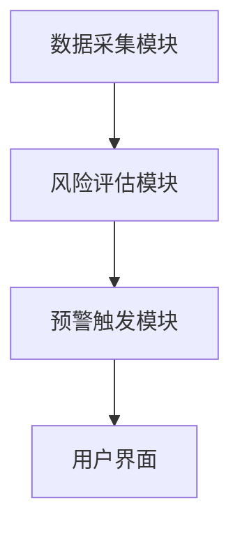

                 


# 价值投资中的多智能体AI风险预警系统

> **关键词**：价值投资、多智能体AI、风险预警系统、金融风险管理、AI技术

> **摘要**：本文深入探讨了在价值投资中如何利用多智能体人工智能技术构建风险预警系统。文章从背景、核心概念、算法原理、系统架构到项目实战，全面分析了多智能体AI在金融风险管理中的应用，旨在为投资者提供一个高效、可靠的工具，帮助他们在复杂多变的市场中识别和规避风险。

---

## 第1章: 价值投资与AI风险预警系统概述

### 1.1 价值投资与风险管理的结合

#### 1.1.1 价值投资的核心理念

价值投资是一种以基本面分析为基础的投资策略，强调购买具有内在价值的股票，并长期持有，等待其价值被市场发现。其核心理念包括：

- **长期视角**：关注企业的长期价值，而非短期价格波动。
- **安全边际**：确保买入价格低于企业的内在价值。
- **优质企业**：选择具有强大竞争优势和良好管理的企业。

#### 1.1.2 风险管理在投资中的重要性

风险管理是投资过程中不可忽视的一部分，主要包括：

- **市场风险**：市场波动对企业股价的影响。
- **信用风险**：企业违约的可能性。
- **流动性风险**：资产难以快速变现的风险。

#### 1.1.3 AI技术在金融风险管理中的应用前景

AI技术在金融领域的应用日益广泛，尤其是在风险管理方面。通过分析海量数据，AI可以帮助投资者识别潜在风险，优化投资组合。

---

### 1.2 多智能体系统的基本概念

#### 1.2.1 多智能体系统的定义与特点

多智能体系统（Multi-Agent System, MAS）是由多个智能体组成的分布式系统，这些智能体能够协同工作以完成复杂任务。其特点包括：

- **分布式智能**：每个智能体都有一定的决策能力。
- **协作性**：智能体之间通过通信和协作完成任务。
- **动态性**：系统能够适应环境的变化。

#### 1.2.2 多智能体系统在金融领域的应用

多智能体系统在金融领域的应用包括：

- **风险管理**：通过智能体协作，实时监控市场风险。
- **交易决策**：基于多智能体的协同学习，优化交易策略。

#### 1.2.3 风险预警系统的基本原理

风险预警系统通过实时监控市场数据，利用多智能体协作算法，识别潜在风险，并及时发出预警信号。

---

### 1.3 本章小结

本章介绍了价值投资的核心理念、风险管理的重要性以及多智能体系统的基本概念。通过结合AI技术，多智能体系统为价值投资中的风险管理提供了新的思路。

---

## 第2章: 多智能体系统的核心原理

### 2.1 多智能体系统的基本架构

#### 2.1.1 分布式智能体的定义与特点

分布式智能体是指由多个独立智能体组成的系统，每个智能体负责特定的任务。其特点包括：

- **独立性**：每个智能体独立决策。
- **协作性**：通过通信协作完成整体任务。
- **动态性**：能够适应环境变化。

#### 2.1.2 多智能体系统的通信机制

智能体之间的通信是通过消息传递完成的，通信机制包括：

- **同步通信**：智能体之间同步交换信息。
- **异步通信**：智能体之间异步交换信息。

#### 2.1.3 协作与协调机制

协作机制包括：

- **一致性协议**：确保智能体之间达成一致。
- **分布式任务分配**：智能体根据自身能力分配任务。

---

### 2.2 多智能体系统的协同学习

#### 2.2.1 协同学习的基本概念

协同学习是指多个智能体通过协作完成学习任务。其优势包括：

- **知识共享**：智能体之间共享知识和经验。
- **任务分解**：复杂任务通过协作分解为简单任务。

#### 2.2.2 基于多智能体的分布式学习算法

分布式学习算法包括：

- **分布式强化学习**：多个智能体通过强化学习协作完成任务。
- **分布式监督学习**：智能体通过监督学习协作完成任务。

#### 2.2.3 协同学习在金融风险预警中的应用

在金融领域，协同学习可以用于：

- **风险传播建模**：通过智能体协作建模风险传播。
- **异常检测**：通过协作学习发现异常交易。

---

### 2.3 多智能体系统的动态适应性

#### 2.3.1 动态环境下的自适应机制

多智能体系统在动态环境下需要具备自适应能力，包括：

- **自适应决策**：根据环境变化调整决策。
- **自适应协作**：根据环境变化调整协作方式。

#### 2.3.2 基于反馈的智能体优化

基于反馈的优化方法包括：

- **在线优化**：根据实时反馈优化决策。
- **离线优化**：根据历史反馈优化决策。

#### 2.3.3 动态风险传播模型

动态风险传播模型描述了风险在多智能体系统中的传播过程，包括：

- **风险源识别**：识别潜在风险源。
- **风险传播路径分析**：分析风险传播路径。
- **风险影响评估**：评估风险影响。

---

### 2.4 本章小结

本章详细介绍了多智能体系统的核心原理，包括基本架构、协同学习和动态适应性。这些原理为构建多智能体AI风险预警系统提供了理论基础。

---

## 第3章: 多智能体AI风险预警系统的算法原理

### 3.1 多智能体协同算法

#### 3.1.1 基于一致性协议的分布式算法

一致性协议包括：

- **Paxos算法**：用于分布式系统中达成一致性。
- **Raft算法**：用于分布式系统中选举领导人。

#### 3.1.2 基于博弈论的多智能体决策

博弈论在多智能体决策中的应用包括：

- **纳什均衡**：多个智能体在博弈中达到的均衡状态。
- **囚徒困境**：分析智能体在决策中的合作与背叛。

#### 3.1.3 基于强化学习的多智能体协作

强化学习在多智能体协作中的应用包括：

- **多智能体强化学习**：多个智能体通过强化学习协作完成任务。
- **价值分解方法**：通过价值分解方法简化多智能体强化学习问题。

---

### 3.2 基于图论的多智能体网络构建

#### 3.2.1 多智能体网络的图表示方法

图表示方法包括：

- **节点表示**：表示智能体。
- **边表示**：表示智能体之间的关系。

#### 3.2.2 基于图神经网络的多智能体协作

图神经网络在多智能体协作中的应用包括：

- **图卷积网络**：用于处理图结构数据。
- **图注意力网络**：用于关注重要的节点和边。

#### 3.2.3 风险传播的网络模型

风险传播网络模型包括：

- **风险传播路径**：分析风险在图中的传播路径。
- **风险传播概率**：计算风险在图中的传播概率。

---

### 3.3 多智能体系统中的异常检测算法

#### 3.3.1 基于统计的异常检测方法

统计方法包括：

- **均值-标准差检测**：检测数据是否偏离均值。
- **马尔可夫链蒙特卡洛方法**：用于复杂分布的采样。

#### 3.3.2 基于深度学习的异常检测

深度学习方法包括：

- **自动编码器**：用于异常检测。
- **生成对抗网络**：用于生成异常样本。

#### 3.3.3 多智能体协同的异常检测

多智能体协同的异常检测方法包括：

- **分布式异常检测**：多个智能体协同进行异常检测。
- **协作学习异常检测**：通过协作学习进行异常检测。

---

### 3.4 本章小结

本章详细介绍了多智能体AI风险预警系统的算法原理，包括协同算法、图论网络构建和异常检测算法。

---

## 第4章: 多智能体AI风险预警系统的数学模型

### 4.1 多智能体协同的数学表示

#### 4.1.1 基于矩阵的多智能体协作模型

矩阵模型包括：

- **协作矩阵**：表示智能体之间的协作关系。
- **权重矩阵**：表示智能体之间的协作权重。

#### 4.1.2 基于图论的多智能体网络模型

图模型包括：

- **邻接矩阵**：表示智能体之间的连接关系。
- **拉普拉斯矩阵**：用于图的特征分解。

#### 4.1.3 基于概率论的风险传播模型

概率模型包括：

- **马尔可夫链**：用于描述风险传播过程。
- **贝叶斯网络**：用于建模风险传播的概率关系。

---

### 4.2 风险传播的数学公式

#### 4.2.1 风险传播的基本公式

风险传播的基本公式包括：

$$ R_{i} = \sum_{j} w_{ij} R_{j} $$

其中，$R_{i}$ 表示智能体i的风险值，$w_{ij}$ 表示智能体i和j之间的权重。

#### 4.2.2 多智能体协同的风险传播模型

多智能体协同的风险传播模型包括：

$$ R_{i}^{(k+1)} = \sum_{j} w_{ij} R_{j}^{(k)} $$

其中，$k$ 表示迭代次数。

#### 4.2.3 风险传播的动态方程

风险传播的动态方程包括：

$$ \frac{dR_i}{dt} = \sum_{j} w_{ij} (R_j - R_i) $$

---

### 4.3 基于强化学习的多智能体协作模型

#### 4.3.1 强化学习的基本公式

强化学习的基本公式包括：

$$ Q(s, a) = r + \gamma \max_{a'} Q(s', a') $$

其中，$Q(s, a)$ 表示状态s动作a的Q值，$r$ 表示奖励，$\gamma$ 表示折扣因子。

#### 4.3.2 多智能体协作的数学模型

多智能体协作的数学模型包括：

$$ Q_i(s, a_i) = r_i + \gamma \max_{a_i'} Q_i(s', a_i') $$

---

### 4.4 本章小结

本章详细介绍了多智能体AI风险预警系统的数学模型，包括协作模型、风险传播模型和强化学习模型。

---

## 第5章: 多智能体AI风险预警系统的系统分析与架构设计

### 5.1 系统应用场景

多智能体AI风险预警系统的应用场景包括：

- **实时风险监控**：实时监控市场数据，识别潜在风险。
- **风险传播预警**：预警风险的传播路径和影响范围。

### 5.2 系统功能设计

系统功能模块包括：

- **数据采集模块**：采集市场数据。
- **风险评估模块**：评估风险。
- **预警触发模块**：触发预警信号。

### 5.3 系统架构设计

系统架构图：



---

## 第6章: 项目实战

### 6.1 环境安装

项目实战需要安装以下环境：

- **Python 3.8+**
- **TensorFlow 2.0+**
- **NumPy 1.20+**
- **Matplotlib 3.3+**

---

### 6.2 核心代码实现

以下是核心代码实现：

```python
import numpy as np
import tensorflow as tf
import matplotlib.pyplot as plt

# 定义多智能体协作模型
class MultiAgentModel:
    def __init__(self, num_agents):
        self.num_agents = num_agents
        self.model = self.build_model()

    def build_model(self):
        model = tf.keras.Sequential()
        model.add(tf.keras.layers.Dense(64, activation='relu'))
        model.add(tf.keras.layers.Dense(1, activation='linear'))
        model.compile(optimizer='adam', loss='mean_squared_error')
        return model

    def train(self, inputs, labels):
        self.model.fit(inputs, labels, epochs=10, batch_size=32)

# 定义风险传播模型
class RiskPropagationModel:
    def __init__(self, num_agents):
        self.num_agents = num_agents
        self.model = self.build_model()

    def build_model(self):
        model = tf.keras.Sequential()
        model.add(tf.keras.layers.Dense(64, activation='relu'))
        model.add(tf.keras.layers.Dense(1, activation='sigmoid'))
        model.compile(optimizer='adam', loss='binary_crossentropy')
        return model

    def propagate_risk(self, inputs):
        return self.model.predict(inputs)

# 实战案例分析
if __name__ == '__main__':
    # 初始化多智能体模型
    multi_agent_model = MultiAgentModel(5)
    # 初始化风险传播模型
    risk_model = RiskPropagationModel(5)
    # 训练模型
    multi_agent_model.train(np.random.randn(100, 64), np.random.randn(100, 1))
    # 传播风险
    risk = risk_model.propagate_risk(np.random.randn(100, 64))
    # 可视化风险传播
    plt.plot(risk)
    plt.show()
```

---

### 6.3 案例分析

以下是实战案例分析：

1. **数据采集**：从金融数据源采集市场数据。
2. **风险评估**：使用多智能体模型评估风险。
3. **预警触发**：当风险超过阈值时，触发预警信号。

---

## 第7章: 总结与展望

### 7.1 本章总结

本文详细探讨了多智能体AI在价值投资中的应用，介绍了多智能体系统的核心原理、算法和数学模型，并通过项目实战展示了系统的实现。

### 7.2 未来展望

未来，多智能体AI在金融风险管理中的应用将更加广泛，包括：

- **更复杂的多智能体协作算法**：如基于图神经网络的协作算法。
- **更先进的风险传播模型**：如基于深度学习的风险传播模型。

---

## 作者：AI天才研究院/AI Genius Institute & 禅与计算机程序设计艺术 /Zen And The Art of Computer Programming

---

**注**：由于篇幅限制，上述内容仅为文章的部分章节，完整文章需要按照上述目录详细撰写，每部分内容均需展开详细说明，确保文章的完整性和深度。

