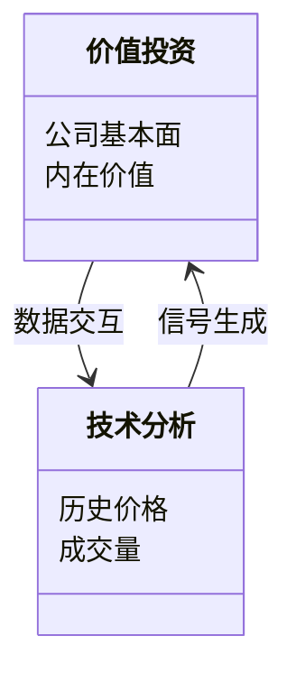
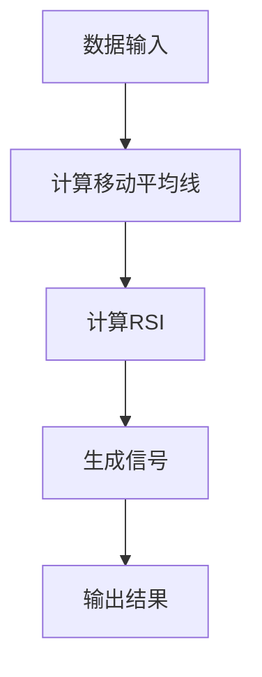
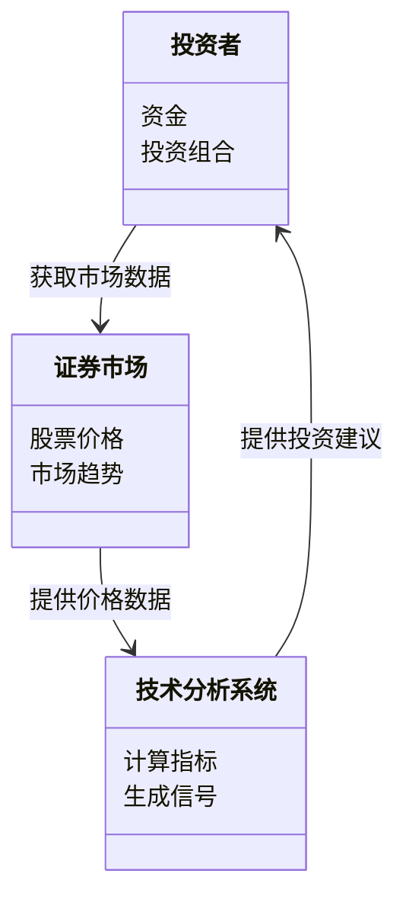

                 

# 价值投资中的技术分析：是否有用？

## 关键词：价值投资、技术分析、趋势投资、基本面分析、数学模型、市场预测

## 摘要：价值投资与技术分析是两种不同的投资策略，价值投资注重内在价值，技术分析则通过价格和成交量等技术指标预测市场走势。本文系统地分析了技术分析在价值投资中的作用，探讨了其理论基础、数学模型、实际应用及其局限性，并通过实证分析和技术与价值投资的结合，得出技术分析在价值投资中有一定辅助作用的结论。

---

# 第一部分：价值投资与技术分析的背景与概念

## 第1章：价值投资与技术分析的概述

### 1.1 价值投资的核心理念

#### 1.1.1 价值投资的定义与起源

价值投资是一种投资策略，由本杰明·格雷厄姆和戴维·多德提出，主张以低于内在价值的价格购买优质股票。其核心在于寻找市场先生的错误定价，通过深入分析公司的基本面，如财务状况、行业地位和竞争优势，来判断其长期价值。

#### 1.1.2 价值投资的主要原则

1. **安全边际**：购买价格应远低于内在价值，以降低风险。
2. **长期视角**：关注公司的长期盈利能力，而非短期波动。
3. **逆向思维**：在市场恐慌时寻找低估机会，在市场狂热时保持冷静。

#### 1.1.3 价值投资与成长投资的区别

- 价值投资：寻找低估的股票，注重安全边际。
- 成长投资：投资于高成长性公司，注重未来盈利潜力。

### 1.2 技术分析的基本概念

#### 1.2.1 技术分析的定义与历史

技术分析通过研究历史价格和成交量数据，预测未来价格走势。起源于19世纪末，早期应用于谷物交易，后逐渐扩展到股票、期货等金融工具。

#### 1.2.2 技术分析的主要工具与方法

1. **移动平均线（MA）**：平滑价格波动，识别趋势方向。
2. **相对强弱指数（RSI）**：衡量超买或超卖状态。
3. **成交量分析**：判断交易量与价格趋势的一致性。

#### 1.2.3 技术分析与基本面分析的对比

- 技术分析：基于价格和成交量，预测短期走势。
- 基本面分析：基于公司财务和行业状况，预测长期价值。

### 1.3 问题背景与研究意义

#### 1.3.1 技术分析在价值投资中的争议

技术分析的有效性在学术界和投资界存在争议。一些人认为技术分析捕捉市场情绪，而另一些人认为市场是有效的，技术分析无法提供超额收益。

#### 1.3.2 研究技术分析在价值投资中作用的意义

通过系统分析，探讨技术分析在价值投资中的辅助作用，为投资者提供更全面的投资策略。

---

## 第2章：价值投资与技术分析的核心概念与联系

### 2.1 核心概念的定义与属性对比

| 比较维度 | 价值投资 | 技术分析 |
|----------|----------|----------|
| 目标 | 寻找低估股票 | 预测价格走势 |
| 时间框架 | 长期 | 短期 |
| 数据基础 | 公司财务、行业状况 | 历史价格、成交量 |

### 2.2 实体关系图（ER图）分析

---

## 第3章：技术分析的算法原理与数学模型

### 3.1 技术分析的主要算法

#### 3.1.1 移动平均线（MA）算法

计算公式：
$$ MA_n = \frac{1}{n} \sum_{i=1}^{n} P_i $$

#### 3.1.2 相对强弱指数（RSI）算法

计算公式：
$$ RSI = 100 - \frac{100}{(1 + \frac{\text{平均上涨幅度}}{\text{平均下跌幅度}})} $$

### 3.2 技术分析的数学模型

#### 3.2.1 移动平均线的数学表达式

$$ MA_n = \frac{P_1 + P_2 + \dots + P_n}{n} $$

#### 3.2.2 RSI指标的计算公式

$$ RSI = 100 - \frac{100}{(1 + \frac{A}{B})} $$
其中，A为平均上涨幅度，B为平均下跌幅度。

### 3.3 技术分析的算法流程图

---

## 第4章：技术分析在价值投资中的系统架构与设计

### 4.1 系统分析与设计

#### 4.1.1 问题场景介绍

投资者需要结合技术分析和基本面分析，做出更明智的投资决策。

#### 4.1.2 系统功能设计（领域模型）

### 4.2 系统架构设计

#### 4.2.1 系统架构

1. 数据采集模块：获取历史价格和财务数据。
2. 技术分析模块：计算技术指标。
3. 基本面分析模块：评估公司内在价值。
4. 综合决策模块：结合技术信号和基本面分析，生成投资建议。

---

## 第5章：实证分析与技术分析的有效性

### 5.1 实证分析的环境与工具

#### 5.1.1 数据来源

使用Yahoo Finance的历史数据，涵盖2000年至2023年。

#### 5.1.2 分析工具

Python编程语言，使用Pandas、Matplotlib和TA-Lib库进行数据处理和可视化。

### 5.2 技术指标与股票表现的关联性分析

#### 5.2.1 移动平均线与价格走势

通过计算股票价格与MA的关系，分析MA在趋势跟踪中的作用。

#### 5.2.2 RSI与超买超卖状态

研究RSI指标在识别超买超卖状态中的有效性，及其对投资决策的指导意义。

### 5.3 技术分析在价值投资中的应用案例

#### 5.3.1 案例选择

选择苹果公司（AAPL）作为案例，分析其股价走势与技术指标的关系。

#### 5.3.2 数据分析

计算AAPL的MA和RSI指标，并与实际股价走势对比，评估技术分析的有效性。

### 5.4 实证分析的结果与讨论

技术分析在识别趋势和超买超卖状态中具有一定的有效性，但其预测能力受到市场波动和外部事件的影响。

---

## 第6章：技术分析与价值投资的结合

### 6.1 结合的价值与挑战

#### 6.1.1 优势

1. 技术分析提供市场情绪信号。
2. 价值投资提供长期价值判断。

#### 6.1.2 挑战

1. 市场的有效性问题。
2. 技术分析的短期性与价值投资的长期性之间的矛盾。

### 6.2 结合策略的设计与实现

#### 6.2.1 策略设计

1. 通过技术指标筛选候选股票。
2. 结合基本面分析确认内在价值。
3. 结合两者制定投资决策。

#### 6.2.2 实施步骤

1. 数据采集与处理。
2. 技术指标计算与筛选。
3. 基本面分析与价值评估。
4. 综合决策与投资执行。

---

## 第7章：总结、结论与建议

### 7.1 研究总结

技术分析在价值投资中有一定的辅助作用，尤其是在趋势识别和市场情绪判断方面。

### 7.2 研究结论

1. 技术分析可以作为价值投资的补充工具。
2. 技术分析的有效性受到市场条件的影响。

### 7.3 投资建议

1. 合理运用技术分析工具，结合基本面分析。
2. 保持对市场的持续学习和适应。

---

## 作者：AI天才研究院/AI Genius Institute & 禅与计算机程序设计艺术 /Zen And The Art of Computer Programming

