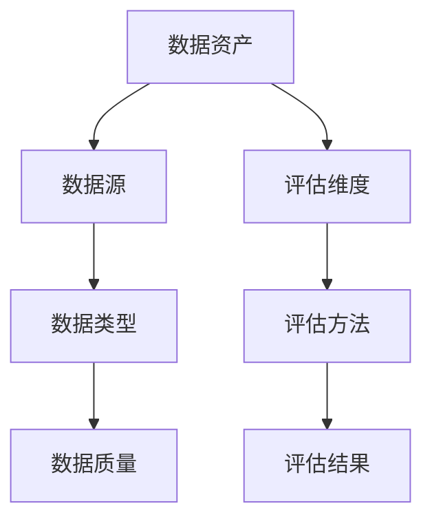
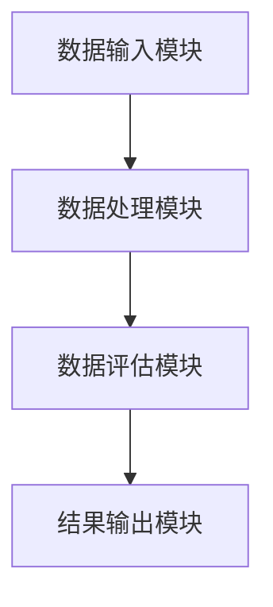
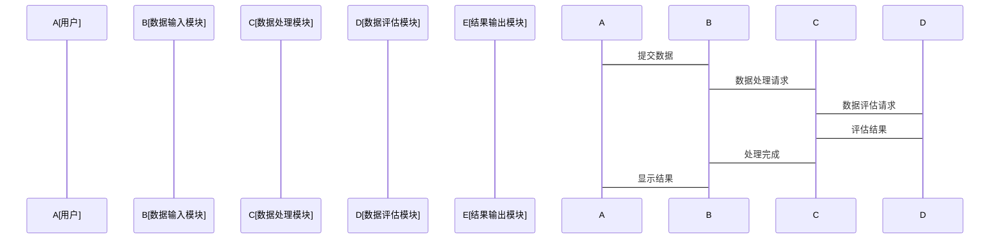

                 


# 价值投资中的数据资产评估

## 关键词：
- 数据资产评估
- 价值投资
- 数据资产
- 投资分析
- 数据价值

## 摘要：
数据资产评估是价值投资中的关键环节，通过对数据资产的量化和价值评估，投资者能够更准确地评估投资目标的潜在价值。本文从数据资产的基本概念出发，详细探讨了数据资产评估的核心原理、数学模型和算法，结合实际案例分析，为投资者提供了一套系统化的数据资产评估方法。

---

## 目录大纲

### 第一部分: 价值投资中的数据资产评估基础

### 第1章: 数据资产评估的背景与概述

#### 1.1 数据资产的基本概念
- 1.1.1 数据资产的定义与特征
  - 数据资产的定义
  - 数据资产的特征（真实性、完整性、一致性、及时性、可扩展性）
- 1.1.2 数据资产在价值投资中的重要性
  - 数据资产作为投资决策的核心依据
  - 数据资产的稀缺性和独特性
- 1.1.3 数据资产评估的必要性
  - 数据资产评估的目标
  - 数据资产评估的意义

#### 1.2 数据资产评估的背景与问题背景
- 1.2.1 价值投资的定义与核心理念
  - 价值投资的定义
  - 价值投资的核心理念
- 1.2.2 数据资产在现代投资中的作用
  - 数据资产在投资决策中的应用
  - 数据资产对投资风险的控制
- 1.2.3 数据资产评估中的常见问题
  - 数据质量的问题
  - 数据来源的可靠性
  - 数据相关性的评估

#### 1.3 数据资产评估的核心目标
- 1.3.1 数据资产的量化与价值评估
  - 数据资产的量化方法
  - 数据资产的价值评估指标
- 1.3.2 数据资产的生命周期与价值变化
  - 数据资产的生命周期
  - 数据资产价值的变化趋势
- 1.3.3 数据资产的边界与外延
  - 数据资产的边界
  - 数据资产的外延

#### 1.4 数据资产的边界与外延
- 1.4.1 数据资产的分类与层次结构
  - 数据资产的分类
  - 数据资产的层次结构
- 1.4.2 数据资产评估的范围与限制
  - 数据资产评估的范围
  - 数据资产评估的限制
- 1.4.3 数据资产与其他资产的关系
  - 数据资产与传统资产的关系
  - 数据资产与其他无形资产的关系

#### 1.5 本章小结

### 第2章: 数据资产评估的核心概念与联系

#### 2.1 数据资产评估的核心概念
- 2.1.1 数据资产的核心要素
  - 数据的来源
  - 数据的质量
  - 数据的相关性
  - 数据的稀缺性
- 2.1.2 数据资产的属性特征
  - 数据的真实性
  - 数据的完整性
  - 数据的可扩展性
- 2.1.3 数据资产的评估维度
  - 数据的质量维度
  - 数据的相关性维度
  - 数据的稀缺性维度

#### 2.2 数据资产评估的核心原理
- 2.2.1 数据资产的价值来源
  - 数据的稀缺性
  - 数据的相关性
  - 数据的可操作性
- 2.2.2 数据资产的评估方法
  - 定量评估方法
  - 定性评估方法
- 2.2.3 数据资产的评估模型
  - 数据质量评估模型
  - 数据相关性评估模型
  - 数据稀缺性评估模型

#### 2.3 数据资产评估的ER实体关系图


#### 2.4 本章小结

### 第3章: 数据资产评估的数学模型与算法原理

#### 3.1 数据资产评估的数学模型
- 3.1.1 数据质量评估模型
  - 数据质量的定义
  - 数据质量的评估指标
- 3.1.2 数据相关性评估模型
  - 数据相关性的定义
  - 数据相关性的评估指标
- 3.1.3 数据稀缺性评估模型
  - 数据稀缺性的定义
  - 数据稀缺性的评估指标

#### 3.2 数据资产评估的算法原理
- 3.2.1 数据质量评估算法
  - 数据清洗算法
  - 数据去重算法
  - 数据填补算法
- 3.2.2 数据相关性评估算法
  - 数据相关性的计算方法
  - 数据相关性的可视化方法
- 3.2.3 数据稀缺性评估算法
  - 数据的唯一性评估
  - 数据的分布评估

#### 3.3 数据资产评估的数学公式
- 3.3.1 数据质量评估公式
  $$ Q = \frac{\sum_{i=1}^{n} w_i x_i}{\sum_{i=1}^{n} w_i} $$
- 3.3.2 数据相关性评估公式
  $$ R = \frac{\sum_{i=1}^{n} (x_i - \bar{x})(y_i - \bar{y})}{\sqrt{\sum_{i=1}^{n} (x_i - \bar{x})^2 \sum_{i=1}^{n} (y_i - \bar{y})^2}} $$
- 3.3.3 数据稀缺性评估公式
  $$ S = \frac{\sum_{i=1}^{n} \log(1 + x_i)}{n} $$

#### 3.4 本章小结

### 第4章: 数据资产评估的系统分析与架构设计

#### 4.1 系统分析
- 4.1.1 项目背景
  - 数据资产评估的需求背景
  - 数据资产评估的目标
- 4.1.2 系统功能设计
  - 数据输入模块
  - 数据处理模块
  - 数据评估模块
  - 结果输出模块

#### 4.2 系统架构设计
- 4.2.1 系统架构图


#### 4.3 系统接口设计
- 4.3.1 数据输入接口
  - 输入数据格式
  - 输入数据结构
- 4.3.2 数据输出接口
  - 输出数据格式
  - 输出数据结构

#### 4.4 系统交互设计
- 4.4.1 系统交互序列图


#### 4.5 本章小结

### 第5章: 数据资产评估的项目实战

#### 5.1 环境安装
- 5.1.1 系统环境要求
  - 操作系统
  - 程序语言
  - 开发工具
- 5.1.2 数据库安装与配置
  - 数据库选择
  - 数据库配置
- 5.1.3 开发工具安装
  - 编程语言安装
  - 开发框架安装

#### 5.2 核心代码实现
- 5.2.1 数据质量评估代码
  ```python
  def calculate_quality(data):
      # 数据质量计算逻辑
      pass
  ```
- 5.2.2 数据相关性评估代码
  ```python
  def calculate_correlation(data):
      # 数据相关性计算逻辑
      pass
  ```
- 5.2.3 数据稀缺性评估代码
  ```python
  def calculate_scarcity(data):
      # 数据稀缺性计算逻辑
      pass
  ```

#### 5.3 代码解读与分析
- 5.3.1 代码结构分析
  - 代码的模块划分
  - 代码的逻辑流程
- 5.3.2 代码实现细节
  - 数据预处理
  - 数据评估

#### 5.4 案例分析
- 5.4.1 案例背景
  - 数据来源
  - 数据特点
- 5.4.2 案例分析过程
  - 数据清洗
  - 数据评估
  - 结果分析

#### 5.5 项目小结

### 第6章: 数据资产评估的最佳实践与总结

#### 6.1 最佳实践
- 6.1.1 数据资产评估的技巧
  - 数据质量的提升
  - 数据相关性的优化
  - 数据稀缺性的管理
- 6.1.2 数据资产评估的注意事项
  - 数据源的选择
  - 数据处理的规范
  - 数据评估的准确性

#### 6.2 未来趋势
- 6.2.1 数据资产评估的技术发展
  - 人工智能在数据资产评估中的应用
  - 大数据技术的进一步融合
- 6.2.2 数据资产评估的行业应用
  - 金融领域的深度应用
  - 其他行业的扩展应用

#### 6.3 本章小结

### 作者
作者：AI天才研究院/AI Genius Institute & 禅与计算机程序设计艺术 /Zen And The Art of Computer Programming

