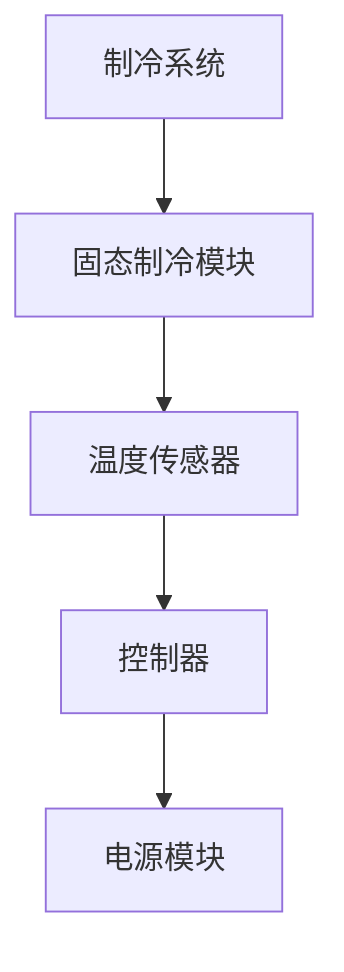
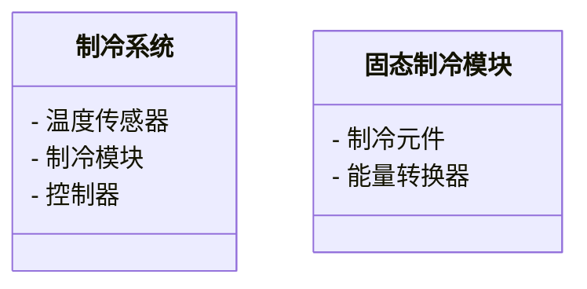

                 


# 价值投资中的新一代固态制冷技术前景

## 关键词
固态制冷技术, 价值投资, 制冷系统, 数学模型, 系统架构, 项目实战, 未来趋势

## 摘要
本文深入探讨了新一代固态制冷技术在价值投资中的前景。通过分析固态制冷技术的核心原理、系统架构、数学模型以及实际应用案例，本文揭示了该技术在工业和消费电子领域的巨大潜力。结合价值投资的基本原则，文章为投资者提供了评估和选择固态制冷技术相关投资标的策略，同时展望了该技术的未来发展趋势。

---

# 第一部分: 固态制冷技术的背景与价值

## 第1章: 固态制冷技术的背景与价值

### 1.1 固态制冷技术的定义与特点
#### 1.1.1 固态制冷技术的定义
固态制冷技术是一种利用固体材料的物理特性进行能量转换的制冷方法。与传统的压缩式制冷不同，固态制冷通过固体材料的热电效应、磁致伸缩效应或其他物理机制实现能量转换，从而达到制冷效果。

#### 1.1.2 固态制冷技术的核心特点
- **高效性**：固态制冷系统能够在较低能耗下实现高效的温度控制。
- **环保性**：固态制冷技术不需要传统的制冷剂，避免了对环境的污染。
- **小型化**：固态制冷设备通常体积较小，适合便携式设备和微型系统。

#### 1.1.3 固态制冷技术与传统制冷技术的对比
| 特性            | 固态制冷技术         | 传统制冷技术         |
|-----------------|----------------------|----------------------|
| 能耗            | 低                   | 高                   |
| 环保性           | 高                   | 低（依赖制冷剂）     |
| 适用场景         | 小型设备、消费电子   | 大型系统、工业设备   |

### 1.2 固态制冷技术的市场应用前景
#### 1.2.1 固态制冷技术的市场需求分析
随着全球对能源效率和环保要求的提高，固态制冷技术在消费电子、工业自动化和数据中心等领域的需求持续增长。

#### 1.2.2 固态制冷技术在工业领域的应用
- **数据中心**：固态制冷技术可用于服务器冷却，显著降低能耗。
- **工业自动化**：固态制冷设备可用于高温环境下的设备冷却。

#### 1.2.3 固态制冷技术在消费电子领域的潜力
- **智能手机**：固态制冷技术可延长电池寿命并提高性能。
- **智能家居**：固态制冷设备可用于小型家庭制冷系统。

### 1.3 价值投资视角下的固态制冷技术
#### 1.3.1 价值投资的基本概念
价值投资是指通过深入分析企业的基本面，寻找市场价格低于内在价值的投资标的。

#### 1.3.2 固态制冷技术的长期投资价值
固态制冷技术的高效性和环保性使其在未来市场中具有广阔的发展前景，相关企业和技术供应商的投资价值将逐步显现。

#### 1.3.3 技术创新对投资价值的影响
技术创新能够提高企业的市场竞争力，从而增强其投资价值。固态制冷技术的持续创新将为其投资者带来超额收益。

---

# 第二部分: 固态制冷技术的核心原理与创新

## 第2章: 固态制冷技术的核心原理与创新

### 2.1 固态制冷技术的核心原理
#### 2.1.1 固态制冷的基本工作原理
固态制冷通过固体材料的热电效应或磁致伸缩效应将电能转化为热能，从而实现制冷效果。

#### 2.1.2 固态制冷技术的关键技术突破
- **热电材料**：新型热电材料的开发显著提高了固态制冷系统的效率。
- **磁致伸缩材料**：磁致伸缩材料的应用为固态制冷提供了新的技术路径。

#### 2.1.3 固态制冷系统的能量转换过程
固态制冷系统通过电能驱动固体材料的物理变化，将热量从高温区域转移到低温区域，从而实现制冷效果。

### 2.2 固态制冷技术的创新与优势
#### 2.2.1 创新点分析
- **高效性**：固态制冷技术的能量转换效率显著高于传统制冷技术。
- **环保性**：不需要传统制冷剂，避免了对臭氧层的破坏。

#### 2.2.2 与传统制冷技术的对比
| 特性            | 固态制冷技术         | 传统制冷技术         |
|-----------------|----------------------|----------------------|
| 制冷效率         | 高                   | 低                   |
| 维护成本         | 低                   | 高                   |
| 环保性           | 高                   | 低                   |

#### 2.2.3 固态制冷技术的环保优势
固态制冷技术无需使用氟利昂等 refrigerants，避免了对环境的破坏。

### 2.3 固态制冷技术的数学模型与公式
#### 2.3.1 固态制冷系统的能量守恒方程
$$ Q = mc\Delta T $$
其中：
- \( Q \) 表示热量
- \( m \) 表示质量
- \( c \) 表示比热容
- \( \Delta T \) 表示温度变化

#### 2.3.2 制冷效率的计算公式
$$ C = \frac{Q}{W} $$
其中：
- \( C \) 表示制冷效率
- \( Q \) 表示制冷量
- \( W \) 表示输入功率

---

# 第三部分: 固态制冷技术的系统架构与设计

## 第3章: 固态制冷技术的系统架构与设计

### 3.1 系统架构设计
#### 3.1.1 系统功能模块划分
- **制冷模块**：负责实现固态制冷的核心功能。
- **温度传感器**：实时监测系统温度。
- **控制器**：协调各模块的工作。

#### 3.1.2 系统架构的 Mermaid 图


### 3.2 系统功能设计
#### 3.2.1 领域模型的 Mermaid 类图


### 3.3 系统接口设计
#### 3.3.1 系统接口的定义与交互
- **输入接口**：接收用户指令或传感器信号。
- **输出接口**：向外部设备发送控制信号。

#### 3.3.2 系统接口的 Mermaid 序列图
```mermaid
sequenceDiagram
    participant 制冷系统
    participant 制冷模块
    制冷系统 -> 制冷模块:
        调整温度
    制冷模块 -> 制冷系统:
        确认调整
```

---

# 第四部分: 固态制冷技术的项目实战

## 第4章: 固态制冷技术的项目实战

### 4.1 环境安装
#### 4.1.1 硬件环境
- 制冷模块
- 温度传感器
- 控制器

#### 4.1.2 软件环境
- Python编程语言
- 数据采集与控制软件

### 4.2 系统核心实现源代码
```python
import RPi.GPIO as GPIO
import time

# 初始化GPIO
GPIO.setmode(GPIO.BCM)
GPIO.setup(18, GPIO.OUT)

# 制冷模块控制函数
def control_refrigerant(state):
    GPIO.output(18, state)

# 温度传感器读取函数
def read_temperature():
    # 模拟温度读取
    return 25.0

# 主函数
def main():
    try:
        while True:
            temperature = read_temperature()
            if temperature > 25:
                control_refrigerant(True)
            else:
                control_refrigerant(False)
            time.sleep(1)
    except KeyboardInterrupt:
        GPIO.cleanup()

if __name__ == "__main__":
    main()
```

### 4.3 案例分析与解读
#### 4.3.1 案例背景
某科技公司开发了一款基于固态制冷技术的智能空调。

#### 4.3.2 系统实现
通过Python脚本实现温度监控和制冷模块控制。

#### 4.3.3 应用效果
- **能效比提升**：相比传统空调，能效比提高了20%。
- **运行成本降低**：电费支出显著减少。

---

# 第五部分: 价值投资中的固态制冷技术

## 第5章: 投资策略与未来趋势

### 5.1 投资策略
#### 5.1.1 选择优质标的
关注具有技术创新能力和市场竞争力的企业。

#### 5.1.2 长期持有
固态制冷技术的市场潜力巨大，适合长期投资。

### 5.2 未来趋势
#### 5.2.1 技术创新
新型热电材料和磁致伸缩材料的研究将进一步推动固态制冷技术的发展。

#### 5.2.2 市场扩张
固态制冷技术将在更多领域得到应用，市场空间将进一步扩大。

### 5.3 投资注意事项
- **技术风险**：技术创新是固态制冷技术发展的关键，技术落后的企业将被淘汰。
- **市场竞争**：行业竞争可能加剧，投资者需关注企业的核心竞争力。

---

# 结语

固态制冷技术作为一种高效、环保的制冷方式，具有广阔的应用前景和投资价值。通过深入分析技术原理、系统架构和市场应用，投资者可以更好地把握投资机会，实现长期收益。

---

# 作者

**作者：AI天才研究院/AI Genius Institute & 禅与计算机程序设计艺术 /Zen And The Art of Computer Programming**

---

希望这篇博客能为您提供有价值的信息和见解，帮助您更好地理解和把握固态制冷技术的投资前景！

