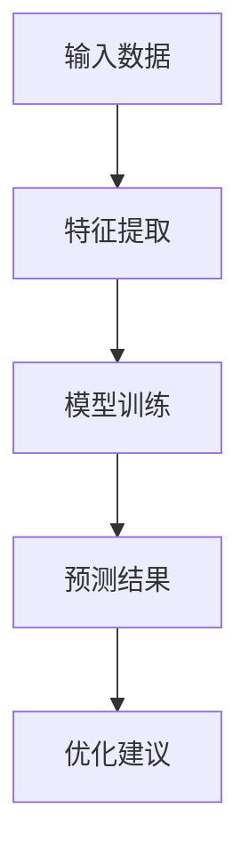
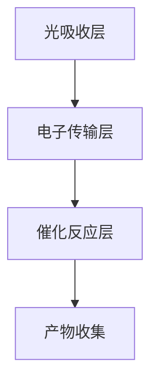
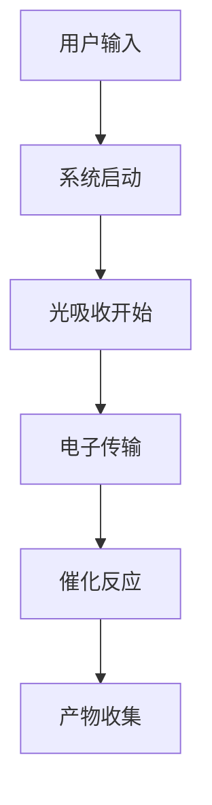

                 


# 价值投资中的新型高效光催化制氢材料技术

> 关键词：光催化制氢、半导体材料、掺杂改性、机器学习、商业化路径、投资回报率

> 摘要：本文从价值投资的角度分析了新型高效光催化制氢材料技术的潜力。首先介绍了光催化制氢的基本原理和发展历程，接着详细探讨了光催化材料的核心概念与联系，包括材料的分类、结构特性以及改性优化方法。然后，从算法原理和数学模型的角度分析了光催化材料的筛选与优化过程，并结合实际案例展示了系统设计与项目实战。最后，提出了价值投资中的最佳实践建议，为投资者提供了科学的决策依据。

---

# 第一部分: 光催化制氢材料技术概述

## 第1章: 光催化制氢材料技术的背景与现状

### 1.1 光催化制氢材料技术的背景

光催化制氢技术是一种利用光能将水分解为氢气和氧气的绿色能源技术，其核心是光催化剂。光催化剂能够吸收光能，产生电子-空穴对，驱动水分解反应。与传统电解水和化石燃料制氢相比，光催化制氢具有清洁、高效和可持续的特点，被认为是实现清洁能源的重要技术之一。

近年来，随着全球能源需求的增长和环保压力的增大，光催化制氢技术受到了广泛关注。然而，目前光催化制氢的效率仍然较低，且大规模商业化面临诸多挑战，如材料成本、稳定性等问题。因此，开发高效、稳定的光催化材料是当前研究的热点。

从投资角度来看，光催化制氢技术的市场潜力巨大。随着技术的不断进步和成本的降低，未来有望在工业生产和能源领域得到广泛应用。然而，投资者需要深入了解光催化材料的技术特性、市场定位和商业化路径，才能做出科学的投资决策。

### 1.2 光催化制氢材料技术的发展历程

光催化制氢技术的研究始于20世纪70年代，最初的研究集中在半导体材料如TiO₂、ZnO等。这些材料具有良好的光吸收性能和电子结构，但其效率较低，难以满足实际应用需求。随后，研究者们开始尝试通过掺杂、表面改性和复合化等方法来提高光催化效率。

近年来，新型高效光催化材料的研究取得了突破性进展。例如，金属氧化物、过渡金属硫化物和碳基材料等新型材料的出现，显著提高了光催化效率。此外，机器学习和人工智能技术的应用，使得光催化剂的筛选和优化更加高效和精准。

### 1.3 价值投资视角下的光催化制氢技术

从价值投资的角度来看，光催化制氢技术的市场潜力主要取决于以下几个方面：

1. **技术门槛**：高效光催化材料的研发需要深厚的技术积累和创新能力，这为技术领先的企业提供了较高的市场准入门槛。
2. **市场需求**：随着全球能源结构的调整和环保政策的加强，清洁能源技术的需求日益增长，光催化制氢技术的市场空间广阔。
3. **商业化路径**：光催化制氢技术的商业化需要解决成本、效率和稳定性等问题。投资者需要关注企业的技术路线和商业模式，判断其是否具备商业化潜力。

### 1.4 本章小结

本章从背景和现状两个方面介绍了光催化制氢材料技术，分析了其在价值投资中的潜力和挑战。接下来的章节将深入探讨光催化材料的核心概念、技术原理和系统设计，为投资者提供更全面的技术分析和投资建议。

---

## 第2章: 光催化制氢材料的核心概念与联系

### 2.1 光催化材料的分类与特性

光催化材料可以根据其物理化学性质和应用领域进行分类。常见的分类方式包括：

1. **按材料类型**：半导体材料（如TiO₂、ZnO）、金属氧化物（如Fe₂O₃）、硫化物（如CdS）等。
2. **按功能特性**：光吸收层、电子传输层、催化层等。
3. **按应用领域**：水溶液中的光催化反应、气相光催化反应等。

每种材料都有其独特的物理化学性质，如光吸收能力、电子迁移率、化学稳定性等。这些性质决定了材料的光催化效率和应用范围。

### 2.2 光催化材料的结构与性能关系

光催化材料的性能与其结构密切相关。例如：

1. **晶体结构**：半导体材料的晶体结构影响其能带结构和电子迁移率。
2. **表面形貌**：纳米结构的光催化材料具有更大的比表面积，能够提高反应效率。
3. **掺杂改性**：通过掺杂其他元素或引入缺陷，可以调控材料的能带结构，提高光吸收效率。

通过优化材料的结构和成分，可以显著提高光催化效率。例如，通过对TiO₂进行氮掺杂改性，可以扩展其光吸收范围，提高光催化活性。

### 2.3 光催化材料的改性与优化

光催化材料的改性与优化是提高其效率和稳定性的关键。常见的改性方法包括：

1. **界面工程**：通过调控材料的界面结构，减少电子-空穴对的复合，提高电荷分离效率。
2. **材料掺杂**：通过引入异种元素或缺陷，调控材料的能带结构，提高光吸收效率。
3. **复合化设计**：将不同功能的材料复合，形成协同效应，提高整体性能。

### 2.4 核心概念对比分析

下表对比了几种常见光催化材料的性能特征：

| 材料类型   | 光吸收范围 | 电子迁移率 | 化学稳定性 | 光催化效率 |
|------------|------------|------------|------------|------------|
| TiO₂       | UV          | 高          | 高          | 中等        |
| ZnO        | UV          | 中等        | 中等        | 低          |
| CdS        |可见光       |低           |低           |高          |

通过对比分析可以看出，不同材料具有不同的优势和劣势，选择合适的材料需要根据具体应用场景进行权衡。

---

## 第3章: 光催化制氢材料的算法原理与数学模型

### 3.1 光催化材料的筛选与优化算法

光催化材料的筛选和优化是一个复杂的多维问题，涉及材料的物理化学性质、晶体结构、表面特性等多个维度。基于机器学习的算法可以帮助我们高效地筛选和优化光催化材料。

#### 算法流程图



#### 核心算法步骤

1. **数据准备**：收集光催化材料的物理化学数据、实验数据和文献数据。
2. **特征提取**：提取关键特征，如带隙、光吸收系数、电荷迁移率等。
3. **模型训练**：基于机器学习算法（如随机森林、支持向量机）进行模型训练。
4. **结果预测**：预测新材料的光催化效率，筛选出最优候选材料。

### 3.2 光催化效率预测的数学模型

光催化效率的预测可以通过以下数学模型实现：

$$效率 = \frac{光吸收率 \times 反应速率}{总能量输入}$$

其中，光吸收率取决于材料的光吸收能力，反应速率与材料的电子迁移率和表面活性位点数量有关，总能量输入包括光能和化学能。

---

## 第4章: 系统分析与架构设计

### 4.1 系统功能设计

光催化制氢系统的功能模块包括：

1. **光吸收模块**：负责吸收光能并产生电子-空穴对。
2. **电子传输模块**：实现电子的定向迁移和分离。
3. **催化反应模块**：驱动水分解反应，生成氢气和氧气。
4. **控制系统**：调节系统的运行参数，实现最优效率。

### 4.2 系统架构设计

下图展示了光催化制氢系统的整体架构：



### 4.3 接口设计

系统接口设计包括：

1. **输入接口**：接收光能输入和化学反应所需的水分解。
2. **输出接口**：输出氢气和氧气。
3. **控制接口**：调节系统的运行参数。

### 4.4 交互设计

系统交互流程如下：



---

## 第5章: 项目实战

### 5.1 环境安装

要实现光催化制氢系统的模拟，需要安装以下环境：

- Python 3.8+
-机器学习库（如Scikit-learn、TensorFlow）
- Mermaid图床（如渲染工具）

### 5.2 核心代码实现

以下是一个基于机器学习的光催化剂筛选代码示例：

```python
import numpy as np
from sklearn.model_selection import train_test_split
from sklearn.ensemble import RandomForestRegressor

# 数据准备
X = np.array([...])  # 特征数据
y = np.array([...])  # 目标变量（光催化效率）

# 数据分割
X_train, X_test, y_train, y_test = train_test_split(X, y, test_size=0.2)

# 模型训练
model = RandomForestRegressor(n_estimators=100)
model.fit(X_train, y_train)

# 预测结果
y_pred = model.predict(X_test)

# 结果分析
print('预测效率:', y_pred)
```

### 5.3 案例分析

通过上述代码，我们可以筛选出具有较高光催化效率的材料，并分析其性能特征。例如，假设我们预测出一种新型材料的效率较高，我们可以进一步验证其实际性能。

---

## 第6章: 最佳实践与投资建议

### 6.1 投资策略

1. **技术优先**：优先选择技术领先、研发投入大的企业。
2. **商业化能力**：关注企业的商业化路径和市场定位。
3. **风险管理**：评估技术风险和市场风险，制定合理的投资组合。

### 6.2 注意事项

1. **技术更新**：光催化技术更新换代快，需要持续关注最新研究进展。
2. **成本控制**：光催化材料的生产成本直接影响其商业化潜力。
3. **政策支持**：关注政府政策和行业趋势，把握市场机会。

### 6.3 拓展阅读

1. 《高效光催化材料的设计与合成》
2. 《机器学习在材料科学中的应用》

---

# 作者：AI天才研究院 & 禅与计算机程序设计艺术

---

通过本文的分析，投资者可以更深入地了解光催化制氢技术的技术特点和市场潜力，为价值投资提供科学依据。未来，随着技术的进步和市场的成熟，光催化制氢有望成为清洁能源领域的重要力量。

