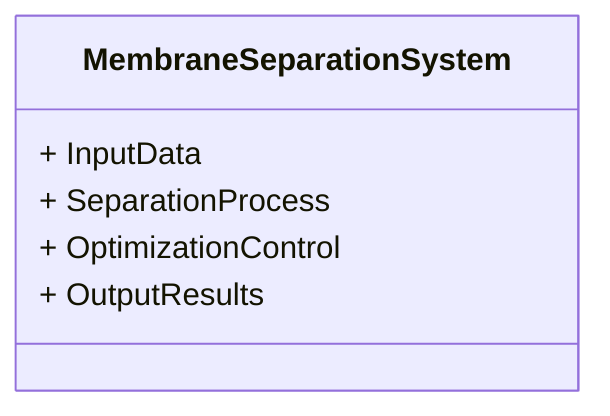
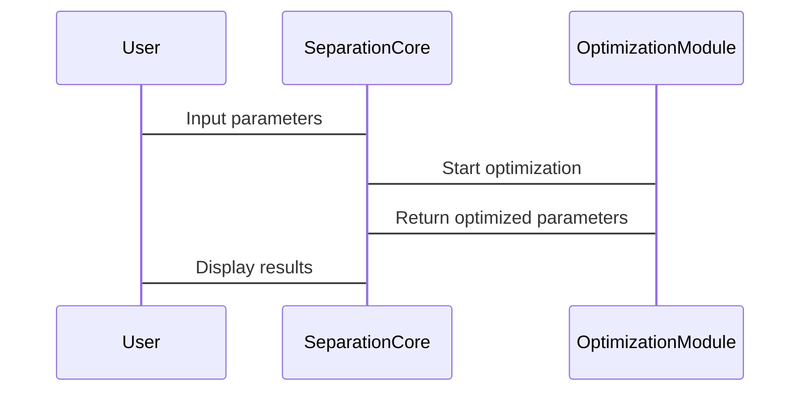

                 


# 价值投资中的新型高效膜分离材料技术

> 关键词：膜分离技术，价值投资，高效材料，优化算法，系统架构

> 摘要：本文详细探讨了膜分离技术在价值投资中的应用，从膜分离技术的基本概念到其在投资分析中的高效性，结合数学模型、优化算法和系统架构设计，全面解析了膜分离材料如何为投资决策提供支持。

---

## 第1章: 膜分离技术的基本概念与价值投资背景

### 1.1 膜分离技术的基本概念

#### 1.1.1 膜分离技术的定义
膜分离技术是一种基于膜材料的选择透过性，实现物质分离的物理化学方法。通过膜的微孔结构，可以有效分离混合物中的目标成分。

#### 1.1.2 膜分离技术的核心原理
膜分离基于扩散和过滤原理，利用膜的物理化学性质实现物质的分离。具体来说，小分子或气体可以通过膜孔，而大分子或颗粒则被截留。

#### 1.1.3 膜分离技术的分类与特点
膜分离技术主要包括微滤、超滤、纳滤和反渗透等，每种技术的特点和适用场景不同。

### 1.2 价值投资中的膜分离技术应用背景

#### 1.2.1 价值投资的基本概念
价值投资是通过分析企业的基本面，寻找被市场低估的投资标的。膜分离技术可以用于分析数据中的噪声，提取有价值的信息。

#### 1.2.2 膜分离技术在投资中的潜在价值
通过膜分离技术，投资者可以过滤掉市场的短期波动，专注于企业的长期价值。

#### 1.2.3 膜分离技术与传统投资技术的对比
传统投资技术依赖于统计分析，而膜分离技术则提供了一种更精确的数据处理方法。

### 1.3 膜分离材料的高效性与投资回报

#### 1.3.1 高效膜分离材料的性能优势
高效膜分离材料具有高选择性、长寿命和低成本的特点。

#### 1.3.2 膜分离技术对投资回报的影响
通过提高数据处理的精准度，膜分离技术可以帮助投资者做出更明智的投资决策。

#### 1.3.3 膜分离材料的市场应用前景
随着技术的进步，膜分离材料在投资领域的应用前景广阔。

---

## 第2章: 膜分离技术的核心概念与原理

### 2.1 膜分离技术的核心原理

#### 2.1.1 膜的物理化学特性
膜材料的孔径、亲水性等物理化学性质决定了其分离性能。

#### 2.1.2 膜分离的基本机制
膜分离主要通过扩散和过滤两种机制实现物质的分离。

#### 2.1.3 膜的孔径与分离效率的关系
孔径越小，分离效率越高，但通量可能下降。

### 2.2 膜分离材料的分类与特性对比

#### 2.2.1 常见膜分离材料的分类
包括微滤膜、超滤膜、纳滤膜和反渗透膜。

#### 2.2.2 不同膜材料的性能对比
| 膜类型 | 主要用途 | 孔径范围 |
|--------|----------|----------|
| 微滤   | 过滤大颗粒 | 0.1-10 μm |
| 超滤   | 分离小分子 | 0.001-0.1 μm |
| 纳滤   | 分离离子   | 0.0001-0.001 μm |
| 反渗透 | 分离水中的溶质 | <0.0001 μm |

#### 2.2.3 膜材料的改性与优化
通过改性提高膜的亲水性、抗污染性和机械强度。

### 2.3 膜分离技术的数学模型与公式

#### 2.3.1 膜分离效率的数学表达式
$$ E = \frac{A \cdot P}{RT} $$
其中，E为分离效率，A为膜面积，P为操作压力，R为气体常数，T为温度。

#### 2.3.2 膜分离过程中的传质方程
$$ J = -D \frac{dC}{dx} $$
J为通量，D为扩散系数，C为浓度，x为位置。

---

## 第3章: 膜分离技术的算法原理与优化

### 3.1 膜分离过程的优化算法

#### 3.1.1 基于膜分离效率的优化目标
最大化分离效率，同时最小化能耗。

#### 3.1.2 膜分离过程中的参数优化
包括膜孔径、操作压力、流速等参数的优化。

#### 3.1.3 遗传算法在膜分离优化中的应用
遗传算法是一种有效的全局优化方法，适用于膜分离参数的优化。

### 3.2 膜分离技术的数学模型实现

#### 3.2.1 膜分离效率的数学模型
$$ E = \frac{A \cdot P}{RT} $$

#### 3.2.2 膜分离过程的模拟算法
使用数值模拟方法，计算膜分离过程中的浓度分布和通量。

#### 3.2.3 膜分离技术的优化策略
结合数学模型和遗传算法，实现膜分离过程的优化。

### 3.3 膜分离技术的优化案例分析

#### 3.3.1 某种膜材料的优化过程
以超滤膜为例，通过优化孔径和操作压力，提高分离效率。

#### 3.3.2 优化后的性能提升对比
优化前后的分离效率对比，显示优化效果显著。

#### 3.3.3 优化算法的适用性分析
遗传算法在膜分离优化中的适用性和局限性。

---

## 第4章: 膜分离技术的系统分析与架构设计

### 4.1 系统分析与功能设计

#### 4.1.1 膜分离系统的功能模块划分
包括数据输入、分离过程模拟、优化控制和结果输出。

#### 4.1.2 系统功能的领域模型设计（mermaid类图）



### 4.2 系统架构设计

#### 4.2.1 膜分离系统的整体架构（mermaid架构图）


#### 4.2.2 系统核心模块的交互设计（mermaid序列图）



### 4.3 系统接口设计

#### 4.3.1 系统输入接口的设计
包括参数输入和数据输入接口。

#### 4.3.2 系统输出接口的设计
包括结果输出和日志输出接口。

#### 4.3.3 系统与外部模块的交互接口
与其他系统的接口设计，如数据库接口。

---

## 第5章: 膜分离技术的项目实战

### 5.1 环境配置

#### 5.1.1 软件环境
安装Python、NumPy、SciPy和Plotly等工具。

#### 5.1.2 硬件环境
推荐配置为高通CPU和充足内存。

### 5.2 系统核心实现源代码

#### 5.2.1 分离效率计算代码
```python
import numpy as np

def calculate_efficiency(A, P, R, T):
    return (A * P) / (R * T)

A = 100  # 膜面积
P = 10  # 操作压力
R = 8.314  # 气体常数
T = 298  # 温度

efficiency = calculate_efficiency(A, P, R, T)
print(f"分离效率为: {efficiency}")
```

#### 5.2.2 优化算法实现代码
```python
from scipy.optimize import minimize

def objective_function(params):
    A, P = params
    return -(A * P)  # 最小化目标函数

bounds = [(10, 200), (5, 20)]
result = minimize(objective_function, [100, 10], bounds=bounds, method='SLSQP')
print(f"优化结果: {result}")
```

### 5.3 案例分析与实际应用

#### 5.3.1 案例分析
以某化工厂的废水处理为例，应用膜分离技术进行优化。

#### 5.3.2 实际应用
膜分离技术在废水处理、食品加工等领域有广泛应用。

### 5.4 项目小结

#### 5.4.1 核心代码实现总结
总结代码实现的关键部分和优化效果。

#### 5.4.2 项目实施中的注意事项
包括参数选择、模型验证和结果分析。

---

## 第6章: 最佳实践与总结

### 6.1 最佳实践 tips

#### 6.1.1 技术选择
根据具体应用场景选择合适的膜分离技术。

#### 6.1.2 参数优化
定期优化膜分离参数以保持最佳性能。

#### 6.1.3 系统维护
定期清洁和维护膜分离系统，延长使用寿命。

### 6.2 小结

#### 6.2.1 膜分离技术的优势
高效、精准和低成本。

#### 6.2.2 未来发展趋势
智能化、模块化和多功能化。

### 6.3 注意事项

#### 6.3.1 参数设置
注意膜分离参数的合理设置。

#### 6.3.2 系统稳定性
确保系统的稳定运行，避免故障。

### 6.4 拓展阅读

#### 6.4.1 推荐书籍
《膜分离技术与应用》

#### 6.4.2 推荐论文
《膜分离技术在投资分析中的应用研究》

---

## 作者：AI天才研究院/AI Genius Institute & 禅与计算机程序设计艺术 /Zen And The Art of Computer Programming

---

这篇文章通过系统地分析膜分离技术的核心原理、优化算法和实际应用，全面探讨了其在价值投资中的潜力和优势。希望本文能为相关领域的研究和实践提供有价值的参考。

