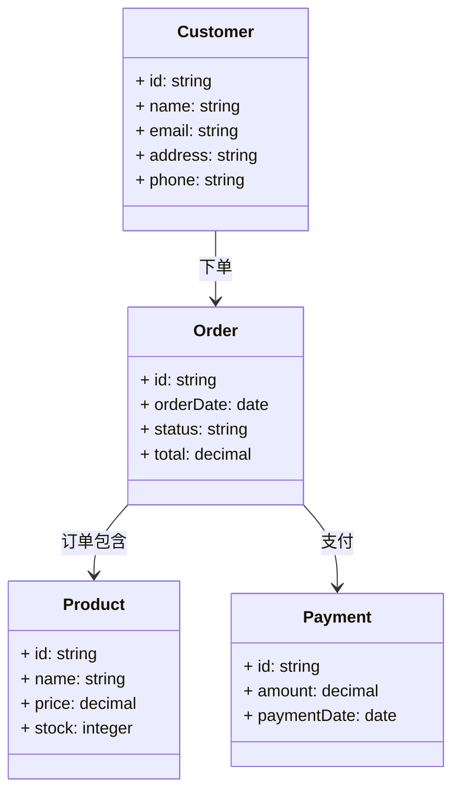

                 


# 《价值投资中的智能仓储无人叉车系统分析》

**关键词**：价值投资、智能仓储、无人叉车、物流自动化、人工智能

**摘要**：  
本文深入分析了智能仓储无人叉车系统在价值投资中的应用，从系统的背景、核心概念、算法原理到项目实战，全面探讨了其在现代物流和投资中的潜力和挑战。文章结合技术与投资的双重视角，详细解读了系统的组成、功能、架构及优化策略，为读者提供了从理论到实践的全面指南。

---

## 目录大纲

### 第1章 价值投资与智能仓储的背景

#### 1.1 价值投资的基本概念  
- 1.1.1 价值投资的定义与核心理念  
- 1.1.2 价值投资在现代经济中的地位  
- 1.1.3 价值投资与智能仓储的结合  

#### 1.2 智能仓储的基本概念  
- 1.2.1 智能仓储的定义与特点  
- 1.2.2 智能仓储在现代物流中的作用  
- 1.2.3 智能仓储与无人叉车的关系  

#### 1.3 无人叉车系统的基本概念  
- 1.3.1 无人叉车的定义与分类  
- 1.3.2 无人叉车的核心技术  
- 1.3.3 无人叉车在智能仓储中的应用  

#### 1.4 价值投资中的智能仓储无人叉车系统分析  
- 1.4.1 系统的定义与组成  
- 1.4.2 系统的核心功能与特点  
- 1.4.3 系统在价值投资中的作用  

### 第2章 智能仓储无人叉车系统的背景与现状

#### 2.1 智能仓储无人叉车系统的背景  
- 2.1.1 智能仓储无人叉车系统的起源  
- 2.1.2 智能仓储无人叉车系统的发展历程  
- 2.1.3 智能仓储无人叉车系统的现状  

#### 2.2 智能仓储无人叉车系统的现状分析  
- 2.2.1 系统的技术现状  
- 2.2.2 系统的市场现状  
- 2.2.3 系统的应用现状  

#### 2.3 智能仓储无人叉车系统的未来趋势  
- 2.3.1 技术发展趋势  
- 2.3.2 市场发展趋势  
- 2.3.3 应用发展趋势  

### 第3章 无人叉车系统的核心概念与联系

#### 3.1 核心概念的定义与原理  
- 3.1.1 无人叉车的核心技术  
- 3.1.2 智能仓储的核心技术  
- 3.1.3 价值投资的核心理念  

#### 3.2 核心概念的属性特征对比  
- 3.2.1 无人叉车与传统叉车的对比  
- 3.2.2 智能仓储与传统仓储的对比  
- 3.2.3 价值投资与传统投资的对比  

#### 3.3 ER实体关系图架构  
```mermaid
erDiagram
    customer[客户] {
        string id
        string name
        string email
    }
    order[订单] {
        string id
        date orderDate
        status status
    }
    product[产品] {
        string id
        string name
        decimal price
    }
    customer --> order: 下单
    order --> product: 订单包含
```

### 第4章 算法原理讲解

#### 4.1 路径规划算法  
- 4.1.1 A*算法原理  
- 4.1.2 A*算法实现步骤  
- 4.1.3 A*算法的优化与改进  

#### 4.2 无人叉车定位算法  
- 4.2.1 SLAM技术原理  
- 4.2.2 SLAM技术的实现流程  
- 4.2.3 SLAM技术的应用案例  

#### 4.3 系统调度算法  
- 4.3.1 调度算法的定义与特点  
- 4.3.2 调度算法的实现流程  
- 4.3.3 调度算法的优化策略  

### 第5章 系统架构设计方案

#### 5.1 问题场景介绍  
- 5.1.1 仓储物流中的痛点  
- 5.1.2 无人叉车系统的解决方案  

#### 5.2 项目介绍  
- 5.2.1 项目目标  
- 5.2.2 项目范围  
- 5.2.3 项目技术选型  

#### 5.3 系统功能设计  
- 5.3.1 领域模型mermaid类图  


#### 5.4 系统架构设计  
- 5.4.1 系统架构图  


#### 5.5 系统接口设计  
- 5.5.1 系统接口定义  
- 5.5.2 接口实现方式  

#### 5.6 系统交互设计  
- 5.6.1 系统交互流程  
- 5.6.2 交互序列图  
```mermaid
sequenceDiagram
    participant 客户端
    participant 无人叉车系统
    participant 调度算法
    客户端 -> 无人叉车系统：请求服务
    无人叉车系统 -> 调度算法：路径规划
    调度算法 -> 传感器：获取实时数据
    传感器 -> 数据处理模块：数据解析
    数据处理模块 -> 存储系统：存储数据
```

### 第6章 项目实战

#### 6.1 环境安装与配置  
- 6.1.1 系统环境要求  
- 6.1.2 系统安装步骤  
- 6.1.3 系统配置参数  

#### 6.2 系统核心实现源代码  
- 6.2.1 路径规划算法实现  
```python
import heapq

def a_star_algorithm(start, goal, grid):
    # 实现A*算法
    pass
```

- 6.2.2 无人叉车定位算法实现  
```python
def slam_technology():
    # 实现SLAM技术
    pass
```

- 6.2.3 系统调度算法实现  
```python
def dispatch_algorithm(tasks):
    # 实现调度算法
    pass
```

#### 6.3 代码应用解读与分析  
- 6.3.1 代码功能分析  
- 6.3.2 代码优化建议  

#### 6.4 实际案例分析  
- 6.4.1 案例背景介绍  
- 6.4.2 案例实现过程  
- 6.4.3 案例分析与总结  

#### 6.5 项目小结  
- 6.5.1 项目成果总结  
- 6.5.2 项目经验分享  

### 第7章 最佳实践与小结

#### 7.1 投资策略与技术选型  
- 7.1.1 价值投资中的技术分析  
- 7.1.2 系统优化策略  

#### 7.2 系统部署与维护  
- 7.2.1 系统部署指南  
- 7.2.2 系统维护建议  

#### 7.3 小结与展望  
- 7.3.1 本文总结  
- 7.3.2 未来展望  

### 附录

#### 附录A 价值投资中的智能仓储无人叉车系统数学公式  
- 附录A.1 路径规划算法公式  
- 附录A.2 无人叉车定位算法公式  

#### 附录B 系统设计相关图表  
- 附录B.1 系统架构图  
- 附录B.2 领域模型类图  

#### 附录C 项目实战代码  
- 附录C.1 路径规划算法代码  
- 附录C.2 无人叉车定位算法代码  

---

**作者**：AI天才研究院/AI Genius Institute & 禅与计算机程序设计艺术/Zen And The Art of Computer Programming

