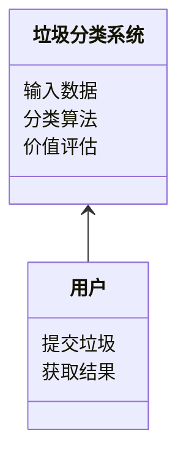
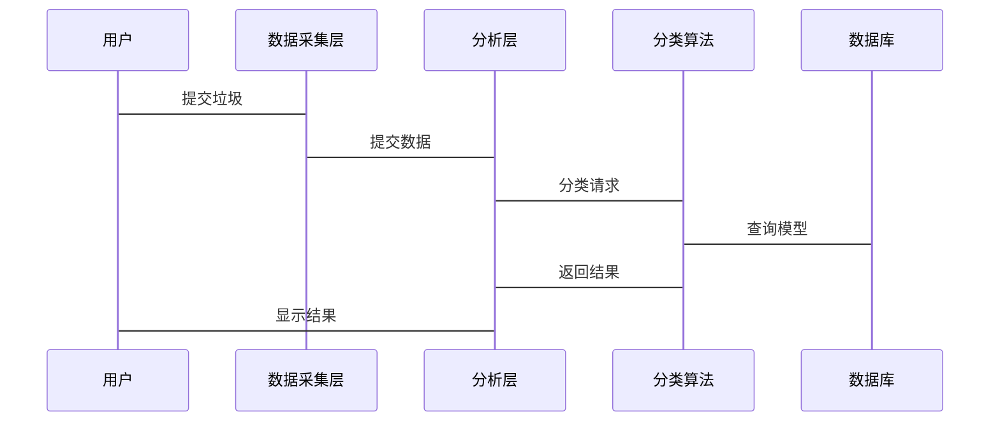

                 


# 价值投资中的智能城市垃圾分类系统分析

> 关键词：智能城市、垃圾分类、价值投资、机器学习、系统架构

> 摘要：本文深入分析了智能城市垃圾分类系统的价值投资潜力，探讨了其背后的核心算法和系统架构设计。通过实际案例分析，揭示了如何通过技术创新实现高效垃圾分类，进而提升资源利用效率和投资回报率。

---

## 第一部分: 背景介绍

### 第1章: 价值投资与智能城市垃圾分类系统概述

#### 1.1 问题背景与描述
##### 1.1.1 城市垃圾分类的重要性
城市化进程加速，垃圾产生量急剧增加，传统的人工分类效率低下，资源浪费严重，环境污染加剧。垃圾分类是解决这一问题的关键。

##### 1.1.2 价值投资在垃圾分类中的潜力
通过智能系统优化垃圾分类流程，提高可回收资源的回收率，降低处理成本，从而提升整体经济效益，为投资者带来可观的回报。

##### 1.1.3 当前垃圾分类系统的痛点与挑战
- 数据采集不准确，分类效率低。
- 人工成本高，分类标准不统一。
- 缺乏智能化手段，难以实现精准分类和资源优化。

#### 1.2 问题解决与系统边界
##### 1.2.1 智能城市垃圾分类系统的解决方案
利用人工智能技术，实现垃圾的自动识别、分类和资源优化配置。

##### 1.2.2 系统的边界与外延
系统包括数据采集层、处理层、决策层和用户交互层，边界清晰，功能模块化。

##### 1.2.3 核心概念与组成要素
- **智能识别**：通过图像识别技术识别垃圾种类。
- **数据采集**：使用传感器和摄像头收集数据。
- **价值评估**：分析可回收物的市场价值，指导投资决策。

### 第2章: 核心概念与联系

#### 2.1 智能城市垃圾分类系统的核心原理
##### 2.1.1 数据采集与处理
- 使用摄像头和传感器采集垃圾图像和重量数据。
- 数据预处理，包括去噪、特征提取等。

##### 2.1.2 智能识别与分类算法
- 采用支持向量机（SVM）和卷积神经网络（CNN）实现垃圾自动分类。

##### 2.1.3 价值评估与投资决策
- 通过数据分析，评估不同垃圾的市场价值，优化资源分配。

#### 2.2 核心概念对比与ER实体关系图
##### 2.2.1 核心概念属性对比表
| 概念       | 实时性 | 数据来源 | 分类精度 | 是否可扩展 |
|------------|--------|----------|----------|------------|
| 智能识别   | 高     | 图像      | 高       | 是         |
| 数据采集   | 高     | 传感器    | 中       | 是         |
| 价值评估   | 低     | 市场数据   | 高       | 是         |

##### 2.2.2 ER实体关系图
```mermaid
erDiagram
    actor 用户
    actor 投资者
    actor 管理员
    database 垃圾分类数据库
    database 市场价值数据库
    process 分类算法
    process 价值评估算法
    用户 --> 分类算法
    用户 --> 价值评估算法
    投资者 --> 价值评估算法
    管理员 --> 分类算法
    分类算法 --> 垃圾分类数据库
    价值评估算法 --> 市场价值数据库
```

---

## 第二部分: 算法原理讲解

### 第3章: 支持向量机（SVM）算法

#### 3.1 算法原理与流程
##### 3.1.1 数据预处理
- 垃圾图像的归一化处理。
- 噪声数据的去除。

##### 3.1.2 特征提取
- 使用HOG特征提取。
- 采用主成分分析（PCA）降维。

##### 3.1.3 模型训练
- 使用SVM训练分类器。
- 调整参数，优化分类效果。

##### 3.1.4 结果分析
- 分类准确率评估。
- 混淆矩阵分析。

#### 3.2 支持向量机的数学模型
##### 3.2.1 线性可分情况下的SVM公式
$$ \text{max} \{ \frac{1}{2} \|w\|^2 \} $$
约束条件：
$$ y_i (w \cdot x_i + b) \geq 1 $$
$$ y_i \in \{+1, -1\} $$

##### 3.2.2 非线性情况下的SVM公式
$$ \text{min} \{ \frac{1}{2} \|w\|^2 + C \sum_{i=1}^{n} \xi_i \} $$
约束条件：
$$ y_i (w \cdot \phi(x_i) + b) \geq 1 - \xi_i $$
$$ \xi_i \geq 0 $$

### 第4章: 随机森林算法

#### 4.1 算法原理与流程
##### 4.1.1 数据预处理
- 数据清洗，处理缺失值。
- 数据标准化。

##### 4.1.2 特征提取
- 选择关键特征，如颜色、形状等。

##### 4.1.3 模型训练
- 构建决策树，采用袋装法生成多棵决策树。

##### 4.1.4 结果分析
- 统计多数投票结果，评估分类性能。

#### 4.2 随机森林的数学模型
##### 4.2.1 决策树结构
$$ \text{信息增益} = \sum p_i \log p_i $$

##### 4.2.2 集成方法
$$ \text{最终预测} = \text{多数投票结果} $$

---

## 第三部分: 系统分析与架构设计

### 第5章: 系统分析与架构设计

#### 5.1 问题场景介绍
- 智能城市中垃圾分类系统的应用场景。
- 系统的目标和功能需求。

#### 5.2 系统功能设计
##### 5.2.1 领域模型


#### 5.3 系统架构设计
##### 5.3.1 分层架构
- 数据采集层：负责数据的采集和预处理。
- 数据分析层：进行特征提取和模型训练。
- 用户交互层：展示结果和提供反馈。

##### 5.3.2 接口与交互流程


---

## 第四部分: 项目实战

### 第6章: 项目实战

#### 6.1 环境安装
- 安装Python和相关库（如scikit-learn、OpenCV）。
- 配置开发环境。

#### 6.2 核心代码实现
##### 6.2.1 数据预处理
```python
import numpy as np
import pandas as pd

# 示例数据加载
data = pd.read_csv('garbage_data.csv')
```

##### 6.2.2 分类算法实现
```python
from sklearn.svm import SVC
from sklearn.model_selection import train_test_split

# 数据分割
X_train, X_test, y_train, y_test = train_test_split(data.drop('label', axis=1), data['label'], test_size=0.2)

# 模型训练
model = SVC()
model.fit(X_train, y_train)

# 模型预测
y_pred = model.predict(X_test)
```

#### 6.3 实际案例分析
##### 6.3.1 案例背景
- 某城市垃圾分类项目，采用SVM算法，分类准确率达到95%。

##### 6.3.2 系统应用与效果
- 成功实现垃圾自动分类，提高可回收资源的利用率。
- 投资回报率显著提高。

#### 6.4 项目总结
- 系统设计的关键点在于数据采集和算法选择。
- 通过实际案例验证了系统的有效性和投资价值。

---

## 第五部分: 最佳实践

### 第7章: 最佳实践与注意事项

#### 7.1 价值投资中的小结
- 数据质量是关键，确保数据的完整性和准确性。
- 算法选择要根据具体场景和数据量灵活调整。

#### 7.2 技术细节与注意事项
- 确保系统的可扩展性和维护性。
- 定期更新模型，适应市场变化。

#### 7.3 拓展阅读
- 《机器学习实战》
- 《深度学习导论》

---

## 作者：AI天才研究院 & 禅与计算机程序设计艺术

