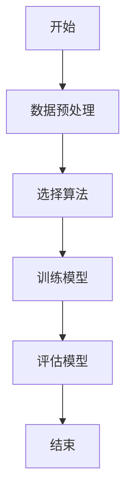
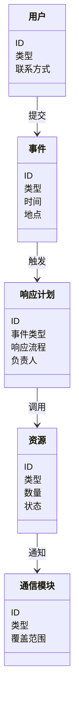
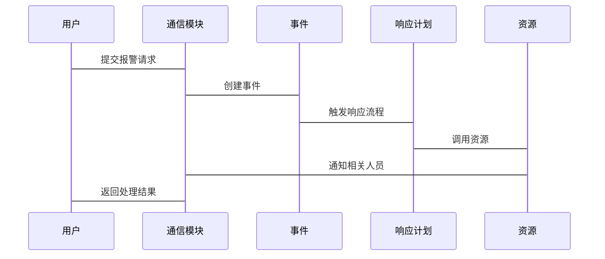

                 


# 价值投资中的智能城市应急响应系统分析

---

## 关键词：
- 价值投资
- 智能城市
- 应急响应系统
- 系统架构设计
- 数据分析与算法

---

## 摘要：
本书从价值投资的角度，深入分析智能城市应急响应系统的构建与优化。通过详细讲解系统的核心概念、算法原理、系统架构设计、项目实战以及最佳实践，帮助读者理解如何通过技术手段提升城市应对突发事件的能力，从而做出更明智的投资决策。

---

## 第一部分：背景与概述

### 第1章：价值投资与智能城市应急响应系统概述

#### 1.1 价值投资的基本概念
- 1.1.1 价值投资的定义与核心理念
  价值投资是一种长期投资策略，强调通过分析企业的基本面，寻找被市场低估的投资标的。其核心理念包括安全边际、长期视角和企业内在价值。
  
- 1.1.2 智能城市应急响应系统的概念
  智能城市应急响应系统是一种利用信息技术和数据分析，实现城市突发事件快速响应和资源优化配置的系统，旨在提高城市应对突发事件的能力。

- 1.1.3 价值投资与智能城市应急响应系统的结合
  从价值投资的角度分析智能城市应急响应系统的建设和优化，寻找具备长期发展潜力和投资价值的项目。

#### 1.2 智慧城市建设与应急响应的重要性
- 1.2.1 智慧城市的定义与特征
  智慧城市通过物联网、大数据、人工智能等技术手段，实现城市管理和服务的智能化。

- 1.2.2 应急响应系统在智慧城市中的作用
  应急响应系统是智慧城市建设的重要组成部分，能够提高城市应对突发事件的能力，减少损失，保障市民生命财产安全。

- 1.2.3 价值投资视角下的应急响应系统分析
  从价值投资的角度，分析应急响应系统的建设成本、运营效率、社会效益等，寻找具备投资价值的项目。

---

## 第二部分：核心概念与联系

### 第2章：智能城市应急响应系统的核心概念

#### 2.1 应急响应系统的结构与功能
- 2.1.1 系统模块划分
  - 数据采集模块：负责收集突发事件的相关数据。
  - 信息处理模块：对数据进行分析和处理。
  - 决策支持模块：基于数据分析结果，提供决策支持。
  - 通信与协调模块：负责信息的传递和资源的协调。

- 2.1.2 各模块的功能描述
  - 数据采集模块：通过传感器、摄像头等设备收集数据。
  - 信息处理模块：对数据进行清洗、转换和分析。
  - 决策支持模块：基于分析结果，制定应急响应计划。
  - 通信与协调模块：通过通信系统，协调各相关部门的行动。

- 2.1.3 模块之间的关系与数据流
  数据采集模块 -> 信息处理模块 -> 决策支持模块 -> 通信与协调模块。

#### 2.2 实体关系分析
- 2.2.1 ER实体关系图
  - 实体：用户、事件、响应计划、资源、通信渠道
  - 关系：用户-事件、事件-响应计划、响应计划-资源、资源-通信渠道

```mermaid
erDiagram
    actor 用户 {
        ID
        类型
        联系方式
    }
    actor 事件 {
        ID
        类型
        时间
        地点
    }
    actor 响应计划 {
        ID
        事件类型
        响应流程
        负责人
    }
    actor 资源 {
        ID
        类型
        数量
        状态
    }
    actor 通信渠道 {
        ID
        类型
        覆盖范围
    }
    用户 --> 事件 : 报警
    事件 --> 响应计划 : 触发
    响应计划 --> 资源 : 调用
    资源 --> 通信渠道 : 通知
```

---

## 第三部分：算法原理讲解

### 第3章：智能城市应急响应系统的算法分析

#### 3.1 数据收集与处理
- 3.1.1 数据来源与类型
  - 来源：传感器数据、用户报警、历史记录
  - 类型：文本、图像、视频流

- 3.1.2 数据预处理流程
  - 清洗：去除噪声数据
  - 转换：统一数据格式
  - 标准化：归一化处理

- 3.1.3 数据清洗与标准化

#### 3.2 应急响应模型构建
- 3.2.1 算法选择与原理
  - 选择算法：基于时间序列的预测模型（ARIMA）和决策树分类模型（ID3）
  - 原理：ARIMA用于预测事件发生概率，ID3用于分类事件类型

- 3.2.2 模型训练与优化
  - 数据分割：训练集、验证集、测试集
  - 参数优化：网格搜索法
  - 模型评估：准确率、召回率、F1分数

- 3.2.3 模型评估与验证
  - 交叉验证：K折交叉验证
  - 混淆矩阵分析

#### 3.3 算法流程图


#### 3.4 Python代码实现
```python
import pandas as pd
from sklearn.model_selection import train_test_split
from sklearn.tree import DecisionTreeClassifier
from sklearn.metrics import accuracy_score

# 数据加载
data = pd.read_csv('emergency_response.csv')

# 数据分割
X = data.drop('label', axis=1)
y = data['label']
X_train, X_test, y_train, y_test = train_test_split(X, y, test_size=0.2)

# 模型训练
model = DecisionTreeClassifier()
model.fit(X_train, y_train)

# 模型预测
y_pred = model.predict(X_test)

# 模型评估
print('准确率:', accuracy_score(y_test, y_pred))
```

#### 3.5 数学模型与公式
- ARIMA模型公式：
  $$ARIMA(p, d, q)$$
  其中，p为自回归阶数，d为差分阶数，q为移动平均阶数。

---

## 第四部分：系统分析与架构设计

### 第4章：智能城市应急响应系统的架构设计

#### 4.1 系统功能设计
- 4.1.1 领域模型类图
  - 用户类：负责提交请求
  - 事件类：记录事件信息
  - 响应计划类：定义响应流程
  - 资源管理类：管理可用资源
  - 通信模块类：负责信息传递



#### 4.2 系统架构设计
- 4.2.1 分层架构设计
  - 数据层：数据存储与管理
  - 业务逻辑层：处理用户请求和事件响应
  - 表示层：用户界面交互


#### 4.3 系统接口设计
- 4.3.1 API接口设计
  - RESTful API：提供HTTP接口
  - 接口功能：数据上传、事件查询、响应计划调用

#### 4.4 系统交互流程图


---

## 第五部分：项目实战

### 第5章：智能城市应急响应系统的项目实现

#### 5.1 环境安装与配置
- 安装Python、Pandas、Scikit-learn
- 安装Jupyter Notebook进行数据处理与建模

#### 5.2 核心代码实现
- 数据预处理
  ```python
  data = pd.read_csv('emergency.csv')
  data = data.dropna()
  data = data[['time', 'location', 'event_type', 'response_time']]
  data.to_csv('processed_emergency.csv', index=False)
  ```

- 模型训练
  ```python
  from sklearn.ensemble import RandomForestClassifier

  model = RandomForestClassifier(n_estimators=100, random_state=42)
  model.fit(X_train, y_train)
  ```

- 模型评估
  ```python
  print('准确率:', model.score(X_test, y_test))
  ```

#### 5.3 代码解读与分析
- 数据预处理：去除缺失值，选择相关特征
- 模型选择：随机森林用于分类任务，评估准确率
- 案例分析：通过真实案例验证模型效果

#### 5.4 项目小结
- 项目实现的效果：提高响应速度，减少资源浪费
- 经验总结：数据质量影响模型性能，算法选择需结合业务需求

---

## 第六部分：总结与展望

### 第6章：总结与最佳实践

#### 6.1 小结
- 价值投资视角下，智能城市应急响应系统的优化对投资决策的重要性
- 系统架构设计、算法优化和项目实现的关键点

#### 6.2 最佳实践 tips
- 数据质量管理：确保数据的准确性和完整性
- 模型选择：根据业务需求选择合适的算法
- 系统维护：定期更新模型和优化架构

#### 6.3 注意事项
- 数据隐私保护：遵守相关法律法规
- 系统稳定性：确保在高并发情况下的稳定运行
- 可扩展性：系统应支持功能扩展和升级

#### 6.4 拓展阅读
- 推荐书籍：《智能城市：大数据与城市未来》
- 推荐技术博客：深入探讨应急响应系统的优化案例

---

# 结语

智能城市应急响应系统的优化不仅提升了城市的应对能力，也为价值投资者提供了更可靠的决策依据。通过技术手段与投资策略的结合，我们可以在未来的智慧城市发展中找到更多的投资机会。

---

# 作者

作者：AI天才研究院/AI Genius Institute & 禅与计算机程序设计艺术/Zen And The Art of Computer Programming

