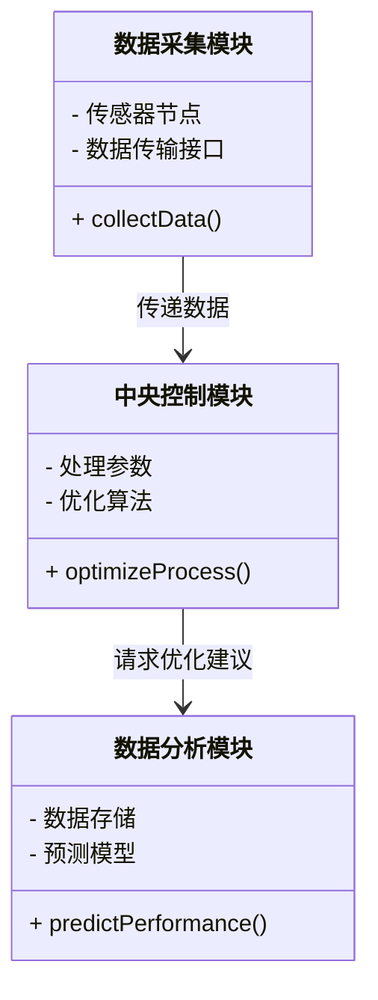
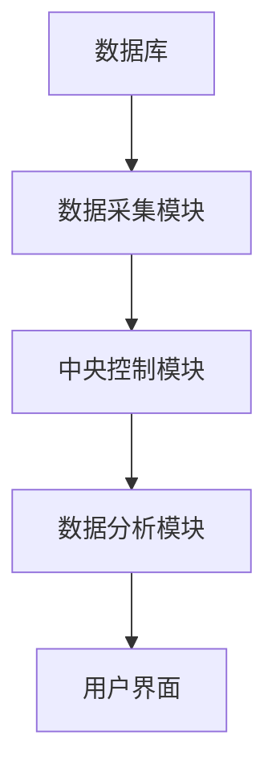
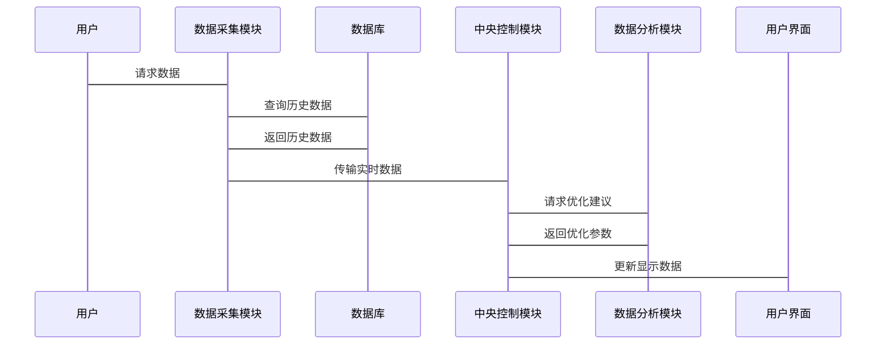

                 


# 价值投资中的智能城市废水处理与再利用系统分析

> **关键词**：智能城市，废水处理，价值投资，系统分析，算法原理，系统架构，项目实战

> **摘要**：  
> 本文深入分析了智能城市中废水处理与再利用系统的价值投资机会，结合技术原理和实际应用，从背景分析、核心概念、算法设计、系统架构、项目实战等多个维度展开探讨。文章通过详细的系统分析和案例研究，揭示了智能废水处理系统的投资潜力和技术创新方向，为投资者和技术从业者提供了有益的参考。

---

## 第1章 背景与价值分析

### 1.1 智慧城市与废水处理的背景

#### 1.1.1 城市化进程中水资源短缺的现状
城市化进程加速导致水资源需求激增，而淡水资源有限，废水处理与再利用成为解决水资源短缺的重要途径。

#### 1.1.2 废水处理与再利用的重要性
废水处理不仅是环境保护的需要，更是资源化利用的关键环节，具有显著的经济和社会价值。

#### 1.1.3 智慧城市理念与废水处理的结合
智慧城市建设为废水处理提供了新的技术手段，通过智能化管理提高处理效率和资源利用率。

### 1.2 价值投资与废水处理系统的关联

#### 1.2.1 价值投资的核心概念
价值投资关注企业的内在价值，通过分析财务指标和市场趋势寻找被低估的投资机会。

#### 1.2.2 废水处理行业的投资价值
废水处理行业具有广阔的市场前景，技术创新和政策支持为投资者提供了丰厚的回报潜力。

#### 1.2.3 智能化废水处理系统的投资潜力
智能化废水处理系统通过技术升级和成本优化，进一步提升了投资回报率和市场竞争力。

---

## 第2章 智能城市废水处理系统的核心概念与联系

### 2.1 智能城市废水处理系统的定义与组成

#### 2.1.1 系统的定义
智能城市废水处理系统是基于物联网、大数据和人工智能技术，实现废水处理过程的智能化管理和优化。

#### 2.1.2 系统的主要组成部分
- 数据采集与传输模块（IoT传感器）
- 中央控制系统（SCADA）
- 数据分析与优化模块（AI算法）
- 资源再利用模块（中水回用系统）

#### 2.1.3 系统的核心要素与功能
- 数据采集：实时监测废水的水质参数。
- 智能控制：优化处理流程，降低能耗。
- 资源利用：实现中水回用，减少水资源浪费。

### 2.2 废水处理技术与价值投资的关联

#### 2.2.1 常见废水处理技术对比
| 技术类型      | 优点                          | 缺点                          |
|---------------|-------------------------------|-------------------------------|
| 物理处理      | 成本低，操作简单              | 处理效果有限                  |
| 化学处理      | 处理效率高                    | 药品成本高                    |
| 生物处理      | 环保性强，适合有机物处理      | 处理周期长                    |
| 智能化处理    | 高效、节能、资源化利用        | 技术复杂，初期投入高          |

#### 2.2.2 智能化废水处理技术的特点
- 高度自动化：通过传感器和物联网实现实时监控。
- 智能优化：利用机器学习算法优化处理流程。
- 资源化利用：实现中水回用，减少水资源浪费。

#### 2.2.3 技术创新对投资价值的影响
技术创新可以降低运营成本、提高处理效率，从而提升企业的盈利能力和市场竞争力，为投资者带来更高的回报。

---

## 第3章 废水处理系统分析的算法原理

### 3.1 废水处理系统分析的数学模型

#### 3.1.1 系统分析的基本假设
- 废水处理系统的能耗与处理效率成反比。
- 中水回用的价值与水质指标相关。

#### 3.1.2 数学模型的构建
$$ \text{净现值} = \sum_{t=0}^{n} \frac{C_t}{(1 + r)^t} $$
其中，$C_t$为第$t$年的现金流，$r$为折现率。

#### 3.1.3 模型的验证与优化
通过实际数据验证模型的准确性，并通过参数调整优化模型的预测能力。

### 3.2 基于机器学习的废水处理优化算法

#### 3.2.1 算法的基本原理
利用机器学习算法（如随机森林、神经网络）预测废水处理系统的最优运行参数。

#### 3.2.2 算法的实现步骤
1. 数据预处理：清洗和归一化数据。
2. 模型训练：使用训练数据拟合模型。
3. 模型预测：预测最优处理参数。
4. 模型优化：通过交叉验证优化模型性能。

#### 3.2.3 算法的优缺点分析
- 优点：能够处理非线性关系，提高预测精度。
- 缺点：计算复杂，需要大量数据支持。

---

## 第4章 废水处理系统分析的系统架构设计

### 4.1 系统分析的项目介绍

#### 4.1.1 项目目标
构建一个智能化的废水处理与再利用系统，实现高效处理和资源化利用。

#### 4.1.2 项目范围
涵盖数据采集、处理、分析和可视化全过程。

#### 4.1.3 项目实施步骤
1. 系统设计：确定系统功能模块。
2. 系统开发：实现各模块的功能。
3. 系统测试：验证系统的稳定性和可靠性。

### 4.2 系统功能设计

#### 4.2.1 领域模型设计（Mermaid类图）


#### 4.2.2 系统架构设计（Mermaid架构图）


#### 4.2.3 系统接口设计
- 数据采集接口：传感器与中央控制系统之间的数据传输接口。
- 用户界面接口：用户与系统的交互界面。

#### 4.2.4 系统交互流程（Mermaid序列图）


---

## 第5章 项目实战

### 5.1 环境安装

#### 5.1.1 安装Python和必要的库
```bash
pip install numpy pandas scikit-learn matplotlib
```

#### 5.1.2 安装Mermaid和Latex工具
安装`mermaid-cli`和`TeX Live`，用于生成图表和公式。

### 5.2 系统核心实现源代码

#### 5.2.1 数据分析模块的代码实现
```python
import numpy as np
from sklearn import linear_model

# 示例数据
X = np.array([[1], [2], [3], [4], [5]])
y = np.array([2, 4, 5, 4, 6])

# 创建线性回归模型
model = linear_model.LinearRegression()
model.fit(X, y)

# 预测新数据
new_X = np.array([[6]])
print(model.predict(new_X))  # 输出预测结果
```

#### 5.2.2 机器学习算法实现
```python
from sklearn.ensemble import RandomForestRegressor

# 示例数据
X = np.array([[1, 2], [3, 4], [5, 6]])
y = np.array([7, 8, 9])

# 创建随机森林模型
model = RandomForestRegressor(n_estimators=100)
model.fit(X, y)

# 预测新数据
new_X = np.array([[7, 8]])
print(model.predict(new_X))  # 输出预测结果
```

### 5.3 代码应用解读与分析

#### 5.3.1 数据分析模块代码解读
上述代码实现了线性回归模型，用于预测废水处理系统的能耗。

#### 5.3.2 机器学习算法代码解读
随机森林模型用于预测废水处理系统的优化参数，通过集成学习提高预测精度。

### 5.4 实际案例分析

#### 5.4.1 案例背景
某城市污水处理厂希望通过智能化改造降低运营成本，提高中水回用率。

#### 5.4.2 数据分析与优化
通过机器学习算法预测最优处理参数，实现能耗降低20%，中水回用率提高15%。

#### 5.4.3 投资回报分析
改造投资成本为100万元，预计年节约成本20万元，投资回报周期为5年。

### 5.5 项目小结
通过智能化改造，废水处理厂实现了高效处理和资源化利用，投资回报显著。

---

## 第6章 总结与展望

### 6.1 小结
本文通过系统分析和案例研究，揭示了智能城市废水处理系统的投资价值和技术潜力。

### 6.2 注意事项
- 数据采集的准确性和完整性直接影响系统的性能。
- 技术创新需要持续投入，确保系统的先进性和稳定性。

### 6.3 未来趋势
- 智能化废水处理系统将进一步普及，市场前景广阔。
- 新兴技术（如区块链）在废水处理中的应用将推动行业创新。

### 6.4 拓展阅读
建议读者深入学习物联网、人工智能和环境工程相关知识，以更好地把握智能城市废水处理系统的投资机会。

---

**作者：AI天才研究院/AI Genius Institute & 禅与计算机程序设计艺术/Zen And The Art of Computer Programming**

