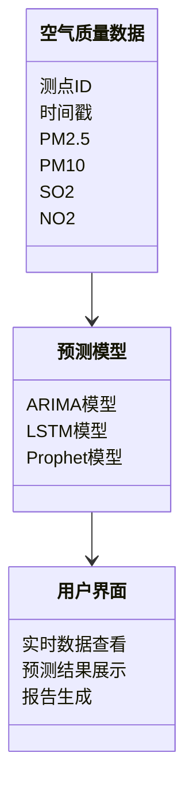
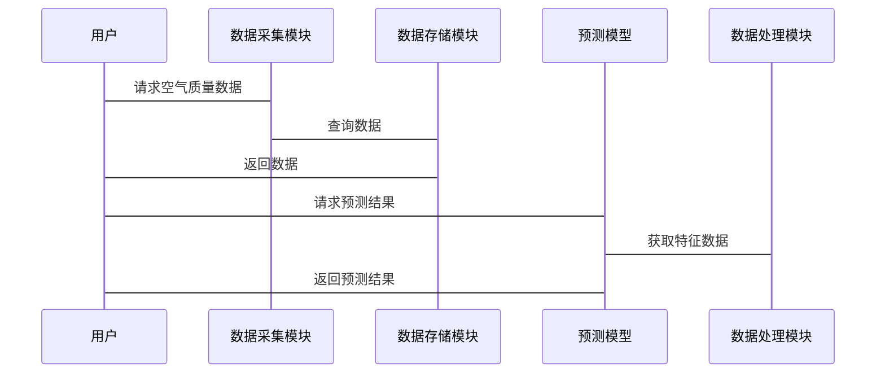

                 


# 价值投资中的智能城市空气质量预测系统分析

---

## 关键词
- 价值投资
- 智能城市
- 空气质量预测
- 时间序列预测
- 机器学习
- 投资策略
- 系统架构

---

## 摘要
本文系统地分析了价值投资与智能城市空气质量预测系统的结合，探讨了如何通过智能技术预测空气质量，并将其应用于价值投资策略中。文章从空气质量预测系统的背景与意义出发，详细讲解了空气质量数据的特征与来源、预测模型的选择与优化、系统架构设计与实现，以及基于预测结果的投资策略制定。通过具体案例分析和代码实现，本文为读者提供了从理论到实践的完整指导，帮助投资者利用智能技术优化决策过程，实现收益与风险的最优平衡。

---

# 第1章: 价值投资与智能城市空气质量预测的背景与概述

## 1.1 价值投资的基本概念与核心理念
### 1.1.1 价值投资的定义与核心原则
价值投资是一种以基本面分析为基础的投资策略，强调以低于内在价值的价格购买优质资产。其核心理念包括：
1. 坚持长期投资，追求资产的内在价值。
2. 以合理的价格买入，注重安全边际。
3. 分散投资，降低风险。

### 1.1.2 价值投资在现代金融中的应用
价值投资广泛应用于股票、房地产、能源等领域。通过分析企业的财务状况、行业地位和未来前景，投资者可以找到被市场低估的投资标的。

### 1.1.3 价值投资与智能城市发展的关系
智能城市的发展依赖于技术创新和数据驱动的决策。价值投资可以通过技术手段（如空气质量预测）优化投资决策，推动智能城市的可持续发展。

## 1.2 智能城市空气质量预测的背景与意义
### 1.2.1 智能城市的概念与发展趋势
智能城市通过物联网、大数据和人工智能技术，优化城市资源配置，提升居民生活质量。空气质量作为重要的环境指标，直接影响居民健康和城市可持续发展。

### 1.2.2 空气质量预测的重要性与挑战
空气质量预测可以帮助政府和企业提前采取措施，减少污染对居民健康的影响。然而，空气质量预测涉及复杂的气象数据和化学反应模型，具有较高的技术难度。

### 1.2.3 智能城市空气质量预测的核心价值
智能城市空气质量预测系统能够实时监测和预测空气质量，为政府制定环保政策、企业优化生产计划、居民健康出行提供数据支持。

## 1.3 价值投资与智能城市空气质量预测的结合
### 1.3.1 价值投资在环境数据中的应用潜力
通过对空气质量数据的分析，投资者可以发现环境风险较高的企业或行业，避免投资潜在的环保问题。

### 1.3.2 智能城市空气质量预测系统的投资价值
空气质量预测系统可以为环保企业、能源企业等提供数据支持，提升企业的市场竞争力和投资价值。

### 1.3.3 本章小结
本章介绍了价值投资的核心理念、智能城市的发展趋势以及空气质量预测的重要性，为后续分析奠定了基础。

---

# 第2章: 智能城市空气质量预测系统的数据与模型

## 2.1 空气质量数据的特征与来源
### 2.1.1 空气质量数据的特征分析
空气质量数据具有时间序列特征，受气象条件、污染源分布和人类活动的影响较大。常用指标包括PM2.5、PM10、SO2、NO2等。

### 2.1.2 数据来源与采集方式
数据来源包括政府环境监测站、企业自监测系统和公开数据库（如AQI指数）。数据采集方式包括传感器采集、气象数据获取和卫星遥感技术。

### 2.1.3 数据预处理与清洗
数据清洗包括去除缺失值、异常值和重复值。常用方法包括插值、平滑和归一化处理。

## 2.2 空气质量预测模型的选择与评估
### 2.2.1 时间序列预测模型的优缺点对比
常用模型包括ARIMA、LSTM和Prophet。ARIMA适用于线性趋势，LSTM适合非线性数据，Prophet适合易解释的需求。

### 2.2.2 机器学习模型在空气质量预测中的应用
随机森林和XGBoost模型可以通过特征工程捕捉空气质量变化的非线性关系。

### 2.2.3 模型评估与优化方法
评估指标包括均方误差（MSE）、平均绝对误差（MAE）和R²值。模型优化可以通过交叉验证和超参数调优实现。

## 2.3 智能城市空气质量预测系统的架构
### 2.3.1 系统整体架构设计
系统架构包括数据采集模块、数据处理模块、模型训练模块和结果展示模块。

### 2.3.2 数据流与信息处理流程
数据从传感器采集后，经过预处理和特征提取，输入模型进行预测，最终结果展示在用户界面。

### 2.3.3 系统扩展性与可维护性
系统设计应考虑模块化和扩展性，便于未来增加新功能和优化算法。

---

# 第3章: 价值投资中的空气质量预测策略

## 3.1 空气质量预测结果的金融化解读
### 3.1.1 空气质量指数与股票价格的相关性分析
通过统计分析和回归模型，研究空气质量指数与相关行业股票价格之间的关系。

### 3.1.2 空气质量预测对投资决策的影响
空气质量预测可以帮助投资者识别高风险行业，优化投资组合。

### 3.1.3 空气质量风险的量化与定价
通过风险评估模型，量化空气质量对投资标的潜在影响，并为其定价。

## 3.2 基于空气质量预测的价值投资策略
### 3.2.1 短期与长期投资策略的制定
短期策略关注市场波动，长期策略注重企业基本面。

### 3.2.2 风险控制与收益最大化的方法
通过分散投资和动态调整投资组合，平衡风险与收益。

### 3.2.3 策略实施中的关键因素分析
包括数据质量、模型精度和市场环境等。

## 3.3 空气质量预测系统的投资价值评估
### 3.3.1 系统的成本与收益分析
评估系统的建设和运营成本，以及其对投资决策的实际价值。

### 3.3.2 系统的市场竞争力与可持续性
分析系统的市场前景和技术优势。

### 3.3.3 系统的未来发展趋势与投资机会
随着技术进步，空气质量预测系统将更加智能化和精准化，为投资者提供更多价值。

---

# 第4章: 空气质量预测系统的算法实现

## 4.1 时间序列预测算法的原理与实现
### 4.1.1 ARIMA模型的原理与应用
ARIMA模型通过自回归和滑动平均部分拟合时间序列数据，适用于线性趋势和季节性变化。

### 4.1.2 LSTM模型的原理与应用
LSTM通过长短期记忆单元捕捉时间序列的长期依赖关系，适用于复杂非线性数据。

### 4.1.3 算法实现的步骤与代码示例
```python
from statsmodels.tsa.arima_model import ARIMA
import numpy as np

# 示例数据
data = np.array([100, 90, 80, 70, 60])

# ARIMA模型训练
model = ARIMA(data, order=(1, 1, 0))
model_fit = model.fit()

# 预测
forecast = model_fit.forecast(steps=5)
print(forecast)
```

## 4.2 机器学习模型的优化与调优
### 4.2.1 随机森林与XGBoost模型的对比
随机森林适合特征重要性分析，XGBoost在预测精度上表现更优。

### 4.2.2 模型调优的步骤与技巧
包括特征选择、参数优化和交叉验证。

### 4.2.3 模型的部署与实时预测
通过API接口实现模型的实时预测功能。

---

# 第5章: 系统架构设计与实现

## 5.1 问题场景介绍
空气质量预测系统需要处理实时数据，支持多用户查询和提供预测报告。

## 5.2 系统功能设计
### 5.2.1 领域模型设计


## 5.3 系统架构设计
```mermaid
containerDiagram
    container 数据采集层 {
        数据采集模块
        数据存储模块
    }
    container 数据处理层 {
        数据清洗模块
        特征提取模块
    }
    container 模型训练层 {
        ARIMA模型
        LSTM模型
        Prophet模型
    }
    container 用户界面层 {
        Web界面
        API接口
    }
```

## 5.4 系统接口设计
### 5.4.1 数据接口
API接口定义：
- `GET /api/air-quality/data`
- `POST /api/air-quality/predict`

### 5.4.2 用户交互流程


---

# 第6章: 项目实战与案例分析

## 6.1 环境安装与配置
### 6.1.1 安装Python环境
使用Anaconda或virtualenv管理Python版本和依赖包。

### 6.1.2 安装依赖包
`pip install numpy pandas scikit-learn statsmodels lightgbm`

## 6.2 核心代码实现
### 6.2.1 数据处理代码
```python
import pandas as pd

# 数据加载
data = pd.read_csv('air_quality.csv')

# 数据清洗
data.dropna(inplace=True)
data = data[~data.duplicated()]
```

### 6.2.2 模型训练代码
```python
from statsmodels.tsa.arima_model import ARIMA
import numpy as np

# ARIMA模型训练
model = ARIMA(data, order=(1, 1, 0))
model_fit = model.fit()

# LSTM模型训练
from keras.models import Sequential
from keras.layers import LSTM, Dense

model = Sequential()
model.add(LSTM(50, input_shape=(1, 1)))
model.add(Dense(1))
model.compile(loss='mean_squared_error', optimizer='adam')
model.fit(X_train, y_train, epochs=50, batch_size=32)
```

### 6.2.3 结果分析与投资策略制定
通过模型预测结果，识别高风险行业，优化投资组合。

## 6.3 案例分析与详细解读
以某城市为例，分析空气质量预测结果对投资决策的影响，展示如何通过预测结果制定投资策略。

---

# 第7章: 总结与展望

## 7.1 最佳实践与小结
### 7.1.1 数据质量的重要性
数据预处理是模型训练的基础，直接影响预测结果的准确性。

### 7.1.2 模型选择的策略
根据数据特征和预测目标选择合适的模型，避免过度拟合。

## 7.2 注意事项与建议
### 7.2.1 数据隐私与安全
保护用户数据隐私，遵守相关法律法规。

### 7.2.2 系统维护与更新
定期更新模型和数据，确保系统的稳定性和准确性。

## 7.3 未来展望与拓展阅读
随着人工智能技术的发展，空气质量预测系统将更加智能化和个性化。未来的研究方向包括多模态数据融合、模型解释性提升和实时预测优化。

---

# 作者：AI天才研究院/AI Genius Institute & 禅与计算机程序设计艺术 /Zen And The Art of Computer Programming

