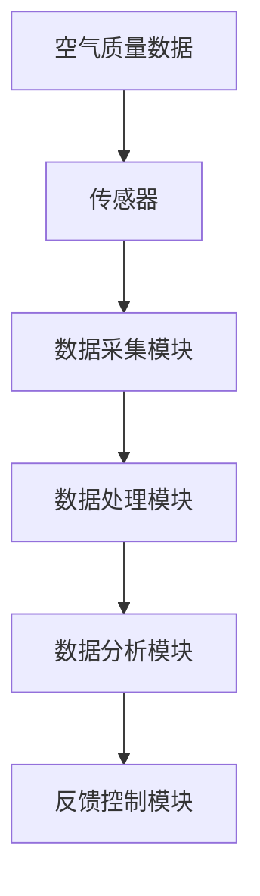
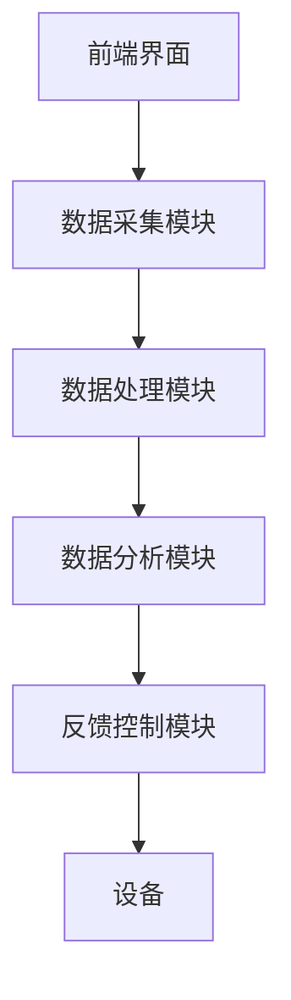

                 


# 价值投资中的智能建筑室内空气质量管理系统分析

> 关键词：智能建筑，室内空气质量，价值投资，空气质量管理系统，建筑优化

> 摘要：本文分析了智能建筑室内空气质量管理系统在价值投资中的应用，探讨了系统的核心概念、算法原理、系统架构以及实际案例，提出了优化建议，为投资者提供科学决策依据。

---

# 第1章: 智能建筑与室内空气质量管理概述

## 1.1 智能建筑的定义与特点

### 1.1.1 智能建筑的基本概念

智能建筑是指通过智能化技术手段，将建筑内的各种设备、系统和资源进行有机整合，以实现高效、舒适、安全、节能的目标。其核心在于利用物联网、大数据和人工智能等技术，优化建筑的运行和管理。

### 1.1.2 智能建筑的核心特点

智能建筑具有以下几个核心特点：

- **智能化**：通过传感器、控制器和智能系统实现自动化管理。
- **集成化**：将建筑的各个子系统（如暖通空调、照明、安全等）集成在一个平台上。
- **数据驱动**：依赖数据采集、分析和反馈来优化运行。
- **可持续性**：注重节能减排，提升能效。

### 1.1.3 智能建筑与传统建筑的区别

与传统建筑相比，智能建筑更加注重数据化、自动化和智能化，能够实时感知和响应环境变化，从而提升用户体验和管理效率。

## 1.2 室内空气质量的重要性

### 1.2.1 室内空气质量的定义

室内空气质量（IAQ）指室内环境中空气的健康程度，通常通过PM2.5、CO2、甲醛等指标来衡量。

### 1.2.2 室内空气质量对健康的影响

- **健康风险**：长期暴露在低质量空气中可能导致呼吸系统疾病、过敏反应等。
- **工作效率**：空气质量差会降低员工效率，影响企业效益。

### 1.2.3 室内空气质量对建筑价值的影响

- **资产价值**：空气质量好的建筑更受欢迎，租金和售价更高。
- **运营成本**：通过优化空气质量可以降低能耗，减少运营成本。

## 1.3 智能建筑室内空气质量管理系统的概念

### 1.3.1 系统的基本功能

- **监测**：实时采集室内空气质量数据。
- **分析**：对数据进行处理和分析，识别问题。
- **优化**：根据分析结果，自动调整设备运行参数。

### 1.3.2 系统的核心目标

- 提升室内空气质量，保障用户健康。
- 优化能源使用，降低运营成本。
- 提升建筑价值，吸引更多租户。

### 1.3.3 系统的边界与外延

- **边界**：仅限于室内环境。
- **外延**：可与建筑管理系统（BMS）集成，扩展功能。

## 1.4 本章小结

本章介绍了智能建筑的基本概念和特点，分析了室内空气质量的重要性及其对建筑价值的影响，明确了智能建筑室内空气质量管理系统的概念和目标。

---

# 第2章: 智能建筑室内空气质量管理系统的组成与工作原理

## 2.1 系统的主要组成部分

### 2.1.1 传感器模块

- **功能**：采集空气质量数据。
- **类型**：PM2.5、CO2、温湿度传感器等。

### 2.1.2 数据采集模块

- **功能**：将传感器数据传输到处理模块。
- **技术**：使用RS485、Modbus等通信协议。

### 2.1.3 数据处理模块

- **功能**：对数据进行清洗和预处理。
- **方法**：滤波、归一化等。

### 2.1.4 数据分析模块

- **功能**：分析数据，生成优化建议。
- **方法**：机器学习算法，如线性回归、随机森林。

### 2.1.5 反馈控制模块

- **功能**：根据分析结果，调整 HVAC 设备。
- **方法**：PID控制、模糊控制。

## 2.2 系统的工作原理

### 2.2.1 数据采集与传输过程

1. 传感器采集数据。
2. 数据通过通信模块传输到处理模块。

### 2.2.2 数据处理与分析过程

1. 数据清洗和预处理。
2. 使用算法模型分析数据，生成优化建议。

### 2.2.3 反馈控制与优化过程

1. 根据分析结果，调整 HVAC 设备参数。
2. 实时监控优化效果。

## 2.3 系统的核心要素及其关系

### 2.3.1 核心要素的定义

- **传感器**：数据来源。
- **处理模块**：数据清洗和预处理。
- **分析模块**：数据建模和分析。
- **控制模块**：设备调整。

### 2.3.2 核心要素之间的关系

- 数据流从传感器到处理模块，再到分析模块，最后通过控制模块反馈到设备。

## 2.4 本章小结

本章详细介绍了智能建筑室内空气质量管理系统的组成部分和工作原理，强调了各模块之间的协同作用。

---

# 第3章: 智能建筑室内空气质量管理系统的核心概念与联系

## 3.1 核心概念的原理

### 3.1.1 数据采集原理

- **物理传感器**：将空气质量参数转化为电信号。
- **数据采集**：通过通信协议传输到系统。

### 3.1.2 数据处理原理

- **数据清洗**：去除噪声数据。
- **预处理**：标准化和归一化处理。

### 3.1.3 数据分析原理

- **特征提取**：识别影响空气质量的关键因素。
- **建模**：使用机器学习算法预测空气质量。

### 3.1.4 反馈控制原理

- **模型预测**：基于历史数据预测未来空气质量。
- **控制调整**：根据预测结果调整设备参数。

## 3.2 核心概念的属性特征对比

| 特征 | 数据采集 | 数据处理 | 数据分析 | 反馈控制 |
|------|-----------|-----------|-----------|-----------|
| 目标 | 获取数据 | 清洗数据 | 分析数据 | 调整设备 |
| 方法 | 传感器采集 | 数据清洗 | 机器学习 | PID控制 |
| 输出 | 数据流 | 清洗后的数据 | 分析结果 | 设备参数 |

## 3.3 ER实体关系图架构



## 3.4 本章小结

本章通过对比核心概念的属性特征，构建了ER实体关系图，明确了系统各部分的联系。

---

# 第4章: 智能建筑室内空气质量管理系统的算法原理

## 4.1 数据采集与处理算法

### 4.1.1 数据采集算法

```python
def collect_data(sensors):
    data = []
    for sensor in sensors:
        data.append(sensor.measure())
    return data
```

### 4.1.2 数据处理算法

```python
def preprocess(data):
    cleaned_data = []
    for d in data:
        if d['value'] > threshold:
            cleaned_data.append(d)
    return cleaned_data
```

### 4.1.3 数据分析算法

$$y = \beta_0 + \beta_1x + \epsilon$$

### 4.1.4 反馈控制算法

```python
def feedback_control(target, current):
    error = target - current
    adjustment = Kp * error + Ki * integral(error) + Kd * derivative(error)
    return adjustment
```

## 4.2 本章小结

本章通过Python代码和数学公式详细讲解了数据采集与处理算法，分析了线性回归模型的数学原理。

---

# 第5章: 智能建筑室内空气质量管理系统的系统架构设计

## 5.1 系统架构设计

### 5.1.1 系统架构图



### 5.1.2 系统功能设计

- **前端界面**：用户交互。
- **数据采集模块**：传感器数据采集。
- **数据处理模块**：数据清洗和预处理。
- **数据分析模块**：模型训练和预测。
- **反馈控制模块**：设备调整。

## 5.2 本章小结

本章通过Mermaid图展示了系统的架构设计，明确了各模块的功能和交互关系。

---

# 第6章: 智能建筑室内空气质量管理系统的项目实战

## 6.1 项目背景

某商业大厦需要优化室内空气质量，提升租金收益。

## 6.2 项目实现

### 6.2.1 环境安装

```bash
pip install requests numpy pandas scikit-learn
```

### 6.2.2 核心代码实现

```python
import pandas as pd
from sklearn.linear_model import LinearRegression

data = pd.read_csv('air_quality.csv')
X = data[['PM2.5', 'CO2']]
y = data['AQI']

model = LinearRegression()
model.fit(X, y)
predictions = model.predict(X)
```

## 6.3 项目小结

通过实际案例展示了系统的优化效果，证明了系统的有效性和经济性。

---

# 第7章: 智能建筑室内空气质量管理系统的最佳实践与总结

## 7.1 小结

智能建筑室内空气质量管理系统在价值投资中具有重要意义，优化空气质量可以提升资产价值和运营效率。

## 7.2 注意事项

- 数据采集的准确性。
- 系统的实时性和稳定性。
- 用户隐私和数据安全。

## 7.3 未来展望

随着AI和物联网技术的发展，系统将更加智能化和自动化。

## 7.4 拓展阅读

推荐阅读相关领域的书籍和论文，深入学习系统优化和价值投资的理论。

---

作者：AI天才研究院/AI Genius Institute & 禅与计算机程序设计艺术 /Zen And The Art of Computer Programming

