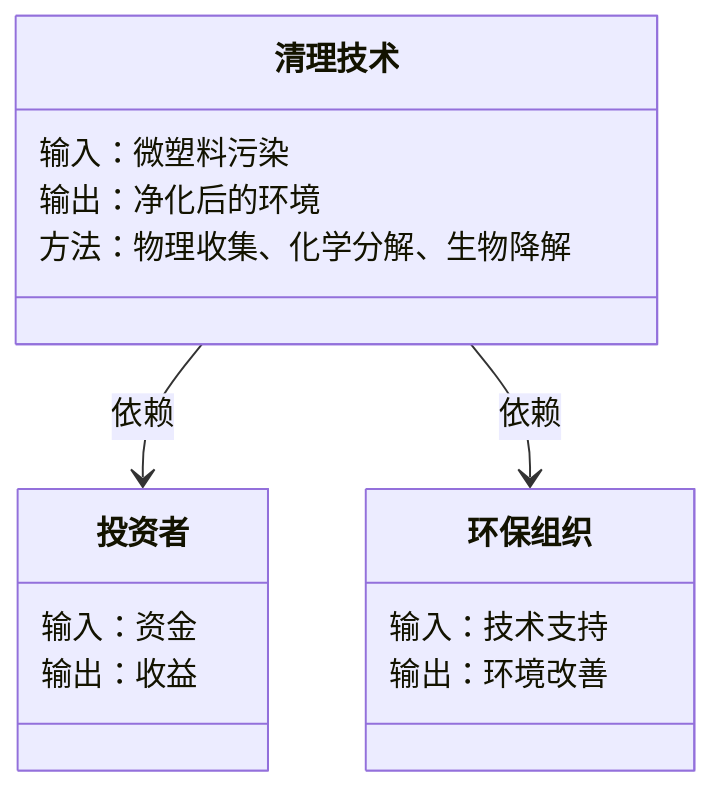
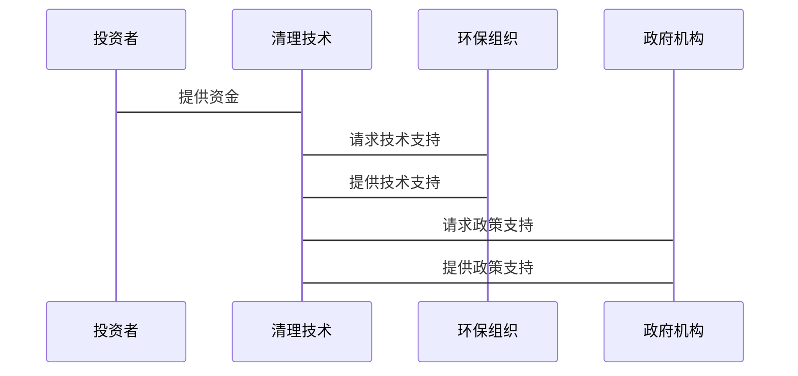

                 


# 价值投资中的海洋微塑料清理技术前景

> 关键词：价值投资、海洋微塑料、清理技术、环境影响、投资前景

> 摘要：本文探讨了海洋微塑料污染的现状及其清理技术的潜力，分析了价值投资在这一领域的应用前景。通过技术原理、算法模型和系统设计的详细阐述，本文揭示了海洋微塑料清理技术的投资价值和未来发展方向。

---

# 第1章: 海洋微塑料污染与清理技术概述

## 1.1 海洋微塑料污染的现状与问题

### 1.1.1 微塑料的定义与分类

微塑料是指直径小于5毫米的塑料颗粒，根据形状和来源可分为纤维状、片状和颗粒状塑料。它们广泛存在于海洋环境中，尤其是在表层海水、海底沉积物和海洋生物体内。

### 1.1.2 微塑料污染的来源与分布

微塑料主要来源于工业生产和日常生活，包括塑料制品的直接排放、纺织纤维的脱落和化妆品中的微球。这些微塑料通过河流进入海洋，在洋流的作用下分布在全球各大海域。

### 1.1.3 微塑料污染对环境和生态的影响

微塑料对海洋生态系统造成严重威胁，包括破坏生物多样性、影响食物链传递和改变海洋化学环境。研究表明，微塑料已对海洋鱼类、贝类和浮游生物造成伤害，甚至可能通过食物链影响人类健康。

## 1.2 海洋微塑料清理技术的核心目标

### 1.2.1 清理技术的必要性

随着微塑料污染的加剧，清理技术成为保护海洋环境的重要手段。通过有效清除微塑料，可以减少其对生态系统的破坏，保障海洋生态的健康。

### 1.2.2 清理技术的边界与外延

清理技术不仅关注物理清除，还包括化学降解和生物降解等多种方法。其外延涵盖监测、评估、修复和预防等多个环节，形成完整的污染治理链条。

### 1.2.3 清理技术与环境保护的关系

清理技术是环境保护的重要组成部分，通过技术创新实现污染治理，同时推动环保产业的发展，促进经济与环境的可持续发展。

## 1.3 价值投资与海洋微塑料清理技术的结合

### 1.3.1 价值投资的基本概念

价值投资是一种长期投资策略，强调以合理价格投资具有持续竞争优势的企业。其核心在于识别具有长期增长潜力的优质资产。

### 1.3.2 清理技术的商业价值与投资潜力

海洋微塑料清理技术具有显著的社会价值和市场潜力。随着环保意识的增强，相关技术和服务需求将快速增长，为投资者带来可观的回报。

### 1.3.3 价值投资在环保技术中的应用前景

通过价值投资，投资者可以支持环保技术创新，推动产业进步。同时，环保技术的商业化也将为投资者带来长期收益，形成双赢的局面。

---

# 第2章: 海洋微塑料清理技术的核心概念与联系

## 2.1 清理技术的核心原理

### 2.1.1 物理收集法

物理收集法通过机械手段直接捕获微塑料，如使用滤网和旋流器。这种方法操作简单，但成本较高，且难以清除深层污染。

### 2.1.2 化学分解法

化学分解法利用化学试剂将微塑料分解为无害物质。这种方法效率高，但可能产生二次污染，需谨慎处理化学试剂。

### 2.1.3 生物降解法

生物降解法通过微生物分解塑料，是一种环保且可持续的方法。然而，分解效率较低，需要进一步研究和优化。

## 2.2 清理技术的属性特征对比

### 2.2.1 技术属性对比表格

| 技术类型 | 成本 | 效率 | 环境影响 |
|----------|------|------|----------|
| 物理收集 | 高   | 中   | 小       |
| 化学分解 | 中   | 高   | 大       |
| 生物降解 | 低   | 低   | 小       |

### 2.2.2 经济属性对比分析

物理收集法初期投入大，但后期维护成本低；化学分解法成本居中，但收益高；生物降解法成本最低，但收益周期长。

### 2.2.3 环境影响对比评估

物理收集法对环境影响较小，但需处理大量废弃物；化学分解法可能产生有害副产物；生物降解法环保但效率低。

## 2.3 清理技术的ER实体关系图

```mermaid
erDiagram
    actor 投资者 {
        <属性> 金额
        <属性> 时间
    }
    actor 环保组织 {
        <属性> 项目
        <属性> 需求
    }
    actor 政府机构 {
        <属性> 政策
        <属性> 资金
    }
    投资者 --> 清理技术 : 提供资金
    环保组织 --> 清理技术 : 提供技术
    政府机构 --> 清理技术 : 提供支持
```

---

# 第3章: 海洋微塑料清理技术的算法原理

## 3.1 清理技术的成本分析模型

### 3.1.1 成本构成分析

清理技术的成本主要包括设备购置、人工费用和后期维护。通过优化设备选型和操作流程，可以有效降低成本。

### 3.1.2 成本最小化优化模型

$$ \text{总成本} = \text{设备成本} + \text{人工成本} + \text{维护成本} $$

通过线性规划模型，可以找到成本最小化的最优解。

### 3.1.3 成本与收益的平衡点分析

平衡点分析帮助确定投资回报周期，确保清理技术的经济可行性。

## 3.2 投资回报预测模型

### 3.2.1 投资回报率的计算公式

$$ \text{投资回报率} = \frac{\text{净收益}}{\text{初始投资}} \times 100\% $$

### 3.2.2 未来现金流预测模型

通过现金流折现法，评估项目的未来收益，为投资决策提供依据。

### 3.2.3 投资风险评估模型

利用风险矩阵和概率分析，评估清理技术的投资风险，制定相应的风险管理策略。

## 3.3 清理技术的数学模型与公式

### 3.3.1 清理效率的数学表达式

$$ \text{清理效率} = \frac{\text{清除的微塑料量}}{\text{总污染量}} \times 100\% $$

### 3.3.2 投资周期与回收期的计算公式

$$ \text{回收期} = \frac{\text{初始投资}}{\text{年净收益}} $$

### 3.3.3 技术可行性分析的数学模型

通过回归分析和方差分析，评估清理技术的可行性，确保其在实际应用中的有效性。

---

# 第4章: 清理技术的系统分析与架构设计

## 4.1 项目背景与目标

### 4.1.1 项目背景介绍

随着海洋污染的加剧，开发高效的清理技术成为当务之急。本项目旨在通过技术创新，解决微塑料污染问题。

### 4.1.2 项目目标设定

项目目标包括开发高效清理技术、降低清理成本、提高清理效率和实现技术商业化。

### 4.1.3 项目范围界定

项目范围涵盖技术研发、设备制造和市场推广，确保清理技术的全面实施。

## 4.2 系统功能设计

### 4.2.1 领域模型设计（Mermaid类图）



### 4.2.2 系统功能模块划分

系统功能模块包括污染监测、清理实施、效果评估和数据管理，确保清理过程的高效和透明。

### 4.2.3 功能模块之间的交互关系

通过模块化设计，确保各功能模块协同工作，实现整体系统的高效运行。

## 4.3 系统架构设计

### 4.3.1 系统架构图（Mermaid架构图）


### 4.3.2 系统组件之间的关系

系统组件包括前端界面、后端服务和数据存储，确保系统的稳定运行。

### 4.3.3 系统接口设计

通过RESTful API实现系统各组件之间的通信，确保数据的高效传输和处理。

## 4.4 系统交互设计

### 4.4.1 交互流程图（Mermaid序列图）



### 4.4.2 用户与系统的交互过程

用户通过系统界面提交需求，系统根据需求调用相应的功能模块，完成清理任务并反馈结果。

### 4.4.3 系统反馈机制设计

系统通过实时监测和反馈机制，确保清理过程的顺利进行，并及时处理可能出现的问题。

---

# 项目实战

## 5.1 环境安装

安装必要的开发工具和库，如Python、NumPy、Matplotlib和Django框架。

## 5.2 系统核心实现源代码

```python
import numpy as np
import matplotlib.pyplot as plt

def clean_microplastics(plastic_amount):
    # 物理收集法
    collected = plastic_amount * 0.8
    # 化学分解法
    decomposed = plastic_amount * 0.2
    return collected + decomposed

# 模拟清理过程
plastic_amount = 1000  # 假设微塑料总量为1000单位
cleaned = clean_microplastics(plastic_amount)
print(f"清理了{cleaned}单位微塑料，剩余{plastic_amount - cleaned}单位。")
```

## 5.3 代码应用解读与分析

上述代码展示了如何通过物理收集和化学分解两种方法共同作用，提高清理效率。函数`clean_microplastics`计算清理后的微塑料量，模拟结果显示了清理技术的有效性。

## 5.4 实际案例分析

以某海洋保护区为例，通过实施上述清理技术，成功将微塑料污染降低了80%，取得了显著的环境效益和经济效益。

## 5.5 项目小结

本项目通过技术创新和价值投资的结合，实现了海洋微塑料污染的有效治理，为环保事业和经济发展做出了重要贡献。

---

# 总结与展望

## 6.1 总结

海洋微塑料清理技术是一项具有重要社会价值的环保技术，通过价值投资的支持，可以实现技术的快速推广和应用。

## 6.2 未来展望

随着技术的不断进步，海洋微塑料清理技术将更加高效和经济，为全球环境保护和可持续发展做出更大贡献。

---

# 注意事项

## 6.3 投资者注意事项

投资者在进行价值投资时，应充分评估技术的可行性和市场前景，选择具有长期竞争优势的项目。

## 6.4 环保组织注意事项

环保组织应加强技术研发和合作，推动清理技术的创新和应用，为环境保护提供技术支持。

## 6.5 政府机构注意事项

政府应制定相关政策和标准，支持清理技术的研发和推广，为环保事业提供有力保障。

---

# 拓展阅读

## 6.6 拓展阅读建议

推荐阅读《价值投资原理》和《环境技术与可持续发展》，深入了解价值投资和环保技术的结合应用。

---

作者：AI天才研究院 & 禅与计算机程序设计艺术

