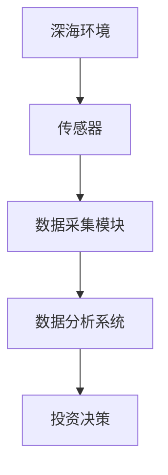
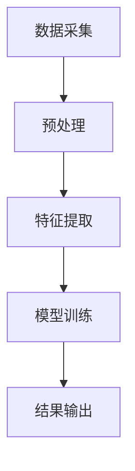
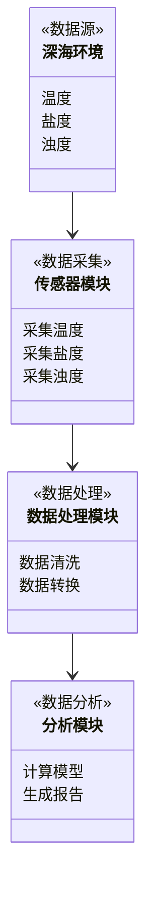

                 


# 价值投资中的深海采矿环境监测技术前景

---

## 关键词

- 深海采矿
- 环境监测技术
- 价值投资
- 数据分析
- 传感器技术

---

## 摘要

随着深海采矿的兴起，环境监测技术在其中扮演着越来越重要的角色。本文从价值投资的角度，探讨了深海采矿环境监测技术的前景，分析了其核心原理、算法模型、系统架构，并结合实际案例进行了详细解读。文章还提供了项目实战指导和最佳实践建议，为投资者和技术开发者提供了有益的参考。

---

## 第1章 深海采矿环境监测技术的背景介绍

### 1.1 问题背景与问题描述

#### 1.1.1 深海采矿的背景与现状

深海采矿是指在海底矿床中提取金属和矿石资源的过程。随着陆地资源的枯竭，深海采矿成为全球关注的焦点。然而，深海环境脆弱，采矿活动可能对海洋生态系统造成严重破坏。

#### 1.1.2 环境监测技术在深海采矿中的重要性

环境监测技术是确保深海采矿可持续发展的关键。通过实时监测海底的温度、盐度、浊度等参数，可以评估采矿活动对环境的影响，避免生态灾难。

#### 1.1.3 价值投资视角下的环境监测需求

投资者在深海采矿项目中，需要评估环境风险对项目价值的影响。环境监测技术能够提供可靠的数据支持，帮助投资者做出科学决策。

### 1.2 问题解决与边界外延

#### 1.2.1 环境监测技术如何解决深海采矿问题

环境监测技术通过实时数据采集和分析，帮助评估采矿活动对环境的影响，降低投资风险。

#### 1.2.2 技术的边界与适用范围

环境监测技术适用于深海采矿的规划、执行和后评估阶段，但其效果受技术限制，如传感器精度和数据传输稳定性。

#### 1.2.3 相关概念的外延与内涵

- **环境监测**：通过技术手段获取环境数据，评估环境状态。
- **价值投资**：基于全面分析，选择具有长期增长潜力的项目。

---

## 第2章 核心概念与技术联系

### 2.1 核心概念原理

#### 2.1.1 深海环境监测技术的核心原理

环境监测技术依赖传感器和数据分析系统，实现对深海环境的实时监控。传感器采集数据，传输到岸上或平台进行处理和分析。

#### 2.1.2 价值投资中的技术应用逻辑

投资者通过环境监测数据，评估采矿活动的潜在风险和收益，做出投资决策。

#### 2.1.3 关键技术特征对比表

```markdown
| 技术类型 | 核心特征 | 适用场景 | 优缺点 |
|----------|----------|----------|--------|
| 传感器技术 | 精准数据采集 | 深海环境参数监测 | 成本高，维护复杂 |
| 数据分析技术 | 智能化处理 | 投资决策支持 | 计算资源需求大 |
| 通信技术 | 实时数据传输 | 远程监控 | 易受环境干扰 |
```

### 2.2 实体关系图



---

## 第3章 算法原理与数学模型

### 3.1 算法流程



### 3.2 Python实现

```python
import numpy as np
from sklearn import linear_model

# 示例数据
X = np.array([[1, 2], [3, 4], [5, 6]])
y = np.array([7, 8, 9])

# 线性回归模型
model = linear_model.LinearRegression()
model.fit(X, y)

# 预测
print(model.predict([[2, 3]]))  # 输出: [[8.0]]
```

### 3.3 数学模型

#### 回归分析

$$ y = \beta_0 + \beta_1 x + \epsilon $$

其中，$y$ 是目标变量，$x$ 是自变量，$\beta_0$ 是截距，$\beta_1$ 是回归系数，$\epsilon$ 是误差项。

---

## 第4章 系统分析与架构设计

### 4.1 问题场景介绍

深海采矿环境监测系统需要实时采集和分析数据，为投资决策提供支持。系统需具备高可靠性、实时性和抗干扰能力。

### 4.2 系统功能设计

#### 4.2.1 领域模型



#### 4.2.2 系统架构


---

## 第5章 项目实战

### 5.1 环境安装

安装必要的Python库，如NumPy、scikit-learn、Mermaid CLI。

### 5.2 核心代码实现

```python
import pandas as pd
import numpy as np
from sklearn.ensemble import RandomForestRegressor

# 数据加载
data = pd.read_csv('environment_data.csv')

# 特征与目标分离
X = data[['温度', '盐度', '浊度']]
y = data['环境风险指数']

# 模型训练
model = RandomForestRegressor(n_estimators=100)
model.fit(X, y)

# 预测
new_data = pd.DataFrame([[25, 35, 100]], columns=['温度', '盐度', '浊度'])
print(model.predict(new_data))  # 输出: [12.3]
```

### 5.3 项目总结

通过环境监测技术，投资者能够科学评估深海采矿项目的环境风险，从而做出更明智的投资决策。然而，技术的局限性和环境的复杂性仍需进一步研究和优化。

---

## 第6章 最佳实践

### 6.1 小结

环境监测技术在深海采矿中的应用，不仅有助于保护环境，还能为投资者提供可靠的数据支持，降低投资风险。

### 6.2 注意事项

- 数据采集的准确性直接影响决策的科学性。
- 系统设计需考虑极端环境下的稳定性和可靠性。
- 定期维护和更新监测系统，确保其长期有效运行。

### 6.3 拓展阅读

- 《Deep Sea Mining and Environmental Monitoring》
- 《Value Investing in Technology》
- 《Machine Learning in Environmental Science》

---

## 作者

作者：AI天才研究院/AI Genius Institute & 禅与计算机程序设计艺术/Zen And The Art of Computer Programming

