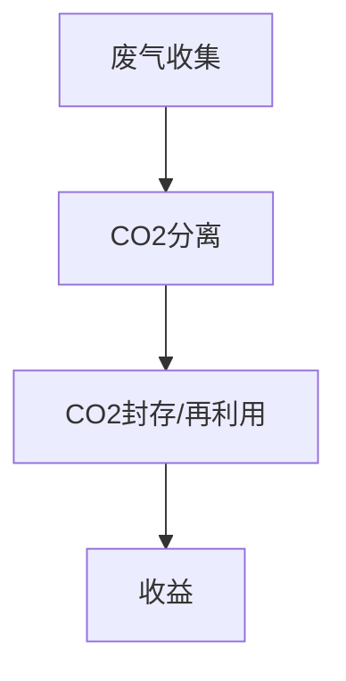

                 

# 价值投资中的碳捕获技术机遇

---

## 关键词：
- 碳捕获技术
- 价值投资
- 碳交易市场
- 可再生能源
- 碳中和目标

---

## 摘要：
碳捕获技术作为一种新兴的环保技术，正在成为全球应对气候变化的重要手段。随着全球碳中和目标的推进，碳捕获技术的应用前景广阔，也为投资者带来了新的价值投资机会。本文将从碳捕获技术的基本原理、市场需求、经济模型、投资策略以及实际案例等方面，深入分析碳捕获技术在价值投资中的潜力和挑战。

---

## 第一部分：碳捕获技术的背景与概念

### 第1章：碳捕获技术的定义与现状

#### 1.1 碳捕获技术的定义
碳捕获技术（Carbon Capture and Storage, CCS）是一种通过捕获工业过程中产生的二氧化碳（CO2），并将其封存或再利用的技术。其核心目标是减少大气中的CO2浓度，从而减缓气候变化。

##### 1.1.1 碳捕获技术的基本概念
碳捕获技术主要分为以下三种类型：
1. **吸收法**：利用化学反应将CO2从废气中分离出来。
2. **吸附法**：通过物理吸附或化学吸附的方式捕获CO2。
3. **膜分离法**：利用膜的选择透过性来分离CO2。

##### 1.1.2 碳捕获技术的分类与特点
| 技术类型 | 特点 | 优缺点 |
|----------|------|--------|
| 吸收法 | 高效、成熟 | 成本较高，化学反应复杂 |
| 吸附法 | 节能、灵活 | 吸附材料研发难度大 |
| 膜分离法 | 简单、高效 | 成本高，技术不成熟 |

##### 1.1.3 碳捕获技术的全球发展现状
目前，全球多个国家和地区已经在碳捕获技术的研发和应用上取得了显著进展。例如，挪威的北海碳封存项目和美国的碳捕获与封存示范项目。

### 第2章：价值投资的基本概念

#### 2.1 价值投资的核心理念
价值投资是一种以长期收益为导向的投资策略，强调通过分析企业的基本面（如盈利能力、财务状况、竞争优势等），寻找被市场低估的投资标的。

##### 2.1.1 价值投资的核心要素
| 要素 | 描述 |
|------|------|
| 企业盈利能力 | 利润率、净利润等指标 |
| 财务健康状况 | 资产负债表、现金流等 |
| 行业地位 | 市场份额、竞争壁垒 |

#### 2.2 碳捕获技术与价值投资的结合
碳捕获技术的市场需求与政策支持为投资者提供了新的机遇。通过分析碳捕获技术企业的商业模式、成本结构和市场潜力，投资者可以发现具有长期价值的标的。

---

## 第二部分：碳捕获技术的市场需求与投资机会

### 第3章：碳捕获技术的市场需求

#### 3.1 碳捕获技术的市场需求驱动因素
##### 3.1.1 全球碳减排目标的推动
国际社会对碳中和目标的承诺（如《巴黎协定》）为碳捕获技术提供了政策支持。

##### 3.1.2 碳交易市场的兴起
碳交易市场的快速发展使得碳捕获技术的经济价值显著提升。企业通过出售捕获的CO2 credits，可以获得额外收益。

### 第4章：碳捕获技术的投资价值

#### 4.1 碳捕获技术企业的投资价值分析
##### 4.1.1 企业盈利能力分析
通过分析碳捕获技术企业的收入来源（如CO2捕获服务、碳 credits交易）和成本结构，评估其盈利能力。

##### 4.1.2 企业的市场竞争力
包括企业的技术优势、专利储备、市场份额等。

##### 4.1.3 政策支持与风险评估
政府政策的不确定性以及技术风险是投资者需要重点关注的因素。

---

## 第三部分：碳捕获技术的经济模型与价值评估

### 第5章：碳捕获技术的经济模型

#### 5.1 碳捕获技术的成本分析
##### 5.1.1 初始投资成本
碳捕获技术的前期投入较高，包括设备采购、设施建设等。

##### 5.1.2 运营成本
包括能源消耗、维护费用、人工成本等。

#### 5.2 碳捕获技术的收益模型
##### 5.2.1 碳 credits交易收入
企业通过出售捕获的CO2 credits获得收入。

##### 5.2.2 次级收益
如碳捕获技术的副产品（如化学品）销售收入。

### 第6章：碳捕获技术的数学模型与公式

#### 6.1 碳捕获效率的计算公式
$$ \text{捕获效率} = \frac{\text{捕获的CO2量}}{\text{总排放的CO2量}} \times 100\% $$

#### 6.2 碳捕获技术的经济性评估
通过净现值（Net Present Value, NPV）模型评估碳捕获技术的经济可行性：
$$ NPV = \sum_{t=1}^{n} \frac{CF_t}{(1 + r)^t} $$

其中，$CF_t$为第t年的现金流，$r$为贴现率，$n$为项目周期。

---

## 第四部分：碳捕获技术的系统架构与投资策略

### 第7章：碳捕获技术的系统架构

#### 7.1 碳捕获系统的整体架构
一个典型的碳捕获系统包括以下几个模块：
- **废气收集模块**：收集工业过程中产生的废气。
- **CO2分离模块**：通过吸收、吸附或膜分离技术捕获CO2。
- **CO2封存或再利用模块**：将捕获的CO2封存或转化为其他产品。

#### 7.2 碳捕获系统的功能模块

### 第8章：碳捕获技术的投资策略

#### 8.1 投资策略的选择
##### 8.1.1 风险偏好
根据投资者的风险偏好选择合适的投资策略。例如，风险厌恶型投资者可以选择低风险、高收益的碳 credits交易。

##### 8.1.2 投资组合优化
通过将碳捕获技术与其他可再生能源技术（如风能、太阳能）结合起来，优化投资组合，降低风险。

---

## 第五部分：案例分析与未来展望

### 第9章：碳捕获技术的实际案例分析

#### 9.1 挪威北海碳封存项目
##### 9.1.1 项目背景
该项目通过碳捕获技术将工业废气中的CO2捕获并封存在海底地质结构中，减少碳排放。

##### 9.1.2 投资回报分析
通过分析该项目的成本和收益，评估其投资回报率。

### 第10章：碳捕获技术的未来展望

#### 10.1 技术发展趋势
未来，碳捕获技术将朝着高效、低成本的方向发展，同时结合人工智能和大数据技术优化系统性能。

#### 10.2 市场扩展与投资机会
随着碳中和目标的推进，碳捕获技术的市场需求将进一步扩大，投资者需要密切关注技术进步和市场动态。

---

## 第六部分：总结与建议

### 第11章：总结与建议

#### 11.1 总结
碳捕获技术作为应对气候变化的重要手段，具有广阔的应用前景和投资价值。投资者需要综合考虑技术、市场和政策因素，制定科学的投资策略。

#### 11.2 投资建议
1. **关注技术创新**：投资具有技术优势的企业。
2. **分散风险**：通过多元化投资降低风险。
3. **长期视角**：碳捕获技术的投资回报周期较长，需要耐心。

---

## 作者：AI天才研究院/AI Genius Institute & 禅与计算机程序设计艺术 /Zen And The Art of Computer Programming

---

通过以上目录和内容安排，我们可以清晰地看到碳捕获技术在价值投资中的潜力和挑战。投资者需要结合技术、市场和政策多方面因素，制定科学的投资策略，抓住碳捕获技术带来的机遇。

