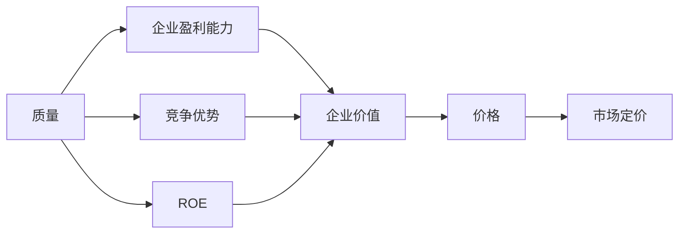
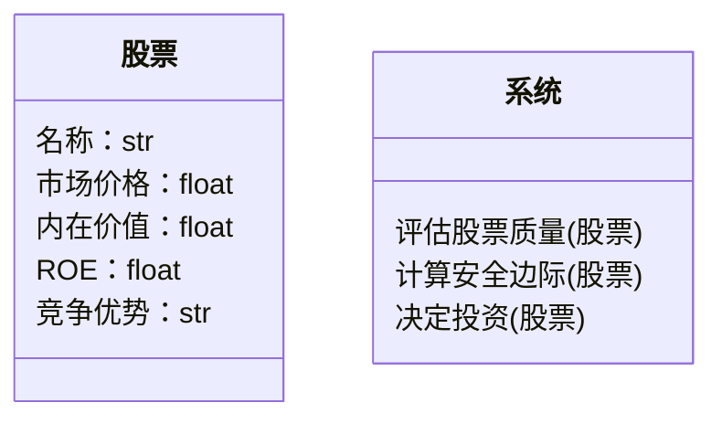
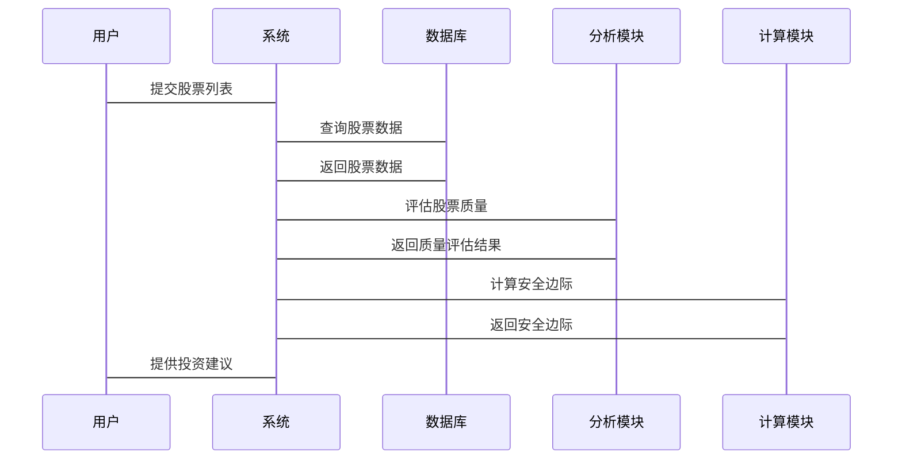

                 


# 价值投资中的质量vs价格：巴菲特的演变

## 关键词：价值投资，巴菲特，质量，价格，投资策略，演变

## 摘要：  
价值投资是投资领域的重要策略，而质量与价格是其核心要素。本文通过分析巴菲特的投资理念演变，探讨质量与价格在价值投资中的重要性，并结合实际案例，深入剖析其内在关系与实际应用。

---

# 第一章：引言

## 1.1 价值投资的重要性

### 1.1.1 价值投资的基本概念  
价值投资是一种以内在价值为导向的投资策略，强调购买价格低于其内在价值的资产。其核心在于识别市场低估的优质资产。

### 1.1.2 巴菲特的投资理念  
巴菲特是价值投资的代表人物，他强调企业质量、长期价值和安全边际。

### 1.1.3 质量与价格的关系  
质量是内在价值的基础，价格是市场对质量的反映，两者共同决定投资价值。

## 1.2 巴菲特投资理念的演变  
巴菲特的投资策略从早期的“烟屁股”策略，到中期的注重企业质量，再到后期的长期价值投资，逐步演变。

## 1.3 本书的目的与结构  
本书旨在分析巴菲特如何通过质量与价格的结合实现投资成功，并提供实际案例和系统方法。

---

# 第二章：价值投资的背景与基础

## 2.1 价值投资的起源与发展  

### 2.1.1 价值投资的起源  
价值投资起源于20世纪初，格雷厄姆和多德是其创始人。

### 2.1.2 价值投资的发展历程  
从早期的低市盈率策略到现代的多因素模型，价值投资不断发展。

### 2.1.3 价值投资的核心思想  
价值投资的核心是寻找市场低估的优质资产。

## 2.2 巴菲特的投资理念演变  

### 2.2.1 巴菲特早期的投资策略  
早期巴菲特注重低估值的股票，关注市净率和市盈率。

### 2.2.2 巴菲特中期的投资策略  
中期注重企业质量和竞争优势，关注ROE和护城河。

### 2.2.3 巴菲特后期的投资策略  
后期注重长期价值和企业基本面，关注现金流和持续盈利能力。

## 2.3 质量与价格的定义与区别  

### 2.3.1 质量的定义与特征  
质量指企业的内在价值，包括ROE、现金流、竞争优势等。

### 2.3.2 价格的定义与特征  
价格指市场对资产的定价，包括市盈率、市净率等指标。

### 2.3.3 质量与价格的关系  
质量是内在价值的基础，价格是市场对质量的反映。

---

# 第三章：质量与价格的核心概念

## 3.1 质量与价格的内在联系  

### 3.1.1 质量与价格的定义对比  
质量是内在价值，价格是市场定价。

### 3.1.2 质量与价格的属性对比  
质量注重长期价值，价格注重短期波动。

### 3.1.3 质量与价格的关系分析  
质量决定长期价格走势，价格反映市场对质量的判断。

## 3.2 质量与价格的实体关系图  



---

# 第四章：质量与价格的算法原理

## 4.1 巴菲特投资策略的算法模型  


### 4.1.1 巴菲特投资策略的代码实现  

```python
def buffett_strategy(stock):
    quality = evaluate_quality(stock)
    price = get_market_price(stock)
    margin_of_safety = calculate_margin(quality, price)
    return invest if margin_of_safety > 0 else hold
```

### 4.1.2 质量评估的数学模型  

$$ \text{内在价值} = \sum_{t=1}^{n} \frac{\text{现金流}_t}{(1 + r)^t} $$

### 4.1.3 价格评估的数学模型  

$$ \text{安全边际} = \text{内在价值} - \text{市场价格} $$

---

# 第五章：系统分析与架构设计

## 5.1 投资决策系统的项目介绍  

### 5.1.1 项目目标  
开发一个基于巴菲特理念的自动化投资决策系统。

### 5.1.2 项目范围  
涵盖股票筛选、质量评估、价格分析和投资决策。

## 5.2 系统功能设计  

### 5.2.1 领域模型  



### 5.2.2 系统架构  


### 5.2.3 接口设计  
- 输入接口：股票数据接口
- 输出接口：投资建议接口

### 5.2.4 交互序列图  



---

# 第六章：项目实战

## 6.1 环境安装  

### 6.1.1 安装Python  
安装Python 3.8及以上版本。

### 6.1.2 安装依赖库  
安装pandas、numpy、matplotlib。

## 6.2 核心代码实现  

### 6.2.1 质量评估函数  

```python
def evaluate_quality(stock):
    roe = stock.ROE
    cash_flow = stock.cash_flow
    moat = stock.competitive_advantage
    return (roe > 15) and (cash_flow > 0) and (moat == "宽")
```

### 6.2.2 价格分析函数  

```python
def calculate_margin(stock):
    intrinsic_value = stock.intrinsic_value
    market_price = stock.price
    return intrinsic_value - market_price
```

### 6.2.3 投资决策函数  

```python
def make_investment_decision(stock):
    margin = calculate_margin(stock)
    if margin > 0:
        return "买入"
    elif margin == 0:
        return "持有"
    else:
        return "卖出"
```

## 6.3 代码应用与解读  

### 6.3.1 代码解读  
通过质量评估和价格分析，计算安全边际，做出投资决策。

## 6.4 案例分析  

### 6.4.1 股票案例  
以苹果公司为例，分析其质量和价格。

## 6.5 项目小结  
通过实战项目，验证巴菲特理念的有效性。

---

# 第七章：总结与展望

## 7.1 本书总结  
总结巴菲特投资理念的演变，强调质量与价格的重要性。

## 7.2 巴菲特投资理念的演变总结  
从早期的低估值策略到后期的长期价值投资，巴菲特的理念不断完善。

## 7.3 未来展望  
未来，价值投资将更加注重质量和价格的动态关系，结合人工智能技术，进一步优化投资决策。

---

# 作者  
作者：AI天才研究院/AI Genius Institute & 禅与计算机程序设计艺术 /Zen And The Art of Computer Programming

---

希望这篇文章能满足您的需求！

