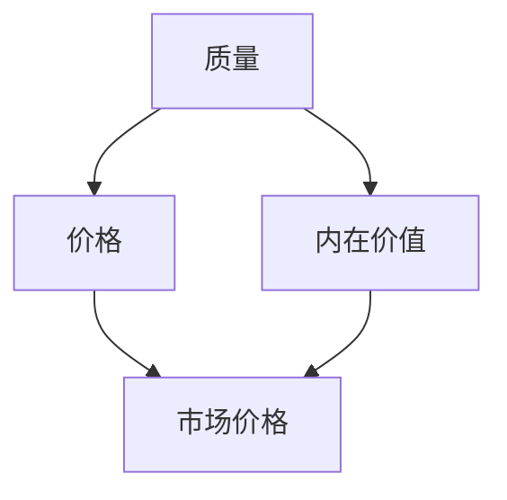

                 

# 价值投资中的质量与价格平衡

**关键词**：价值投资、质量、价格、内在价值、DCF模型、基本面分析、投资策略

**摘要**：  
本文探讨了价值投资中质量与价格的平衡问题。通过分析质量和价格的定义、关系及评估方法，结合经典数学模型如DCF模型，详细阐述了如何在投资决策中实现质量和价格的平衡。文章从理论基础到实际应用，结合案例分析，为投资者提供了系统的指导和实践建议。

---

## 第1章: 价值投资的背景与发展

### 1.1 价值投资的起源与发展

#### 1.1.1 格雷厄姆与巴菲特的理论基础
格雷厄姆的价值投资理念奠定了现代价值投资的基础，强调以低于内在价值的价格买入优质资产。巴菲特继承并发展了这一理念，强调长期投资和对公司的深入研究。

#### 1.1.2 价值投资的核心理念
价值投资的核心在于寻找市场低估的公司，通过分析公司的基本面，评估其内在价值，并在价格合理时进行投资。

#### 1.1.3 价值投资在现代金融中的地位
尽管现代金融学引入了复杂的风险定价模型，但价值投资依然在长期投资中占据重要地位，尤其在市场波动和不确定性中表现突出。

### 1.2 质量与价格平衡的重要性

#### 1.2.1 质量与价格的定义
- **质量**：指公司的基本面，包括盈利能力、财务状况、行业地位和竞争优势。
- **价格**：指股票的市场估值，通常通过市盈率、市净率等指标衡量。

#### 1.2.2 质量与价格的相互关系
高质量的公司通常具有较高的内在价值，但市场价格可能因市场情绪波动而偏离其真实价值。寻找质量与价格的平衡点，即找到价格低于内在价值的高质量公司。

#### 1.2.3 质量与价格平衡的必要性
在投资中，仅关注价格可能导致短期亏损，而忽视质量则可能面临长期风险。平衡两者有助于降低风险，提高投资回报。

### 1.3 价值投资的基本原则

#### 1.3.1 质量优先原则
优先选择具有强大竞争优势、稳定盈利和良好财务状况的公司，确保投资的安全性。

#### 1.3.2 价格合理原则
以低于公司内在价值的价格买入，避免支付过高的溢价，降低投资风险。

#### 1.3.3 长期投资原则
价值投资强调长期持有，避免频繁交易，以时间摊薄短期波动风险，实现资产增值。

### 1.4 价值投资的边界与外延

#### 1.4.1 价值投资的适用范围
适用于对公司基本面有深入研究且具备长期投资能力的投资者，尤其适合寻找稳定收益的长线投资者。

#### 1.4.2 价值投资与其他投资策略的区别
与技术分析和短期交易不同，价值投资强调对公司内在价值的深入分析和长期持有，注重基本面而非短期波动。

---

## 第2章: 质量与价格的评估与平衡

### 2.1 质量评估的核心指标

#### 2.1.1 盈利能力分析
- **净利润率**：衡量公司盈利效率。
- **ROE（净资产收益率）**：反映公司使用股东资金的效率。
- **ROA（资产回报率）**：衡量资产的使用效率。

#### 2.1.2 财务健康状况
- **负债率**：衡量公司的财务杠杆风险。
- **现金流**：反映公司的盈利能力和流动性。

#### 2.1.3 行业地位与竞争优势
- **市场占有率**：行业龙头通常更具竞争优势。
- **品牌价值**：强大的品牌有助于公司在行业中占据优势。

### 2.2 价格评估的数学模型

#### 2.2.1 DCF模型
DCF（Discounted Cash Flow）模型用于估算公司的内在价值，公式如下：

$$
\text{内在价值} = \sum_{t=1}^{n} \frac{\text{现金流}}{(1 + r)^t} + \frac{\text{终值}}{(1 + r)^n}
$$

其中，\( r \) 是折现率，通常采用无风险利率加风险溢价。

#### 2.2.2 市盈率与市净率
- **市盈率（P/E）**：股价除以每股收益，公式为 \( \text{P/E} = \frac{\text{股价}}{\text{每股收益}} \)。
- **市净率（P/B）**：股价除以每股净资产，公式为 \( \text{P/B} = \frac{\text{股价}}{\text{每股净资产}} \)。

#### 2.2.3 市盈率与ROE的关系
研究表明，高质量的公司通常具有较低的P/E和较高的ROE，形成有效的质量与价格平衡。

### 2.3 质量与价格的平衡点

#### 2.3.1 质量与价格的对比表格
| 指标 | 定义 | 重要性 |
|------|------|--------|
| 质量 | 公司基本面 | 高质量公司具有长期竞争优势 |
| 价格 | 市场估值 | 合理价格应低于内在价值 |

#### 2.3.2 质量与价格的关系图

---

## 第3章: 价值投资的系统架构与实施策略

### 3.1 投资决策系统架构

#### 3.1.1 系统模块划分
- 数据采集模块：收集公司财务数据和市场数据。
- 分析模块：计算内在价值和市场价格。
- 决策模块：判断是否满足质量与价格平衡条件。

#### 3.1.2 模块功能描述
- 数据采集：从财务报表中提取关键指标。
- 分析模块：运用DCF模型计算内在价值。
- 决策模块：比较市场价格与内在价值，决定是否投资。

#### 3.1.3 系统架构图

### 3.2 投资策略的实施步骤

#### 3.2.1 确定投资目标
明确投资目标，如追求长期资本增值，选择合适的行业和公司。

#### 3.2.2 数据收集与分析
收集目标公司的财务数据，计算关键指标，如ROE、P/E、P/B等。

#### 3.2.3 评估内在价值
使用DCF模型计算公司内在价值，判断市场价格是否低于内在价值。

#### 3.2.4 投资决策
根据分析结果，决定是否投资，调整投资组合。

### 3.3 投资组合管理

#### 3.3.1 资产配置
根据市场情况调整资产配置，分散投资风险。

#### 3.3.2 定期复评
定期评估投资组合，重新计算内在价值，确保价格合理。

#### 3.3.3 风险管理
设定止损点，避免重大损失，保持投资纪律。

---

## 第4章: 实战案例分析

### 4.1 案例背景
以苹果公司为例，分析其质量和价格的平衡。

### 4.2 数据分析
计算苹果的ROE、P/E、P/B等指标，评估其质量和价格。

### 4.3 内在价值计算
使用DCF模型估算苹果的内在价值，比较其与市场价格的差异。

### 4.4 投资决策
根据分析结果，判断是否投资苹果公司。

### 4.5 代码实现
使用Python代码实现DCF模型的计算，展示内在价值的估算过程。

---

## 第5章: 价值投资的心理与行为因素

### 5.1 投资者心理偏差
常见偏差包括过度自信、从众心理和损失厌恶，影响投资决策。

### 5.2 行为金融学的影响
投资者情绪波动可能导致市场价格偏离内在价值，需克服情绪影响。

### 5.3 纪律与耐心的重要性
坚持价值投资原则，避免短期波动干扰，保持长期投资纪律。

---

## 第6章: 价值投资的未来趋势

### 6.1 数字化与智能化
技术进步推动投资分析的自动化和智能化，提高评估效率。

### 6.2 ESG投资的兴起
环境、社会和治理因素成为新的质量评估维度，影响投资决策。

### 6.3 全球化与多元化
全球化背景下，投资者需关注全球市场，分散投资风险。

---

## 第7章: 总结与展望

### 7.1 总结
质量与价格的平衡是价值投资的核心，需结合基本面分析和市场估值，选择优质低估的公司。

### 7.2 展望
随着技术进步和市场变化，价值投资需不断创新和适应，抓住新的投资机会。

---

## 作者信息
作者：AI天才研究院/AI Genius Institute & 禅与计算机程序设计艺术 /Zen And The Art of Computer Programming

