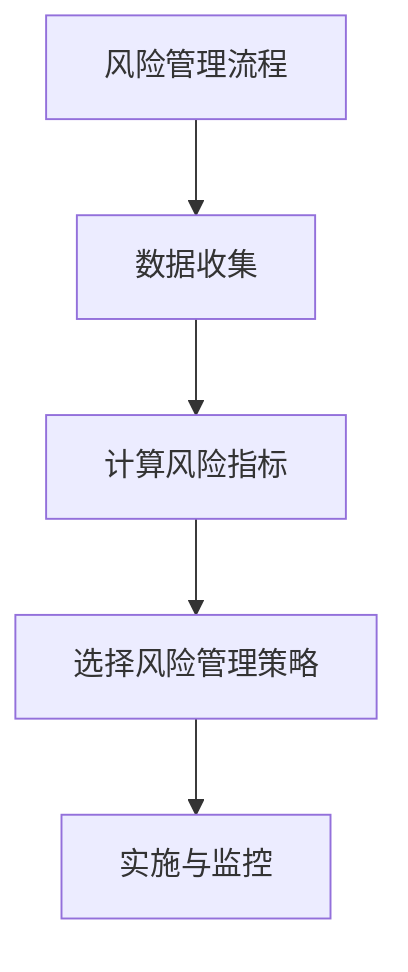
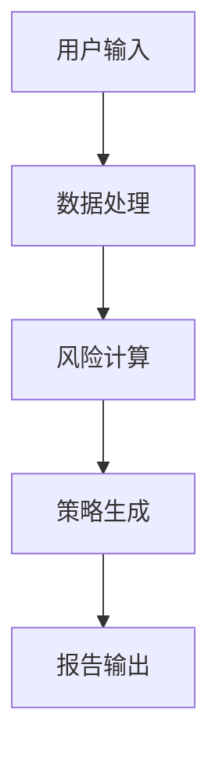

                 


# 价值投资中的风险管理策略

## 关键词：价值投资、风险管理、风险度量、夏普比率、VaR、投资组合

## 摘要：  
价值投资是一种以基本面分析为核心的长期投资策略，其成功与否在很大程度上取决于对风险的有效管理。本文从风险管理的核心概念入手，详细探讨了在价值投资中如何通过数学模型、系统架构设计和实际案例分析来实现有效的风险管理。文章不仅介绍了风险管理的基本原理，还通过具体的算法流程图和系统架构图，展示了如何将风险管理理论应用于实际投资决策中。通过本文的分析，读者可以更好地理解如何在价值投资中构建稳健的投资组合，控制风险，实现长期稳健的收益。

---

# 第一部分: 价值投资与风险管理基础

## 第1章: 价值投资与风险管理概述

### 1.1 价值投资的核心理念

#### 1.1.1 价值投资的定义与起源
价值投资是一种以分析企业的内在价值为基础，寻找市场价格低于内在价值的投资标的的投资方法。它起源于20世纪初，由本杰明·格雷厄姆和戴维·多德等投资者发展完善。价值投资的核心理念是寻找市场先生的错误定价，通过长期持有优质资产来实现收益。

#### 1.1.2 价值投资的基本原则
- **安全边际**：买入价格低于内在价值，以提供足够的安全空间。
- **长期视角**：关注企业的长期盈利能力，而非短期价格波动。
- **逆向思维**：在市场恐慌时寻找机会，在市场狂热时保持冷静。

#### 1.1.3 价值投资与风险管理的关系
风险管理是价值投资成功的关键因素之一。即使选择了一个优秀的投资标的，如果未能有效管理风险，也可能因为市场的波动或个人的决策失误而导致重大损失。因此，风险管理不仅是对收益的保护，更是对投资理念的贯彻。

---

### 1.2 风险管理的核心概念

#### 1.2.1 风险的定义与分类
风险是指在投资过程中，由于不确定因素的存在，投资收益可能偏离预期值的可能性。常见的风险类型包括：
- **系统性风险**：影响整个市场的风险，如经济衰退、通货膨胀等。
- **非系统性风险**：特定于某个资产或行业的风险，如公司违约风险。
- **流动性风险**：资产难以快速变现的风险。

#### 1.2.2 风险管理的目标与流程
- **目标**：通过识别、评估和控制风险，降低投资组合的波动性，实现长期稳健的收益。
- **流程**：
  1. **识别风险**：分析投资标的可能面临的风险因素。
  2. **评估风险**：量化风险的影响程度。
  3. **制定策略**：根据风险特征制定相应的管理策略。
  4. **监控与调整**：持续跟踪风险变化，及时调整策略。

#### 1.2.3 风险与收益的平衡
在价值投资中，风险与收益是密不可分的。高收益通常伴随着高风险，而稳健的收益则需要在风险控制上下功夫。通过合理的风险分散和管理，投资者可以在追求收益的同时，降低风险的负面影响。

---

### 1.3 价值投资中的风险管理特点

#### 1.3.1 价值投资中的风险类型
在价值投资中，风险主要集中在以下几个方面：
- **估值风险**：市场对标的估值可能高于其内在价值，导致短期亏损。
- **流动性风险**：在市场低迷时，优质资产可能难以变现。
- **市场风险**：整体市场波动可能影响投资标的的价格。

#### 1.3.2 风险偏好与投资策略
投资者的风险偏好决定了其投资策略的选择。价值投资者通常偏好低风险、高安全边际的投资标的，通过长期持有来实现收益。

#### 1.3.3 风险管理在价值投资中的重要性
有效的风险管理能够帮助投资者在市场波动中保持冷静，避免因情绪化决策而导致的重大损失。同时，通过合理的风险控制，投资者可以更好地实现资产的长期增值。

---

### 1.4 本章小结
价值投资的核心在于寻找被市场低估的优质资产，而风险管理则是确保投资成功的关键。通过理解风险管理的核心概念和在价值投资中的具体应用，投资者可以在复杂多变的市场环境中，实现稳健的收益。

---

# 第二部分: 风险管理的数学模型与算法

## 第2章: 风险管理的数学模型

### 2.1 风险度量的常用指标

#### 2.1.1 方差与标准差
方差和标准差是衡量资产收益波动性的指标。方差表示收益与期望值的偏离程度，标准差则是方差的平方根，具有更直观的解释性。

$$\text{方差} = \sigma^2 = \frac{1}{N}\sum_{i=1}^{N}(x_i - \mu)^2$$

$$\text{标准差} = \sigma = \sqrt{\frac{1}{N}\sum_{i=1}^{N}(x_i - \mu)^2}$$

#### 2.1.2 VaR（Value at Risk）
VaR是指在一定置信水平下，投资组合可能遭受的最大损失。例如，在95%的置信水平下，VaR表示在95%的概率下，投资组合的最大损失。

$$VaR = \mu + z \cdot \sigma$$

其中，$\mu$是资产的平均收益，$\sigma$是标准差，$z$是对应于置信水平的正态分布分位数。

#### 2.1.3 CVaR（Conditional Value at Risk）
CVaR是VaR的扩展，表示在VaR水平上的平均损失。CVaR比VaR更能反映尾部风险。

$$CVaR = \frac{1}{1 - \alpha}\int_{\alpha}^{1} x f(x) dx$$

其中，$\alpha$是置信水平，$f(x)$是收益的概率密度函数。

---

### 2.2 风险调整后的收益模型

#### 2.2.1 夏普比率
夏普比率衡量的是单位风险下的超额收益。

$$\text{夏普比率} = \frac{\mu_p - \mu_f}{\sigma_p}$$

其中，$\mu_p$是投资组合的平均收益，$\mu_f$是无风险利率，$\sigma_p$是投资组合的标准差。

#### 2.2.2 特雷诺比率
特雷诺比率是另一种风险调整后收益指标，基于CAPM模型。

$$\text{特雷诺比率} = \frac{(\mu_p - \mu_f)}{\sqrt{\beta^2 \sigma_m^2}}$$

其中，$\beta$是投资组合的贝塔系数，$\sigma_m$是市场收益的标准差。

#### 2.2.3 理论风险调整后收益模型
通过夏普比率和特雷诺比率，投资者可以更好地比较不同投资组合的风险调整后收益，从而做出更明智的投资决策。

---

### 2.3 算法流程图

#### 2.3.1 风险管理流程图


---

### 2.4 本章小结
通过数学模型和算法，投资者可以更科学地量化和管理风险。夏普比率和VaR等指标为风险管理提供了有力工具，而算法流程图则帮助投资者清晰地理解风险管理的步骤和逻辑。

---

# 第三部分: 系统分析与架构设计

## 第3章: 风险管理系统分析

### 3.1 风险管理系统的构成

#### 3.1.1 数据层
数据层包括市场数据、资产数据和交易数据的收集与存储。

#### 3.1.2 计算层
计算层负责对数据进行处理，计算风险指标如VaR、夏普比率等。

#### 3.1.3 策略层
策略层根据计算结果制定风险管理策略，如调整投资组合权重、设定止损线等。

---

### 3.2 系统架构设计

#### 3.2.1 分层架构
分层架构将系统划分为数据层、计算层和策略层，确保各部分独立且易于维护。

#### 3.2.2 模块化设计
模块化设计使得系统功能清晰，每个模块专注于特定任务，如数据处理、风险计算等。

#### 3.2.3 高可用性设计
通过分布式计算和冗余设计，确保系统在高负载和故障情况下的稳定运行。

---

### 3.3 系统接口与交互

#### 3.3.1 数据接口
数据接口负责与外部数据源（如金融数据API）的交互，获取市场数据和资产信息。

#### 3.3.2 用户界面
用户界面为投资者提供直观的操作界面，显示风险指标和管理策略建议。

#### 3.3.3 报告生成
系统生成风险报告，帮助投资者了解当前投资组合的风险状况。

---

### 3.4 系统流程图

#### 3.4.1 系统流程图


---

### 3.5 本章小结
通过系统架构设计，投资者可以构建一个高效、可靠的管理系统，实时监控和管理投资组合的风险，确保投资策略的稳健实施。

---

# 第四部分: 项目实战与案例分析

## 第4章: 风险管理策略的实战应用

### 4.1 项目环境与工具安装

#### 4.1.1 环境配置
安装必要的开发工具，如Python、Jupyter Notebook和数据可视化库（如Matplotlib、Seaborn）。

#### 4.1.2 数据来源
使用金融数据API（如Yahoo Finance）获取市场数据和资产信息。

---

### 4.2 核心算法实现

#### 4.2.1 夏普比率计算
编写Python代码计算投资组合的夏普比率。

```python
import numpy as np

def sharpe_ratio(returns, risk_free_rate):
    excess_returns = returns - risk_free_rate
    return np.mean(excess_returns) / np.std(excess_returns)

# 示例数据
returns = np.array([0.05, 0.03, 0.07, 0.01, 0.04])
risk_free_rate = 0.01

print("夏普比率:", sharpe_ratio(returns, risk_free_rate))
```

---

### 4.3 案例分析

#### 4.3.1 案例背景
假设我们有一个包含5只股票的投资组合，我们需要计算其风险指标，并制定相应的风险管理策略。

#### 4.3.2 数据处理与分析
收集每只股票的历史价格数据，计算收益率和风险指标。

#### 4.3.3 策略制定
根据计算结果，调整投资组合的权重，分散风险。

#### 4.3.4 监控与调整
定期监控投资组合的风险指标，根据市场变化及时调整。

---

### 4.4 本章小结
通过实际案例分析，投资者可以更好地理解如何将风险管理理论应用于实际投资中。通过编程实现夏普比率等指标的计算，可以帮助投资者更科学地评估和管理风险。

---

# 第五部分: 总结与最佳实践

## 第5章: 总结与最佳实践

### 5.1 价值投资中的风险管理总结
风险管理是价值投资成功的关键，通过科学的数学模型和系统的架构设计，投资者可以更好地控制风险，实现长期稳健的收益。

### 5.2 最佳实践Tips
- **分散投资**：通过分散投资降低非系统性风险。
- **定期评估**：定期评估投资组合的风险指标，及时调整策略。
- **避免情绪化决策**：在市场波动中保持冷静，避免因情绪化决策导致重大损失。

### 5.3 未来展望
随着人工智能和大数据技术的发展，风险管理将更加精准和高效。投资者可以通过更多的数据和算法，进一步优化风险管理系统，提升投资决策的科学性。

---

# 作者：AI天才研究院/AI Genius Institute & 禅与计算机程序设计艺术 /Zen And The Art of Computer Programming

---

以上是《价值投资中的风险管理策略》的完整目录和内容概要。通过系统的分析和实战案例，读者可以全面理解价值投资中的风险管理策略，并能够在实际投资中灵活运用这些方法，实现稳健的收益。

