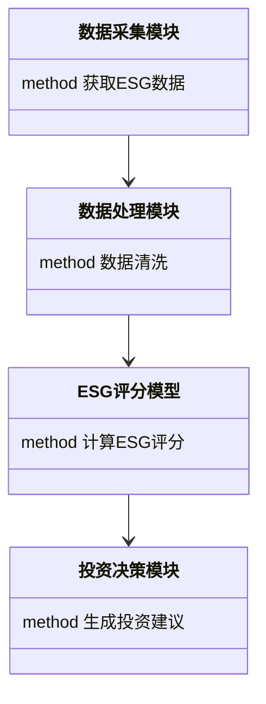

                 


# 价值投资在ESG（环境、社会和治理）框架下的演变

## 关键词：价值投资，ESG，环境，社会，治理，可持续发展，投资策略

## 摘要：  
本文探讨了价值投资在ESG（环境、社会和治理）框架下的演变，分析了ESG与价值投资的结合及其对投资策略的影响。文章从ESG的定义、核心要素及其对价值投资的启示入手，结合数学模型和系统设计，详细阐述了ESG评分模型的构建与实现，最后通过实际案例展示了如何在实际投资中应用ESG框架。本文旨在为投资者提供一种新的视角，帮助他们在可持续发展的背景下做出更明智的投资决策。

---

# 第一部分：价值投资与ESG框架的背景介绍

## 第1章：ESG的起源与发展

### 1.1 ESG的定义与核心概念  
ESG（环境、社会和治理）是一种评估企业可持续发展能力的框架，涵盖企业在环境、社会和治理方面的表现。环境（E）关注企业的资源利用和碳排放；社会（S）关注企业的社会责任和员工权益；治理（G）关注企业的治理结构和透明度。

#### 1.1.1 ESG的起源与演变  
ESG的起源可以追溯到20世纪60年代的环保运动和70年代的股东 activism。随着全球对可持续发展的关注增加，ESG投资逐渐从 niche市场成为主流。  

#### 1.1.2 ESG的核心要素与特征  
ESG的核心要素包括：  
- **环境（E）**：关注企业的碳排放、资源利用效率和可持续发展能力。  
- **社会（S）**：关注企业的社会责任、员工权益和社区参与。  
- **治理（G）**：关注企业的治理结构、透明度和高管薪酬。  

ESG的特征包括：数据驱动、透明度高、动态调整。  

#### 1.1.3 ESG与可持续发展的关系  
ESG是实现可持续发展的重要工具，通过关注企业的长期价值，推动社会和环境的可持续发展。  

---

## 第2章：价值投资与ESG的结合  

### 2.1 价值投资的定义与特点  
价值投资是一种长期投资策略，强调投资于被市场低估的优质企业。其核心是寻找具有持续竞争优势和良好治理结构的企业。  

#### 2.1.1 价值投资的基本原理  
价值投资的基本原理包括：  
1. 市场价格与内在价值的差异。  
2. 企业基本面分析，包括财务状况、盈利能力和发展潜力。  
3. 长期持有，避免频繁交易。  

#### 2.1.2 价值投资的核心要素  
价值投资的核心要素包括：  
- 企业盈利能力。  
- 财务健康状况。  
- 竞争优势。  

#### 2.1.3 价值投资与ESG的联系  
ESG因素可以作为价值投资的重要补充，帮助投资者识别具有可持续发展能力的企业。  

---

## 第3章：ESG框架下的投资策略  

### 3.1 ESG投资的背景与现状  
随着全球对可持续发展的关注增加，ESG投资逐渐成为主流。机构投资者越来越重视企业的环境、社会和治理表现。  

#### 3.1.1 ESG投资的兴起  
ESG投资的兴起源于全球环保意识的增强和气候变化的威胁。  

#### 3.1.2 ESG投资的全球发展趋势  
ESG投资在全球范围内迅速发展，越来越多的机构投资者将ESG因素纳入投资决策。  

#### 3.1.3 ESG投资的市场影响  
ESG投资推动了企业改进治理结构、减少碳排放和履行社会责任。  

---

# 第二部分：ESG框架的核心概念与联系

## 第4章：ESG框架的核心要素分析  

### 4.1 环境（E）要素  

#### 4.1.1 环境要素的定义与属性  
环境要素关注企业的资源利用和碳排放。  

#### 4.1.2 环境要素的特征对比  
环境要素的特征包括：  
- 数据可量化的。  
- 长期影响显著。  

#### 4.1.3 环境要素的ER实体关系图  
```mermaid
erd
    entity 环境要素 {
        key: 碳排放
        attribute: 排放量, 排放强度
    }
```

### 4.2 社会（S）要素  

#### 4.2.1 社会要素的定义与属性  
社会要素关注企业的社会责任和员工权益。  

#### 4.2.2 社会要素的特征对比  
社会要素的特征包括：  
- 数据难以量化。  
- 短期影响较小，长期影响显著。  

#### 4.2.3 社会要素的ER实体关系图  
```mermaid
erd
    entity 社会要素 {
        key: 员工满意度
        attribute: 社会责任指数, 员工福利
    }
```

### 4.3 治理（G）要素  

#### 4.3.1 治理要素的定义与属性  
治理要素关注企业的治理结构和透明度。  

#### 4.3.2 治理要素的特征对比  
治理要素的特征包括：  
- 数据相对容易量化。  
- 对企业价值的影响显著。  

#### 4.3.3 治理要素的ER实体关系图  
```mermaid
erd
    entity 治理要素 {
        key: 股东权益
        attribute: 股东透明度, 高管薪酬
    }
```

---

## 第5章：价值投资与ESG框架的联系  

### 5.1 ESG框架对价值投资的影响  

#### 5.1.1 ESG框架如何影响投资决策  
ESG框架通过提供企业可持续发展的信息，帮助投资者识别具有长期价值的企业。  

#### 5.1.2 ESG框架对投资风险的评估  
ESG框架可以帮助投资者评估企业面临的环境和社会风险。  

#### 5.1.3 ESG框架对投资收益的潜在影响  
研究表明，ESG表现良好的企业往往具有更高的长期收益。  

### 5.2 价值投资与ESG框架的对比分析  

#### 5.2.1 价值投资与ESG框架的异同点  
- 相同点：都关注企业的长期价值。  
- 不同点：价值投资更关注财务指标，而ESG框架更关注非财务指标。  

#### 5.2.2 价值投资在ESG框架下的演变  
价值投资逐渐将ESG因素纳入考量，形成了新的投资策略。  

#### 5.2.3 价值投资与ESG框架的协同发展  
价值投资与ESG框架的结合可以提高投资的可持续性和长期收益。  

---

# 第三部分：ESG框架下的数学模型与算法原理

## 第6章：ESG评分模型的构建  

### 6.1 ESG评分模型的定义与目标  
ESG评分模型旨在量化企业的环境、社会和治理表现。  

#### 6.1.1 模型的输入与输出  
- 输入：企业的ESG相关数据。  
- 输出：企业的ESG评分。  

#### 6.1.2 模型的目标函数与约束条件  
目标函数：最大化评分的准确性。  
约束条件：数据可得性、评分范围等。  

#### 6.1.3 模型的评估指标与标准  
评估指标包括：准确率、召回率、F1分数。  

### 6.2 ESG评分模型的数学公式  

#### 6.2.1 数据预处理与特征提取  
数据预处理包括：清洗、标准化、缺失值处理。  

#### 6.2.2 模型的数学表达式  
$$ ESG\_score = \alpha E + \beta S + \gamma G $$  
其中，$\alpha, \beta, \gamma$是权重系数。  

---

## 第7章：ESG评分模型的实现与应用  

### 7.1 模型实现的步骤与流程  

#### 7.1.1 数据收集与清洗  
使用MSCI的ESG数据，清洗异常值。  

#### 7.1.2 特征工程与模型训练  
选择逻辑回归或随机森林进行训练。  

#### 7.1.3 模型评估与优化  
通过交叉验证优化模型参数。  

### 7.2 模型的代码实现  

```python
import pandas as pd
from sklearn.model_selection import train_test_split
from sklearn.linear_model import LogisticRegression

# 数据加载与清洗
df = pd.read_csv('esg_data.csv')
df = df.dropna()

# 特征工程
features = ['E', 'S', 'G']
target = 'ESG_score'

# 数据分割
X_train, X_test, y_train, y_test = train_test_split(df[features], df[target], test_size=0.2)

# 模型训练
model = LogisticRegression()
model.fit(X_train, y_train)

# 模型评估
score = model.score(X_test, y_test)
print(f'模型准确率：{score}')
```

---

# 第四部分：系统分析与架构设计方案

## 第8章：系统功能设计与架构  

### 8.1 项目介绍  
构建一个基于ESG框架的投资分析系统，帮助投资者评估企业的可持续发展能力。  

### 8.2 系统功能设计  

#### 8.2.1 领域模型（Mermaid类图）  


---

## 第9章：系统架构设计  

### 9.1 系统架构（Mermaid架构图）  


---

## 第10章：项目实战与案例分析  

### 10.1 环境安装与配置  
安装Python和相关库（pandas, scikit-learn）。  

### 10.2 核心代码实现与解读  
实现ESG评分模型，解读代码逻辑。  

### 10.3 实际案例分析  
分析某科技公司的ESG表现，生成投资建议。  

---

## 第11章：最佳实践与总结  

### 11.1 最佳实践 tips  
- 定期更新ESG数据。  
- 组合使用多种模型。  

### 11.2 小结  
价值投资在ESG框架下的演变，为投资者提供了新的视角和工具。  

### 11.3 注意事项  
- 数据质量影响模型准确性。  
- 模型需定期更新。  

### 11.4 拓展阅读  
推荐阅读《ESG投资指南》和《价值投资实战》。  

---

# 作者：AI天才研究院 & 禅与计算机程序设计艺术  
# 禅与计算机程序设计艺术，专注人工智能与编程艺术的结合，探索技术的本质与美。

