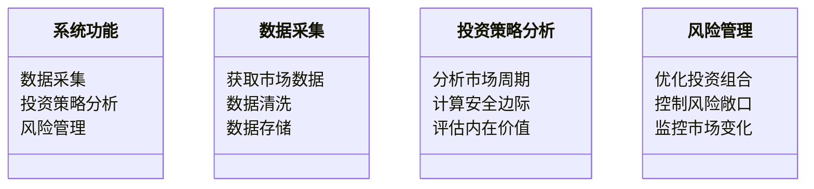
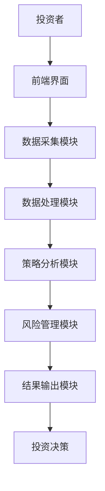
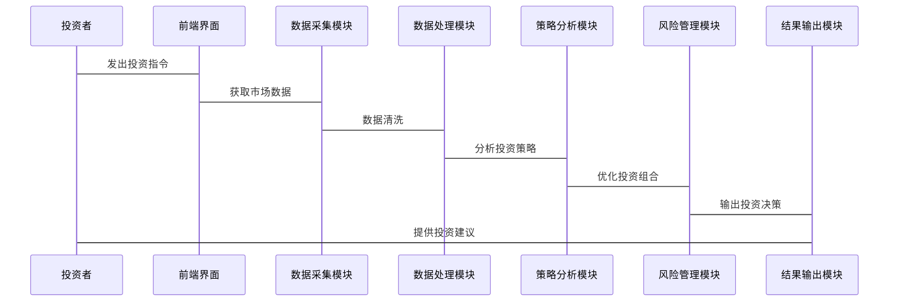

                 


# 《价值投资在不同市场条件下的适应性策略》

---

## 关键词：价值投资、市场适应性、风险管理、资产配置、投资策略、系统架构

---

## 摘要：本文深入探讨了价值投资在不同市场条件下的适应性策略，分析了市场周期对投资策略的影响，并提出了风险管理与资产配置的最佳实践。文章结合理论与实战，通过系统分析和项目案例，展示了如何在不同市场环境中优化价值投资策略。

---

## 第1章: 价值投资的背景与核心理念

### 1.1 价值投资的定义与起源

价值投资是一种长期投资策略，强调通过分析企业的基本面，寻找市场低估的股票进行投资。该理念由本杰明·格雷厄姆和戴维·多德提出，强调安全边际和内在价值。

- **1.1.1 价值投资的起源与发展**
  - 格雷厄姆与多德的价值投资理论奠定了基础。
  - 巴菲特等投资者将价值投资理念发扬光大。

- **1.1.2 格雷厄姆与巴菲特的价值投资理念**
  - 格雷厄姆：寻找安全边际，注重低市盈率和低市净率。
  - 巴菲特：长期持有优质企业，注重企业的竞争优势和管理层。

- **1.1.3 价值投资的核心原则**
  - 买入低于内在价值的股票。
  - 长期持有，避免频繁交易。
  - 重视安全边际，降低投资风险。

### 1.2 市场条件对投资策略的影响

- **1.2.1 市场周期的定义与分类**
  - 牛市：市场情绪乐观，股价可能被高估。
  - 熊市：市场情绪悲观，股价可能被低估。
  - 震荡市：市场波动较大，不确定性增加。

- **1.2.2 不同市场条件下投资策略的调整**
  - 牛市：谨慎投资，避免高估股票，选择优质企业。
  - 熊市：积极寻找低估股票，增加仓位。
  - 震荡市：调整仓位，注重风险管理。

- **1.2.3 价值投资在不同市场环境中的适用性**
  - 价值投资在熊市中更具优势，但在牛市中需要调整策略，避免过度乐观。

### 1.3 价值投资的适应性策略

- **1.3.1 适应性策略的核心概念**
  - 根据市场条件调整投资策略，保持灵活性。

- **1.3.2 不同市场条件下策略的差异性**
  - 牛市：减少投资频率，注重优质企业。
  - 熊市：增加投资频率，寻找低估股票。

- **1.3.3 适应性策略的实施步骤**
  1. 分析市场环境，判断当前市场周期。
  2. 根据市场周期调整投资策略。
  3. 定期评估策略效果，进行必要的调整。

---

## 第2章: 价值投资的理论基础

### 2.1 格雷厄姆的价值投资

- **2.1.1 格雷厄姆的投资理念**
  - 强调安全边际和内在价值。
  - 选择低市盈率和低市净率的股票。

- **2.1.2 安全边际的概念**
  - 安全边际=内在价值-市场价格。
  - 安全边际越大，投资风险越小。

- **2.1.3 内在价值的评估方法**
  - 股息率：股息/股价。
  - 市盈率：股价/每股收益。
  - 市净率：股价/每股净资产。

- **2.1.4 格雷厄姆的数学模型**
  - 内在价值计算公式：
    $$内在价值 = \frac{股息}{(贴现率 - 增长率)}$$
  - 安全边际计算公式：
    $$安全边际 = 内在价值 - 市场价格$$

### 2.2 巴菲特的长期投资策略

- **2.2.1 长期投资的核心原则**
  - 长期持有优质企业。
  - 选择具有强大竞争优势的企业。

- **2.2.2 企业竞争优势的分析**
  - 品牌优势。
  - 技术优势。
  - 成本优势。

- **2.2.3 长期投资的风险管理**
  - 分散投资，降低风险。
  - 定期评估持仓，调整投资组合。

---

## 第3章: 市场周期与投资策略调整

### 3.1 市场周期的分析与应对策略

- **3.1.1 牛市的特征与应对策略**
  - 牛市特征：
    - 市场情绪乐观。
    - 股价被高估。
  - 应对策略：
    - 减少投资频率。
    - 选择优质企业。

- **3.1.2 熊市的特征与应对策略**
  - 熊市特征：
    - 市场情绪悲观。
    - 股价被低估。
  - 应对策略：
    - 增加投资频率。
    - 寻找低估股票。

- **3.1.3 震荡市的特征与应对策略**
  - 震荡市特征：
    - 市场波动较大。
    - 不确定性增加。
  - 应对策略：
    - 调整仓位。
    - 优化投资组合。

### 3.2 不同市场条件下的策略调整

- **3.2.1 牛市中的策略调整**
  - 选择优质企业，避免高估股票。
  - 减少投资频率，控制风险。

- **3.2.2 熊市中的策略调整**
  - 寻找低估股票，增加投资频率。
  - 增加安全边际，降低风险。

- **3.2.3 震荡市中的策略调整**
  - 优化投资组合，分散投资。
  - 调整仓位，灵活应对市场变化。

---

## 第4章: 风险管理与资产配置

### 4.1 风险管理的核心原则

- **4.1.1 风险管理的重要性**
  - 风险管理是投资成功的关键。
  - 有效的风险管理可以降低投资损失。

- **4.1.2 风险管理的实施步骤**
  1. 识别潜在风险。
  2. 评估风险影响。
  3. 制定风险管理策略。
  4. 实施风险管理策略。
  5. 监控风险管理效果。

### 4.2 资产配置的最佳实践

- **4.2.1 资产配置的核心原则**
  - 分散投资，降低风险。
  - 根据市场环境调整资产分配。

- **4.2.2 动态资产配置策略**
  - 根据市场变化调整资产分配。
  - 优化投资组合，提高收益。

- **4.2.3 资产配置的数学模型**
  - 资产配置公式：
    $$资产配置 = \sum_{i=1}^{n} (权重_i \times 资产_i)$$
  - 风险调整后的资产配置：
    $$风险调整后的资产配置 = 资产配置 - 风险敞口$$

---

## 第5章: 系统分析与架构设计

### 5.1 系统功能设计

- **5.1.1 系统功能需求**
  - 数据采集与处理。
  - 投资策略分析。
  - 风险管理与资产配置。

- **5.1.2 系统功能设计类图**



### 5.2 系统架构设计

- **5.2.1 系统架构设计**



### 5.3 接口与交互设计

- **5.3.1 系统接口设计**
  - 数据接口：获取市场数据。
  - 策略接口：分析投资策略。
  - 风险管理接口：优化投资组合。

- **5.3.2 系统交互流程**



---

## 第6章: 项目实战与案例分析

### 6.1 项目实战

- **6.1.1 环境安装**
  - Python环境配置。
  - 数据分析库安装（Pandas、NumPy、Matplotlib）。

- **6.1.2 核心实现**
  - 数据采集：从Yahoo Finance获取数据。
  - 数据处理：清洗和预处理数据。
  - 策略分析：计算内在价值和安全边际。
  - 风险管理：优化投资组合。

### 6.2 核心代码实现

```python
import pandas as pd
import numpy as np

# 数据采集
def get_market_data(ticker):
    data = pd.read_csv(f'https://query1.finance.yahoo.com/ws/...{ticker}.csv')
    return data

# 内在价值计算
def calculate_intrinsic_value(ticker, data):
    growth_rate = 0.05
    discount_rate = 0.10
    dividend = data['Dividends'].mean()
    iv = dividend / (discount_rate - growth_rate)
    return iv

# 安全边际计算
def calculate_margin_of_safety(ticker, iv, price):
    mos = iv - price
    return mos

# 风险管理优化
def optimize_portfolio(portfolio, risk_tolerance):
    # 使用现代投资组优化理论
    return optimized_portfolio
```

### 6.3 案例分析

- **6.3.1 案例分析：牛市中的策略调整**
  - 案例背景：2009年牛市。
  - 分析步骤：识别市场周期，调整投资策略。
  - 结论：选择优质企业，减少投资频率。

- **6.3.2 案例分析：熊市中的策略调整**
  - 案例背景：2020年新冠疫情引发的熊市。
  - 分析步骤：寻找低估股票，增加投资频率。
  - 结论：增加安全边际，降低风险。

### 6.4 项目小结

- 项目实现的关键点：
  - 数据采集与处理。
  - 投资策略分析。
  - 风险管理优化。

---

## 第7章: 数学模型与公式

### 7.1 价值投资的核心公式

- **7.1.1 内在价值计算公式**
  $$内在价值 = \frac{股息}{(贴现率 - 增长率)}$$

- **7.1.2 安全边际计算公式**
  $$安全边际 = 内在价值 - 市场价格$$

- **7.1.3 股价评估公式**
  $$股价 = 内在价值 \times (1 + 安全边际)$$

### 7.2 风险管理的数学模型

- **7.2.1 风险调整后的资产配置**
  $$风险调整后的资产配置 = 资产配置 - 风险敞口$$

- **7.2.2 投资组合风险评估**
  $$投资组合风险 = \sqrt{\sum_{i=1}^{n} (权重_i^2 \times 资产_i 风险)}$$

---

## 第8章: 结论与展望

### 8.1 结论

- 价值投资在不同市场条件下的适应性策略是成功的投资关键。
- 需要根据市场周期调整投资策略，优化风险管理与资产配置。
- 通过系统分析和项目实战，可以更好地应对市场变化，提高投资收益。

### 8.2 未来展望

- 人工智能与大数据技术的进步将为价值投资策略优化提供更多可能性。
- 新兴市场的分析与投资策略的创新将为投资者提供新的机会。
- 全球化背景下，跨市场投资策略的优化将更具挑战性和重要性。

---

## 作者：AI天才研究院/AI Genius Institute & 禅与计算机程序设计艺术 /Zen And The Art of Computer Programming

---

通过以上目录和内容，您可以开始撰写完整的文章了。确保每个章节详细展开，结合理论与实践，提供丰富的案例和代码实现，使文章内容充实且具有可操作性。

