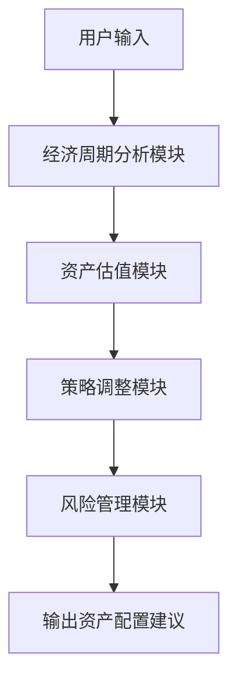

                 

# 价值投资在不同经济周期中的策略调整

## 关键词：价值投资、经济周期、投资策略、风险管理、资产配置

## 摘要：  
价值投资是一种长期投资策略，强调以低于公平价值的价格购买优质资产。然而，经济周期的变化会影响市场的表现和资产的价格。本文探讨了在不同经济周期（扩张期、衰退期、萧条期和复苏期）中，价值投资者应该如何调整其策略，以应对市场的波动并最大化长期收益。文章结合了理论分析、数学建模和实际案例，为投资者提供了实用的指导。

---

# 引言

价值投资是一种基于对公司基本面分析的投资策略，强调以低于内在价值的价格买入优质资产并长期持有。然而，经济周期的波动会对市场环境、资产价格和企业盈利产生重大影响。在不同的经济周期中，价值投资者需要灵活调整其策略，以应对市场变化并实现稳健的投资回报。

本文将从经济周期的定义出发，分析不同阶段的特点，探讨价值投资策略的具体调整方法，并通过实际案例和数学模型验证策略的有效性。同时，本文还讨论了风险管理的重要性，以确保投资者能够在不同经济环境下保持投资组合的稳定性。

---

## 第一部分：价值投资的核心理论

### 第1章：价值投资的基本原理

#### 1.1 价值投资的定义与核心要素

价值投资是一种以基本面分析为基础的投资策略，强调购买具有内在价值的资产。其核心要素包括：

- **内在价值**：资产在未来现金流的现值，基于对公司财务状况、行业地位和竞争优势的分析。
- **安全边际**：买入价格与内在价值之间的折扣，以降低投资风险。
- **长期视角**：关注企业的长期盈利能力，而非短期市场波动。

#### 1.2 价值投资的哲学与实践

价值投资的哲学强调“逆市场思维”，即在市场恐慌时寻找机会，在市场狂热时保持冷静。其实践方法包括：

- **深入研究**：对公司财务报表、管理层能力和行业前景进行详细分析。
- **分散投资**：通过投资多个优质资产降低风险。
- **长期持有**：避免频繁交易，减少交易成本和税收负担。

---

## 第二部分：经济周期的定义与特征

### 第2章：经济周期的四个阶段

经济周期通常分为四个阶段：扩张期、衰退期、萧条期和复苏期。每个阶段的市场环境和资产表现都有显著差异。

#### 2.1 扩张期

- **定义**：经济快速增长，企业盈利上升，就业率高，市场情绪乐观。
- **资产表现**：股市表现强劲，尤其是成长型企业；债券收益率较低。
- **风险**：市场可能出现泡沫，投资者需警惕过度乐观情绪。

#### 2.2 衰退期

- **定义**：经济增长放缓，企业盈利下降，失业率上升，市场情绪悲观。
- **资产表现**：股市下跌，债券和防御性资产（如公用事业、黄金）表现较好。
- **风险**：流动性风险和信用风险上升。

#### 2.3 萧条期

- **定义**：经济严重衰退，企业大量倒闭，就业率极低，市场情绪极度悲观。
- **资产表现**：股市触底，债券收益率极低，货币和现金成为 safest asset。
- **风险**：通货紧缩和债务危机的风险。

#### 2.4 复苏期

- **定义**：经济开始复苏，企业盈利逐渐恢复，市场情绪逐步改善。
- **资产表现**：股市逐步回升，债券收益率上升。
- **风险**：市场波动较大，需警惕经济复苏不及预期的风险。

---

## 第三部分：价值投资在不同经济周期中的策略调整

### 第3章：扩张期的策略调整

#### 3.1 市场特征与投资机会

在扩张期，市场情绪乐观，企业盈利增长，股市表现强劲。此时，价值投资者应关注高成长性企业，尤其是那些能够持续创造价值的优质资产。

#### 3.2 具体策略

- **增加股票仓位**：优先选择成长型企业，尤其是那些估值合理且具有强大竞争优势的企业。
- **分散投资**：避免过度集中于单一行业或资产，以降低风险。
- **关注估值**：尽管市场情绪乐观，仍需关注买入价格与内在价值的匹配。

### 第4章：衰退期的策略调整

#### 4.1 市场特征与投资机会

在衰退期，市场情绪悲观，企业盈利下降，股市表现疲软。此时，价值投资者应关注防御性资产和那些被市场低估的优质企业。

#### 4.2 具体策略

- **减少股票仓位**：降低对高风险资产的敞口，转投防御性资产如债券、黄金等。
- **寻找价值陷阱**：识别那些基本面恶化但估值仍较高的企业，避免陷入价值陷阱。
- **增加现金持有**：在市场底部附近，保持较高的现金仓位，以抓住潜在的抄底机会。

### 第5章：萧条期的策略调整

#### 5.1 市场特征与投资机会

在萧条期，市场情绪极度悲观，企业大量倒闭，经济活动停滞。此时，价值投资者应关注那些真正具有内在价值的资产，尤其是那些能够在经济复苏中表现强劲的企业。

#### 5.2 具体策略

- **逐步增加股票仓位**：在市场底部附近逐步增加对优质企业的投资，尤其是那些具有强大竞争优势和估值合理的企业。
- **关注长期机会**：萧条期往往是投资的黄金时期，许多优质资产的价格被严重低估。
- **保持耐心**：在市场底部时，投资者需要保持耐心，避免因短期波动而放弃长期投资计划。

### 第6章：复苏期的策略调整

#### 6.1 市场特征与投资机会

在复苏期，市场情绪逐渐改善，企业盈利恢复增长，股市开始回升。此时，价值投资者应关注那些在衰退期被低估但在复苏期表现强劲的企业。

#### 6.2 具体策略

- **逐步增加股票仓位**：在经济复苏初期，逐步增加对成长型企业股票的投资。
- **关注周期性行业**：周期性行业在经济复苏期通常表现较好，如制造业、房地产等。
- **优化资产配置**：根据经济复苏的强度和持续性，调整资产配置比例，平衡风险与收益。

---

## 第四部分：价值投资策略的数学建模与优化

### 第7章：动态资产分配模型

#### 7.1 模型概述

动态资产分配模型是一种基于经济周期变化调整资产配置的投资策略。模型通过分析经济周期的阶段，动态调整股票、债券和现金的比例。

#### 7.2 模型输入与输出

- **输入**：经济指标（GDP增长率、失业率、通胀率等）、市场数据（股票指数、债券收益率等）、资产价格波动性。
- **输出**：最优资产配置比例（股票、债券、现金）。

#### 7.3 模型实现

基于动态资产分配模型，我们可以使用以下公式计算资产配置比例：

$$
w_{\text{股票}} = \alpha \cdot \text{经济周期指标} + \beta \cdot \text{市场估值指标}
$$

$$
w_{\text{债券}} = \gamma \cdot \text{经济周期指标} + \delta \cdot \text{市场估值指标}
$$

$$
w_{\text{现金}} = 1 - w_{\text{股票}} - w_{\text{债券}}
$$

其中，$\alpha$、$\beta$、$\gamma$、$\delta$ 是模型参数，需根据历史数据进行校准。

---

## 第五部分：系统分析与架构设计

### 第8章：系统架构与功能设计

#### 8.1 系统功能模块

- **经济周期分析模块**：分析当前经济周期阶段。
- **资产估值模块**：评估资产的内在价值。
- **策略调整模块**：根据经济周期和资产估值调整投资策略。
- **风险管理模块**：监控和管理投资组合风险。

#### 8.2 系统架构图

---

## 第六部分：项目实战与案例分析

### 第9章：实际案例分析

#### 9.1 案例1：2008年金融危机期间的价值投资策略

在2008年金融危机期间，许多投资者选择持有优质股票和债券。例如，巴菲特在市场底部时大量买入 Goldman Sachs 的优先股，最终获得了丰厚的回报。

#### 9.2 案例2：2020年新冠疫情冲击下的投资策略

在2020年新冠疫情冲击下，许多投资者选择持有防御性资产如债券和黄金，同时逐步增加对科技股的投资。

---

## 第七部分：未来展望与总结

### 第10章：未来展望

#### 10.1 技术进步对价值投资的影响

- 大数据分析技术的应用：通过大数据分析，投资者可以更精准地评估资产的内在价值。
- 人工智能的应用：AI技术可以帮助投资者更快速地识别投资机会和风险。

#### 10.2 全球化背景下的价值投资

在全球化背景下，价值投资者需要关注全球市场的机会和风险，尤其是新兴市场的投资潜力。

---

## 结论

价值投资是一种长期有效的投资策略，但在不同的经济周期中，投资者需要灵活调整其策略以应对市场变化。通过深入分析经济周期的特征，结合数学建模和系统设计，投资者可以制定更科学的投资计划，并在不同经济环境下实现稳健的收益。

---

## 作者

作者：AI天才研究院/AI Genius Institute  
邮箱：info@aitoptech.com  
官方网站：https://www.aitoptech.com  

---

本文由AI天才研究院撰写，未经授权不得转载。

