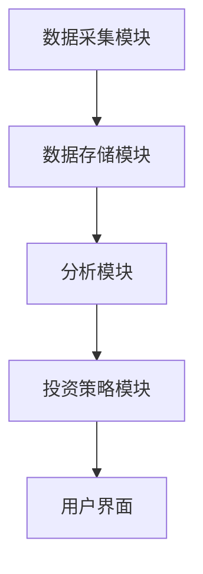

                 


# 价值投资在波动市场中的优势

> 关键词：价值投资，波动市场，内在价值，安全边际，风险管理，投资策略，长期持有

> 摘要：  
价值投资是一种以基本面分析为基础的长期投资策略，强调购买价格低于内在价值的优质股票并长期持有。在波动的市场环境中，价值投资因其独特的优势，如注重安全边际、关注长期价值而非短期波动、以及通过深入研究降低投资风险，表现出色。本文将从价值投资的理论基础、波动市场的特性、价值投资的策略与方法、数学模型、系统分析、项目实战等多方面展开，深入探讨价值投资在波动市场中的优势，并通过实际案例分析，为投资者提供实用的指导和建议。

---

# 第1章: 价值投资的起源与核心理念

## 1.1 价值投资的起源与发展

### 1.1.1 价值投资的起源

价值投资的起源可以追溯到20世纪初。1934年，本杰明·格雷厄姆和戴维·多德合著的《证券分析》一书奠定了价值投资理论的基础。格雷厄姆提出了“内在价值”这一核心概念，认为股票的价格波动围绕其内在价值波动，而市场波动为投资者提供了以低于内在价值的价格买入优质股票的机会。

### 1.1.2 价值投资的核心理念

价值投资的核心理念是：市场价格与内在价值之间的差异提供了投资机会。投资者应关注企业的基本面，寻找市场价格低于内在价值的企业进行投资，并长期持有，直到市场重新认识其价值。

### 1.1.3 价值投资与波动市场的关系

波动市场为价值投资者提供了低价买入优质资产的机会。当市场恐慌或下跌时，许多优质股票的价格会被低估，此时买入并长期持有，最终随着企业价值的实现获得超额收益。

---

## 1.2 价值投资的核心概念

### 1.2.1 内在价值的定义

内在价值是指企业在未来现金流的现值。计算内在价值时，投资者需要考虑企业的盈利能力、成长潜力、行业地位、竞争优势等因素。公式如下：

$$
\text{内在价值} = \sum_{t=1}^{n} \frac{\text{现金流}_t}{(1 + r)^t}
$$

其中，$r$ 是折现率，$n$ 是评估的年数，$\text{现金流}_t$ 是第 $t$ 年的现金流。

### 1.2.2 市场价值的波动性

市场价值是指资产在市场上的价格，它受市场情绪、投资者行为等因素的影响，往往偏离内在价值。市场波动为价值投资者提供了以低于内在价值的价格买入资产的机会。

### 1.2.3 安全边际的内涵

安全边际是指市场价格低于内在价值的部分。通过预留安全边际，价值投资者降低了投资风险，确保在市场价格波动时仍能获得正收益。

$$
\text{安全边际} = \text{内在价值} - \text{市场价格}
$$

---

## 1.3 价值投资的基本原则

### 1.3.1 质优价廉的原则

价值投资者追求的是优质资产的低价买入。优质资产通常具有强劲的盈利能力、强大的竞争优势、稳定的现金流和良好的管理团队。

### 1.3.2 长期持有的策略

价值投资强调长期持有，避免频繁交易。长期持有使投资者能够分享企业的长期增长，同时减少交易成本和税收负担。

### 1.3.3 风险管理的重要性

价值投资者通过分散投资、预留安全边际等方式管理风险。即使市场短期波动，长期持有的策略也能帮助投资者抵御短期风险。

---

## 1.4 本章小结

本章介绍了价值投资的起源与发展，阐述了其核心理念和核心概念，包括内在价值、市场价值波动性和安全边际。同时，强调了长期持有和风险管理的重要性。这些内容为后续章节分析价值投资在波动市场中的优势奠定了基础。

---

# 第2章: 波动市场的特性与挑战

## 2.1 市场波动的定义与特征

### 2.1.1 市场波动的周期性

市场波动具有周期性，通常表现为牛市、熊市、震荡市交替出现。在熊市中，市场波动加剧，许多优质股票价格被低估，为价值投资者提供了投资机会。

### 2.1.2 市场波动的来源

市场波动的来源包括宏观经济因素（如经济周期、利率变化）、行业因素（如政策变化、行业竞争）、企业因素（如业绩不佳、管理问题）和市场情绪（如投资者恐慌、过度乐观）。

### 2.1.3 波动性对投资者的影响

市场波动对投资者的影响是双重的：短期波动可能带来损失，但长期来看，波动性为价值投资者提供了低价买入优质资产的机会。

---

## 2.2 市场波动与价值投资的关系

### 2.2.1 波动性对价值投资的机会

波动性为价值投资者提供了以低于内在价值的价格买入优质资产的机会。例如，在市场恐慌时，许多优质股票的价格可能大幅低于其内在价值。

### 2.2.2 波动性对价值投资的挑战

波动性可能导致投资者情绪波动，容易引发非理性决策。此外，短期波动可能影响投资者的耐心，导致其在市场低点卖出，错失长期收益。

### 2.2.3 如何在波动中保持理性

价值投资者需要在波动市场中保持冷静，避免被短期波动干扰。通过制定明确的投资计划和长期目标，投资者可以在波动中坚持价值投资策略。

---

## 2.3 市场波动中的投资者行为分析

### 2.3.1 投资者情绪的波动性

投资者情绪通常表现出非理性特征，例如在牛市中过度乐观，在熊市中过度悲观。这种情绪波动可能导致投资者做出错误决策。

### 2.3.2 非理性决策的常见表现

非理性决策包括追涨杀跌、频繁交易、盲目跟风等。这些行为通常会导致投资亏损，尤其是在波动市场中。

### 2.3.3 如何克服情绪干扰

克服情绪干扰的方法包括：制定明确的投资计划、分散投资、定期复盘和调整投资组合。

---

## 2.4 本章小结

本章分析了波动市场的特性，探讨了波动性对价值投资的机会与挑战。同时，重点分析了投资者在波动市场中的行为，并提出了克服情绪干扰的建议。这些内容帮助投资者更好地理解波动市场的本质，并在波动中保持理性。

---

# 第3章: 价值投资的策略与方法

## 3.1 价值投资的基本策略

### 3.1.1 选择优质企业的标准

选择优质企业是价值投资的关键。优质企业通常具有以下特征：强劲的盈利能力、强大的竞争优势、稳定的现金流、良好的管理团队和可持续的业务模式。

### 3.1.2 评估企业内在价值的方法

评估企业内在价值的方法包括：现金流折现法（DCF）、市盈率法、市净率法等。其中，DCF方法是最常用的。

### 3.1.3 安全边际的计算与应用

计算安全边际时，投资者需要比较市场价格与内在价值的差异。如果市场价格显著低于内在价值，说明存在安全边际，适合买入。

---

## 3.2 价值投资的具体方法

### 3.2.1 财务报表分析

财务报表分析是评估企业内在价值的重要步骤。投资者需要关注企业的收入、利润、现金流、资产负债表和现金流量表等指标。

### 3.2.2 行业分析与竞争地位评估

行业分析帮助投资者了解企业的行业地位和竞争优势。例如，行业集中度高、进入门槛高、企业市场份额稳定的行业更容易产生优质企业。

### 3.2.3 市场情绪与估值区间判断

市场情绪和估值区间是判断买入机会的重要依据。当市场情绪恐慌时，许多优质股票可能被低估，此时买入具有较高的安全边际。

---

## 3.3 价值投资组合的构建

### 3.3.1 投资组合的分散化策略

分散化是降低投资风险的重要手段。通过投资不同行业、不同地区的股票，投资者可以降低单一股票或行业波动带来的风险。

### 3.3.2 资产配置的动态调整

资产配置需要根据市场环境和投资目标进行动态调整。例如，在市场波动加剧时，增加现金持仓比例，降低股票持仓比例。

### 3.3.3 风险控制的措施

风险控制包括设置止损点、定期复盘和调整投资组合等。通过有效的风险控制，投资者可以在波动市场中降低损失，保护投资本金。

---

## 3.4 本章小结

本章详细介绍了价值投资的策略与方法，包括选择优质企业的标准、评估内在价值的方法、安全边际的计算与应用，以及投资组合的构建。这些内容为投资者提供了具体的指导，帮助其在波动市场中实现长期收益。

---

# 第4章: 价值投资的数学模型与公式

## 4.1 内在价值的计算公式

### 4.1.1 现金流折现模型（DCF）

现金流折现模型是计算内在价值的核心方法。公式如下：

$$
\text{内在价值} = \frac{\text{自由现金流}_1}{(1 + r)^1} + \frac{\text{自由现金流}_2}{(1 + r)^2} + \dots + \frac{\text{自由现金流}_n}{(1 + r)^n}
$$

其中，$r$ 是折现率，$n$ 是评估的年数。

### 4.1.2 市盈率与市净率的比较

市盈率（P/E）和市净率（P/B）是常用的估值指标。公式分别为：

$$
\text{市盈率} = \frac{\text{股价}}{\text{每股收益}}
$$

$$
\text{市净率} = \frac{\text{股价}}{\text{每股净资产}}
$$

### 4.1.3 股息率的计算与应用

股息率是衡量股票收益能力的重要指标，公式为：

$$
\text{股息率} = \frac{\text{股息支付额}}{\text{股价}} \times 100\%
$$

---

## 4.2 市场波动中的投资策略

### 4.2.1 投资组合的波动性分析

投资者可以通过波动率和相关性系数来评估投资组合的波动性。相关性系数公式为：

$$
\text{相关性系数} = \frac{\text{协方差}(x, y)}{\sigma_x \sigma_y}
$$

其中，$\sigma_x$ 和 $\sigma_y$ 分别是变量 $x$ 和 $y$ 的标准差。

### 4.2.2 风险调整后的收益评估

风险调整后的收益评估常用夏普比率衡量，公式为：

$$
\text{夏普比率} = \frac{\text{收益} - \text{无风险利率}}{\text{收益的标准差}}
$$

---

## 4.3 本章小结

本章通过数学模型和公式，详细阐述了内在价值的计算方法、市盈率与市净率的比较，以及股息率的计算与应用。同时，分析了市场波动中的投资策略，包括投资组合的波动性分析和风险调整后的收益评估。这些内容为投资者提供了量化工具，帮助其更好地进行投资决策。

---

# 第5章: 波动市场中的系统分析与架构设计

## 5.1 系统分析

### 5.1.1 投资决策系统介绍

投资决策系统是一个帮助投资者进行价值投资的工具，包括数据采集、分析模块和投资策略模块。

### 5.1.2 系统功能设计

系统功能设计包括数据采集模块、分析模块和投资策略模块。数据采集模块负责获取市场数据，分析模块负责计算内在价值和市场估值，投资策略模块根据分析结果生成投资建议。

### 5.1.3 系统架构设计

系统架构设计采用分层架构，包括数据层、业务逻辑层和用户界面层。各层通过接口进行交互，确保系统的高效运行。

---

## 5.2 系统架构设计

### 5.2.1 系统架构图

系统架构图如下：



### 5.2.2 接口设计

接口设计包括数据接口和用户接口。数据接口负责与数据源交互，用户接口负责与用户交互。

### 5.2.3 交互设计

交互设计包括数据采集、分析和投资决策的流程。用户可以通过界面输入指令，系统根据指令执行相应的操作。

---

## 5.3 本章小结

本章通过系统分析与架构设计，详细介绍了投资决策系统的功能和架构。系统架构图展示了各模块之间的关系，接口设计和交互设计为系统的实现提供了指导。

---

# 第6章: 价值投资的项目实战

## 6.1 项目环境安装

### 6.1.1 安装Python和必要的库

安装Python和Pandas、NumPy、Matplotlib等库，用于数据分析和可视化。

### 6.1.2 安装数据源接口

安装金融数据接口，如Yahoo Finance API，用于获取实时数据。

---

## 6.2 核心实现代码

### 6.2.1 数据获取与处理

```python
import pandas as pd
import numpy as np

# 获取数据
data = pd.read_csv('stock_data.csv')

# 计算内在价值
def calculate_intrinsic_value(data):
    # 示例：计算现金流折现模型
    cash_flows = data['cash_flows'].values
    discount_rate = 0.1
    intrinsic_value = sum(cash_flows / (1 + discount_rate)**i for i in range(len(cash_flows)))
    return intrinsic_value

# 应用函数
data['intrinsic_value'] = data.apply(calculate_intrinsic_value, axis=1)
```

### 6.2.2 计算安全边际

```python
# 计算安全边际
data['margin_of_safety'] = data['intrinsic_value'] - data['market_price']
```

---

## 6.3 代码应用解读与分析

### 6.3.1 数据获取与处理

通过读取CSV文件获取股票数据，计算每只股票的现金流折现模型的内在价值。

### 6.3.2 安全边际的计算

根据内在价值和市场价格计算安全边际，筛选出安全边际为正的股票作为潜在投资标的。

---

## 6.4 实际案例分析

### 6.4.1 案例背景

以某公司为例，计算其内在价值和安全边际，判断是否适合投资。

### 6.4.2 数据分析

分析公司的财务数据、行业地位和竞争优势，评估其内在价值和市场估值。

### 6.4.3 投资决策

根据分析结果，判断是否买入、持有或卖出。

---

## 6.5 本章小结

本章通过项目实战，展示了如何在实际市场中应用价值投资策略。通过数据获取与处理、安全边际计算和案例分析，帮助投资者更好地理解和应用价值投资。

---

# 第7章: 总结与最佳实践

## 7.1 价值投资的优势

### 7.1.1 长期视角的优势

长期视角使投资者能够忽略短期波动，关注企业的长期价值。

### 7.1.2 安全边际的重要性

安全边际是价值投资的核心，通过预留安全边际降低投资风险。

### 7.1.3 风险管理的重要性

有效的风险管理是价值投资成功的关键，通过分散投资和动态调整投资组合，投资者可以降低波动性带来的风险。

---

## 7.2 最佳实践 tips

### 7.2.1 长期持有优质股票

长期持有优质股票是价值投资的核心策略，避免频繁交易。

### 7.2.2 定期复盘和调整

定期复盘投资组合，根据市场环境和企业变化进行动态调整。

### 7.2.3 保持耐心和纪律

在波动市场中，投资者需要保持耐心和纪律，避免被短期波动干扰。

---

## 7.3 本章小结

本章总结了价值投资的优势，并提出了最佳实践建议。通过长期持有优质股票、定期复盘和调整、保持耐心和纪律，投资者可以在波动市场中实现长期收益。

---

# 作者：AI天才研究院/AI Genius Institute & 禅与计算机程序设计艺术 /Zen And The Art of Computer Programming

