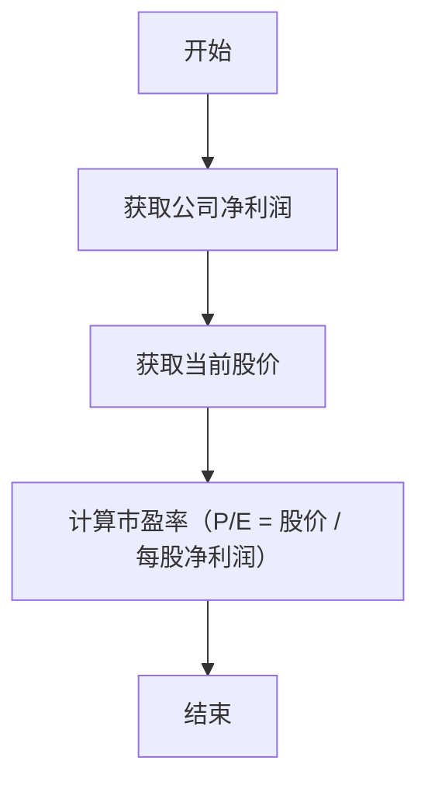
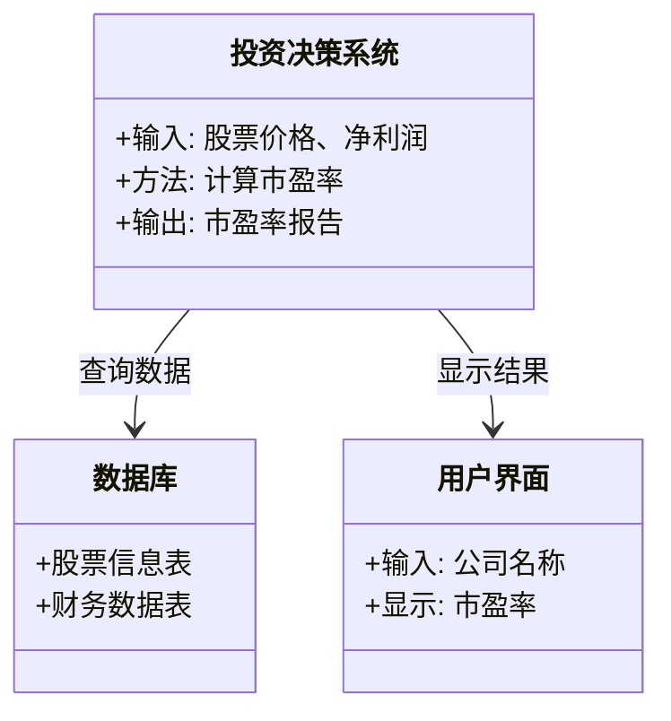
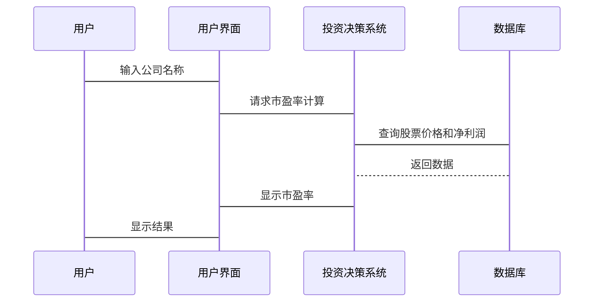

                 


# 《价值投资者如何看待市盈率》

## 关键词：价值投资、市盈率、投资决策、财务指标、投资策略

## 摘要：市盈率是评估股票价值的重要指标，本文深入探讨市盈率的定义、计算、与其他财务指标的关系，分析其在投资决策中的应用，并提供实际案例和投资策略建议。

---

# 第1章: 市盈率的背景与基本概念

## 1.1 市盈率的定义与计算方法

### 1.1.1 市盈率的定义
市盈率（Price-to-Earnings Ratio，简称P/E）是衡量股票价值的重要指标，表示股票当前价格相对于每股净利润的倍数。

$$ P/E = \frac{股票价格}{每股净利润} $$

### 1.1.2 市盈率的计算公式
市盈率的计算需要股票的价格和每股净利润（EPS）。

### 1.1.3 市盈率的适用范围
市盈率适用于盈利稳定的企业，尤其适合用于比较同行业内的公司。

## 1.2 市盈率的历史演变

### 1.2.1 市盈率的起源与发展
市盈率起源于20世纪初，随着金融市场的发展逐渐成为重要的估值指标。

### 1.2.2 市盈率在不同经济周期的表现
经济繁荣时，市盈率可能偏高；经济衰退时，市盈率可能偏低。

### 1.2.3 市盈率与市场波动的关系
市盈率受市场情绪和宏观经济因素影响较大。

## 1.3 市盈率在投资决策中的重要性

### 1.3.1 市盈率与投资价值的关系
低市盈率可能意味着股票被低估，而高市盈率可能意味着高风险。

### 1.3.2 市盈率与风险评估的联系
市盈率高可能表明市场对公司的未来盈利预期较高，但也可能意味着高风险。

### 1.3.3 市盈率在长期投资中的作用
市盈率帮助投资者识别长期投资机会，尤其是那些具有稳定盈利和合理估值的公司。

---

# 第2章: 市盈率的核心概念与关联指标

## 2.1 市盈率的核心概念解析

### 2.1.1 市盈率的构成要素
市盈率由股票价格和每股净利润组成。

### 2.1.2 市盈率与企业盈利的关系
市盈率直接反映企业的盈利能力，高市盈率可能意味着高盈利预期。

### 2.1.3 市盈率与企业成长性的关联
成长型企业通常具有较高的市盈率，因为市场预期其未来盈利将快速增长。

## 2.2 市盈率与其他财务指标的对比

### 2.2.1 市净率与市盈率的对比
市净率（P/B）衡量股价与每股净资产的比率，而市盈率衡量股价与每股净利润的比率。

| 指标 | 定义 | 适用场景 |
|------|------|----------|
| P/E  | 股价/每股净利润 | 盈利稳定企业 |
| P/B  | 股价/每股净资产 | 重资产企业 |

### 2.2.2 股息率与市盈率的对比
股息率衡量股价与股息的比率，市盈率衡量股价与净利润的比率。

| 指标 | 定义 | 适用场景 |
|------|------|----------|
| 股息率 | 股息/股价 | 高分红企业 |
| P/E  | 股价/净利润 | 盈利稳定企业 |

### 2.2.3 市盈率与ROE的对比
ROE（净资产收益率）衡量企业盈利能力，市盈率衡量市场对盈利的估值。

| 指标 | 定义 | 适用场景 |
|------|------|----------|
| ROE  | 净利润/净资产 | 判断企业盈利能力 |
| P/E  | 股价/净利润 | 评估市场估值 |

## 2.3 市盈率的ER实体关系图
```mermaid
er
    entity 市盈率 {
        id 市盈率ID
        市盈率数值
        时间范围
        公司ID
    }
    entity 公司 {
        id 公司ID
        公司名称
        行业分类
        财务数据
    }
    市盈率 --> 公司: 计算基于
```

---

# 第3章: 市盈率的算法原理与计算

## 3.1 市盈率的计算流程



## 3.2 市盈率的Python计算示例

```python
def calculate_pe(stock_price, net_income_per_share):
    return stock_price / net_income_per_share

# 示例
stock_price = 100
net_income_per_share = 25
pe_ratio = calculate_pe(stock_price, net_income_per_share)
print(f"市盈率: {pe_ratio}")
```

## 3.3 市盈率的数学模型与公式

市盈率公式：
$$ P/E = \frac{P}{EPS} $$

其中，P为股票价格，EPS为每股净利润。

---

# 第4章: 市盈率的系统分析与架构设计

## 4.1 系统功能设计



## 4.2 系统架构设计


## 4.3 系统接口设计



---

# 第5章: 价值投资者的市盈率分析实战

## 5.1 环境安装

### 5.1.1 安装Python和Pandas
```bash
pip install pandas
```

## 5.2 核心实现代码

```python
import pandas as pd

def calculate_pe(stock_data):
    pe_ratio = stock_data['股价'] / stock_data['每股净利润']
    return pe_ratio

# 示例数据
data = {
    '股价': [100, 150, 200],
    '每股净利润': [25, 30, 40]
}
stock_data = pd.DataFrame(data)

pe_ratios = calculate_pe(stock_data)
print(pe_ratios)
```

## 5.3 实际案例分析

### 5.3.1 苹果公司市盈率分析
2023年，苹果股价为150美元，每股净利润为10美元，市盈率为15倍，表明合理估值。

### 5.3.2 低市盈率与高市盈率案例对比
- 低市盈率：某银行股价10元，净利润0.5元，市盈率20倍，可能被低估。
- 高市盈率：某科技公司股价50元，净利润1元，市盈率50倍，可能高估。

## 5.4 项目总结

### 5.4.1 关键点
- 选择市盈率合理的公司。
- 结合行业和公司基本面分析。

### 5.4.2 注意事项
- 市盈率高不一定意味着高风险，也可能意味着高增长。
- 结合其他指标如ROE、股息率等综合分析。

---

# 第6章: 价值投资者的市盈率最佳实践

## 6.1 投资策略

### 6.1.1 低市盈率策略
寻找市盈率低于行业平均水平的公司，可能被低估。

### 6.1.2 高市盈率策略
投资于成长型企业，即使市盈率高，但未来盈利增长可能超过当前估值。

## 6.2 小结

市盈率是价值投资者的重要工具，但需结合其他指标和公司基本面进行综合分析。

## 6.3 注意事项

- 市盈率受宏观经济影响，需关注整体市场环境。
- 避免仅凭市盈率做决策，需考虑企业盈利能力和成长性。

## 6.4 拓展阅读

- 《价值投资入门》
- 《财务报表分析》

---

# 作者：AI天才研究院/AI Genius Institute & 禅与计算机程序设计艺术 /Zen And The Art of Computer Programming

