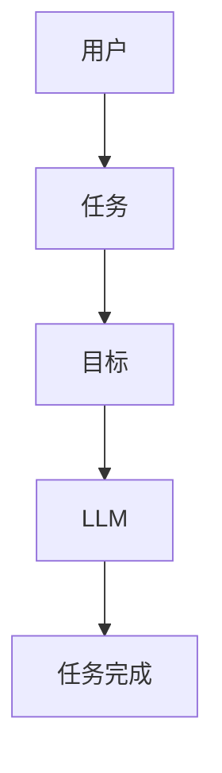
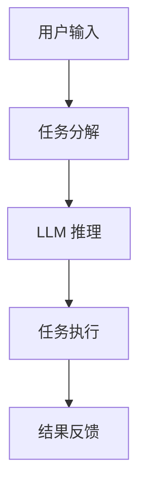

                 


# 任务导向型 AI Agent：基于 LLM 的目标完成系统

> **关键词**：任务导向型 AI Agent, 大语言模型, 目标完成系统, 自然语言处理, 人机交互, 系统架构设计

> **摘要**：本文深入探讨了任务导向型 AI Agent 的设计与实现，基于大语言模型（LLM）的目标完成系统。通过分析任务导向型 AI Agent 的核心概念、算法原理、系统架构设计以及实际项目案例，本文为读者提供了一套完整的系统化解决方案，帮助读者理解如何利用 LLM 构建高效的任务导向型 AI 系统。

---

## 第一部分: 任务导向型 AI Agent 基础

### 第1章: 任务导向型 AI Agent 概述

#### 1.1 任务导向型 AI Agent 的定义与背景

任务导向型 AI Agent 是一种基于大语言模型（LLM）的智能系统，旨在通过理解和执行用户指定的任务来实现特定的目标。与传统的对话系统不同，任务导向型 AI Agent 更注重任务的完成，而非仅仅进行对话交互。

#### 1.2 任务导向型 AI Agent 的应用场景

任务导向型 AI Agent 的应用场景广泛，包括但不限于：

1. **自然语言处理任务**：如文本摘要、信息抽取、问答系统等。
2. **人机交互中的任务完成**：如智能助手、虚拟客服等。
3. **企业级应用中的目标导向系统**：如流程自动化、决策支持等。

#### 1.3 任务导向型 AI Agent 的技术优势

1. **基于 LLM 的自然语言理解能力**：能够理解和处理复杂的自然语言输入。
2. **任务分解与执行能力**：能够将复杂的任务分解为多个子任务，并逐步完成。
3. **系统化的目标完成能力**：能够通过协调多个模块和工具完成复杂的目标。

#### 1.4 本章小结

本章从任务导向型 AI Agent 的定义、应用场景和技术优势三个方面进行了概述，为后续章节的深入分析奠定了基础。

---

### 第2章: 大语言模型（LLM）基础

#### 2.1 大语言模型的定义与特点

大语言模型（LLM）是一种基于深度学习的自然语言处理模型，具有以下特点：

1. **大规模训练数据**：通常使用 billions 级别的数据进行训练。
2. **强大的上下文理解能力**：能够理解和生成复杂的自然语言文本。
3. **多任务学习能力**：可以通过微调适应多种不同的任务。

#### 2.2 大语言模型的训练与推理

1. **训练过程**：
   - 使用大规模数据进行预训练，通常采用自监督学习。
   - 通过优化目标函数（如交叉熵损失）来训练模型。

2. **推理机制**：
   - 基于生成式模型，通过概率生成的方式来生成文本。
   - 支持多种推理模式，如贪心搜索、随机采样等。

3. **LLM 的局限性**：
   - 计算资源消耗大。
   - 可能存在幻觉（hallucination）问题，生成的内容不一定真实可靠。

#### 2.3 大语言模型在任务导向型 AI Agent 中的作用

1. **作为知识库**：通过 LLM 的大规模训练数据，能够存储和理解丰富的知识。
2. **作为推理引擎**：能够通过生成式推理来解决复杂的任务。
3. **作为交互界面**：通过自然语言交互与用户进行沟通。

#### 2.4 本章小结

本章详细介绍了大语言模型的定义、特点、训练与推理过程及其在任务导向型 AI Agent 中的作用，为后续章节的应用奠定了基础。

---

### 第3章: 任务导向型 AI Agent 的核心概念与联系

#### 3.1 核心概念原理

1. **任务分解与执行**：
   - 将复杂任务分解为多个子任务。
   - 每个子任务通过 LLM 进行处理和执行。

2. **目标导向的自然语言处理**：
   - 通过 LLM 的自然语言理解能力，明确用户的目标。
   - 通过生成式推理，制定具体的执行步骤。

3. **多轮对话中的任务跟踪**：
   - 在多轮对话中，通过上下文跟踪任务的状态。
   - 根据任务的进展调整后续的对话内容。

#### 3.2 核心概念对比表格

| 对比维度         | 基于规则的任务系统 | 基于 LLM 的任务系统 |
|------------------|--------------------|---------------------|
| **灵活性**        | 低                 | 高                  |
| **可扩展性**      | 低                 | 高                  |
| **处理复杂任务能力** | 有限               | 强大                |

#### 3.3 ER实体关系图架构



#### 3.4 本章小结

本章通过对比和图示的方式，详细阐述了任务导向型 AI Agent 的核心概念及其与大语言模型的联系。

---

### 第4章: 基于 LLM 的任务导向型 AI Agent 算法原理

#### 4.1 算法原理概述

1. **任务分解与执行算法**：
   - 将用户的目标分解为多个子任务。
   - 每个子任务通过 LLM 进行处理和执行。

2. **基于 LLM 的任务推理算法**：
   - 通过 LLM 的生成能力，推理出完成任务的具体步骤。
   - 支持多轮推理，确保任务的完整性和准确性。

3. **任务执行算法**：
   - 根据推理出的步骤，调用相应的工具或服务。
   - 实时反馈执行结果，并根据结果调整后续步骤。

#### 4.2 算法流程图



#### 4.3 本章小结

本章通过流程图和算法描述，详细阐述了基于 LLM 的任务导向型 AI Agent 的算法原理。

---

## 第二部分: 系统分析与架构设计方案

### 第5章: 系统架构设计

#### 5.1 问题场景介绍

任务导向型 AI Agent 的目标是通过 LLM 的能力，帮助用户完成特定任务。系统需要支持复杂的任务分解、多轮对话跟踪以及任务执行的反馈机制。

#### 5.2 项目介绍

本项目旨在构建一个基于 LLM 的任务导向型 AI Agent 系统，能够处理多种复杂任务，如信息查询、流程自动化等。

#### 5.3 系统功能设计

1. **领域模型设计**：
   ```mermaid
   classDiagram
       class 用户 {
           id
           历史记录
       }
       class 任务 {
           id
           目标
           状态
       }
       class LLM {
           模型参数
           推理接口
       }
       用户 --> 任务: 提交任务
       任务 --> LLM: 调用推理
       LLM --> 用户: 返回结果
   ```

2. **系统架构设计**：
   ```mermaid
   diagram
       前端 --> 后端: 请求
       后端 --> LLM: 调用推理
       后端 <-- 前端: 返回结果
   ```

3. **系统接口设计**：
   - 用户接口：API 接口，接收用户的任务请求。
   - LLM 接口：API 接口，调用 LLM 的推理功能。

4. **系统交互设计**：
   ```mermaid
   sequenceDiagram
       用户 ->> 后端: 提交任务
       后端 ->> LLM: 调用推理
       LLM ->> 后端: 返回推理结果
       后端 ->> 用户: 返回执行结果
   ```

#### 5.4 本章小结

本章通过领域模型、架构设计和接口设计，详细阐述了任务导向型 AI Agent 系统的架构方案。

---

### 第6章: 项目实战

#### 6.1 环境安装

1. **安装 Python 环境**：
   ```bash
   python -m pip install --upgrade pip
   ```

2. **安装依赖库**：
   ```bash
   pip install transformers requests
   ```

#### 6.2 系统核心实现源代码

```python
from transformers import pipeline

# 初始化 LLM 推理管道
llm_pipeline = pipeline("text-generation", model="gpt2")

# 任务分解函数
def decompose_task(task_description):
    return llm_pipeline(task_description, max_length=100)

# 任务执行函数
def execute_task(task_steps):
    # 简单模拟任务执行过程
    for step in task_steps:
        print(f"Executing step: {step}")
    return "Task completed successfully"

# 主函数
def main():
    import json
    import requests
    import logging

    logging.basicConfig(level=logging.INFO)
    logger = logging.getLogger(__name__)

    try:
        # 接收用户输入
        task_description = input("请输入任务描述：")
        # 分解任务
        task_steps = decompose_task(task_description)
        # 执行任务
        result = execute_task(task_steps)
        # 返回结果
        print(f"任务完成，结果为：{result}")
    except Exception as e:
        logger.error(f"任务执行失败，错误信息：{str(e)}")

if __name__ == "__main__":
    main()
```

#### 6.3 实际案例分析

以信息查询任务为例：

1. **用户输入**：查询2023年全球GDP排名。
2. **任务分解**：
   - 确定数据来源。
   - 获取最新数据。
   - 进行数据整理。
3. **任务执行**：
   - 从可靠的数据源获取数据。
   - 数据清洗和整理。
   - 返回结果。

#### 6.4 本章小结

本章通过实际代码和案例分析，详细展示了任务导向型 AI Agent 系统的实现过程。

---

### 第7章: 优化与扩展

#### 7.1 系统优化

1. **性能优化**：
   - 使用更高效的模型（如 LLaMA、Vicuna）。
   - 优化推理流程，减少计算开销。

2. **可扩展性优化**：
   - 支持多任务并行处理。
   - 提供灵活的任务配置接口。

#### 7.2 最佳实践 tips

1. **任务分解要合理**：任务分解的粒度要适中，既不过细也不过粗。
2. **错误处理要全面**：任务执行过程中要处理各种可能的异常情况。
3. **反馈机制要完善**：任务执行结果要及时反馈给用户，并支持调整。

#### 7.3 本章小结

本章从系统优化和最佳实践两个方面，为读者提供了任务导向型 AI Agent 系统的优化与扩展建议。

---

## 第三部分: 总结与展望

### 第8章: 总结

#### 8.1 核心内容回顾

任务导向型 AI Agent 是一种基于大语言模型的目标完成系统，通过任务分解、推理和执行，能够帮助用户完成多种复杂任务。

#### 8.2 本书的贡献

本书通过系统的理论分析和实践案例，为读者提供了一套完整的任务导向型 AI Agent 系统化解决方案。

#### 8.3 本章小结

本章总结了全书的核心内容，并展望了未来的发展方向。

---

### 第9章: 未来展望

#### 9.1 任务导向型 AI Agent 的未来发展方向

1. **更强大的 LLM 模型**：如 GPT-5、PaLM 等。
2. **多模态任务处理**：支持图像、音频等多种数据类型。
3. **更高效的推理算法**：如基于图的推理、强化学习等。

#### 9.2 任务导向型 AI Agent 的社会影响

1. **对企业的影响**：提高效率，降低人工成本。
2. **对个人的影响**：提供更智能的辅助工具。
3. **对社会的影响**：推动智能化社会的发展。

#### 9.3 本章小结

本章展望了任务导向型 AI Agent 的未来发展方向及其对社会的影响。

---

## 作者：AI天才研究院/AI Genius Institute & 禅与计算机程序设计艺术/Zen And The Art of Computer Programming

