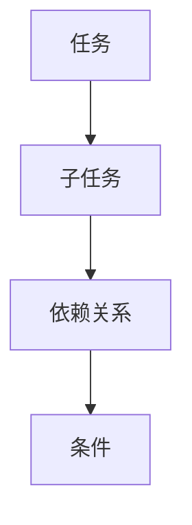
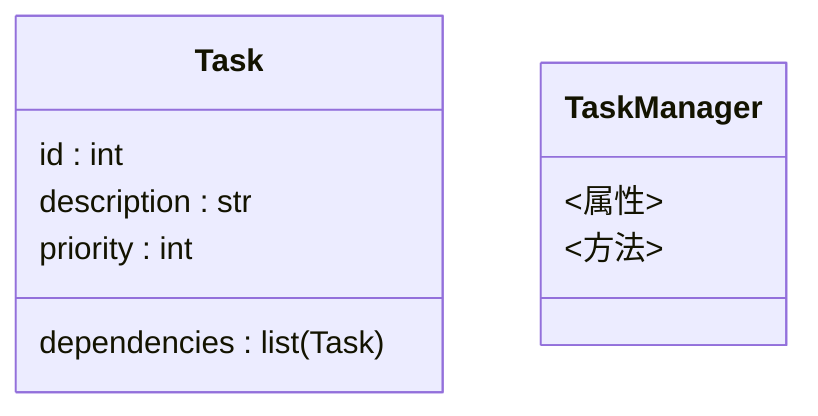
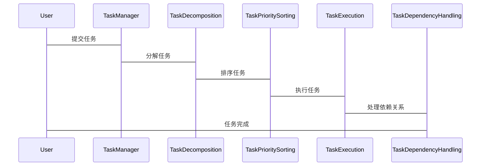

                 


# 任务规划与分解：提高AI Agent的问题解决能力

> 关键词：任务规划，AI Agent，问题解决，任务分解，优先级排序，依赖关系

> 摘要：本文将详细介绍任务规划与分解在提高AI Agent问题解决能力中的关键作用。从任务规划的基本原理到具体算法的实现，从系统架构设计到实际项目案例分析，本文将全面解析如何通过科学的任务分解和优先级排序来优化AI Agent的问题解决能力，帮助读者在实际应用中更好地理解和应用相关技术。

---

# 第1章 任务规划与分解的背景介绍

## 1.1 问题背景

### 1.1.1 任务规划与分解的定义
任务规划（Task Planning）是AI Agent在复杂环境中完成特定目标的核心能力。任务分解（Task Decomposition）则是将复杂任务拆解为更简单、可执行的子任务，以简化问题解决过程。通过任务分解，AI Agent能够将复杂问题转化为多个小问题，逐一解决，从而提高整体效率。

### 1.1.2 问题解决的必要性
AI Agent面临的任务往往具有复杂性、不确定性或动态性，直接处理完整任务可能会导致计算复杂度爆炸。因此，通过任务分解，将大任务拆分为小任务，能够降低计算复杂度，提高问题解决的效率和成功率。

### 1.1.3 任务规划的边界与外延
任务规划的边界包括任务目标、可用资源、环境约束等。其外延则涉及任务执行过程中的动态调整、多Agent协作以及人机交互等。

## 1.2 问题描述

### 1.2.1 AI Agent的任务特点
AI Agent的任务通常是复杂的、动态的，并且需要在不确定的环境中完成。例如，智能助手需要处理用户的多种请求，自动驾驶系统需要实时做出决策。

### 1.2.2 任务分解的必要性
任务分解能够将复杂任务拆解为更简单的子任务，使得AI Agent能够逐一处理，避免计算复杂度过高。

### 1.2.3 任务解决的逻辑框架
任务解决的逻辑框架包括任务分解、任务优先级排序、任务依赖关系处理等步骤。

## 1.3 问题解决与任务规划的关系

### 1.3.1 问题解决的基本步骤
问题解决通常包括理解问题、分解问题、解决问题和验证结果等步骤。

### 1.3.2 任务规划的核心作用
任务规划是问题解决的关键步骤，它决定了如何分解任务、如何分配资源以及如何处理任务之间的依赖关系。

### 1.3.3 分解与整合的平衡
任务分解需要在颗粒度和整体性之间找到平衡，既要避免过度分解导致的效率低下，又要避免分解不足导致的问题复杂化。

## 1.4 任务规划的核心要素

### 1.4.1 任务目标的明确性
任务目标是任务规划的起点，明确的目标能够指导任务分解和优先级排序。

### 1.4.2 任务分解的层次性
任务分解需要考虑层次性，通常从高层次目标分解到具体的操作步骤。

### 1.4.3 任务执行的可操作性
任务分解后的子任务需要具有可操作性，即每个子任务都应该是具体、可执行的。

---

# 第2章 任务规划与分解的核心概念与联系

## 2.1 任务分解的基本原理

### 2.1.1 分解的层次结构
任务分解通常按照层次结构进行，例如根任务→子任务→孙任务。

### 2.1.2 分解的策略与方法
常见的任务分解策略包括基于目标的分解、基于操作的分解等。

### 2.1.3 分解的复杂性分析
任务分解的复杂性取决于任务的规模、结构和约束条件。

## 2.2 任务优先级排序的原理

### 2.2.1 优先级的定义与分类
优先级是指任务的重要性和紧迫性，通常分为高、中、低三个等级。

### 2.2.2 优先级排序的算法
常见的优先级排序算法包括贪心算法、A*算法等。

### 2.2.3 优先级调整的机制
优先级可以根据环境变化动态调整，例如紧急任务优先处理。

## 2.3 任务依赖关系的处理

### 2.3.1 任务间的依赖类型
任务依赖关系可以是顺序依赖、并行依赖或条件依赖。

### 2.3.2 依赖关系的建模
依赖关系可以通过有向图或任务关系矩阵进行建模。

### 2.3.3 依赖冲突的解决
依赖冲突可以通过调整任务顺序或增加缓冲时间来解决。

## 2.4 任务规划与分解的对比分析

### 2.4.1 任务分解的特征对比表

| 特征         | 分解特征        |
|--------------|-----------------|
| 输入         | 复杂任务         |
| 输出         | 子任务列表       |
| 方法         | 分解算法         |
| 目的         | 简化问题         |

### 2.4.2 任务优先级排序的特征对比表

| 特征         | 排序特征        |
|--------------|-----------------|
| 输入         | 子任务列表       |
| 输出         | 优先级排序结果   |
| 方法         | 排序算法         |
| 目的         | 确定执行顺序     |

### 2.4.3 任务依赖关系的ER实体关系图



---

# 第3章 任务规划算法的实现原理

## 3.1 基于A*算法的任务规划

### 3.1.1 A*算法的基本原理
A*算法是一种基于广度优先搜索的启发式算法，常用于路径规划和任务规划。

### 3.1.2 A*算法的数学模型
$$f(n) = g(n) + h(n)$$
其中，$g(n)$是当前节点到起点的已知成本，$h(n)$是当前节点到目标的估计成本。

### 3.1.3 A*算法的实现步骤
1. 初始化优先队列。
2. 取出队列中具有最小$f(n)$的节点。
3. 展开该节点，生成子节点。
4. 重复上述步骤，直到找到目标节点。

### 3.1.4 A*算法的代码实现

```python
import heapq

def a_star_search(graph, start, goal):
    open_set = {start}
    came_from = {}
    g_score = {start: 0}
    f_score = {start: heuristic(start, goal)}
    
    while open_set:
        current = heapq.heappop(open_set)
        if current == goal:
            break
        for neighbor in graph.get_neighbors(current):
            tentative_g_score = g_score[current] + graph.cost(current, neighbor)
            if neighbor not in g_score or tentative_g_score < g_score[neighbor]:
                came_from[neighbor] = current
                g_score[neighbor] = tentative_g_score
                f_score[neighbor] = g_score[neighbor] + heuristic(neighbor, goal)
                heapq.heappush(open_set, neighbor)
    return came_from, g_score
```

### 3.1.5 A*算法的优缺点
优点：路径优化，效率较高；缺点：计算复杂度较高。

---

## 3.2 基于贪心算法的任务优先级排序

### 3.2.1 贪心算法的基本原理
贪心算法是一种基于当前最优选择的算法，通常用于任务优先级排序。

### 3.2.2 贪心算法的数学模型
$$\text{选择当前最优的任务}$$

### 3.2.3 贪心算法的实现步骤
1. 初始化任务列表。
2. 根据优先级排序规则，选择优先级最高的任务。
3. 执行该任务，并从列表中删除。
4. 重复上述步骤，直到所有任务完成。

### 3.2.4 贪心算法的代码实现

```python
def greedy_algorithm(tasks):
    while tasks:
        # 根据优先级排序规则选择优先级最高的任务
        highest_priority_task = max(tasks, key=lambda x: x['priority'])
        # 执行该任务
        execute_task(highest_priority_task)
        # 从任务列表中删除该任务
        tasks.remove(highest_priority_task)
```

### 3.2.5 贪心算法的优缺点
优点：简单高效；缺点：可能无法找到全局最优解。

---

# 第4章 系统分析与架构设计方案

## 4.1 问题场景介绍

### 4.1.1 智能助手的任务分解
智能助手需要处理用户的多种请求，例如设置提醒、查询天气等。

### 4.1.2 系统功能设计
系统功能包括任务分解、任务优先级排序、任务依赖关系处理等。

## 4.2 系统架构设计

### 4.2.1 领域模型


### 4.2.2 系统架构


### 4.2.3 接口设计
系统接口包括任务分解接口、任务优先级排序接口、任务执行接口等。

### 4.2.4 交互序列图


---

# 第5章 项目实战

## 5.1 环境安装

### 5.1.1 安装Python环境
使用Anaconda或虚拟环境安装Python 3.8以上版本。

### 5.1.2 安装依赖库
安装必要的库，例如`mermaid`、`matplotlib`等。

## 5.2 核心代码实现

### 5.2.1 任务分解模块

```python
def decompose_task(task):
    # 分解任务为子任务
    sub_tasks = []
    # 分解逻辑
    return sub_tasks
```

### 5.2.2 任务优先级排序模块

```python
def sort_tasks(tasks):
    # 根据优先级排序
    sorted_tasks = sorted(tasks, key=lambda x: x['priority'])
    return sorted_tasks
```

### 5.2.3 任务执行模块

```python
def execute_task(task):
    # 执行任务
    pass
```

## 5.3 代码解读与分析

### 5.3.1 任务分解模块的解读
任务分解模块将复杂任务拆解为多个子任务，每个子任务都是具体、可执行的。

### 5.3.2 任务优先级排序模块的解读
任务优先级排序模块根据优先级规则，对子任务进行排序，确定执行顺序。

## 5.4 实际案例分析

### 5.4.1 案例背景
例如，智能助手需要处理用户的多个请求，如设置提醒、查询天气、发送邮件等。

### 5.4.2 案例分析
通过任务分解和优先级排序，智能助手能够高效地处理用户的请求。

---

# 第6章 最佳实践

## 6.1 小结

### 6.1.1 核心概念总结
任务规划与分解是提高AI Agent问题解决能力的关键技术。

### 6.1.2 算法原理总结
A*算法和贪心算法是常用的任务规划算法。

## 6.2 注意事项

### 6.2.1 算法选择
根据具体场景选择合适的算法，避免盲目使用复杂算法。

### 6.2.2 任务分解的颗粒度
任务分解的颗粒度需要适度，既不能过于粗放，也不能过于细碎。

### 6.2.3 优先级调整
根据环境变化动态调整任务优先级，确保任务执行的高效性。

## 6.3 拓展阅读

### 6.3.1 推荐书籍
《算法导论》、《人工智能：一种现代方法》

### 6.3.2 推荐博客
相关技术博客和开源项目。

---

# 作者

作者：AI天才研究院 & 禅与计算机程序设计艺术

---

通过本文的详细讲解和案例分析，读者可以深入了解任务规划与分解在AI Agent中的应用，掌握核心算法和系统设计方法，从而在实际项目中提高问题解决能力。

