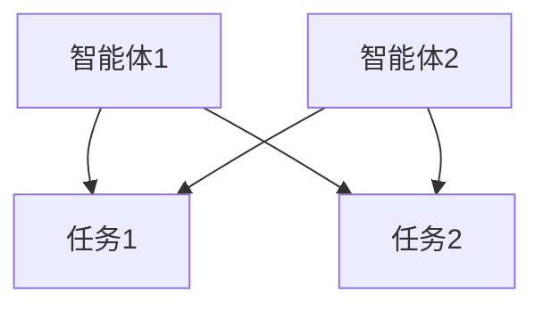
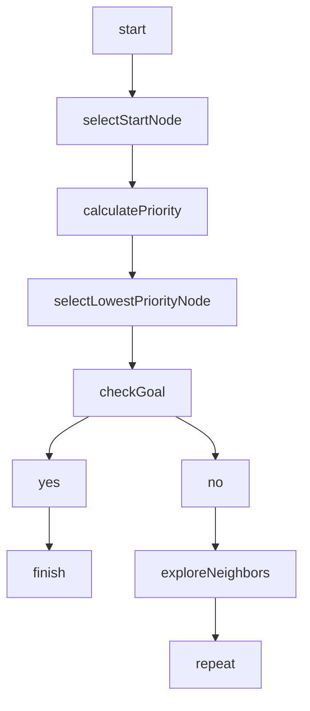
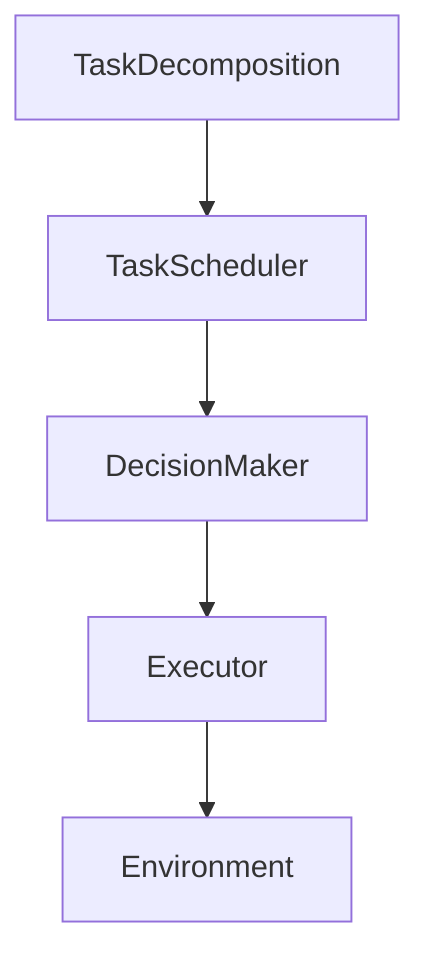
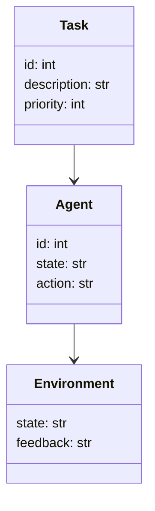

                 


# 任务规划与执行：AI Agent的行动决策机制

> 关键词：任务规划、AI Agent、行动决策、决策机制、算法原理、系统架构、项目实战

> 摘要：  
本文深入探讨了AI Agent在任务规划与执行中的行动决策机制。通过分析任务规划的核心概念、算法原理及系统架构，结合实际案例，详细阐述了AI Agent如何通过任务分解、约束处理和多智能体协作实现高效的行动决策。文章还介绍了多种任务规划算法，如A*算法和强化学习，并通过系统架构设计和项目实战，展示了如何将理论应用于实际场景。最后，本文总结了任务规划的关键点，并展望了未来的发展方向。

---

# 第1章: 任务规划与AI Agent的概述

## 1.1 任务规划的基本概念

### 1.1.1 任务规划的定义  
任务规划是指通过分解任务目标，生成一系列行动序列，以实现最终目标的过程。它是AI Agent实现自主行为的核心能力之一。

### 1.1.2 AI Agent的基本概念  
AI Agent（人工智能代理）是一种能够感知环境、自主决策并执行任务的智能实体。它可以分为简单反射型、基于模型的反应型、目标驱动型和效用驱动型四种类型。

### 1.1.3 任务规划与AI Agent的关系  
任务规划是AI Agent实现自主行为的关键技术，AI Agent通过任务规划来确定行动序列，从而实现目标。

## 1.2 任务规划的核心要素

### 1.2.1 任务目标的分解  
任务目标需要分解为多个子任务，以便AI Agent能够逐步执行。例如，将“完成文件分类”分解为“获取文件列表”、“分类文件”等子任务。

### 1.2.2 行动序列的生成  
任务规划的核心是生成一个合理的行动序列，确保每个行动能够逐步推进任务的完成。

### 1.2.3 环境感知与反馈  
AI Agent需要通过感知环境动态调整行动序列，确保任务能够顺利执行。

## 1.3 AI Agent的决策机制

### 1.3.1 基于规则的决策  
基于规则的决策机制通过预定义的规则来确定行动。例如，当检测到某个条件满足时，执行相应的操作。

### 1.3.2 基于知识的决策  
基于知识的决策机制依赖于知识库中的信息，通过推理和逻辑分析来确定行动。

### 1.3.3 基于学习的决策  
基于学习的决策机制通过机器学习算法，从历史数据中学习决策模式，从而生成行动。

## 1.4 任务规划的应用场景

### 1.4.1 自动化系统中的任务规划  
在工业自动化、智能家居等领域，任务规划帮助AI Agent实现自主操作。

### 1.4.2 人机协作中的任务分配  
在人机协作场景中，任务规划帮助AI Agent与人类协同完成复杂任务。

### 1.4.3 多智能体环境中的任务协调  
在多智能体环境中，任务规划帮助各个智能体协作完成任务。

## 1.5 本章小结  
本章介绍了任务规划的基本概念、核心要素和AI Agent的决策机制，并通过实际应用场景展示了任务规划的重要性。

---

# 第2章: 任务规划的核心概念与联系

## 2.1 任务分解方法

### 2.1.1 分层次任务分解  
任务分解可以通过层次化的方式进行，例如将大任务分解为多个子任务，每个子任务进一步分解为更小的任务。

### 2.1.2 基于子目标的任务分解  
任务分解也可以基于子目标进行，例如将“完成项目”分解为“需求分析”、“开发”、“测试”等子目标。

### 2.1.3 任务分解的优缺点对比  
| 分解方法 | 优点 | 缺点 |
|----------|------|------|
| 层次分解 | 结构清晰 | 可能过于复杂 |
| 子目标分解 | 简单明了 | 可能不够灵活 |

## 2.2 约束条件与优先级

### 2.2.1 约束条件的处理  
任务规划需要考虑环境中的约束条件，例如时间限制、资源限制等。可以通过优先级排序来处理约束条件。

### 2.2.2 任务优先级的确定  
任务优先级的确定需要综合考虑任务的重要性和紧急性。例如，紧急任务优先级高于非紧急任务。

### 2.2.3 约束与优先级的综合考虑  
通过综合考虑约束条件和优先级，可以生成最优的行动序列。

## 2.3 多智能体协作的任务规划

### 2.3.1 多智能体任务分配  
在多智能体环境中，任务需要分配给不同的智能体，例如一个智能体负责数据采集，另一个智能体负责数据分析。

### 2.3.2 协作任务规划的挑战  
协作任务规划需要解决通信、协调和冲突等问题，例如智能体之间的通信延迟可能影响任务执行效率。

### 2.3.3 实体关系图（ER图）展示  


## 2.4 本章小结  
本章详细介绍了任务分解方法、约束条件处理和多智能体协作的任务规划，并通过ER图展示了多智能体协作的实体关系。

---

# 第3章: 任务规划的算法原理与实现

## 3.1 常见任务规划算法

### 3.1.1 A*算法  
A*算法是一种经典的路径规划算法，适用于任务分解和路径选择。其公式为：
$$f(n) = g(n) + h(n)$$  
其中，$g(n)$是已遍历的路径成本，$h(n)$是启发函数。

### 3.1.2 贪心算法  
贪心算法是一种贪心策略，适用于简单的任务规划问题。例如，选择当前最优的行动序列。

### 3.1.3 强化学习算法  
强化学习算法通过与环境交互，学习最优的行动策略。例如，使用Q-learning算法进行任务规划。

## 3.2 算法原理与流程图

### 3.2.1 A*算法流程图  


### 3.2.2 代码实现  
```python
def a_star_algorithm(start, goal):
    open_set = {start}
    closed_set = set()
    came_from = {}
    g_score = {start: 0}
    f_score = {start: heuristic(start, goal)}
    
    while open_set:
        current = node_with_min_f_score(open_set, f_score)
        if current == goal:
            break
        open_set.remove(current)
        closed_set.add(current)
        for neighbor in neighbors(current):
            if neighbor in closed_set:
                continue
            tentative_g_score = g_score[current] + cost(current, neighbor)
            if neighbor not in g_score or tentative_g_score < g_score[neighbor]:
                came_from[neighbor] = current
                g_score[neighbor] = tentative_g_score
                f_score[neighbor] = g_score[neighbor] + heuristic(neighbor, goal)
                if neighbor not in open_set:
                    open_set.add(neighbor)
    return reconstruct_path(came_from, start, goal)
```

## 3.3 本章小结  
本章介绍了常见的任务规划算法，包括A*算法、贪心算法和强化学习，并通过流程图和代码示例展示了它们的实现原理。

---

# 第4章: 任务规划的系统架构与设计

## 4.1 系统架构设计

### 4.1.1 系统功能模块  
- 任务分解模块
- 约束处理模块
- 决策执行模块
- 环境感知模块

### 4.1.2 系统架构图  


### 4.1.3 系统交互流程  
1. 系统接收任务目标。
2. 任务分解模块将任务分解为子任务。
3. 约束处理模块处理环境约束。
4. 决策执行模块生成行动序列。
5. 执行器与环境交互，执行行动。

## 4.2 系统功能设计

### 4.2.1 领域模型  


### 4.2.2 系统架构  


### 4.2.3 系统接口设计  
- `TaskScheduler.start_task(task)`：启动任务
- `Executor.execute_action(action)`：执行行动
- `Environment.receive_feedback(feedback)`：接收反馈

## 4.3 本章小结  
本章介绍了任务规划系统的架构设计，包括功能模块、系统架构和接口设计，并通过类图和序列图展示了系统的交互流程。

---

# 第5章: 任务规划的项目实战

## 5.1 环境搭建

### 5.1.1 工具安装  
- 安装Python和相关库（如numpy、pandas）
- 安装AI框架（如TensorFlow、PyTorch）

### 5.1.2 环境配置  
- 创建虚拟环境
- 安装依赖库

## 5.2 核心代码实现

### 5.2.1 任务分解模块  
```python
def decompose_task(task):
    subtasks = []
    # 分解任务为子任务
    for step in task.steps:
        subtasks.append(step)
    return subtasks
```

### 5.2.2 决策执行模块  
```python
def execute_action(action):
    # 执行具体行动
    pass
```

### 5.2.3 环境交互模块  
```python
def interact_with_env(action):
    # 与环境交互并返回反馈
    pass
```

## 5.3 案例分析

### 5.3.1 实际案例  
例如，在一个智能家居系统中，AI Agent需要根据用户需求生成行动序列，如“打开空调”、“调节温度”等。

### 5.3.2 案例解读  
通过具体案例分析，展示了任务规划在实际场景中的应用。

## 5.4 项目总结

### 5.4.1 经验总结  
- 任务分解是关键
- 约束条件处理需要细致
- 多智能体协作需要良好的通信机制

### 5.4.2 注意事项  
- 确保环境感知的准确性
- 优化算法性能
- 处理多智能体协作中的冲突问题

## 5.5 本章小结  
本章通过实际项目实战，展示了任务规划的实现过程，并总结了经验和注意事项。

---

# 第6章: 任务规划的高级话题

## 6.1 动态任务规划

### 6.1.1 动态任务规划的定义  
动态任务规划是指任务目标和约束条件动态变化的任务规划。

### 6.1.2 动态任务规划的实现  
通过实时感知环境变化，动态调整行动序列。

## 6.2 多目标优化

### 6.2.1 多目标优化的定义  
多目标优化是指在多个目标之间进行权衡，找到最优解。

### 6.2.2 多目标优化的实现  
通过改进算法，平衡多个目标之间的冲突。

## 6.3 人机协作

### 6.3.1 人机协作的定义  
人机协作是指人类和AI Agent共同完成任务的过程。

### 6.3.2 人机协作的任务规划  
通过人机交互，动态调整任务规划。

## 6.4 本章小结  
本章介绍了任务规划的高级话题，包括动态任务规划、多目标优化和人机协作，并讨论了它们的实现方法。

---

# 第7章: 总结与展望

## 7.1 总结  
本文详细探讨了任务规划与AI Agent行动决策机制，介绍了任务分解、算法实现和系统架构设计，并通过实际案例展示了任务规划的实现过程。

## 7.2 展望  
未来，任务规划将更加智能化和动态化，结合强化学习和多智能体协作，实现更复杂的任务规划。

---

# 作者：AI天才研究院/AI Genius Institute & 禅与计算机程序设计艺术 /Zen And The Art of Computer Programming

