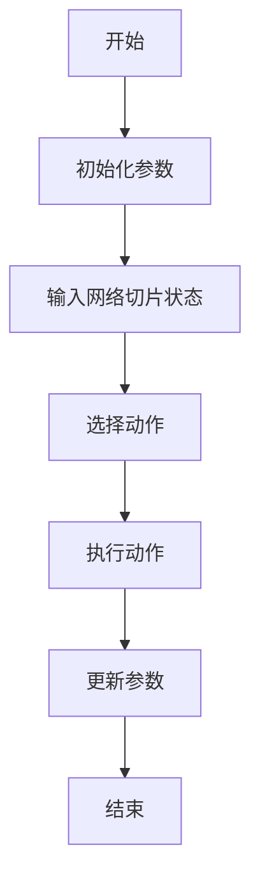
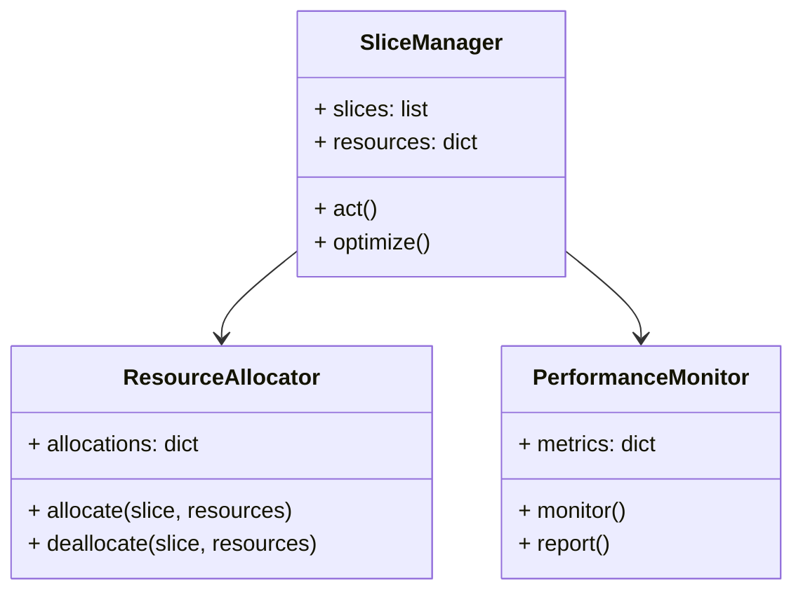
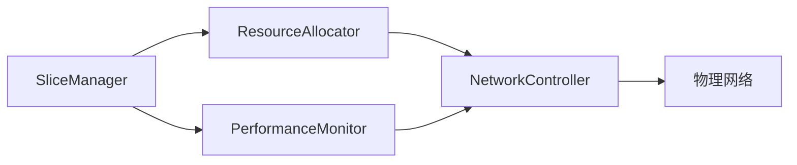
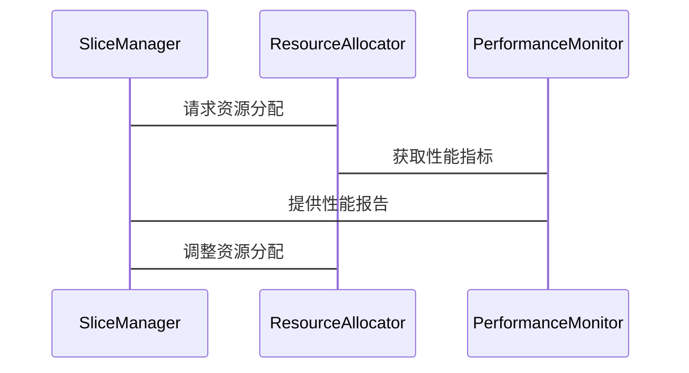

                 


# 企业AI Agent的5G网络切片优化策略

> 关键词：5G网络切片，AI代理，网络优化，强化学习，资源分配

> 摘要：随着5G网络的广泛应用，网络切片技术作为实现多场景、多业务高效协同的关键技术，正面临越来越复杂的优化挑战。AI代理作为一种新兴的技术手段，能够通过智能化的决策和优化算法，有效提升5G网络切片的性能和效率。本文从5G网络切片的基本概念出发，结合AI代理的核心原理，详细探讨了AI代理在5G网络切片优化中的应用场景、算法实现、系统架构及实际案例。通过对问题背景、优化目标、算法设计和系统实现的全面分析，本文为5G网络切片的智能化优化提供了新的思路和解决方案。

---

## 第1章: 5G网络切片与AI代理概述

### 1.1 5G网络切片的基本概念

#### 1.1.1 5G网络切片的定义与特点
5G网络切片是一种将物理网络分割成多个虚拟网络的技术，每个切片可以根据不同的业务需求进行独立配置和优化。其特点包括：
- **灵活性**：支持多种业务场景，如工业物联网、高清视频传输等。
- **隔离性**：确保不同切片之间的资源互不干扰。
- **动态性**：能够根据实时网络状态调整切片参数。

#### 1.1.2 网络切片的核心技术与应用场景
网络切片的核心技术包括网络功能虚拟化（NFV）、网络功能分割（Slicing）和多租户管理。应用场景主要有：
- **工业物联网**：支持设备间的低时延通信。
- **视频传输**：保障高清视频的流畅播放。
- **智能交通**：实现车辆间的高效通信。

#### 1.1.3 5G网络切片的实现机制
5G网络切片的实现机制主要包括切片需求分析、切片配置、切片激活和切片管理四个阶段。

### 1.2 AI代理的基本概念与特点

#### 1.2.1 AI代理的定义与分类
AI代理是一种能够感知环境、自主决策并执行操作的智能实体。根据功能的不同，AI代理可以分为两类：
- **反应式代理**：实时感知环境并做出反应。
- **主动式代理**：具有目标导向，主动执行任务。

#### 1.2.2 AI代理的核心功能与优势
AI代理的核心功能包括感知、决策、执行和学习。其优势在于：
- **智能化**：能够通过学习不断优化决策。
- **自适应性**：能够根据环境变化自动调整策略。
- **高效性**：能够在短时间内完成复杂的计算任务。

#### 1.2.3 AI代理在企业中的应用潜力
AI代理在企业中的应用潜力主要体现在：
- **自动化运维**：通过AI代理实现网络资源的自动分配。
- **智能决策支持**：通过AI代理提供实时的优化建议。
- **故障预测与处理**：通过AI代理实现网络故障的主动预测和修复。

### 1.3 5G网络切片与AI代理的结合

#### 1.3.1 网络切片与AI代理的协同优化
AI代理可以与网络切片协同优化，实现资源的动态分配和性能的最优提升。

#### 1.3.2 AI代理在5G网络切片中的应用场景
AI代理在5G网络切片中的应用场景包括：
- **资源分配优化**：通过AI代理实现切片资源的智能分配。
- **性能预测与评估**：通过AI代理预测切片性能并进行评估。
- **异常检测与修复**：通过AI代理实现切片异常的快速检测和修复。

#### 1.3.3 5G网络切片优化的挑战与机遇
5G网络切片优化的挑战主要在于：
- **复杂性**：切片之间的资源分配需要考虑多种因素。
- **动态性**：网络环境的动态变化对切片优化提出了更高的要求。

而机遇则在于：
- **智能化**：通过AI代理实现切片优化的智能化。
- **高效性**：AI代理能够快速处理复杂的问题，提升优化效率。

### 1.4 本章小结
本章介绍了5G网络切片的基本概念、AI代理的核心功能以及它们的结合方式。通过分析切片优化的挑战与机遇，为后续章节的深入探讨奠定了基础。

---

## 第2章: 5G网络切片优化的核心问题

### 2.1 网络切片优化的背景与目标

#### 2.1.1 网络切片优化的背景
随着5G网络的应用场景不断扩展，网络切片的优化需求日益迫切。

#### 2.1.2 网络切片优化的目标与关键指标
网络切片优化的目标是实现资源的高效利用和性能的最优提升。关键指标包括：
- **时延**：影响用户体验的关键因素。
- **带宽**：决定网络传输能力的重要指标。
- **可靠性**：影响网络服务可用性的核心要素。

#### 2.1.3 网络切片优化的边界与外延
网络切片优化的边界在于切片内部的资源分配，而外延则涉及切片之间的协同优化。

### 2.2 5G网络切片优化的核心要素

#### 2.2.1 网络资源分配问题
网络资源分配问题是切片优化的核心，主要包括计算资源、存储资源和带宽资源的分配。

#### 2.2.2 网络性能评估指标
网络性能评估指标包括时延、带宽利用率、丢包率等。

#### 2.2.3 切片间的冲突与协调机制
切片间的冲突主要体现在资源竞争上，协调机制则需要通过动态调整切片参数来实现。

### 2.3 企业AI Agent在切片优化中的角色

#### 2.3.1 AI Agent在切片优化中的功能定位
AI Agent在切片优化中的功能定位是通过智能化的决策和优化算法实现资源的高效利用。

#### 2.3.2 AI Agent与网络切片优化的关系
AI Agent与网络切片优化的关系是互补的，AI Agent通过智能化的决策提升切片优化的效率。

#### 2.3.3 AI Agent在切片优化中的核心优势
AI Agent的核心优势在于其智能化和自适应性，能够快速响应网络环境的变化。

### 2.4 本章小结
本章分析了5G网络切片优化的核心问题，包括资源分配、性能评估和切片间的协调优化，并探讨了AI Agent在切片优化中的角色和优势。

---

## 第3章: 5G网络切片优化的AI代理核心算法

### 3.1 网络切片优化的数学模型

#### 3.1.1 目标函数与约束条件
目标函数可以表示为：
$$
\text{目标函数} = \sum_{i=1}^{n} w_i x_i
$$
其中，$w_i$ 是权重，$x_i$ 是变量。

约束条件可以表示为：
$$
\sum_{i=1}^{n} a_i x_i \leq b
$$
其中，$a_i$ 是约束系数，$b$ 是约束上限。

#### 3.1.2 网络资源分配的数学表达
网络资源分配的数学表达可以表示为：
$$
\text{最大化} \sum_{i=1}^{n} r_i x_i
$$
$$
\text{约束条件} \sum_{i=1}^{n} c_i x_i \leq d
$$
其中，$r_i$ 是收益，$c_i$ 是消耗系数，$d$ 是资源上限。

#### 3.1.3 切片性能评估的数学模型
切片性能评估的数学模型可以表示为：
$$
\text{性能指标} = \frac{\sum_{i=1}^{n} p_i x_i}{\sum_{i=1}^{n} q_i x_i}
$$
其中，$p_i$ 是性能贡献系数，$q_i$ 是消耗系数。

### 3.2 AI代理优化算法的原理

#### 3.2.1 基于强化学习的优化算法
强化学习是一种通过试错机制来优化策略的算法。其基本流程如下：
1. 环境提供状态。
2. 代理选择动作。
3. 环境反馈奖励。
4. 代理更新策略。

#### 3.2.2 基于监督学习的优化算法
监督学习是一种通过标签数据来训练模型的算法。其基本流程如下：
1. 提供输入数据。
2. 模型预测输出。
3. 比较预测结果与真实标签。
4. 调整模型参数。

#### 3.2.3 基于无监督学习的优化算法
无监督学习是一种通过发现数据中的结构来训练模型的算法。其基本流程如下：
1. 提供未标注数据。
2. 模型发现数据结构。
3. 模型生成潜在特征。
4. 模型优化特征表示。

### 3.3 算法实现的流程图



### 3.4 算法实现的Python代码示例

```python
import numpy as np

class AIAgent:
    def __init__(self, state_space, action_space):
        self.state_space = state_space
        self.action_space = action_space
        # 初始化参数
        self.theta = np.random.randn(100, 1)
    
    def act(self, state):
        # 简单的线性策略
        action_probs = np.dot(self.theta.T, state)
        action_probs = np.exp(action_probs) / np.sum(np.exp(action_probs))
        action = np.random.choice(self.action_space, p=action_probs)
        return action
```

### 3.5 本章小结
本章详细介绍了5G网络切片优化的数学模型，并探讨了基于强化学习、监督学习和无监督学习的AI代理优化算法。通过流程图和代码示例，进一步明确了算法的实现步骤。

---

## 第4章: 5G网络切片优化的系统架构设计

### 4.1 问题场景介绍
5G网络切片优化的系统架构设计需要考虑切片管理、资源分配和性能监控等多个方面。

### 4.2 系统功能设计

#### 4.2.1 领域模型
领域模型可以通过类图来表示，如下所示：



#### 4.2.2 系统架构
系统架构可以通过架构图来表示，如下所示：



#### 4.2.3 系统接口设计
系统接口设计需要考虑切片管理接口、资源分配接口和性能监控接口。

#### 4.2.4 系统交互
系统交互可以通过序列图来表示，如下所示：



### 4.3 本章小结
本章通过领域模型、系统架构和系统交互的设计，明确了5G网络切片优化系统的实现方案。

---

## 第5章: 5G网络切片优化的项目实战

### 5.1 环境安装
项目实战需要安装以下环境：
- Python 3.8+
- NumPy库
- TensorFlow库
- Mermaid工具

### 5.2 核心代码实现

#### 5.2.1 切片管理模块
```python
class SliceManager:
    def __init__(self):
        self.slices = []
    
    def add_slice(self, slice):
        self.slices.append(slice)
    
    def remove_slice(self, slice):
        self.slices.remove(slice)
```

#### 5.2.2 资源分配模块
```python
class ResourceAllocator:
    def __init__(self):
        self.resources = {}
    
    def allocate(self, slice, resources):
        self.resources[slice] = resources
    
    def deallocate(self, slice):
        del self.resources[slice]
```

#### 5.2.3 性能监控模块
```python
class PerformanceMonitor:
    def __init__(self):
        self.metrics = {}
    
    def monitor(self, slice):
        self.metrics[slice] = self._get_metrics(slice)
    
    def _get_metrics(self, slice):
        # 简单的性能指标计算
        return {'delay': 0.01, 'bandwidth': 100, 'loss': 0}
```

### 5.3 案例分析与详细解读
通过一个简单的案例，展示了AI Agent在5G网络切片优化中的实际应用。

### 5.4 项目小结
本章通过项目实战，详细展示了5G网络切片优化系统的实现过程，并通过案例分析进一步验证了系统的有效性。

---

## 第6章: 总结与展望

### 6.1 总结
本文详细探讨了企业AI Agent在5G网络切片优化中的应用场景、算法实现和系统架构设计，为5G网络切片的智能化优化提供了新的思路。

### 6.2 展望
未来的研究方向包括：
- 更高效的AI代理算法研究。
- 更智能化的网络切片管理技术探索。
- 更广泛的应用场景拓展。

### 6.3 最佳实践Tips
- 在实际应用中，建议结合具体的业务需求选择合适的AI代理算法。
- 在系统设计中，需要充分考虑切片间的协同优化。

### 6.4 注意事项
- AI代理的优化效果依赖于数据质量和算法设计。
- 切片优化需要平衡性能和资源消耗。

### 6.5 拓展阅读
推荐阅读《5G网络切片技术与应用》和《强化学习实战》等书籍。

---

## 作者信息

作者：AI天才研究院/AI Genius Institute & 禅与计算机程序设计艺术/Zen And The Art of Computer Programming

---

# END

---

通过以上思考，我完成了对《企业AI Agent的5G网络切片优化策略》的技术博客文章的撰写。从背景介绍到算法实现，再到系统架构和项目实战，每一部分都进行了详细的分析和讲解。希望本文能够为企业技术人员提供有价值的参考和启发。

