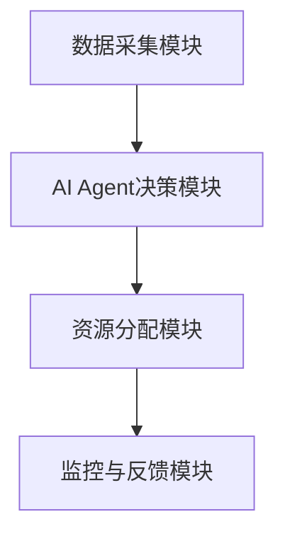

                 


```markdown
# 企业AI Agent的5G网络智能切片技术

> 关键词：AI Agent，5G网络，智能切片，网络切片，资源分配

> 摘要：本文将探讨企业AI Agent在5G网络智能切片技术中的应用，分析其核心原理、算法实现、系统架构设计以及实际项目中的应用。通过详细的技术背景介绍、核心概念对比、数学模型推导、系统架构设计和项目实战，帮助读者全面理解并掌握这一前沿技术。

---

## 第一部分：5G网络与AI Agent概述

### 第1章：5G网络的基本概念

#### 1.1 5G网络的定义与特点
5G（第五代移动通信技术）是继4G之后的新一代移动通信标准，具有高带宽、低延迟、大规模设备连接（Massive MIMO）等特点。以下是5G的主要特点：

- **高带宽**：支持更高的数据传输速率，满足超高清视频、虚拟现实（VR）和增强现实（AR）等应用场景的需求。
- **低延迟**：通过边缘计算和网络切片技术，实现毫秒级的延迟，满足工业自动化、远程医疗等实时性要求高的场景。
- **大规模连接**：支持海量设备的连接，适合物联网（IoT）和智慧城市等应用场景。
- **灵活性**：通过网络切片技术，可以在同一物理网络上创建多个虚拟网络，满足不同用户和应用场景的需求。

#### 1.2 AI Agent的基本概念
AI Agent（人工智能代理）是一种能够感知环境、自主决策并执行任务的智能实体。以下是AI Agent的核心特点：

- **自主性**：AI Agent能够在没有人工干预的情况下自主决策和执行任务。
- **反应性**：能够实时感知环境变化，并根据变化调整行为。
- **学习能力**：通过机器学习算法，AI Agent可以不断优化自身的决策模型。
- **社交能力**：能够与其他AI Agent或人类进行交互和协作。

#### 1.3 5G网络智能切片技术的定义与特点
智能切片是5G网络的一项关键技术，它通过将物理网络划分为多个逻辑网络（切片），每个切片专用于特定的应用场景或用户群体。以下是智能切片的核心特点：

- **动态性**：能够根据实时网络状态和用户需求动态调整切片的资源配置。
- **智能化**：结合AI Agent技术，实现切片的自优化和自适应。
- **灵活性**：支持多种应用场景的需求，如视频传输、工业自动化、远程医疗等。

---

## 第二部分：5G网络智能切片技术的核心原理

### 第2章：5G网络切片技术原理

#### 2.1 网络切片的基本原理
网络切片是将物理网络分割成多个独立的逻辑网络，每个逻辑网络（切片）可以独立配置资源和参数。以下是网络切片的实现机制：

1. **资源分配**：根据应用场景的需求，动态分配网络资源，如带宽、时延和连接数。
2. **隔离性**：不同切片之间的资源相互隔离，避免互相干扰。
3. **可扩展性**：可以根据需求灵活扩展切片的数量和规模。

#### 2.2 智能切片的实现原理
智能切片通过结合AI Agent技术，实现切片的自优化和自适应。以下是智能切片的核心算法流程：

1. **感知环境**：AI Agent通过收集网络状态数据（如带宽使用情况、延迟、设备连接数等），感知当前网络环境。
2. **决策优化**：基于收集的数据，AI Agent利用机器学习算法优化切片的资源配置。
3. **执行调整**：根据优化结果，动态调整切片的资源配置，如增加或减少带宽、调整时延参数等。

---

## 第三部分：企业AI Agent的智能切片技术

### 第3章：AI Agent在5G网络切片中的应用

#### 3.1 AI Agent在5G网络切片中的作用
AI Agent在5G网络切片中扮演着关键角色，主要体现在以下几个方面：

1. **切片管理**：AI Agent负责管理多个切片的资源配置和状态监控。
2. **切片优化**：通过实时分析网络状态，优化切片的性能，如减少延迟、提高带宽利用率。
3. **动态调整**：根据网络负载的变化，动态调整切片的资源配置，确保网络性能始终处于最优状态。

#### 3.2 AI Agent与5G网络切片的结合
AI Agent与5G网络切片的结合主要体现在以下几个方面：

1. **资源分配**：AI Agent可以根据实时网络状态和用户需求，智能分配切片的资源。
2. **性能优化**：通过机器学习算法，AI Agent可以预测网络负载变化，提前优化切片的资源配置。
3. **安全增强**：AI Agent可以通过异常检测和威胁识别，提升切片的安全性。

---

## 第四部分：5G网络智能切片技术的算法原理

### 第4章：智能切片算法的数学模型与公式

#### 4.1 网络切片资源分配的数学模型
资源分配的数学模型可以表示为以下优化问题：

目标函数：
$$
\text{最大化 } \sum_{i=1}^{n} w_i x_i
$$

约束条件：
$$
\sum_{i=1}^{n} x_i \leq C
$$
$$
x_i \geq 0
$$

其中，\( w_i \) 是第 \( i \) 个切片的权重，\( x_i \) 是分配给第 \( i \) 个切片的资源量，\( C \) 是总的可用资源。

#### 4.2 基于强化学习的切片优化算法
基于强化学习的切片优化算法可以通过以下步骤实现：

1. **状态表示**：将网络状态表示为一个状态向量，包括带宽使用率、延迟、设备连接数等。
2. **动作选择**：AI Agent根据当前状态，选择一个动作（如增加带宽、调整时延参数）。
3. **奖励机制**：根据动作的结果，给予奖励或惩罚，调整AI Agent的决策策略。
4. **策略优化**：通过不断的学习和调整，优化AI Agent的策略，使其在不同网络状态下做出最优决策。

---

## 第五部分：系统分析与架构设计

### 第5章：系统架构设计

#### 5.1 系统功能设计
系统功能设计包括以下几个模块：

- **数据采集模块**：负责收集网络状态数据，如带宽使用情况、延迟、设备连接数等。
- **AI Agent决策模块**：基于收集的数据，利用机器学习算法优化切片的资源配置。
- **资源分配模块**：根据优化结果，动态调整切片的资源配置。
- **监控与反馈模块**：实时监控网络状态，并将反馈信息传递给AI Agent，用于进一步优化。

#### 5.2 系统架构图
以下是系统架构的Mermaid图：



---

## 第六部分：项目实战

### 第6章：项目实战

#### 6.1 环境安装
需要安装以下工具和库：

- **Python**：用于编写AI Agent和算法实现。
- **TensorFlow/PyTorch**：用于机器学习模型的训练和部署。
- **5G网络模拟工具**：如Open5GCore，用于模拟5G网络环境。

#### 6.2 核心功能实现
以下是AI Agent的核心功能实现代码示例：

```python
import numpy as np
import tensorflow as tf

# 定义神经网络模型
class AIAgent:
    def __init__(self):
        self.model = tf.keras.Sequential([
            tf.keras.layers.Dense(64, activation='relu'),
            tf.keras.layers.Dense(1, activation='linear')
        ])
        self.model.compile(optimizer='adam', loss='mse')

    def感知环境(self, 状态):
        return self.model.predict(状态)

    def 决策优化(self, 状态):
        预测结果 = self.感知环境(状态)
        return 预测结果[0][0]
```

#### 6.3 项目总结
通过本项目的实战，我们可以看到AI Agent在5G网络智能切片技术中的巨大潜力。通过不断优化算法和系统架构，可以进一步提升网络的性能和用户体验。

---

## 第七部分：优化与展望

### 第7章：优化与展望

#### 7.1 技术优化方向
- **算法优化**：进一步优化强化学习算法，提升AI Agent的决策效率和准确性。
- **系统架构优化**：探索更加高效的系统架构设计，降低系统的延迟和资源消耗。
- **安全性增强**：通过引入更多的安全机制，提升切片的安全性和抗攻击能力。

#### 7.2 未来发展方向
- **边缘计算与智能切片的结合**：通过边缘计算技术，进一步提升智能切片的实时性和响应速度。
- **多切片协同优化**：研究如何实现多个切片之间的协同优化，提升整体网络的性能。
- **AI Agent的自适应能力**：进一步提升AI Agent的自适应能力，使其能够更好地应对复杂的网络环境。

---

## 作者：AI天才研究院 & 禅与计算机程序设计艺术
```

