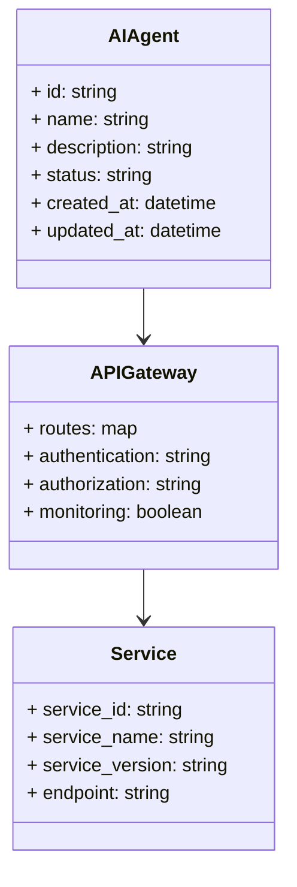
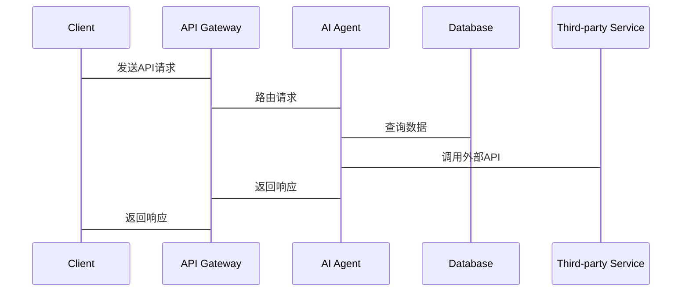

                 


# 企业AI Agent的API设计与管理

> 关键词：API设计，企业AI Agent，API管理，AI开发，API安全

> 摘要：本文深入探讨了企业AI Agent的API设计与管理的关键问题，从核心概念到系统架构，从实战案例到最佳实践，全面解析了如何高效设计和管理企业AI Agent的API。文章内容涵盖API设计原则、API管理平台构建、API安全与监控、API架构设计、系统交互流程等，旨在为企业技术架构师、开发者和管理人员提供实用的指导和参考。

---

# 第1章 企业AI Agent概述

## 1.1 AI Agent的基本概念

### 1.1.1 什么是AI Agent
AI Agent（人工智能代理）是指能够感知环境、自主决策并执行任务的智能体。它通过与环境交互，利用传感器获取信息，通过执行器采取行动，实现特定目标。

### 1.1.2 AI Agent的核心特征
AI Agent具有以下几个核心特征：
- **自主性**：能够在没有外部干预的情况下运行。
- **反应性**：能够感知环境并实时响应。
- **目标导向性**：具备明确的目标，所有行为都围绕目标展开。
- **学习能力**：能够通过数据和经验不断优化自身的决策能力。

### 1.1.3 企业级AI Agent的定义与特点
企业级AI Agent是专门为企业的业务场景设计的智能代理，具有以下特点：
- **企业级能力**：能够处理复杂的业务逻辑，支持企业级的决策和执行。
- **高可用性**：具备7×24小时运行能力，确保企业业务的连续性。
- **可扩展性**：能够根据业务需求快速扩展能力。
- **安全性**：严格遵循企业安全规范，保护数据和系统的安全。

---

## 1.2 企业AI Agent的应用场景

### 1.2.1 企业智能化转型的需求
随着企业数字化转型的推进，智能化需求日益增长。AI Agent能够帮助企业实现自动化决策、智能化运营和高效问题解决。

### 1.2.2 AI Agent在企业中的典型应用
1. **智能客服**：通过自然语言处理技术，为企业提供智能问答和客户支持服务。
2. **自动化运维**：通过AI Agent实现系统监控、故障诊断和自动修复。
3. **智能推荐**：基于用户行为分析，为企业提供个性化的产品推荐。
4. **风险管理**：通过实时数据分析，识别潜在风险并采取应对措施。

### 1.2.3 企业AI Agent的边界与外延
AI Agent的边界在于其功能的实现范围和应用场景，而外延则包括与企业现有系统的集成、数据来源的扩展以及能力的不断增强。

---

## 1.3 本章小结

### 1.3.1 核心概念总结
- AI Agent是具备自主性、反应性、目标导向性和学习能力的智能体。
- 企业级AI Agent能够处理复杂的业务逻辑，具备高可用性和安全性。

### 1.3.2 企业AI Agent的价值与挑战
- **价值**：提升企业效率、降低成本、增强客户体验。
- **挑战**：数据安全、系统集成复杂性、算法优化和性能调优。

---

# 第2章 API设计与管理的核心概念

## 2.1 API设计的基本原则

### 2.1.1 RESTful API设计原则
RESTful API设计原则包括：
1. **资源化**：将功能模块抽象为资源。
2. **统一接口**：使用HTTP方法（GET、POST、PUT、DELETE）进行操作。
3. **状态管理**：通过状态码和返回数据进行状态反馈。
4. **缓存控制**：合理使用缓存机制提高性能。

### 2.1.2 API版本控制策略
API版本控制可以通过URL、请求头或自定义字段实现，确保不同版本的API能够共存和兼容。

### 2.1.3 API文档编写规范
API文档应包含接口描述、请求格式、返回格式、错误码和示例，确保开发者能够快速理解和使用API。

---

## 2.2 API管理平台的构建

### 2.2.1 API网关的功能与作用
API网关是企业API管理的核心组件，负责API的路由转发、权限控制、流量监控和日志记录。

### 2.2.2 API生命周期管理
API的生命周期包括设计、开发、测试、发布、监控和优化，API管理平台应支持每个阶段的操作。

### 2.2.3 API监控与日志分析
通过日志分析工具，实时监控API的性能指标，包括响应时间、请求量和错误率，并根据日志数据进行异常检测和告警。

---

## 2.3 API安全与权限管理

### 2.3.1 API认证与授权机制
常用认证方式包括JWT、OAuth 2.0等，授权机制则通过权限校验实现。

### 2.3.2 OAuth 2.0协议的应用
OAuth 2.0协议通过令牌机制实现API的认证和授权，确保API的安全访问。

### 2.3.3 API安全威胁与防护措施
主要的安全威胁包括SQL注入、XSS攻击和未授权访问，可通过输入过滤、身份验证和访问控制等措施进行防护。

---

## 2.4 本章小结

### 2.4.1 API设计与管理的关键点
- 设计原则：资源化、统一接口、状态管理和缓存控制。
- 管理平台：API网关、生命周期管理和监控日志。

### 2.4.2 企业AI Agent中的API角色
API是企业AI Agent与企业系统和其他服务交互的核心通道，确保API的设计和管理至关重要。

---

# 第3章 企业AI Agent的API设计原理

## 3.1 AI Agent与API的关系

### 3.1.1 AI Agent如何通过API实现功能
AI Agent通过调用企业内部和外部的API，获取数据、触发服务、执行操作，完成任务。

### 3.1.2 AI Agent的API设计原则
1. **模块化设计**：将AI Agent的功能模块化，每个模块通过API进行通信。
2. **可扩展性**：确保API能够支持AI Agent的能力扩展。
3. **高可用性**：设计容错机制，确保API的稳定运行。

---

## 3.2 AI Agent的API架构设计

### 3.2.1 面向服务架构（SOA）的应用
SOA架构将企业系统划分为多个服务，通过API实现服务之间的通信和协作。

### 3.2.2 微服务架构下的API设计
微服务架构通过API网关统一暴露服务接口，实现服务间的解耦和高效通信。

### 3.2.3 API网关在企业AI Agent中的作用
API网关负责API的路由转发、权限校验和流量控制，确保企业AI Agent能够安全、高效地访问所需服务。

---

## 3.3 AI Agent的API交互流程

### 3.3.1 请求处理流程
1. AI Agent接收用户的请求。
2. 通过API网关调用后端服务。
3. 后端服务处理请求并返回结果。
4. AI Agent将结果反馈给用户。

### 3.3.2 响应返回机制
通过异步处理和队列机制，确保API的响应速度和系统的稳定性。

### 3.3.3 错误处理与重试策略
通过错误码和日志记录，快速定位和解决API调用中的问题，并通过重试机制保证任务的完成。

---

## 3.4 本章小结

### 3.4.1 API设计的核心要点
- 模块化设计、可扩展性和高可用性。
- SOA和微服务架构的应用。
- API网关的作用。

### 3.4.2 企业AI Agent中的API设计挑战
- 复杂的业务逻辑处理。
- 多系统集成和API兼容性问题。
- API性能优化和安全性保障。

---

# 第4章 企业AI Agent的API管理与监控

## 4.1 API管理平台的功能模块

### 4.1.1 API注册与发现
API管理平台提供API的注册、发现和文档管理功能，方便开发者快速接入和使用。

### 4.1.2 API流量控制
通过设置速率限制和配额管理，确保API的稳定运行和性能优化。

### 4.1.3 API性能监控
通过监控工具实时跟踪API的性能指标，包括响应时间、吞吐量和错误率。

---

## 4.2 API监控与日志分析

### 4.2.1 API性能指标
包括响应时间、吞吐量、错误率和请求量等关键指标。

### 4.2.2 日志分析工具的应用
通过日志分析工具，提取有用信息，快速定位和解决问题。

### 4.2.3 异常检测与告警
基于机器学习的异常检测算法，实时监控API运行状态，并在检测到异常时触发告警。

---

## 4.3 API安全与合规管理

### 4.3.1 数据隐私保护
通过数据加密、访问控制和匿名化处理，确保API的数据安全和隐私保护。

### 4.3.2 API访问控制
通过身份验证和权限校验，确保只有合法用户能够访问API。

### 4.3.3 合规性要求与实现
遵循企业内部的安全规范和相关法律法规，确保API的合规性。

---

## 4.4 本章小结

### 4.4.1 API管理的核心要点
- API注册、发现和文档管理。
- 流量控制和性能监控。
- 数据安全和访问控制。

### 4.4.2 企业AI Agent中的API管理挑战
- 复杂的权限管理。
- 数据安全与隐私保护。
- 实时监控与异常检测。

---

# 第5章 企业AI Agent的API系统架构设计

## 5.1 问题场景介绍
企业AI Agent需要与企业内部系统、第三方服务以及其他AI Agent进行交互，API的设计和管理至关重要。

## 5.2 项目介绍
设计并实现一个企业级AI Agent的API架构，确保其具备高可用性、可扩展性和安全性。

---

## 5.3 系统功能设计

### 5.3.1 领域模型设计


---

### 5.3.2 系统架构设计


---

### 5.3.3 系统接口设计
系统接口设计包括：
1. API Gateway接口：处理API请求和响应。
2. AI Agent接口：处理业务逻辑和数据处理。
3. Third-party Service接口：调用外部服务API。

---

### 5.3.4 系统交互流程


---

## 5.4 本章小结

### 5.4.1 系统架构设计总结
- 系统架构设计包括领域模型、系统架构图和系统交互图。
- 通过API Gateway实现API的统一管理和服务调用。

### 5.4.2 系统架构设计的关键点
- 明确系统组件及其关系。
- 设计合理的接口和交互流程。
- 确保系统的高可用性和可扩展性。

---

# 第6章 企业AI Agent的API项目实战

## 6.1 环境安装

### 6.1.1 安装所需工具
- 安装Python、Django框架、Django REST Framework。
- 安装Django REST framework和Django OAuth Toolkit。

### 6.1.2 安装API管理工具
- 使用Apigee或Postman进行API设计和测试。

---

## 6.2 系统核心实现源代码

### 6.2.1 AI Agent的API实现
```python
from rest_framework.views import APIView
from rest_framework.response import Response
from rest_framework import status
from .models import AIAgent
from .serializers import AI_AGENTSerializer

class AIAgentAPIView(APIView):
    def post(self, request, format=None):
        serializer = AI_AGENTSerializer(data=request.data)
        if serializer.is_valid():
            AIAgent.objects.create(**serializer.validated_data)
            return Response(serializer.data, status=status.HTTP_201_CREATED)
        return Response(serializer.errors, status=status.HTTP_400_BAD_REQUEST)
```

---

### 6.2.2 API网关实现
```python
from django.urls import path
from .views import AIAgentAPIView

urlpatterns = [
    path('ai-agents/', AIAgentAPIView.as_view()),
]
```

---

## 6.3 代码应用解读与分析
- 通过Django REST framework实现API接口，确保RESTful API的设计。
- 使用序列化器和视图类，简化API的开发和维护。

---

## 6.4 实际案例分析
- 某企业AI Agent通过API实现智能客服功能，调用内部CRM系统和外部天气API，提供个性化的客户服务。

---

## 6.5 本章小结

### 6.5.1 项目实战总结
- 通过Django REST framework快速实现企业AI Agent的API。
- 使用API网关实现API的统一管理和服务调用。

### 6.5.2 项目实战的关键点
- 合理选择开发框架和工具。
- 确保API的设计符合RESTful原则。
- 重视API的安全性和性能优化。

---

# 第7章 企业AI Agent的API最佳实践与小结

## 7.1 最佳实践 tips

### 7.1.1 API设计
- 遵循RESTful原则，确保API的简洁性和可扩展性。
- 提供详细的API文档和示例，方便开发者使用。

### 7.1.2 API管理
- 使用专业的API管理平台，实现API的统一管理和监控。
- 定期进行API的性能优化和安全检查。

### 7.1.3 API监控
- 实时监控API的性能指标，及时发现和解决问题。
- 通过日志分析工具，深入挖掘API的运行状态。

---

## 7.2 本章小结

### 7.2.1 核心内容总结
- 企业AI Agent的API设计与管理是实现企业智能化的关键。
- 通过合理的API设计和高效的API管理，确保企业AI Agent的高效运行。

### 7.2.2 未来展望
- 随着AI技术的不断发展，企业AI Agent的API设计与管理将更加复杂和重要。
- 人工智能、大数据和区块链等技术的结合，将为企业AI Agent的API设计与管理带来新的机遇和挑战。

---

# 作者：AI天才研究院/AI Genius Institute & 禅与计算机程序设计艺术 /Zen And The Art of Computer Programming

