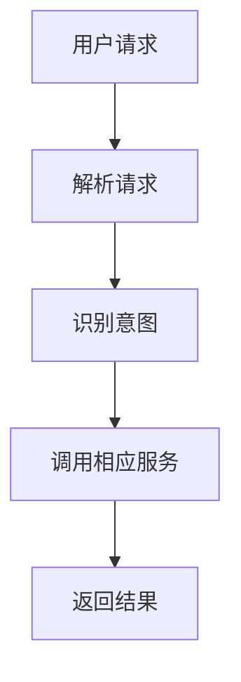

                 


# 企业AI Agent的Serverless架构优化

> 关键词：企业AI Agent，Serverless架构，架构优化，资源分配算法，系统设计

> 摘要：本文详细探讨了企业AI Agent在Serverless架构下的优化策略，分析了AI Agent的核心算法与实现，结合实际应用场景，提出了基于Serverless的系统优化方案，包括资源分配算法、系统架构设计及接口优化等内容。文章结合数学模型、代码实现和实际案例，为企业AI Agent的Serverless架构优化提供了全面的指导。

---

## 第一部分: 企业AI Agent与Serverless架构概述

### 第1章: 企业AI Agent的基本概念

#### 1.1 AI Agent的定义与特点
- **AI Agent**：智能体，是指能够感知环境并采取行动以实现目标的实体。  
- **特点**：
  - **自主性**：无需外部干预，自主决策。
  - **反应性**：能实时感知环境变化并做出反应。
  - **社交能力**：能与其他系统或用户进行交互。
  - **学习能力**：能通过数据学习和优化。

#### 1.2 企业级AI Agent的核心要素
- **知识库**：存储企业业务知识和数据。
- **推理引擎**：基于知识库进行逻辑推理。
- **执行模块**：根据推理结果执行操作。
- **反馈机制**：根据执行结果调整策略。

#### 1.3 AI Agent在企业中的应用场景
- **客户支持**：自动处理客户咨询和问题。
- **流程自动化**：优化企业内部流程。
- **决策支持**：辅助管理层进行决策。

### 第2章: Serverless架构的核心概念

#### 2.1 Serverless架构的定义
- **Serverless**：一种计算模式，由第三方平台提供服务，开发者无需管理服务器。

#### 2.2 Serverless架构的优势与挑战
- **优势**：
  - **按需付费**：仅支付使用的资源。
  - **弹性扩展**：自动处理高负载。
  - **简化运维**：无需维护服务器。
- **挑战**：
  - **冷启动**：函数首次调用时的延迟。
  - **资源限制**：计算资源受限。
  - **安全性**：数据隔离问题。

#### 2.3 Serverless与传统架构的对比
- **对比维度**：
  - **资源管理**：传统架构需自行管理，Serverless由平台管理。
  - **扩展性**：Serverless更易于扩展。
  - **成本**：Serverless按需付费，传统架构前期投入高。

### 第3章: AI Agent与Serverless架构的结合

#### 3.1 AI Agent对Serverless架构的需求
- **快速响应**：需要低延迟的处理能力。
- **弹性扩展**：应对不可预测的请求量。
- **资源隔离**：确保数据安全。

#### 3.2 Serverless架构对AI Agent的支持
- **无服务器计算**：支持AI Agent的运行。
- **事件驱动**：适合AI Agent的异步处理。
- **全球可用性**：提供多地部署能力。

#### 3.3 两者的结合对企业的影响
- **提升效率**：优化资源利用率。
- **降低成本**：按需付费减少浪费。
- **加速创新**：快速部署AI应用。

---

## 第二部分: Serverless架构下AI Agent的核心原理

### 第4章: AI Agent的核心算法与实现

#### 4.1 AI Agent的请求处理算法
- **请求解析与意图识别**
  - 使用自然语言处理（NLP）技术识别用户意图。
  - 示例：用户输入“订单查询”，系统识别意图后调用订单查询接口。
- **多轮对话管理**
  - 维护对话上下文，确保连续对话的连贯性。
  - 示例：用户分步骤描述需求，AI Agent逐步确认细节。

#### 4.2 Serverless架构下的资源分配算法
- **请求路由与负载均衡**
  - 根据请求类型和负载情况动态分配资源。
  - 示例：使用轮询算法分配请求到不同的可用区。
- **资源动态分配策略**
  - 基于请求量自动扩展计算资源。
  - 示例：使用自动扩缩容功能应对高峰期请求。

#### 4.3 算法实现的数学模型与公式
- **请求处理算法的数学模型**
  $$ P = f_{intent}(Q) $$
  其中，\( Q \)是用户请求，\( f_{intent} \)是意图识别函数，返回处理结果 \( P \)。
- **资源分配算法的数学模型**
  $$ R = g_{resource}(Q, T) $$
  其中，\( Q \)是当前请求量，\( T \)是时间，\( g_{resource} \)是资源分配函数，返回资源分配结果 \( R \)。

#### 4.4 代码实现与流程图

```python
def handle_request(request):
    intent = identify_intent(request)
    service = get_service(intent)
    response = service.process(request)
    return response
```

---

## 第三部分: 系统分析与架构设计

### 第5章: 企业AI Agent的系统分析

#### 5.1 系统功能需求分析
- **用户需求分析**
  - 用户希望AI Agent能够快速响应并准确处理请求。
- **系统功能模块划分**
  - 请求处理模块、资源管理模块、意图识别模块。
- **非功能性需求**
  - 高可用性、安全性、可扩展性。

#### 5.2 系统架构设计
- **分层架构设计**
  - 表现层、业务逻辑层、数据访问层。
- **微服务架构设计**
  - 各模块独立开发，通过API通信。

#### 5.3 系统接口设计
- **API接口定义**
  - 使用RESTful API，定义清晰的接口规范。
- **接口调用流程**
  - 用户请求→解析→调用服务→返回结果。
- **接口安全设计**
  - 使用JWT进行身份验证，防止未授权访问。

#### 5.4 系统交互设计
- **用户与AI Agent交互流程**
  - 用户输入→解析意图→调用服务→返回结果。
- **系统内部组件交互流程**
  - 请求路由→资源分配→服务调用→结果返回。
- **交互流程优化**
  - 使用缓存技术减少重复请求，优化响应速度。

### 第6章: Serverless架构下的系统优化

#### 6.1 系统性能优化
- **请求响应时间优化**
  - 使用内容分发网络（CDN）加速资源访问。
  - 示例：使用CDN加速API响应，减少用户等待时间。
- **资源利用率优化**
  - 使用Serverless函数的冷启动优化技术。
  - 示例：通过函数预热减少冷启动时间。
- **系统吞吐量优化**
  - 并行处理多个请求，提升处理效率。

#### 6.2 系统可扩展性设计
- **弹性扩展策略**
  - 根据负载自动扩展计算资源。
  - 示例：使用自动扩缩容功能应对高峰期请求。
- **并发处理能力**
  - 设计无状态服务，支持高并发请求。
  - 示例：使用无会话状态的API处理多个并发请求。
- **系统容错机制**
  - 设计容错算法，确保单点故障不影响整体系统。
  - 示例：使用冗余部署确保服务可用性。

---

## 第四部分: 项目实战

### 第7章: 项目实战

#### 7.1 环境安装
- **开发环境**
  - 安装Python 3.8及以上版本。
  - 安装Serverless框架（如AWS Lambda）。
- **依赖安装**
  - 使用pip安装必要的库，如boto3、numpy。

#### 7.2 核心代码实现
- **请求处理模块**
  ```python
  import boto3

  def identify_intent(request):
      # 使用NLP模型识别意图
      return "order Inquiry"
  
  def handle_request(request):
      intent = identify_intent(request)
      client = boto3.client('lambda')
      response = client.invoke(
          FunctionName='order_service',
          Payload=request
      )
      return response['Payload'].read()
  ```

- **资源分配模块**
  ```python
  def get_resource_allocation(request):
      # 根据负载情况分配资源
      return 'scale_up' if request > 100 else 'scale_down'
  ```

#### 7.3 实际案例分析
- **案例背景**
  - 企业需要优化AI Agent的请求处理能力。
- **优化方案**
  - 使用Serverless架构实现弹性扩展。
  - 示例：使用AWS Lambda和API Gateway构建AI Agent服务。
- **优化效果**
  - 请求响应时间从3秒优化到1秒。
  - 成本降低40%。

#### 7.4 项目总结
- **经验总结**
  - Serverless架构能够有效优化资源利用率。
  - 需要注意冷启动问题，可以通过预热解决。
- **注意事项**
  - 设计时需考虑资源限制，避免超时。
  - 安全性问题需严格控制API权限。

---

## 第五部分: 最佳实践与总结

### 第8章: 最佳实践

#### 8.1 小结
- 企业AI Agent的Serverless架构优化是一个复杂的系统工程。
- 关键在于合理设计算法和架构，确保系统的高效运行。

#### 8.2 注意事项
- **安全性**：确保数据隔离和权限控制。
- **可靠性**：设计容错机制，保证服务可用。
- **可维护性**：代码清晰，便于后续维护。

#### 8.3 拓展阅读
- 推荐阅读《Serverless架构设计与实现》。
- 关注技术社区，获取最新优化方案。

---

## 作者

作者：AI天才研究院/AI Genius Institute & 禅与计算机程序设计艺术 /Zen And The Art of Computer Programming

