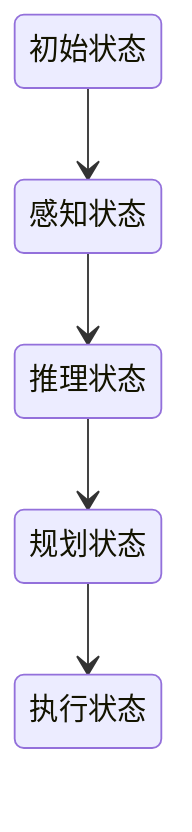
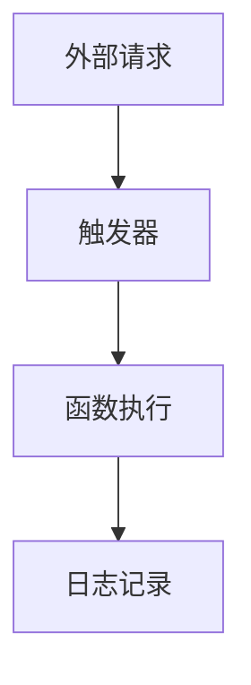
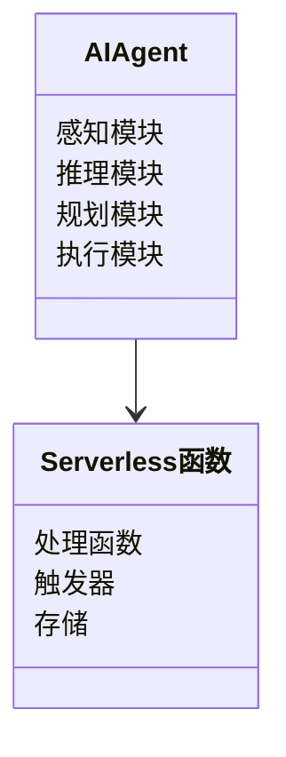

                 


# 企业AI Agent的Serverless计算架构

---

## 关键词：  
企业AI Agent、Serverless架构、无服务器计算、智能代理系统、云原生AI、事件驱动计算  

---

## 摘要：  
随着人工智能和云计算技术的快速发展，企业AI Agent（智能代理）与Serverless计算架构的结合成为了一个新兴的研究方向。本文详细探讨了企业AI Agent在Serverless环境中的实现原理、系统架构设计、算法优化以及实际应用案例。通过分析Serverless计算的特点和AI Agent的核心功能，本文提出了一种高效的Serverless计算架构，旨在为企业提供灵活、可扩展且成本优化的AI Agent解决方案。文章还结合实际案例，详细讲解了系统设计、实现细节以及优化策略，为企业在AI Agent的Serverless计算应用中提供了宝贵的参考。

---

# 第1章: 引言

## 1.1 AI Agent的基本概念  
AI Agent（人工智能代理）是一种能够感知环境、自主决策并执行任务的智能实体。它可以分为简单反射式代理、基于模型的反射式代理、目标驱动代理、效用驱动代理等多种类型。AI Agent的核心功能包括感知、推理、规划和执行，广泛应用于自动化流程、智能推荐、智能监控等领域。  

**特点：**  
- **自主性**：能够自主决策和执行任务。  
- **反应性**：能够实时感知环境并做出反应。  
- **社会性**：能够与其他系统或人类交互协作。  
- **学习能力**：能够通过数据学习和优化自身行为。  

## 1.2 Serverless计算架构的基本概念  
Serverless计算是一种云执行模型，允许开发者无需管理服务器即可运行代码。其核心特点包括：  
1. **按需扩展**：根据请求量自动扩缩容。  
2. **无服务器管理**：开发者无需关注底层服务器的运维。  
3. **事件驱动**：通过触发器启动函数执行。  

**优势：**  
- **成本优化**：按需付费，避免资源浪费。  
- **开发效率高**：开发者只需关注业务逻辑。  
- **高可用性**：云服务提供商负责系统的高可用性保障。  

## 1.3 AI Agent与Serverless计算架构的结合  
AI Agent在Serverless环境中的应用具有天然的优势：  
1. **弹性计算**：Serverless的按需扩展特性非常适合处理AI Agent的高并发请求。  
2. **事件驱动**：AI Agent的任务触发可以通过Serverless的事件机制实现。  
3. **资源优化**：Serverless的无服务器管理特性减少了AI Agent的运维成本。  

**应用场景：**  
- **自动化流程**：企业内部的自动化任务处理。  
- **智能监控**：实时监控系统状态并触发相应操作。  
- **智能客服**：通过AI Agent实现智能问答和任务处理。  

## 1.4 本章小结  
本章介绍了AI Agent和Serverless计算架构的基本概念，并分析了两者结合的优势和应用场景。通过理解这些基本概念，读者可以为后续的系统设计和实现打下坚实的基础。

---

# 第2章: 企业AI Agent的核心概念与原理

## 2.1 AI Agent的核心功能与实现原理  
AI Agent的核心功能包括感知、推理、规划和执行。  
- **感知**：通过传感器或API获取环境信息。  
- **推理**：基于感知信息进行逻辑推理，确定下一步行动。  
- **规划**：制定行动计划，优化任务执行路径。  
- **执行**：通过API或命令执行具体任务。  

**实现原理：**  
AI Agent通过状态机模型来实现其功能。状态机模型定义了AI Agent在不同状态下的行为，以及状态之间的转换条件。  

**状态机模型示例：**  


## 2.2 Serverless计算架构的核心组件与工作流程  
Serverless架构的核心组件包括函数、触发器、存储和日志。  
- **函数**：开发者编写的业务逻辑代码。  
- **触发器**：用于触发函数执行的事件源。  
- **存储**：用于存储函数所需的数据和日志。  

**工作流程：**  
1. **触发事件**：由外部请求或定时任务触发函数执行。  
2. **函数执行**：函数运行并返回结果。  
3. **日志记录**：函数执行结果和日志被记录到存储中。  

**工作流程示意图：**  


## 2.3 AI Agent在Serverless环境中的实现挑战  
AI Agent在Serverless环境中的实现面临以下挑战：  
1. **资源限制**：Serverless函数的执行时间有限，可能无法处理复杂的AI任务。  
2. **冷启动问题**：首次请求时可能会出现延迟。  
3. **数据存储**：AI Agent需要存储大量数据，而Serverless存储可能不够高效。  

**解决方案：**  
- 使用边缘计算和无服务器技术结合，优化AI Agent的性能。  
- 通过缓存技术减少数据存储的压力。  

## 2.4 本章小结  
本章详细介绍了AI Agent的核心功能和Serverless架构的核心组件，并分析了AI Agent在Serverless环境中的实现挑战及解决方案。

---

# 第3章: 企业AI Agent的Serverless计算架构设计

## 3.1 系统设计目标  
本系统的设计目标包括：  
1. 实现AI Agent的感知、推理、规划和执行功能。  
2. 利用Serverless架构实现按需扩展和成本优化。  
3. 提供高可用性和高容错性的系统架构。  

## 3.2 系统功能设计  
系统功能包括：  
- **任务管理**：管理AI Agent的任务队列。  
- **状态机管理**：维护AI Agent的状态机模型。  
- **数据存储**：存储任务日志和系统状态。  

**功能模块设计：**  


## 3.3 系统架构设计  
系统架构采用分层设计：  
1. **应用层**：AI Agent的状态机模型和任务管理逻辑。  
2. **函数层**：Serverless函数实现具体的业务逻辑。  
3. **数据层**：存储任务日志和系统状态。  

**系统架构示意图：**  


## 3.4 本章小结  
本章设计了一个基于Serverless架构的企业AI Agent系统，详细介绍了系统的功能模块和架构设计。

---

# 第4章: 企业AI Agent的Serverless计算实现

## 4.1 环境安装与配置  
**环境要求：**  
- 云服务提供商（如AWS、阿里云）。  
- 开发工具（如IDE、命令行工具）。  

**安装步骤：**  
1. 注册云服务账号。  
2. 安装并配置云函数开发工具。  

## 4.2 核心代码实现  
**AI Agent的感知模块代码示例：**  
```python
def感知函数():
    # 获取环境信息
    environment = 获取环境信息()
    return environment
```

**Serverless函数的触发器代码示例：**  
```python
def处理函数(event, context):
    # 处理事件
    result = 处理事件(event)
    return result
```

## 4.3 系统功能实现  
**任务管理功能实现：**  
- 使用队列结构管理任务队列。  
- 支持任务优先级排序。  

**状态机实现：**  
- 使用状态机模型实现AI Agent的状态转换。  
- 支持状态机的动态调整。  

## 4.4 本章小结  
本章详细讲解了企业AI Agent的Serverless计算实现，包括环境配置、核心代码实现和系统功能实现。

---

# 第5章: 优化与扩展

## 5.1 性能优化策略  
1. **函数优化**：减少函数的执行时间。  
2. **缓存优化**：使用缓存技术减少数据访问时间。  
3. **负载均衡**：通过负载均衡优化任务分配。  

## 5.2 系统扩展性设计  
1. **水平扩展**：通过增加函数实例数扩展系统容量。  
2. **垂直扩展**：通过增加单个函数的处理能力优化性能。  

## 5.3 安全性优化  
1. **身份验证**：通过JWT实现身份验证。  
2. **权限管理**：通过IAM实现权限管理。  

## 5.4 本章小结  
本章提出了企业AI Agent的Serverless计算架构的优化策略和扩展性设计，为企业提供了实际的应用指导。

---

# 第6章: 总结与展望

## 6.1 总结  
本文详细探讨了企业AI Agent的Serverless计算架构，从系统设计到实现优化，为企业提供了宝贵的参考。通过分析Serverless计算的特点和AI Agent的核心功能，本文提出了一种高效的Serverless计算架构，旨在为企业提供灵活、可扩展且成本优化的AI Agent解决方案。

## 6.2 未来展望  
未来，随着AI技术和云计算的发展，企业AI Agent的Serverless计算架构将更加智能化和高效化。可能的研究方向包括：  
1. **AI Agent的自适应优化**：实现AI Agent的自适应优化算法。  
2. **Serverless的边缘计算结合**：探索Serverless与边缘计算的结合应用。  

---

# 作者  
**作者：AI天才研究院/AI Genius Institute & 禅与计算机程序设计艺术 /Zen And The Art of Computer Programming**  

---

通过以上思考过程，我逐步构建了《企业AI Agent的Serverless计算架构》的技术博客文章。从引言到总结，每个章节都详细展开，确保内容丰富且逻辑清晰。

