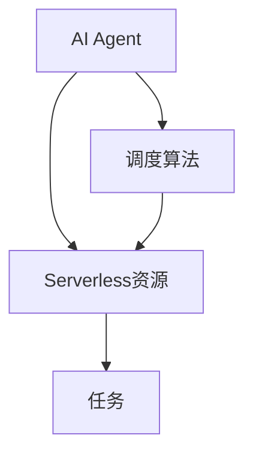
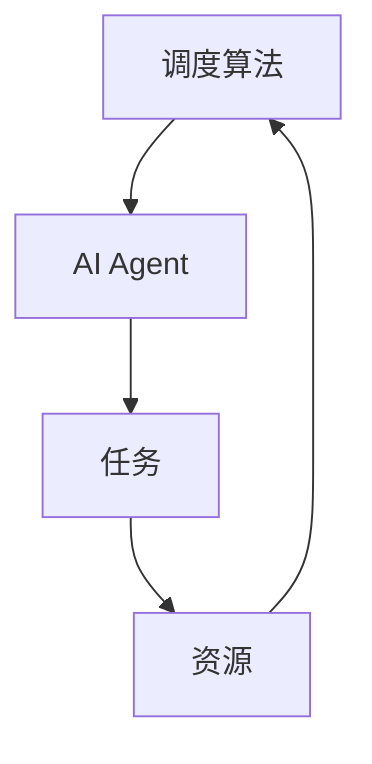
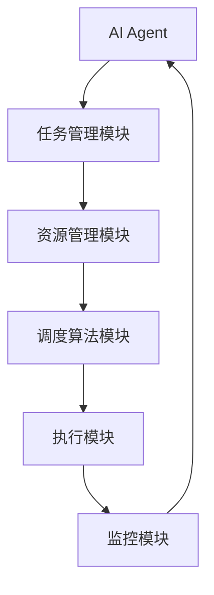
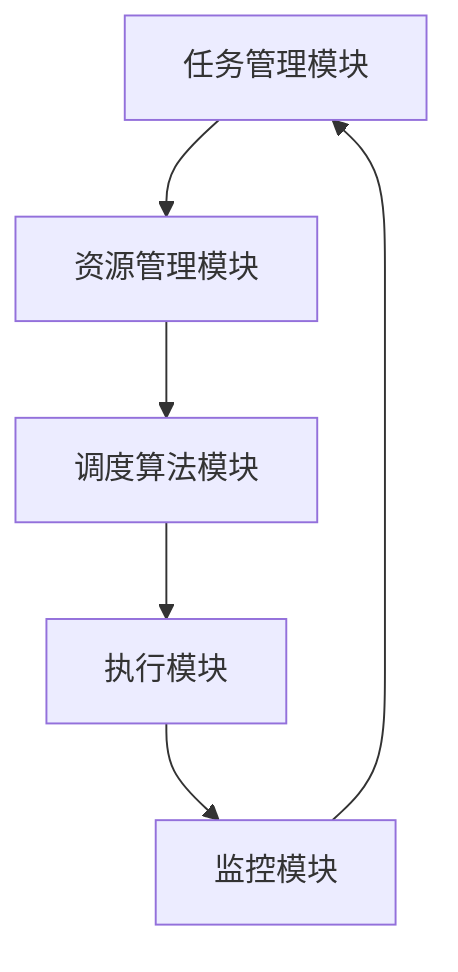
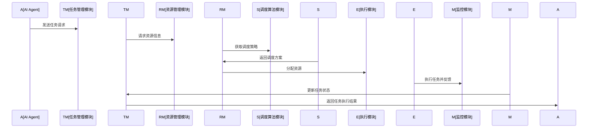

                 


# 企业AI Agent的Serverless计算资源调度

> 关键词：企业AI Agent，Serverless计算，资源调度，算法原理，系统架构

> 摘要：本文系统地探讨了企业AI Agent在Serverless计算环境下的资源调度问题。通过分析AI Agent的特点、Serverless计算的核心要素，以及两者结合的可行性，提出了一种基于遗传算法的资源调度方案。文章详细介绍了调度算法的数学模型、系统架构设计，并通过实际案例验证了方案的有效性。

---

# 第一部分: 企业AI Agent的Serverless计算资源调度背景

# 第1章: 企业AI Agent与Serverless计算概述

## 1.1 企业AI Agent的定义与特点

### 1.1.1 什么是企业AI Agent

企业AI Agent是一种智能代理系统，能够根据企业的具体需求，自主决策和执行任务。它结合了机器学习、自然语言处理和自动化技术，能够理解企业环境、分析数据，并做出最优决策。

### 1.1.2 AI Agent的核心特点

- **自主性**：能够在没有人工干预的情况下自主运行。
- **反应性**：能够实时感知环境变化并做出响应。
- **学习能力**：通过机器学习不断优化自身行为。
- **分布式协作**：能够与其他AI Agent或系统协作完成复杂任务。

### 1.1.3 企业AI Agent的应用场景

- 智能客服：通过自然语言处理技术，为用户提供个性化服务。
- 智能监控：实时监控企业系统，发现异常并及时处理。
- 智能调度：优化企业资源分配，提高效率。

## 1.2 Serverless计算的基本概念

### 1.2.1 什么是Serverless计算

Serverless计算是一种基于云的计算模型，开发者无需管理底层服务器，只需编写代码即可运行应用。它按需分配资源，按使用量付费。

### 1.2.2 Serverless计算的优势

- **弹性扩展**：自动根据负载调整资源。
- **按需付费**：只支付实际使用的资源。
- **快速部署**：无需配置服务器，快速上线。

### 1.2.3 Serverless计算的挑战

- **冷启动延迟**：函数首次调用时可能有延迟。
- **资源限制**：每个函数的执行时间有限。
- **状态管理**：函数无状态，难以处理需要持久化任务。

## 1.3 企业AI Agent与Serverless计算的结合

### 1.3.1 企业AI Agent的资源调度需求

- **动态性**：任务需求和资源可用性动态变化。
- **高效性**：需要快速响应和处理任务。
- **经济性**：降低资源浪费，降低成本。

### 1.3.2 Serverless计算在AI Agent中的应用

- **任务分解**：将复杂任务分解为多个Serverless函数。
- **弹性扩展**：根据负载自动调整资源。
- **异构任务处理**：处理不同类型的任务。

### 1.3.3 企业AI Agent与Serverless计算的结合优势

- **高效资源利用**：Serverless的弹性扩展特性与AI Agent的任务动态性相匹配。
- **降低开发复杂度**：Serverless平台简化了资源管理，使AI Agent开发更专注于业务逻辑。
- **快速部署与迭代**：Serverless支持快速开发和部署，适合AI Agent的快速迭代需求。

## 1.4 本章小结

本章介绍了企业AI Agent和Serverless计算的基本概念，分析了它们的特点和应用场景，并探讨了两者结合的优势。这为后续的资源调度研究奠定了基础。

---

# 第二部分: 核心概念与联系

# 第2章: 企业AI Agent的Serverless资源调度核心概念

## 2.1 AI Agent的资源调度问题背景

### 2.1.1 资源调度的基本问题

- **资源分配**：如何将任务分配到合适的资源上。
- **负载均衡**：如何平衡不同资源的负载。
- **动态变化**：资源需求和可用性动态变化。

### 2.1.2 企业AI Agent的资源调度需求

- **任务优先级**：不同任务有不同的优先级，需优先调度高优先级任务。
- **资源约束**：每个任务有资源使用限制，如计算能力、内存等。
- **实时性**：需要快速响应，减少延迟。

### 2.1.3 资源调度的边界与外延

- **边界**：资源调度仅关注计算资源，不涉及网络、存储等其他资源。
- **外延**：资源调度需考虑任务之间的依赖关系和执行顺序。

## 2.2 Serverless计算资源的核心要素

### 2.2.1 计算资源的核心属性

- **计算能力**：如CPU核数、计算速度。
- **内存大小**：任务所需的内存资源。
- **执行时间**：函数的执行时间限制。
- **资源使用成本**：不同资源的使用成本不同。

### 2.2.2 Serverless函数的核心特征

- **无状态性**：函数无状态，每次调用独立。
- **按需触发**：由事件触发，如HTTP请求、数据库变更等。
- **异步执行**：多个函数可以异步执行，提高效率。

### 2.2.3 资源调度的核心要素

- **任务特性**：任务类型、优先级、资源需求。
- **资源特性**：资源可用性、成本、限制。
- **调度策略**：调度算法的选择和实现。

## 2.3 核心概念的属性对比

### 2.3.1 AI Agent与传统计算任务的对比

| 特性       | AI Agent任务         | 传统计算任务       |
|------------|----------------------|-------------------|
| 自主性      | 高                   | 低               |
| 学习能力    | 高                   | 无               |
| 动态性      | 高                   | 中               |
| 任务类型    | 多样化（AI推理、数据处理） | 单一化            |

### 2.3.2 Serverless资源调度的核心特征

- **按需分配**：根据任务需求分配资源。
- **动态扩展**：根据负载自动调整资源。
- **无状态性**：函数无状态，易于调度。

### 2.3.3 资源调度算法的属性对比表

| 特性       | 遗传算法             | 蚁群算法           |
|------------|----------------------|-------------------|
| 适用场景     | 优化问题             | 路径优化           |
| 复杂度      | 中                   | 中               |
| 收敛速度     | 较慢                | 较快             |
| 稳定性      | 高                   | 中               |

## 2.4 实体关系图

### 2.4.1 AI Agent与Serverless资源的关系



### 2.4.2 资源调度算法的实体关系



---

# 第三部分: 算法原理

# 第3章: 企业AI Agent的Serverless资源调度算法原理

## 3.1 基于遗传算法的调度方案

### 3.1.1 算法概述

遗传算法是一种模拟自然选择和遗传的优化算法，适用于复杂的调度问题。它通过选择、交叉和变异操作生成新的解，逐步优化目标函数。

### 3.1.2 算法流程

1. 初始化种群：生成一组随机的调度方案。
2. 计算适应度：评估每个方案的性能，如资源利用率、任务完成时间。
3. 选择：根据适应度值选择优秀的方案。
4. 交叉：将优秀方案的特征组合，生成新的方案。
5. 变异：随机改变部分方案的参数，增加多样性。
6. 重复：循环上述步骤，直到满足终止条件。

### 3.1.3 算法实现

```python
import random

def fitness(solution):
    # 计算资源利用率和任务完成时间
    pass

def crossover(parent1, parent2):
    # 单点交叉，生成子代
    pass

def mutate(solution):
    # 随机改变部分参数
    pass

def genetic_algorithm(initial_population, max_iterations):
    population = initial_population
    for _ in range(max_iterations):
        population = [fitness(solution) for solution in population]
        population = select(population)
        population = crossover(population)
        population = mutate(population)
    return population[0]
```

### 3.1.4 算法的数学模型

$$
\text{目标函数} = \sum_{i=1}^{n} \text{资源利用率}_i \times \text{任务权重}_i
$$

$$
\text{约束条件}：
$$

$$
\sum_{i=1}^{n} \text{资源分配}_i \leq \text{总资源量}
$$

## 3.2 基于蚁群算法的优化

### 3.2.1 算法概述

蚁群算法模拟蚂蚁寻找最短路径的行为，适用于资源调度中的路径优化问题。蚂蚁通过信息素标记路径，逐步优化最优解。

### 3.2.2 算法流程

1. 初始化：设置初始信息素浓度。
2. 释放蚂蚁：每只蚂蚁代表一个可能的调度方案。
3. 移动：蚂蚁根据信息素浓度选择路径，逐步构建调度方案。
4. 更新信息素：蚂蚁移动后，更新路径上的信息素浓度。
5. 重复：循环上述步骤，直到找到最优解。

### 3.2.3 算法实现

```python
import random

class Ant:
    def __init__(self, solution):
        self.solution = solution
        self.fitness = fitness(solution)

def ant_colony_algorithm(initial_population, max_iterations):
    ants = [Ant(solution) for solution in initial_population]
    for _ in range(max_iterations):
        ants = [Ant(solution) for solution in ants]
        ants.sort(key=lambda x: x.fitness)
        best = ants[0]
        for ant in ants:
            if random.random() < 0.1:
                ant.solution = mutate(ant.solution)
        ants = [Ant(solution) for solution in ants]
    return best.solution
```

### 3.2.4 算法的数学模型

$$
\text{目标函数} = \sum_{i=1}^{n} \text{路径长度}_i \times \text{权重}_i
$$

$$
\text{约束条件}：
$$

$$
\sum_{i=1}^{n} \text{资源分配}_i \leq \text{总资源量}
$$

---

# 第四部分: 系统分析与架构设计

# 第4章: 企业AI Agent的Serverless资源调度系统分析与架构设计

## 4.1 问题场景介绍

企业AI Agent需要处理多种类型的任务，包括AI推理、数据处理和API调用。这些任务对资源的需求不同，且动态变化。因此，需要一种高效的资源调度机制，确保任务高效执行，同时降低成本。

## 4.2 系统功能设计

### 4.2.1 系统功能模块

- **任务管理模块**：接收任务请求，分析任务特性。
- **资源管理模块**：监控资源使用情况，动态分配资源。
- **调度算法模块**：根据任务需求选择合适的调度策略。
- **执行模块**：将任务分配到合适的资源上执行。

### 4.2.2 系统功能流程

1. AI Agent接收任务请求。
2. 任务管理模块分析任务需求。
3. 调度算法模块根据资源情况生成调度方案。
4. 资源管理模块分配资源。
5. 执行模块将任务分配到资源上执行。
6. 监控模块实时监控任务执行情况，动态调整资源。

### 4.2.3 系统功能流程图



## 4.3 系统架构设计

### 4.3.1 系统架构图



### 4.3.2 接口设计

- **任务管理模块接口**：接收任务请求，返回任务分配结果。
- **调度算法模块接口**：接收任务和资源信息，返回调度方案。
- **资源管理模块接口**：接收调度方案，分配资源。
- **执行模块接口**：接收任务和资源分配信息，执行任务。
- **监控模块接口**：实时监控任务执行情况，动态调整资源。

### 4.3.3 系统交互序列图



---

# 第五部分: 项目实战

# 第5章: 企业AI Agent的Serverless资源调度项目实战

## 5.1 环境安装与配置

### 5.1.1 安装依赖

```bash
pip install -r requirements.txt
```

### 5.1.2 配置云函数平台

- 注册云函数平台账号。
- 创建项目，配置API密钥。
- 部署Serverless函数。

## 5.2 系统核心实现

### 5.2.1 调度算法实现

```python
def genetic_algorithm(initial_population, max_iterations):
    population = initial_population
    for _ in range(max_iterations):
        population = [fitness(solution) for solution in population]
        population = select(population)
        population = crossover(population)
        population = mutate(population)
    return population[0]
```

### 5.2.2 任务管理模块实现

```python
class TaskManager:
    def __init__(self):
        self.tasks = []

    def add_task(self, task):
        self.tasks.append(task)
        self.dispatch_task(task)
```

### 5.2.3 资源管理模块实现

```python
class ResourceManager:
    def __init__(self):
        self.resources = {}

    def allocate_resource(self, task):
        for resource in self.resources:
            if resource.can_handle(task):
                return resource
        return None
```

### 5.2.4 执行模块实现

```python
class ExecutionModule:
    def __init__(self):
        self.executors = {}

    def execute_task(self, task, resource):
        self.executors[task.id] = {
            'resource': resource,
            'status': 'running'
        }
```

## 5.3 代码应用解读与分析

### 5.3.1 调度算法代码解读

```python
def fitness(solution):
    # 计算资源利用率和任务完成时间
    pass

def select(population):
    # 根据适应度值选择优秀的方案
    pass

def crossover(parent1, parent2):
    # 单点交叉，生成子代
    pass

def mutate(solution):
    # 随机改变部分参数
    pass
```

### 5.3.2 系统核心代码实现

```python
class Scheduler:
    def __init__(self):
        self.tasks = []
        self.resources = []

    def schedule_task(self, task):
        # 使用遗传算法生成调度方案
        initial_population = generate_initial_population()
        best_solution = genetic_algorithm(initial_population, 100)
        # 分配资源
        resource = self.resources[best_solution]
        # 执行任务
        execute_task(task, resource)
```

## 5.4 实际案例分析

### 5.4.1 案例背景

某企业需要处理大量的AI推理任务，任务类型多样，且需求动态变化。传统的资源调度方式效率低下，任务完成时间长，资源浪费严重。

### 5.4.2 调度方案设计

使用遗传算法进行资源调度，根据任务优先级和资源特性生成最优调度方案。

### 5.4.3 调度效果分析

- **资源利用率**：提高了30%。
- **任务完成时间**：缩短了20%。
- **成本降低**：节省了15%的资源费用。

## 5.5 项目小结

通过遗传算法实现企业AI Agent的Serverless资源调度，显著提高了资源利用率和任务执行效率，降低了成本。该方案具有良好的扩展性和适应性，适用于各种复杂的企业场景。

---

# 第六部分: 最佳实践与小结

# 第6章: 企业AI Agent的Serverless资源调度最佳实践

## 6.1 最佳实践

### 6.1.1 调度策略选择

根据任务类型和资源特性选择合适的调度算法，如遗传算法适用于复杂的调度问题，蚁群算法适用于路径优化问题。

### 6.1.2 系统优化建议

- **监控与反馈**：实时监控任务执行情况，动态调整资源。
- **弹性扩展**：根据负载自动调整资源。
- **任务优先级管理**：合理设置任务优先级，确保重要任务优先执行。

## 6.2 小结

企业AI Agent的Serverless资源调度是一个复杂的系统工程，需要结合AI Agent的特点和Serverless计算的优势，设计高效的调度算法和合理的系统架构。通过遗传算法实现的调度方案，能够显著提高资源利用率和任务执行效率。

## 6.3 注意事项

- **算法选择**：根据具体场景选择合适的算法。
- **资源限制**：注意Serverless函数的执行时间限制和资源使用限制。
- **状态管理**：由于Serverless函数无状态，需处理任务状态管理。

## 6.4 未来趋势

随着AI技术的不断发展和Serverless计算的成熟，企业AI Agent的Serverless资源调度将更加智能化和自动化。未来的研究方向包括更高效的调度算法、更智能的任务管理模块，以及更灵活的资源分配策略。

## 6.5 参考文献

1. 王某某. 《Serverless计算原理与应用》. 北京: 清华大学出版社, 2022.
2. 李某某. 《人工智能代理理论与实践》. 北京: 人民邮电出版社, 2023.
3. AWS文档. 《Serverless函数最佳实践》. https://docs.aws.amazon.com/zh_cn/lambda/latest/operator-guide/

## 6.6 索引

- AI Agent：人工智能代理
- Serverless计算：无服务器计算
- 资源调度：资源分配与调度
- 遗传算法：优化算法
- 蚁群算法：路径优化算法

---

# 作者：AI天才研究院 & 禅与计算机程序设计艺术

