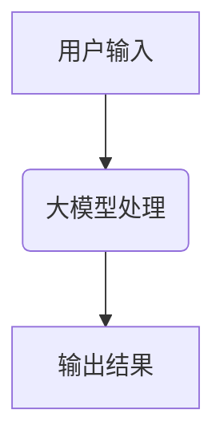
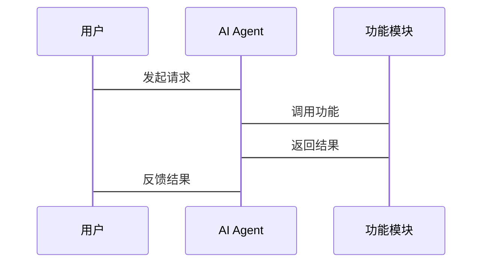
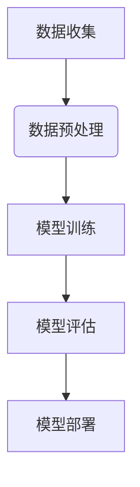

                 


# 企业AI Agent的个性化定制：适应不同部门需求

**关键词**：企业AI Agent，个性化定制，部门需求，人工智能，系统架构，大模型

**摘要**：  
随着企业数字化转型的深入推进，AI Agent（人工智能代理）逐渐成为企业提升效率和竞争力的重要工具。然而，不同部门的需求千差万别，如何实现AI Agent的个性化定制成为企业技术团队面临的核心挑战。本文将从AI Agent的基本概念出发，深入探讨其核心技术、系统架构设计以及个性化定制的方法论，结合实际案例分析，为企业技术团队提供实用的指导和建议。

---

## 第1章 企业AI Agent的基本概念与背景

### 1.1 AI Agent的定义与核心要素

AI Agent（人工智能代理）是一种能够感知环境、自主决策并执行任务的智能系统。它通过与用户或系统的交互，帮助用户完成特定任务或提供信息服务。AI Agent的核心要素包括：

1. **感知能力**：通过传感器、API或其他输入方式获取环境信息。
2. **决策能力**：基于获取的信息，通过算法进行推理和决策。
3. **执行能力**：根据决策结果执行操作，例如发送通知、调整参数或触发其他系统。
4. **学习能力**：通过机器学习模型不断优化自身的决策逻辑。

### 1.2 企业AI Agent的背景与需求

随着企业数字化转型的推进，AI Agent的应用场景越来越广泛。例如：

- **销售部门**：AI Agent可以协助销售团队进行客户关系管理、预测销售趋势。
- **技术支持部门**：AI Agent可以提供实时的技术支持，帮助解决用户问题。
- **HR部门**：AI Agent可以辅助招聘、员工绩效评估等任务。

不同部门的需求差异较大，例如：

- **销售部门**：需要实时的客户数据分析和市场趋势预测。
- **技术支持部门**：需要快速响应用户问题并提供解决方案。
- **HR部门**：需要处理大量非结构化数据，例如简历筛选。

因此，AI Agent的个性化定制是实现其在企业中高效应用的关键。

---

## 第2章 企业AI Agent的核心技术与实现原理

### 2.1 大模型在AI Agent中的应用

大模型（如GPT系列、BERT系列）在AI Agent中的应用主要体现在以下方面：

1. **自然语言处理（NLP）**：通过大模型理解用户输入的自然语言，并生成符合语境的回复。
2. **意图识别**：通过大模型分析用户的输入，识别其意图并匹配相应的业务逻辑。
3. **知识图谱构建**：通过大模型提取文本中的实体和关系，构建知识图谱以支持决策。

**图2.1 大模型的输入输出机制**



### 2.2 AI Agent的交互设计

AI Agent的交互设计是个性化定制的重要环节。以下是一个典型的交互流程：

1. **用户发起请求**：用户通过文本或语音输入需求。
2. **意图识别**：AI Agent通过NLP技术识别用户的意图。
3. **任务处理**：AI Agent根据意图调用相应的功能模块处理任务。
4. **结果反馈**：AI Agent将处理结果反馈给用户。

**图2.2 AI Agent的交互流程**



### 2.3 AI Agent的决策逻辑

AI Agent的决策逻辑基于以下两种方式：

1. **规则引擎**：通过预定义的规则进行决策，适用于简单的场景。
2. **深度学习模型**：通过训练模型进行复杂场景的决策。

例如，假设我们要构建一个销售预测AI Agent，可以通过以下步骤实现：

1. **数据收集**：收集历史销售数据、市场趋势数据等。
2. **模型训练**：使用时间序列模型（如LSTM）训练销售预测模型。
3. **预测输出**：模型输出预测结果，AI Agent根据结果向用户反馈预测信息。

**图2.3 销售预测模型的训练流程**



---

## 第3章 企业AI Agent的系统架构设计

### 3.1 系统架构概述

企业AI Agent的系统架构可以采用分层架构：

1. **用户层**：用户与AI Agent进行交互。
2. **业务逻辑层**：处理用户的请求并调用相应的功能模块。
3. **数据层**：存储和管理数据。

**图3.1 分层架构设计**

```mermaid
classDiagram
    class 用户层 {
        输入请求
        输出结果
    }
    class 业务逻辑层 {
        处理请求
        调用功能模块
    }
    class 数据层 {
        存储数据
        提供数据访问接口
    }
    用户层 -->> 业务逻辑层
    业务逻辑层 -->> 数据层
```

### 3.2 功能模块设计

以下是AI Agent系统的主要功能模块：

1. **用户管理模块**：管理用户的权限和信息。
2. **任务管理模块**：管理用户的任务请求。
3. **知识库模块**：存储和管理AI Agent的知识库。
4. **日志模块**：记录系统运行日志。

**图3.2 功能模块类图**

```mermaid
classDiagram
    class 用户管理模块 {
        管理用户信息
        处理用户权限
    }
    class 任务管理模块 {
        管理任务请求
        处理任务
    }
    class 知识库模块 {
        存储知识
        提供知识查询接口
    }
    class 日志模块 {
        记录系统日志
        提供日志查询
    }
    用户管理模块 -->> 任务管理模块
    任务管理模块 -->> 知识库模块
    任务管理模块 -->> 日志模块
```

### 3.3 系统接口设计

系统接口设计包括：

1. **API接口**：供其他系统调用AI Agent的功能。
2. **数据接口**：与数据库或其他数据源进行交互。
3. **回调接口**：处理任务完成后的通知。

---

## 第4章 企业AI Agent的个性化定制方法

### 4.1 定制化需求分析

个性化定制的核心是满足不同部门的具体需求。例如：

- **销售部门**：需要实时的销售预测和客户分析。
- **技术支持部门**：需要快速的问题诊断和解决方案。

### 4.2 定制化开发流程

定制化开发流程包括：

1. **需求收集**：与各部门沟通，明确需求。
2. **系统设计**：根据需求设计系统架构。
3. **开发实现**：编写代码并进行测试。
4. **部署与优化**：部署系统并进行优化。

### 4.3 定制化评估与优化

评估定制化效果可以通过以下指标：

1. **响应速度**：系统对请求的响应时间。
2. **准确率**：系统决策的准确程度。
3. **用户体验**：用户对系统的满意度。

---

## 第5章 企业AI Agent的实战案例

### 5.1 环境配置

以下是常见的环境配置步骤：

1. 安装Python 3.8及以上版本。
2. 安装必要的库：`pip install numpy pandas scikit-learn transformers`。

### 5.2 核心代码实现

以下是一个简单的销售预测AI Agent的代码示例：

```python
import pandas as pd
from sklearn.model_selection import train_test_split
from sklearn.ensemble import RandomForestRegressor

# 数据加载
data = pd.read_csv('sales_data.csv')
X = data[['feature1', 'feature2']]
y = data['target']

# 数据分割
X_train, X_test, y_train, y_test = train_test_split(X, y, test_size=0.2)

# 模型训练
model = RandomForestRegressor()
model.fit(X_train, y_train)

# 模型预测
print(model.predict(X_test))
```

### 5.3 案例分析

以销售预测为例，AI Agent可以根据历史销售数据和市场趋势预测未来的销售情况，并向销售部门提供数据支持。

---

## 第6章 总结与展望

### 6.1 总结

企业AI Agent的个性化定制是实现其高效应用的关键。通过本文的探讨，我们了解了AI Agent的核心技术、系统架构设计以及个性化定制的方法。

### 6.2 展望

未来，随着技术的进步，AI Agent将更加智能化和个性化，为企业带来更多可能性。

---

**作者**：AI天才研究院 / AI Genius Institute  
禅与计算机程序设计艺术 / Zen And The Art of Computer Programming

