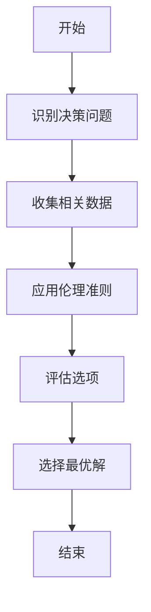
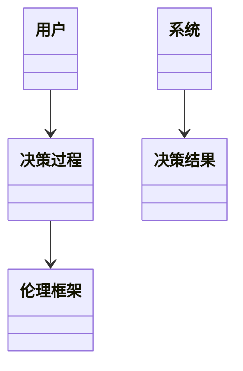
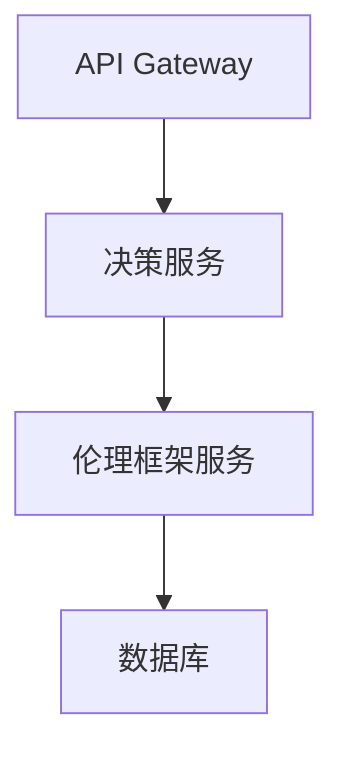

                 


# 《企业AI Agent的伦理决策框架》

## 关键词：企业AI Agent，伦理决策框架，算法原理，系统架构设计，项目实战

## 摘要

在企业环境中，AI Agent的应用日益广泛，但其决策过程中的伦理问题也随之浮现。本文旨在构建一个企业AI Agent的伦理决策框架，涵盖核心概念、算法原理、系统架构设计及项目实战，确保AI Agent在决策过程中遵循伦理标准。通过详细分析和实际案例，本文为实现伦理决策提供了全面的解决方案。

---

## 第一部分：背景介绍

### 第1章：企业AI Agent的伦理决策背景

#### 1.1 问题背景

AI Agent在企业中的应用如流程自动化、客户服务等领域日益增多，但决策过程中的伦理问题（如偏见、透明度）也随之增加。企业面临合规风险和信任危机。

#### 1.2 问题描述

AI Agent决策可能引发伦理问题，如算法偏见、责任归属、透明度不足。这些问题可能导致法律风险、信任丧失和声誉损害。

#### 1.3 问题解决

构建伦理决策框架，确保AI Agent在决策时遵循伦理原则。通过明确的伦理准则和透明的决策过程，提升决策的公平性和可解释性。

#### 1.4 概念结构与核心要素

- 核心概念：伦理原则（公正、尊重、有益）、决策过程（识别、评估、选择）。
- 框架属性：可定制性、可解释性、适应性。

---

## 第二部分：核心概念与联系

### 第2章：伦理决策框架的核心原理

#### 2.1 核心概念原理

- **伦理原则**：确保决策符合道德标准。
- **决策过程**：识别问题、评估选项、选择最优解。
- **框架属性**：定制性、可解释性、适应性。

#### 2.2 对比分析

| 框架 | 优点 | 缺点 |
|------|------|------|
| 基于规则 | 明确性高 | 灵活性低 |
| 基于效用 | 最大化收益 | 可能忽视公平 |
| 基于义务论 | 责任明确 | 过于僵化 |

#### 2.3 ER实体关系图

```mermaid
erDiagram
    actor 用户
    actor 系统
    actor 伦理框架
    participant 决策过程
    participant 决策结果
    participant 伦理准则
    决策过程 --> 伦理准则
    决策过程 --> 决策结果
    用户 --> 决策过程
    系统 --> 决策结果
    伦理框架 --> 决策过程
```

---

## 第三部分：算法原理讲解

### 第3章：伦理决策算法的实现

#### 3.1 算法流程图



#### 3.2 数学模型与公式

伦理评分模型：

$$ \text{伦理评分} = \sum_{i=1}^{n} (w_i \times f_i) $$

其中，$$ w_i $$ 是第i个伦理准则的权重，$$ f_i $$ 是对应的行为分数。

#### 3.3 Python代码实现

```python
def ethical_framework(weights, behaviors):
    return sum(w * b for w, b in zip(weights, behaviors))

weights = [0.4, 0.3, 0.3]
behaviors = [0.8, 0.7, 0.9]
print(ethical_framework(weights, behaviors))
```

---

## 第四部分：系统分析与架构设计

### 第4章：系统架构设计方案

#### 4.1 问题场景介绍

企业AI Agent系统需处理客户查询，涉及数据隐私和决策透明度问题。

#### 4.2 功能需求设计



#### 4.3 系统架构设计



---

## 第五部分：项目实战

### 第5章：企业AI Agent的伦理决策框架实现

#### 5.1 环境安装

安装Python和相关库（如numpy、pandas）。

#### 5.2 核心代码实现

```python
def apply伦理准则(数据):
    伦理评分 = 0
    for 准则 in 伦理准则列表:
        评分 = 评估(数据, 准则)
        伦理评分 += 评分
    return 伦理评分
```

#### 5.3 案例分析

AI客服推荐产品，需确保推荐基于用户需求，避免利益冲突。

#### 5.4 项目小结

实现伦理框架，提升决策透明度和公平性，降低风险。

---

## 第六部分：最佳实践

### 第6章：企业AI Agent伦理决策框架的最佳实践

#### 6.1 小结

确保框架可定制、可解释，结合具体场景优化。

#### 6.2 注意事项

数据隐私、透明度、持续监控和维护。

#### 6.3 拓展阅读

推荐书籍：《伦理与人工智能》。

---

## 作者：AI天才研究院/AI Genius Institute & 禅与计算机程序设计艺术 /Zen And The Art of Computer Programming

