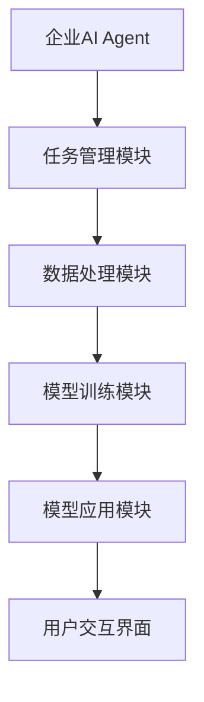
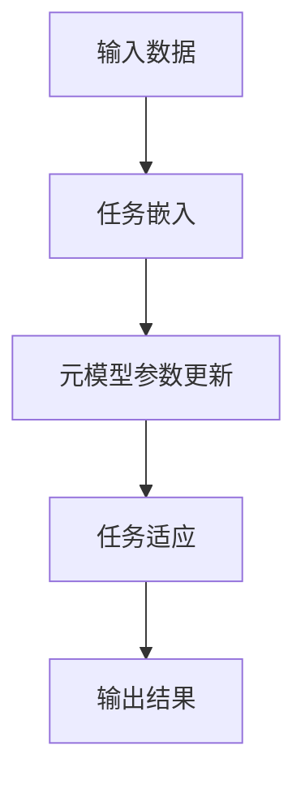
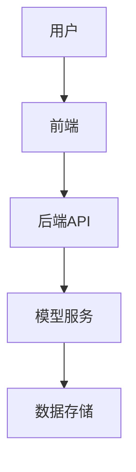

                 


# 企业AI Agent的元学习框架：快速适应新任务与领域

**关键词**：企业AI Agent，元学习，Meta-Learning，快速适应，新任务，领域

**摘要**：本文深入探讨了企业AI Agent的元学习框架，结合具体案例和系统设计，全面分析了元学习在企业环境中的应用。通过对比传统机器学习，解释了元学习的核心原理和优势，并通过算法和系统设计展示了如何实现快速适应新任务和领域的目标。

---

## 第一部分：元学习与企业AI Agent的背景介绍

### 第1章：元学习的基本概念

#### 1.1 元学习的定义
元学习（Meta-Learning）是一种机器学习方法，旨在通过在多个任务上的学习，使模型能够快速适应新任务。与传统机器学习不同，元学习注重模型的泛化能力和快速迁移能力。

#### 1.2 元学习的核心思想
元学习的核心思想是通过元任务（meta-tasks）的训练，使模型具备在新任务上线快速学习的能力。这种方法特别适合处理数据量小、任务多样的场景。

#### 1.3 元学习与传统机器学习的区别
| 特性       | 传统机器学习                | 元学习                        |
|------------|-----------------------------|---------------------------------|
| 数据需求   | 需要大量标注数据             | 数据量小，任务多样性            |
| 适应能力   | 适应单一任务                | 跨任务适应，快速迁移            |
| 训练目标   | 优化单一任务性能             | 优化多个任务的平均性能          |

#### 1.4 企业AI Agent的定义与特点
企业AI Agent是一种具备自主决策和问题解决能力的智能体，能够通过元学习框架快速适应新的业务需求和环境变化。

### 第2章：元学习在企业AI Agent中的应用背景

#### 1.1 问题背景
企业在实际应用中常常面临任务多样性和数据稀疏性的挑战，传统机器学习方法难以快速适应新任务。

#### 1.2 问题描述
企业AI Agent需要在短时间内处理多个任务，且每个任务的数据量有限，传统方法难以满足需求。

#### 1.3 问题解决
通过元学习框架，企业AI Agent可以在训练时学习多个相关任务，从而快速适应新任务。

#### 1.4 边界与外延
元学习的应用范围限于需要快速适应的任务，而对于数据充足且任务单一的情况，传统方法更优。

#### 1.5 核心要素组成
- 元任务设计
- 快速适应策略
- 跨任务优化

---

## 第二部分：元学习的核心概念与联系

### 第2章：元学习的原理

#### 2.1 元学习的核心思想
元学习通过在多个任务上的训练，使模型具备在新任务上线快速学习的能力。

#### 2.2 元学习的数学模型
元学习通常涉及两个阶段的优化：
- 元训练阶段：优化元模型参数，使其能够在多个任务上表现良好。
- 任务适应阶段：在新任务上线时，快速调整模型参数以适应该任务。

#### 2.3 元学习与传统学习的区别
- 元学习注重任务间的共享和迁移，传统学习注重单任务优化。
- 元学习需要处理多个任务，传统学习专注于单一任务。

### 第3章：企业AI Agent的实体关系图



---

## 第三部分：元学习算法原理

### 第4章：主流元学习算法

#### 4.1 MAML算法



代码实现：
```python
def maml_update(x, y, model, meta_opt, inner_opt, inner_steps=5):
    # 内部梯度下降步骤
    for step in range(inner_steps):
        pred = model(x)
        loss = F.cross_entropy(pred, y)
        inner_opt.zero_grad()
        loss.backward()
        inner_opt.step()
    # 元优化步骤
    meta_opt.zero_grad()
    ...
```

#### 4.2 ReMAML算法


代码实现：
```python
def remaml_update(x, y, model, meta_opt, inner_opt, inner_steps=5):
    # 内部梯度下降步骤
    with torch.no_grad():
        pred = model(x)
        loss = F.cross_entropy(pred, y)
        inner_opt.zero_grad()
        loss.backward()
        inner_opt.step()
    # 元优化步骤
    meta_opt.zero_grad()
    ...
```

---

## 第四部分：系统分析与架构设计

### 第5章：企业AI Agent系统分析

#### 5.1 系统架构设计



---

## 第五部分：项目实战

### 第6章：基于元学习框架的企业AI Agent实现

#### 6.1 环境安装
安装必要的库，如TensorFlow、Keras、Scikit-learn等。

#### 6.2 核心代码实现

```python
import tensorflow as tf
from tensorflow.keras import layers

def build_meta_model(input_shape):
    model = tf.keras.Sequential([
        layers.Dense(64, activation='relu', input_shape=input_shape),
        layers.Dense(32, activation='relu'),
        layers.Dense(10, activation='softmax')
    ])
    return model
```

---

## 第六部分：最佳实践与小结

### 第7章：元学习框架的优劣势及注意事项

#### 7.1 优劣势分析
- 优势：快速适应新任务，减少数据依赖。
- 劣势：计算资源消耗大，模型复杂度高。

#### 7.2 注意事项
- 数据质量：确保元任务数据的多样性和代表性。
- 模型选择：选择适合特定任务的元学习算法。
- 性能调优：合理设置超参数，避免过拟合。

#### 7.3 拓展阅读
建议深入研究元学习的数学原理和最新论文。

---

## 作者信息

**作者：** AI天才研究院 & 禅与计算机程序设计艺术

---

**结语：** 企业AI Agent的元学习框架为企业智能化转型提供了强大的技术支撑，通过快速适应新任务和领域，提升了企业的竞争力和效率。希望本文能为相关领域的研究和实践提供有价值的参考和指导。

