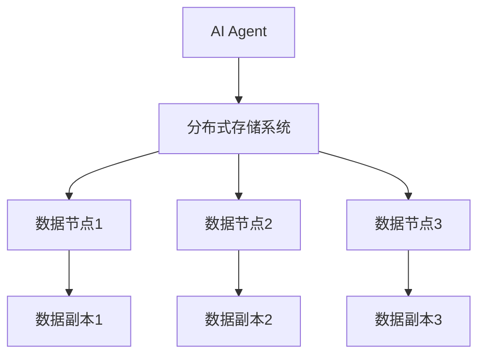
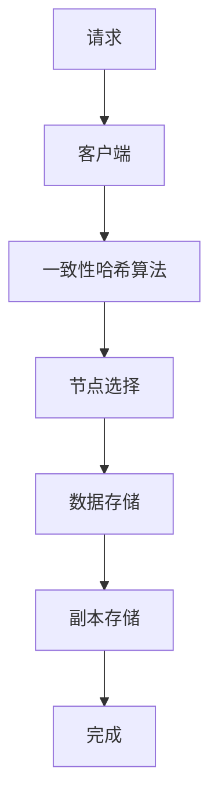
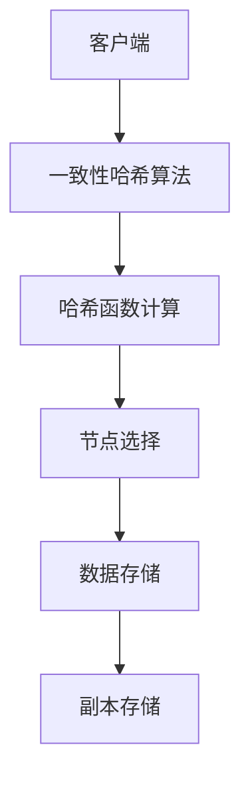
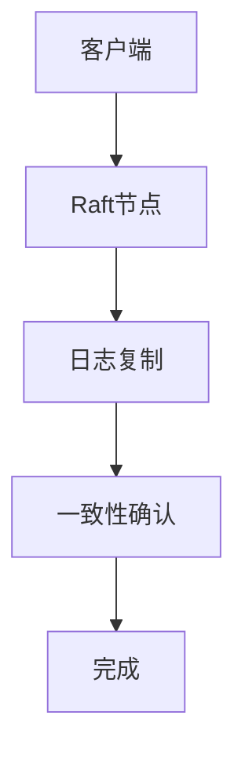
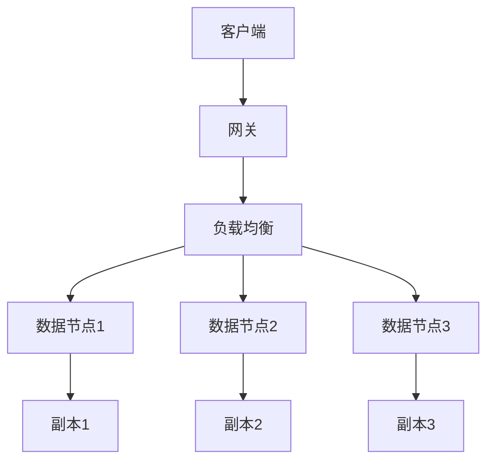
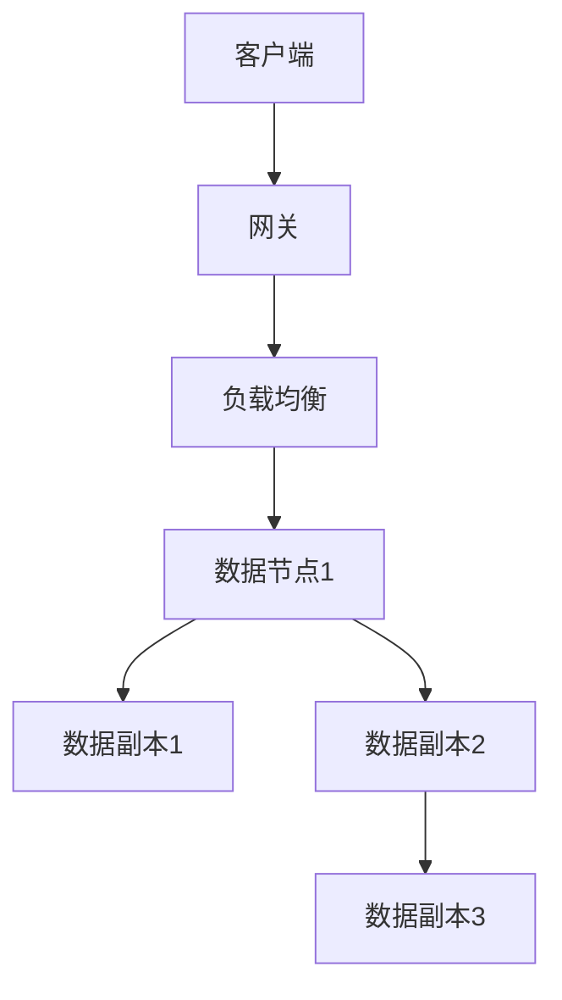

                 


# 《企业AI Agent的分布式存储系统设计》

---

## 关键词：企业AI Agent、分布式存储、系统设计、算法原理、项目实战

---

## 摘要：  
本文围绕企业AI Agent的分布式存储系统设计展开，系统性地分析了企业AI Agent对分布式存储的需求，详细阐述了分布式存储的核心概念、算法原理、系统架构，并通过实际案例展示了如何在企业AI Agent中实现分布式存储。文章还总结了最佳实践，为企业AI Agent的分布式存储系统设计提供了理论支持和实践指导。

---

## 第一部分: 企业AI Agent的背景与分布式存储基础

---

### 第1章: 企业AI Agent与分布式存储概述

#### 1.1 企业AI Agent的定义与特点

- **1.1.1 AI Agent的基本概念**  
  AI Agent（人工智能代理）是一种能够感知环境、执行任务并做出决策的智能实体。它通常具备自主性、反应性、目标导向和社交能力等特征。

- **1.1.2 企业AI Agent的核心特点**  
  - **自主性**：能够独立执行任务，无需人工干预。  
  - **反应性**：能够实时感知环境变化并做出响应。  
  - **目标导向**：以实现特定目标为导向，优化决策过程。  
  - **可扩展性**：能够处理大规模数据和复杂任务。  

- **1.1.3 企业AI Agent的应用场景**  
  - 智能客服  
  - 自动化运维  
  - 数据分析与决策支持  
  - 智能供应链管理  

---

#### 1.2 分布式存储系统的定义与特点

- **1.2.1 分布式存储的基本概念**  
  分布式存储是一种将数据分散存储在多台服务器上的技术，通过网络连接实现数据的分布式管理。  

- **1.2.2 分布式存储的核心特点**  
  - **高可用性**：单点故障的消除，保证数据可靠性。  
  - **高扩展性**：能够根据需求动态扩展存储容量。  
  - **高性能**：通过并行计算提高数据读写速度。  

- **1.2.3 分布式存储与传统存储的区别**  
  | 特性               | 分布式存储               | 传统存储               |  
  |--------------------|--------------------------|-------------------------|  
  | 数据分布           | 分散存储                 | 集中存储               |  
  | 扩展性             | 高扩展性                 | 低扩展性               |  
  | 可用性             | 高可用性                 | 低可用性               |  

---

#### 1.3 企业AI Agent与分布式存储的结合

- **1.3.1 企业AI Agent对存储系统的需求**  
  - 大规模数据存储与处理  
  - 实时数据访问与更新  
  - 数据一致性与可靠性  

- **1.3.2 分布式存储在AI Agent中的作用**  
  - 提供高效的存储解决方案，支持AI Agent的海量数据处理。  
  - 保证数据的高可用性和一致性，确保AI Agent的决策准确性。  

- **1.3.3 企业AI Agent分布式存储的挑战与机遇**  
  - **挑战**：数据一致性、网络延迟、节点故障处理。  
  - **机遇**：通过分布式存储实现高效的数据管理，提升AI Agent的性能和扩展性。  

---

#### 1.4 本章小结  
本章介绍了企业AI Agent和分布式存储的基本概念、特点及其在企业中的应用。通过对比分析，明确了分布式存储在企业AI Agent中的重要性，为后续章节的深入分析奠定了基础。

---

## 第2章: 企业AI Agent分布式存储的背景与问题背景

---

### 2.1 企业AI Agent分布式存储的背景

- **2.1.1 当前企业AI Agent的发展趋势**  
  - AI技术的快速发展推动了企业AI Agent的广泛应用。  
  - 企业对智能化、自动化的需求日益增长。  

- **2.1.2 分布式存储在企业AI Agent中的重要性**  
  - 支持大规模数据处理和存储。  
  - 确保数据的高可用性和一致性。  

- **2.1.3 企业AI Agent分布式存储的市场需求**  
  - 随着企业数据量的激增，对分布式存储的需求日益迫切。  
  - 云计算和大数据技术的普及推动了分布式存储的应用。  

---

### 2.2 问题背景与问题描述

#### 2.2.1 企业AI Agent数据存储的主要问题

- 数据量大：企业AI Agent需要处理海量数据，传统存储系统难以应对。  
- 数据一致性：分布式环境下，如何保证数据一致性是一个难题。  
- 网络延迟：分布式存储可能导致网络延迟，影响数据访问性能。  

#### 2.2.2 分布式存储在解决这些问题中的作用

- **数据量大**：通过分布式存储，可以将数据分散存储在多个节点上，提高存储容量和性能。  
- **数据一致性**：通过一致性协议（如Raft、Paxos）保证数据一致性。  
- **网络延迟**：通过优化数据分布和访问策略，降低网络延迟。  

#### 2.2.3 企业AI Agent分布式存储的边界与外延

- **边界**：仅关注企业AI Agent的分布式存储问题，不涉及其他系统模块。  
- **外延**：分布式存储的设计和实现需要与企业AI Agent的其他部分（如计算引擎、数据分析模块）协同工作。  

---

### 2.3 问题解决与核心要素

#### 2.3.1 企业AI Agent分布式存储的核心要素

- **数据模型**：定义数据的结构和存储方式。  
- **一致性协议**：确保数据在分布式系统中的一致性。  
- **节点通信机制**：实现节点之间的高效通信与协作。  

#### 2.3.2 各要素之间的关系

- 数据模型是系统的基础，决定了数据的存储和访问方式。  
- 一致性协议是保证数据一致性的关键，直接影响系统的可靠性和稳定性。  
- 节点通信机制是系统的核心，决定了系统的性能和扩展性。  

#### 2.3.3 核心问题的解决方案概述

- **数据模型**：采用合适的数据模型（如键值存储、文档存储）来满足企业AI Agent的需求。  
- **一致性协议**：选择合适的共识算法（如Raft、Paxos）来保证数据一致性。  
- **节点通信机制**：设计高效的通信协议，减少网络延迟。  

---

### 2.4 本章小结  
本章分析了企业AI Agent分布式存储的背景和问题背景，明确了分布式存储在企业AI Agent中的重要性，并总结了核心问题的解决方案。

---

## 第3章: 企业AI Agent分布式存储的核心概念与联系

---

### 3.1 核心概念原理

#### 3.1.1 分布式存储的核心原理

- **数据分片**：将数据分散存储在多个节点上，提高存储效率。  
- **一致性哈希**：通过哈希函数将数据均匀分布到各个节点，保证数据的均衡存储。  
- **副本机制**：通过存储多个副本，提高数据的可靠性和容错性。  

#### 3.1.2 企业AI Agent分布式存储的实现机制

- **数据分区**：根据特定规则将数据分配到不同的节点上。  
- **负载均衡**：通过动态调整数据分布，保证系统负载均衡。  
- **一致性管理**：通过一致性协议保证数据的一致性。  

#### 3.1.3 关键技术的详细解释

- **一致性哈希**：通过哈希函数将数据均匀分布到各个节点，确保数据的均衡存储。  
- **副本机制**：通过存储多个副本，提高数据的可靠性和容错性。  
- **一致性协议**：通过共识算法（如Raft、Paxos）保证数据一致性。  

---

### 3.2 核心概念与联系

#### 3.2.1 核心概念对比表格

| 概念       | 描述                                   | 优势                                   |
|------------|--------------------------------------|--------------------------------------|
| 数据分片   | 将数据分散存储到多个节点             | 提高存储效率和系统扩展性               |
| 一致性哈希 | 通过哈希函数实现数据的均衡分布       | 保证数据分布的均衡性和一致性           |
| 副本机制   | 存储多个副本，提高数据的可靠性和容错性 | 保证数据的高可用性和容错性             |

---

#### 3.2.2 ER实体关系图架构



---

#### 3.2.3 一致性哈希流程图



---

### 3.3 本章小结  
本章详细分析了企业AI Agent分布式存储的核心概念及其之间的联系，通过对比和流程图的形式，清晰地展示了系统的实现机制和关键原理。

---

## 第4章: 企业AI Agent分布式存储的算法原理

---

### 4.1 分布式存储的算法原理

#### 4.1.1 一致性哈希算法



- **一致性哈希函数**：通过哈希函数将键值对映射到节点上。  
  $$ hash(key) = (key \times 1663) \mod 10000 $$  
- **一致性哈希的分片策略**：将整个哈希空间划分为多个虚拟节点，每个虚拟节点对应一个实际节点。  

---

#### 4.1.2 Raft一致性协议



- **Raft一致性协议**：通过选举一个领导者节点，保证所有节点的日志一致。  
- **节点角色**：领导者、候选者、跟随者。  
- **日志同步**：领导者将日志同步到所有跟随者节点，确保数据一致性。  

---

### 4.2 本章小结  
本章通过一致性哈希和Raft一致性协议的实现，详细讲解了分布式存储的算法原理，为后续的系统设计和实现奠定了理论基础。

---

## 第5章: 企业AI Agent分布式存储的系统分析与架构设计

---

### 5.1 系统分析

#### 5.1.1 项目背景介绍

- 项目目标：设计一个高效的分布式存储系统，支持企业AI Agent的海量数据存储与处理。  
- 项目需求：高可用性、高扩展性、高性能。  

---

#### 5.1.2 系统功能设计

- **数据存储**：支持键值存储、文档存储等多种数据模型。  
- **数据查询**：支持高效的数据查询和检索。  
- **数据一致性**：通过一致性协议保证数据一致性。  
- **容错性**：通过副本机制实现数据的高可用性。  

---

#### 5.1.3 系统架构设计



---

### 5.2 系统接口设计

#### 5.2.1 接口描述

- **写入接口**：`put(key, value)`  
- **读取接口**：`get(key)`  
- **删除接口**：`delete(key)`  
- **一致性检查**：`checkConsistency()`  

---

#### 5.2.2 交互流程图



---

### 5.3 本章小结  
本章通过系统分析和架构设计，明确了企业AI Agent分布式存储系统的功能和结构，并通过交互流程图展示了系统的实现过程。

---

## 第6章: 企业AI Agent分布式存储的项目实战

---

### 6.1 环境搭建

- **操作系统**：Linux  
- **编程语言**：Python  
- **依赖库**：`asyncio`, `aioredis`  

---

### 6.2 核心代码实现

```python
import asyncio
import aioredis

async def main():
    redis = await aioredis.Redis(host='localhost', port=6379)
    await redis.set('key', 'value')
    value = await redis.get('key')
    print(value)
    await redis.close()

asyncio.run(main())
```

---

### 6.3 案例分析与详细解读

- **案例背景**：企业AI Agent需要存储大量的用户数据和日志数据。  
- **实现步骤**：  
  1. 数据分片：将数据分散存储到多个节点。  
  2. 数据一致性：通过一致性协议保证数据一致性。  
  3. 网络通信：通过高效的通信机制降低网络延迟。  

---

### 6.4 本章小结  
本章通过实际案例展示了企业AI Agent分布式存储的实现过程，帮助读者更好地理解和掌握分布式存储的核心技术。

---

## 第7章: 企业AI Agent分布式存储的最佳实践

---

### 7.1 性能调优

- **数据分片**：合理设计数据分片策略，提高存储效率。  
- **网络优化**：通过优化网络拓扑和通信协议，降低网络延迟。  
- **负载均衡**：动态调整负载，保证系统性能均衡。  

---

### 7.2 安全性与可靠性

- **数据加密**：对敏感数据进行加密存储，确保数据安全。  
- **容错机制**：通过副本机制和冗余存储，提高系统的容错性。  
- **访问控制**：通过权限管理，确保数据的安全性。  

---

### 7.3 可扩展性

- **动态扩展**：根据需求动态扩展存储容量。  
- **模块化设计**：通过模块化设计，提高系统的可扩展性。  
- **弹性计算**：通过弹性计算技术，动态调整系统资源。  

---

### 7.4 注意事项

- **节点选择**：合理选择节点数量和分布，保证系统的性能和一致性。  
- **一致性协议**：选择合适的共识算法，确保数据一致性。  
- **监控与维护**：定期监控系统状态，及时发现和解决问题。  

---

### 7.5 拓展阅读

- 《分布式系统：概念与设计》  
- 《Raft一致性协议论文》  
- 《一致性哈希算法详解》  

---

## 第8章: 总结与展望

---

### 8.1 总结

- 本文系统性地分析了企业AI Agent分布式存储的背景、核心概念、算法原理和系统架构。  
- 通过实际案例展示了分布式存储的实现过程，并总结了最佳实践。  

---

### 8.2 展望

- 随着企业AI Agent的不断发展，分布式存储技术将面临更多的挑战和机遇。  
- 未来的研究方向包括：  
  - 更高效的分布式存储算法。  
  - 更智能的负载均衡策略。  
  - 更强大的数据一致性协议。  

---

## 作者：AI天才研究院/AI Genius Institute & 禅与计算机程序设计艺术 /Zen And The Art of Computer Programming

---

**本文为原创内容，转载请注明出处。**

