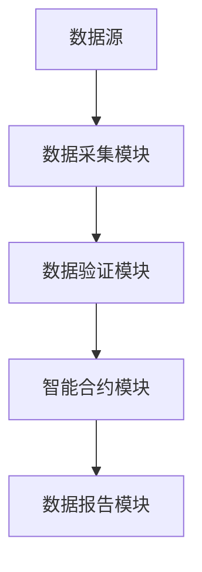

                 


# 企业AI Agent的区块链数据审计系统

> 关键词：企业AI Agent，区块链数据审计，智能合约，数据验证，共识机制

> 摘要：随着企业数字化转型的深入推进，数据安全与隐私保护的重要性日益凸显。本文提出了一种基于企业AI Agent的区块链数据审计系统，通过结合人工智能与区块链技术，实现高效、智能的数据审计。本文详细探讨了系统的核心概念、算法原理、架构设计及项目实现，为企业在数据审计领域提供了新的解决方案。

---

# 第1章: 企业AI Agent与区块链数据审计概述

## 1.1 企业AI Agent的基本概念

### 1.1.1 AI Agent的定义与特点

AI Agent（人工智能代理）是指能够感知环境、自主决策并执行任务的智能实体。其特点包括：

- **自主性**：能够在没有外部干预的情况下自主运行。
- **反应性**：能够实时感知环境变化并做出响应。
- **目标导向**：具有明确的目标，并根据目标优化行为。
- **学习能力**：能够通过数据学习和优化自身算法。

AI Agent可以分为**简单反射型**、**基于模型的反应型**、**目标驱动型**和**实用驱动型**四种类型。

### 1.1.2 企业AI Agent的应用场景

在企业环境中，AI Agent可以应用于以下场景：

- **智能监控**：实时监控企业数据流，发现异常行为。
- **自动化决策**：基于历史数据和实时信息，自动做出最优决策。
- **风险管理**：通过分析潜在风险，提出预警和应对策略。
- **数据审计**：利用AI算法对数据进行验证和审计。

### 1.1.3 区块链技术的核心概念

区块链是一种去中心化的分布式账本技术，具有以下核心特性：

- **去中心化**：通过分布式节点共同维护数据一致性，避免单点故障。
- **不可篡改**：数据一旦写入区块链，难以被修改或删除。
- **可追溯性**：每条数据都有时间戳和交易记录，便于追溯来源。
- **共识机制**：通过共识算法（如PoW、PoS、RAFT等）确保数据一致性。

---

## 1.2 区块链数据审计的背景与意义

### 1.2.1 数据审计的定义与重要性

数据审计是指对数据的合法性、完整性和一致性进行检查和验证的过程。在企业中，数据审计的重要性体现在以下几个方面：

- **数据安全**：确保数据未被篡改或泄露。
- **合规性**：符合行业监管要求。
- **信任建立**：通过数据透明性增强企业间的信任。

### 1.2.2 区块链在数据审计中的优势

区块链技术的特性使其非常适合用于数据审计：

- **数据不可篡改**：区块链上的数据一旦写入，难以被修改。
- **可追溯性**：数据来源和修改记录清晰可查。
- **去中心化**：避免单点故障，降低数据被操控的风险。

### 1.2.3 企业AI Agent与区块链的结合

通过结合AI Agent与区块链技术，企业可以实现智能化的数据审计系统：

- **智能数据验证**：AI Agent利用区块链上的数据进行实时验证。
- **自动化审计流程**：AI Agent可以自动触发审计任务，减少人工干预。
- **高效数据分析**：AI算法可以快速处理大量数据，提升审计效率。

---

## 1.3 本章小结

本章主要介绍了企业AI Agent和区块链技术的基本概念，以及它们在数据审计中的应用。通过结合AI Agent的智能性和区块链的不可篡改性，企业可以实现高效、安全的数据审计系统。

---

# 第2章: 企业AI Agent的区块链数据审计系统背景

## 2.1 数据审计的背景与挑战

### 2.1.1 数据安全与隐私保护的需求

随着企业数字化转型的推进，数据成为企业核心资产。然而，数据泄露和篡改的风险也在增加。企业需要一种可靠的技术手段来保护数据安全。

### 2.1.2 传统数据审计的局限性

传统数据审计存在以下问题：

- **效率低下**：人工审计耗时长，成本高。
- **数据孤岛**：各部门数据分散，难以统一管理。
- **信任缺失**：数据真实性难以验证，容易被篡改。

### 2.1.3 区块链技术如何解决数据审计问题

区块链技术通过去中心化、不可篡改和可追溯性等特点，有效解决了传统数据审计的痛点：

- **数据透明性**：所有数据记录在区块链上，供多方查阅。
- **数据安全性**：区块链数据难以被篡改，确保数据真实可靠。
- **自动化审计**：通过智能合约自动执行审计任务，提升效率。

---

## 2.2 企业AI Agent的应用背景

### 2.2.1 AI Agent在企业中的角色

AI Agent在企业中扮演多种角色：

- **数据监控者**：实时监控数据流，发现异常行为。
- **决策支持者**：基于数据提供决策支持。
- **自动化执行者**：根据设定规则自动执行任务。

### 2.2.2 区块链技术在企业数据管理中的应用

区块链技术在企业数据管理中的应用包括：

- **数据存证**：将重要数据写入区块链，作为法律依据。
- **数据共享**：通过区块链实现多方数据共享，确保数据隐私。
- **智能合约**：基于区块链的智能合约可以自动执行合同条款。

### 2.2.3 数据审计对企业数字化转型的重要性

数据审计是企业数字化转型的关键环节：

- **确保数据质量**：数据质量是企业决策的基础，数据审计可以确保数据的准确性和完整性。
- **增强信任**：通过数据审计，企业可以增强内部和外部的信任。
- **合规性**：满足行业监管要求，避免法律风险。

---

## 2.3 本章小结

本章分析了数据审计的背景与挑战，探讨了区块链技术在数据审计中的应用价值，并介绍了AI Agent在企业中的角色。通过结合AI Agent和区块链技术，企业可以实现高效、智能的数据审计系统。

---

# 第3章: 企业AI Agent的区块链数据审计系统核心概念

## 3.1 AI Agent与区块链的关系

### 3.1.1 AI Agent在区块链中的角色

AI Agent在区块链中可以扮演以下几个角色：

- **数据验证者**：对区块链上的数据进行验证，确保数据真实性和一致性。
- **智能合约执行者**：根据设定规则自动执行智能合约。
- **数据分析师**：利用AI算法对区块链数据进行分析，发现潜在问题。

### 3.1.2 区块链技术对AI Agent的支持

区块链技术为AI Agent提供了以下支持：

- **数据可信性**：区块链上的数据具有不可篡改性，为AI Agent提供了可靠的数据源。
- **去中心化计算**：通过区块链的分布式特性，AI Agent可以在多个节点上进行并行计算。
- **智能合约**：通过智能合约，AI Agent可以实现自动化的业务逻辑。

### 3.1.3 两者结合的协同效应

通过结合AI Agent和区块链技术，企业可以实现以下协同效应：

- **智能化数据审计**：AI Agent利用区块链数据进行智能审计，提升审计效率。
- **自动化流程**：通过智能合约和AI Agent的结合，实现数据审计的自动化。
- **数据隐私保护**：区块链技术可以确保数据隐私，同时AI Agent可以通过隐私计算技术进一步保护数据安全。

---

## 3.2 数据审计的核心概念

### 3.2.1 数据审计的定义与目标

数据审计是指对数据的合法性、完整性和一致性进行检查和验证的过程。其目标包括：

- **验证数据真实性**：确保数据未被篡改或伪造。
- **检查数据完整性**：确保数据未被遗漏或损坏。
- **评估数据合规性**：确保数据符合相关法规和标准。

### 3.2.2 区块链数据审计的实现原理

区块链数据审计的实现原理包括以下几个步骤：

1. **数据上链**：将需要审计的数据写入区块链。
2. **数据验证**：通过区块链上的智能合约对数据进行验证。
3. **数据存储**：将验证后的数据存储在区块链上。
4. **数据追溯**：通过区块链的可追溯性，追查数据来源和修改记录。

### 3.2.3 AI Agent在数据审计中的功能

AI Agent在数据审计中的功能包括：

- **数据采集**：从区块链上采集需要审计的数据。
- **数据分析**：利用AI算法对数据进行分析，发现异常行为。
- **数据验证**：通过验证算法确保数据的真实性和一致性。

---

## 3.3 系统核心要素与组成

### 3.3.1 数据源与数据存储

- **数据源**：数据源可以是企业内部的数据库、API或其他外部数据源。
- **数据存储**：数据存储在区块链上，确保数据的安全性和可追溯性。

### 3.3.2 区块链节点与智能合约

- **区块链节点**：区块链网络中的每个节点都负责存储和验证数据。
- **智能合约**：智能合约是区块链上的自动执行代码，用于数据验证和审计流程。

### 3.3.3 AI Agent的算法模型

- **算法模型**：AI Agent利用机器学习算法对数据进行分析和预测，发现潜在问题。

---

## 3.4 本章小结

本章详细探讨了企业AI Agent与区块链数据审计系统的核心概念，包括AI Agent与区块链的关系、数据审计的实现原理以及系统的组成要素。通过结合AI Agent的智能性和区块链的不可篡改性，企业可以实现高效、安全的数据审计系统。

---

# 第4章: 企业AI Agent的区块链数据审计系统算法原理

## 4.1 数据审计算法概述

### 4.1.1 数据审计的基本流程

数据审计的基本流程包括以下几个步骤：

1. **数据采集**：从区块链上采集需要审计的数据。
2. **数据预处理**：对数据进行清洗和转换，确保数据格式一致。
3. **数据验证**：利用算法对数据进行验证，发现异常行为。
4. **数据分析**：对数据进行统计分析和挖掘，发现潜在问题。
5. **数据报告**：生成审计报告，记录审计结果和建议。

### 4.1.2 区块链中的数据验证机制

区块链中的数据验证机制包括以下几种：

- **哈希验证**：通过计算数据的哈希值，确保数据未被篡改。
- **数字签名**：通过数字签名验证数据来源和真实性。
- **共识机制**：通过共识算法确保数据一致性。

### 4.1.3 AI Agent在数据审计中的算法应用

AI Agent在数据审计中的算法应用包括：

- **异常检测**：利用聚类算法或神经网络发现数据中的异常点。
- **分类与预测**：通过分类算法预测数据的合法性。
- **关联规则挖掘**：发现数据中的关联规则，识别潜在问题。

---

## 4.2 区块链共识机制与数据审计

### 4.2.1 共识机制的定义与分类

共识机制是指通过分布式网络中所有节点达成一致的算法。常见的共识机制包括：

- **工作量证明（PoW）**：通过计算哈希值来证明计算能力。
- **权益证明（PoS）**：根据节点持有的代币数量来决定记账权。
- **RAFT**：基于投票机制的共识算法。

### 4.2.2 共识机制在数据审计中的作用

共识机制在数据审计中的作用包括：

- **数据一致性**：通过共识机制确保所有节点的数据一致。
- **数据不可篡改性**：通过共识机制防止数据被恶意篡改。
- **数据可追溯性**：通过共识机制记录数据的修改历史，便于追溯。

### 4.2.3 常见共识机制的优缺点

| 共识机制 | 优点 | 缺点 |
|----------|------|------|
| PoW     | 安全性高，去中心化 | 计算资源消耗大，效率低 |
| PoS     | 能耗低，效率高 | 中心化风险较高 |
| RAFT     | 简单高效，适合企业场景 | 去中心化程度较低 |

---

## 4.3 AI Agent的数据分析算法

### 4.3.1 数据分析算法的分类

数据分析算法可以分为以下几类：

- **监督学习**：用于分类和回归任务。
- **无监督学习**：用于聚类和异常检测。
- **强化学习**：用于决策和策略优化。

### 4.3.2 基于区块链的AI数据处理流程

基于区块链的AI数据处理流程包括以下几个步骤：

1. **数据采集**：从区块链上采集需要处理的数据。
2. **数据预处理**：对数据进行清洗和转换，确保数据格式一致。
3. **模型训练**：利用AI算法对数据进行训练，生成模型。
4. **模型部署**：将训练好的模型部署到区块链网络中。
5. **数据处理**：利用模型对数据进行处理和分析。

### 4.3.3 AI Agent的数据验证与异常检测

AI Agent可以通过以下算法进行数据验证和异常检测：

- **哈希验证**：通过计算数据的哈希值，确保数据未被篡改。
- **异常检测**：利用聚类算法或神经网络发现数据中的异常点。
- **分类与预测**：通过分类算法预测数据的合法性。

---

## 4.4 本章小结

本章详细探讨了企业AI Agent的区块链数据审计系统的算法原理，包括数据审计算法、共识机制以及AI Agent的数据分析算法。通过结合这些算法，企业可以实现高效、智能的数据审计系统。

---

# 第5章: 企业AI Agent的区块链数据审计系统架构设计

## 5.1 系统功能设计

### 5.1.1 功能模块划分

企业AI Agent的区块链数据审计系统可以划分为以下几个功能模块：

- **数据采集模块**：从区块链上采集需要审计的数据。
- **数据验证模块**：利用AI算法对数据进行验证和异常检测。
- **智能合约模块**：通过智能合约实现数据验证和审计流程的自动化。
- **数据报告模块**：生成审计报告，记录审计结果和建议。

### 5.1.2 功能模块的交互流程

功能模块的交互流程如下：

1. 数据采集模块从区块链上采集需要审计的数据。
2. 数据验证模块对数据进行验证和异常检测。
3. 智能合约模块根据验证结果自动执行相应的操作。
4. 数据报告模块生成审计报告，记录审计结果和建议。

---

## 5.2 系统架构设计

### 5.2.1 系统架构图

以下是企业AI Agent的区块链数据审计系统的架构图：



### 5.2.2 关键模块的设计

- **数据采集模块**：负责从区块链上采集需要审计的数据。
- **数据验证模块**：利用AI算法对数据进行验证和异常检测。
- **智能合约模块**：通过智能合约实现数据验证和审计流程的自动化。
- **数据报告模块**：生成审计报告，记录审计结果和建议。

---

## 5.3 系统接口设计

### 5.3.1 数据采集接口

数据采集接口负责从区块链上采集需要审计的数据，接口定义如下：

```python
def get_data(blockchain, start_height, end_height):
    # 从区块链中获取指定高度范围内的数据
    data = blockchain.get_data(start_height, end_height)
    return data
```

### 5.3.2 数据验证接口

数据验证接口负责对数据进行验证和异常检测，接口定义如下：

```python
def validate_data(data, model):
    # 利用AI模型对数据进行验证
    result = model.predict(data)
    return result
```

---

## 5.4 本章小结

本章详细探讨了企业AI Agent的区块链数据审计系统的架构设计，包括功能模块划分、系统架构图以及关键模块的设计。通过合理的设计，企业可以实现高效、智能的数据审计系统。

---

# 第6章: 企业AI Agent的区块链数据审计系统项目实战

## 6.1 环境搭建

### 6.1.1 系统环境要求

- **操作系统**：Linux或Windows
- **区块链框架**：以太坊、Fabric等
- **编程语言**：Python、Solidity等
- **AI框架**：TensorFlow、PyTorch等

### 6.1.2 安装与配置

1. 安装区块链框架（以以太坊为例）：
   ```bash
   pip install web3
   ```

2. 安装AI框架（以TensorFlow为例）：
   ```bash
   pip install tensorflow
   ```

---

## 6.2 系统核心实现

### 6.2.1 数据采集实现

数据采集实现代码如下：

```python
from web3 import Web3

def get_data(blockchain, start_height, end_height):
    w3 = Web3(Web3.HTTPProvider(blockchain))
    data = []
    for height in range(start_height, end_height + 1):
        block = w3.eth.get_block(height)
        data.append(block)
    return data
```

### 6.2.2 数据验证实现

数据验证实现代码如下：

```python
import tensorflow as tf

def validate_data(data, model):
    # 数据预处理
    processed_data = preprocess_data(data)
    # 预测结果
    result = model.predict(processed_data)
    return result
```

---

## 6.3 案例分析

### 6.3.1 案例背景

假设某企业需要对销售数据进行审计，确保数据的真实性和完整性。

### 6.3.2 实施步骤

1. 数据采集：从区块链上采集销售数据。
2. 数据验证：利用AI算法对数据进行验证，发现异常行为。
3. 数据报告：生成审计报告，记录审计结果和建议。

### 6.3.3 分析结果

通过数据验证，发现某笔销售数据存在异常，可能涉及舞弊行为。企业可以根据审计报告进行进一步调查。

---

## 6.4 系统优化

### 6.4.1 性能优化

- **并行计算**：利用多线程或分布式计算提升数据处理效率。
- **缓存机制**：通过缓存技术减少重复计算，提升系统性能。

### 6.4.2 安全优化

- **隐私保护**：通过加密技术保护数据隐私。
- **访问控制**：通过权限管理控制数据访问范围。

---

## 6.5 本章小结

本章通过实际案例分析，详细探讨了企业AI Agent的区块链数据审计系统的项目实现。通过环境搭建、系统核心实现以及案例分析，读者可以更好地理解系统的实际应用。

---

# 第7章: 企业AI Agent的区块链数据审计系统总结与展望

## 7.1 总结

企业AI Agent的区块链数据审计系统通过结合AI技术和区块链技术，实现高效、智能的数据审计。该系统具有以下优势：

- **数据安全性**：区块链技术确保数据不可篡改，AI Agent提升数据验证效率。
- **自动化审计**：通过智能合约和AI算法实现数据审计的自动化。
- **高效性**：利用AI算法快速处理大量数据，提升审计效率。

## 7.2 应用价值

企业AI Agent的区块链数据审计系统具有重要的应用价值：

- **数据安全**：保护企业核心数据资产，防止数据泄露和篡改。
- **合规性**：满足行业监管要求，避免法律风险。
- **效率提升**：通过自动化审计流程，降低人工成本，提升审计效率。

## 7.3 未来展望

随着AI技术和区块链技术的不断发展，企业AI Agent的区块链数据审计系统将具有更广阔的应用前景：

- **智能合约优化**：通过优化智能合约提升系统性能。
- **AI算法创新**：研究新的AI算法，提升数据审计的准确性和效率。
- **跨链技术**：通过跨链技术实现不同区块链网络之间的数据互通。

---

# 作者：AI天才研究院/AI Genius Institute & 禅与计算机程序设计艺术 /Zen And The Art of Computer Programming

---

以上是《企业AI Agent的区块链数据审计系统》的技术博客文章的完整内容，涵盖从概念到实现的详细过程。

