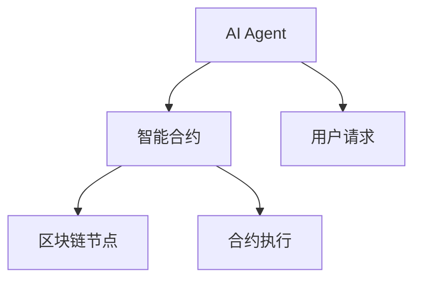
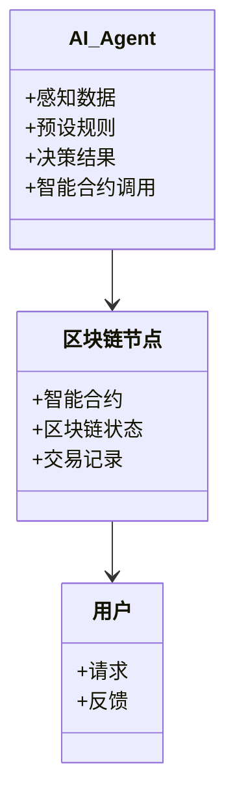
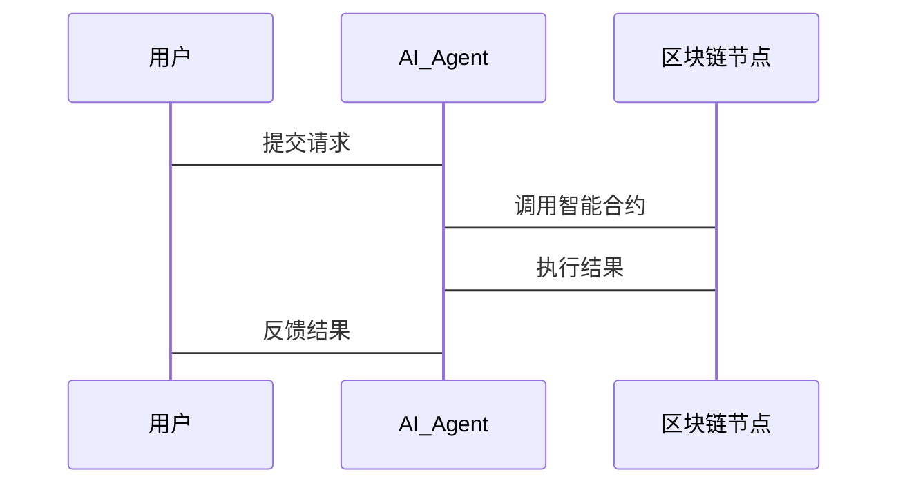

                 


# 企业AI Agent的区块链智能合约应用

> 关键词：AI Agent, 区块链, 智能合约, 企业应用, 技术融合

> 摘要：本文探讨了企业AI Agent与区块链智能合约的结合，分析了其在企业数字化转型中的应用价值。通过详细的技术原理讲解、系统架构设计和项目实战案例，展示了如何利用AI Agent调用智能合约，实现企业智能化、自动化的目标。文章结合数学公式、流程图和源代码，深入剖析了技术细节，为读者提供了系统化的解决方案和实践指导。

---

# 第一部分: 引言

## 第1章: 企业AI Agent与区块链智能合约的背景与意义

### 1.1 问题背景

#### 1.1.1 当前企业数字化转型的挑战
企业数字化转型已成为全球性的趋势，但企业在智能化升级过程中面临诸多挑战。传统的企业系统多基于规则引擎和人工干预，存在效率低、响应慢、决策滞后等问题。与此同时，企业内外部数据的复杂性增加，如何高效处理这些数据并做出实时决策成为关键。

#### 1.1.2 AI技术在企业中的应用现状
AI技术在企业中的应用日益广泛，从客服机器人到智能推荐系统，AI Agent（智能代理）逐渐成为企业自动化处理任务的核心工具。AI Agent能够根据设定的规则和数据驱动决策，但在实际应用中，如何确保其决策的透明性和可追溯性仍是一个难题。

#### 1.1.3 区块链技术对企业智能化的推动作用
区块链技术以其去中心化、不可篡改和智能合约的特性，为企业智能化提供了新的可能性。智能合约能够自动执行预设的规则，确保交易的透明性和可信度。将AI Agent与区块链智能合约结合，可以在企业中实现更加高效、安全的自动化流程。

### 1.2 问题描述

#### 1.2.1 企业AI Agent的核心需求
企业AI Agent需要具备以下核心需求：
- **数据驱动决策**：能够实时处理企业内外部数据，做出最优决策。
- **自动化执行**：能够自动触发相关操作，减少人工干预。
- **可追溯性**：决策过程可被记录和追溯，确保透明性和合规性。

#### 1.2.2 区块链智能合约的应用场景
区块链智能合约的应用场景包括：
- **供应链管理**：自动跟踪物流信息，确保货物按时交付。
- **财务结算**：自动执行支付和账单核对。
- **合同管理**：自动验证合同条款，确保自动履行。

#### 1.2.3 当前技术融合的痛点与难点
- **技术复杂性**：AI Agent与区块链的结合涉及多领域的技术，开发和部署难度较大。
- **性能瓶颈**：区块链的高延迟和低吞吐量可能影响AI Agent的实时性。
- **安全性问题**：AI Agent的决策可能受到恶意攻击的影响，需要确保其安全性和鲁棒性。

### 1.3 问题解决

#### 1.3.1 AI Agent与区块链智能合约的结合思路
通过将AI Agent与区块链智能合约结合，可以实现以下目标：
- **数据共享与协作**：AI Agent可以在区块链上访问多方数据，确保数据的安全性和一致性。
- **自动化决策与执行**：AI Agent根据数据和预设规则触发智能合约，实现自动化业务流程。
- **可追溯与审计**：区块链的特性确保每一步操作可追溯，方便审计和合规。

#### 1.3.2 技术融合对企业效率的提升
技术融合可以通过以下方式提升企业效率：
- **减少人工干预**：AI Agent和智能合约的自动化能力可以减少企业对人工操作的依赖。
- **提高决策速度**：通过实时数据分析和AI算法，企业能够快速做出决策。
- **增强信任与合规性**：区块链的透明性和智能合约的自动履行能力可以增强企业内外部的信任，确保合规性。

#### 1.3.3 智能合约在AI Agent中的具体应用
智能合约可以用于以下场景：
- **触发条件满足时自动执行**：例如，当供应链中的某个节点达到特定条件时，智能合约自动触发物流系统。
- **自动化支付与结算**：AI Agent根据业务规则自动执行支付操作，减少人为错误。
- **数据隐私保护**：通过区块链的隐私保护机制，确保数据在传输和处理过程中的安全性。

### 1.4 边界与外延

#### 1.4.1 技术融合的边界条件
- **技术实现**：AI Agent与区块链的结合需要考虑技术实现的可行性，如AI算法的实时性与区块链的性能限制。
- **数据隐私**：需要在数据共享与隐私保护之间找到平衡点。
- **合规性要求**：需要遵守相关法律法规，确保技术应用的合法性。

#### 1.4.2 应用场景的外延分析
- **扩展性**：AI Agent和智能合约的应用场景可以扩展到更多领域，如金融、医疗、教育等。
- **生态系统构建**：通过技术融合，构建一个多方参与的生态系统，促进企业间的协作与创新。

#### 1.4.3 未来可能的发展方向
- **AI与区块链的深度融合**：随着技术的发展，AI Agent与区块链的结合将更加紧密，可能出现新的应用场景和技术模式。
- **边缘计算的结合**：利用边缘计算技术，进一步提升AI Agent的实时性和响应速度。
- **智能化决策优化**：通过不断优化AI算法，提升AI Agent的决策能力，使其能够应对更加复杂的业务场景。

### 1.5 概念结构与核心要素组成

#### 1.5.1 核心概念的层次结构
- **顶层概念**：企业AI Agent、区块链智能合约。
- **中间层概念**：数据共享、自动化决策、智能合约执行。
- **底层概念**：AI算法、区块链技术、数据存储。

#### 1.5.2 核心要素的对比分析
| 核心要素 | 描述 |
|----------|------|
| AI Agent | 能够自主决策和执行任务的智能代理，依赖于AI算法和数据驱动。 |
| 智能合约 | 以区块链为底层，自动执行预设规则的代码，确保透明性和可信度。 |
| 数据共享 | 通过区块链实现多方数据的安全共享和协作。 |
| 自动化决策 | AI Agent根据数据和规则做出决策，并触发智能合约。 |
| 可追溯性 | 区块链记录每一步操作，确保决策过程可追溯和审计。 |

#### 1.5.3 实体关系图（Mermaid）



---

## 第2章: AI Agent的核心原理

### 2.1 AI Agent的基本原理

#### 2.1.1 AI Agent的定义与特征
AI Agent（人工智能代理）是一种能够感知环境、自主决策并执行任务的智能系统。其主要特征包括：
- **自主性**：能够在没有人工干预的情况下自主决策。
- **反应性**：能够根据环境变化实时调整行为。
- **目标导向**：基于预设目标或学习目标进行决策和行动。
- **协作性**：能够与其他系统或人进行协作，完成复杂任务。

#### 2.1.2 AI Agent的分类与应用场景
AI Agent可以分为以下几类：
- **简单反射式Agent**：基于当前感知做出简单反应，如自动回复邮件。
- **基于模型的反射式Agent**：维护环境模型，能够基于模型做出决策，如智能音箱。
- **目标导向的Agent**：基于目标驱动行为，如智能供应链管理。
- **效用导向的Agent**：基于效用函数进行优化决策，如自动驾驶。

#### 2.1.3 AI Agent与传统AI的区别
AI Agent与传统AI的区别主要体现在：
- **自主性**：AI Agent具备自主决策能力，而传统AI通常需要人工干预。
- **实时性**：AI Agent能够实时处理数据并做出决策，传统AI更多用于离线分析。
- **目标导向**：AI Agent基于目标驱动行为，传统AI更多用于数据处理和分析。

### 2.2 区块链智能合约的基本原理

#### 2.2.1 区块链智能合约的定义
区块链智能合约是一种基于区块链技术的自动化执行代码，用于在满足特定条件时自动触发操作。智能合约的核心特点包括：
- **自动执行**：一旦触发条件满足，智能合约会自动执行预设的操作。
- **不可篡改**：智能合约代码一旦部署到区块链上，无法被修改。
- **透明性**：智能合约的执行过程和结果对所有参与者公开，确保透明性和可信度。

#### 2.2.2 智能合约的执行机制
智能合约的执行机制包括以下几个步骤：
1. **触发条件**：当满足特定条件时，智能合约开始执行。
2. **状态检查**：智能合约检查当前区块链的状态，确保触发条件成立。
3. **合约执行**：智能合约根据预设规则执行操作，如转账、修改数据等。
4. **记录日志**：智能合约的执行过程和结果会被记录在区块链上，确保可追溯性。

#### 2.2.3 智能合约的安全性与可靠性
智能合约的安全性与可靠性依赖于区块链的技术特性：
- **安全性**：智能合约运行在区块链节点上，通过密码学技术确保安全性。
- **可靠性**：智能合约的执行结果被区块链记录，确保数据的准确性和一致性。

### 2.3 AI Agent与智能合约的关系

#### 2.3.1 AI Agent调用智能合约的逻辑
AI Agent可以通过以下步骤调用智能合约：
1. **感知环境**：AI Agent通过传感器或数据接口感知环境信息。
2. **决策判断**：基于感知数据和预设规则，AI Agent做出是否需要调用智能合约的决策。
3. **智能合约调用**：AI Agent通过区块链接口调用智能合约，触发智能合约的执行。
4. **结果反馈**：智能合约执行完毕后，将结果反馈给AI Agent，AI Agent根据反馈结果调整后续行为。

#### 2.3.2 智能合约如何支持AI Agent的决策
智能合约可以为AI Agent提供以下支持：
- **数据共享**：智能合约可以作为数据共享的中间件，确保数据的安全性和一致性。
- **规则执行**：智能合约可以自动执行预设规则，确保AI Agent的决策符合企业政策。
- **可信环境**：智能合约的执行环境是可信的，AI Agent可以依赖智能合约的执行结果进行决策。

#### 2.3.3 两者的结合对企业的影响
AI Agent与智能合约的结合可以显著提升企业的智能化水平，主要体现在：
- **效率提升**：通过自动化决策和执行，减少人工干预，提升企业效率。
- **决策优化**：AI Agent基于实时数据和智能合约的执行结果，做出更加优化的决策。
- **信任增强**：智能合约的透明性和可信度，增强了企业内外部的信任，促进协作。

---

## 第3章: AI Agent的算法原理

### 3.1 AI Agent的决策算法

#### 3.1.1 基于规则的决策算法
基于规则的决策算法是最简单的AI Agent决策算法，适用于规则明确的场景。例如：
$$
\text{如果温度 > 30℃，则开启空调}
$$

#### 3.1.2 基于逻辑的决策算法
基于逻辑的决策算法通过逻辑推理做出决策，适用于规则复杂且需要推理的场景。例如：
$$
\text{如果（温度 > 30℃ 且湿度 > 60%）或（温度 < 20℃ 且湿度 < 30%），则启动空调}
$$

#### 3.1.3 基于机器学习的决策算法
基于机器学习的决策算法通过训练模型做出决策，适用于数据复杂且需要深度学习的场景。例如：
$$
\text{预测明天的温度，如果预测温度 > 30℃，则开启空调}
$$

#### 3.1.4 基于强化学习的决策算法
基于强化学习的决策算法通过与环境的交互学习，不断优化决策策略，适用于动态变化的复杂场景。例如：
$$
\text{在股票交易中，根据市场变化调整买卖策略，最大化收益}
$$

---

## 第4章: 区块链智能合约的算法原理

### 4.1 区块链智能合约的执行流程

#### 4.1.1 智能合约的触发条件
智能合约的触发条件可以是以下几种形式：
- **时间触发**：例如，在特定时间执行某个操作。
- **事件触发**：例如，当某个事件发生时，自动执行智能合约。
- **状态触发**：例如，当某个区块链的状态满足特定条件时，执行智能合约。

#### 4.1.2 智能合约的执行过程
智能合约的执行过程包括以下几个步骤：
1. **触发条件检查**：智能合约检查当前是否满足触发条件。
2. **状态读取**：智能合约读取区块链当前的状态，获取需要的数据。
3. **合约执行**：智能合约根据预设规则执行操作，修改区块链的状态。
4. **日志记录**：智能合约的执行过程和结果被记录在区块链上，确保可追溯性。

#### 4.1.3 智能合约的安全性保障
智能合约的安全性保障主要依赖于以下技术：
- **加密技术**：通过加密算法确保智能合约代码的安全性。
- **权限控制**：通过权限管理确保只有授权的节点可以执行智能合约。
- **共识机制**：通过共识机制确保智能合约的执行结果被所有节点认可。

---

## 第5章: AI Agent与区块链智能合约的结合算法

### 5.1 AI Agent调用智能合约的算法流程

#### 5.1.1 算法步骤
1. **感知环境**：AI Agent通过传感器或数据接口感知环境信息。
2. **决策判断**：基于感知数据和预设规则，AI Agent做出是否需要调用智能合约的决策。
3. **智能合约调用**：如果需要调用智能合约，AI Agent通过区块链接口调用智能合约，触发智能合约的执行。
4. **结果反馈**：智能合约执行完毕后，将结果反馈给AI Agent，AI Agent根据反馈结果调整后续行为。

#### 5.1.2 算法的数学模型
AI Agent的决策过程可以用以下数学模型表示：
$$
\text{决策 = f(感知数据, 预设规则)}
$$
其中，$f$是AI Agent的决策函数，可以是基于规则的函数，也可以是基于机器学习的模型。

### 5.2 智能合约执行的算法保障

#### 5.2.1 算法的可靠性
智能合约的可靠性主要依赖于区块链的特性：
- **不可篡改性**：智能合约代码一旦部署到区块链上，无法被修改。
- **透明性**：智能合约的执行过程和结果对所有参与者公开，确保透明性和可信度。

#### 5.2.2 算法的安全性
智能合约的安全性保障主要依赖于以下技术：
- **加密技术**：通过加密算法确保智能合约代码的安全性。
- **权限控制**：通过权限管理确保只有授权的节点可以执行智能合约。
- **共识机制**：通过共识机制确保智能合约的执行结果被所有节点认可。

---

## 第6章: 系统分析与架构设计方案

### 6.1 项目背景介绍

#### 6.1.1 项目目标
本项目旨在通过将AI Agent与区块链智能合约结合，实现企业智能化、自动化的业务流程。主要目标包括：
- 提升企业的决策效率和响应速度。
- 增强企业的数据安全性和可信度。
- 降低企业的人工成本和管理复杂性。

#### 6.1.2 项目需求
项目需求包括：
- **数据共享**：实现企业内外部数据的安全共享和协作。
- **自动化决策**：通过AI Agent实现业务流程的自动化决策和执行。
- **智能合约执行**：通过区块链智能合约实现业务规则的自动履行。

### 6.2 系统功能设计

#### 6.2.1 领域模型设计
领域模型设计可以通过Mermaid类图表示：



#### 6.2.2 系统架构设计
系统架构设计可以通过Mermaid架构图表示：


#### 6.2.3 系统接口设计
系统接口设计包括：
- **AI Agent接口**：用于AI Agent感知环境和调用智能合约。
- **区块链节点接口**：用于智能合约的部署和执行。
- **用户接口**：用于用户提交请求和接收反馈。

#### 6.2.4 系统交互设计
系统交互可以通过Mermaid序列图表示：



### 6.3 项目实现与代码

#### 6.3.1 环境安装
项目开发环境包括：
- **Python 3.8+**
- **Solidity 0.8+**
- **以太坊节点（如Geth）**
- **Python以太坊库（如web3.py）**

#### 6.3.2 智能合约实现

##### 智能合约代码（Solidity）
```solidity
// SPDX-License-Identifier: MIT
pragma solidity ^0.8.0;

contract SmartContract {
    event LogEvent(address indexed caller, uint256 value);

    function execute(uint256 value) external {
        emit LogEvent(msg.sender, value);
        // 执行智能合约操作
    }
}
```

##### 智能合约调用代码（Python）
```python
from web3 import Web3

# 初始化以太坊节点连接
w3 = Web3(Web3.HTTPProvider('http://localhost:8545'))

# 智能合约地址
contract_address = '0x123456789abcde123456789abcde123456789abc'

# 调用智能合约
contract = w3.eth.contract(contract_address, abi=abi)
tx_hash = contract.functions.execute(123).transact()
receipt = w3.eth.waitForTransactionReceipt(tx_hash)
```

#### 6.3.3 AI Agent实现

##### AI Agent代码（Python）
```python
class AI_Agent:
    def __init__(self, blockchain_node):
        self.blockchain_node = blockchain_node

    def感知环境(self):
        # 获取环境数据
        pass

    def决策(self, 数据):
        # 根据数据和规则做出决策
        return True

    def执行(self, 决策):
        if self.决策(数据):
            self.blockchain_node.调用智能合约()

    def反馈(self, 反馈):
        # 处理反馈结果
        pass
```

##### AI Agent调用智能合约示例
```python
agent = AI_Agent(blockchain_node)
agent.感知环境()
agent.决策(数据)
agent.执行(决策)
agent.反馈(结果)
```

### 6.4 项目案例分析与详细解读

#### 6.4.1 案例背景
假设某企业希望通过AI Agent实现供应链管理的智能化。AI Agent需要根据供应链中的实时数据，自动触发智能合约，确保物流流程的顺利进行。

#### 6.4.2 案例分析
1. **需求分析**：企业需要实时监控供应链中的物流信息，当某个节点出现延迟时，自动触发智能合约，通知相关部门进行处理。
2. **系统设计**：
   - **AI Agent**：负责实时监控物流信息，做出是否需要触发智能合约的决策。
   - **智能合约**：当AI Agent触发智能合约时，智能合约会自动通知相关物流系统进行调整。
3. **实现过程**：
   - AI Agent通过传感器获取物流信息。
   - AI Agent判断是否需要触发智能合约。
   - 如果需要触发智能合约，AI Agent调用区块链节点上的智能合约，智能合约执行相应的操作。
   - 智能合约的执行结果反馈给AI Agent，AI Agent根据反馈结果调整后续行为。

#### 6.4.3 案例实现
```python
# AI Agent代码
class AI_Agent:
    def __init__(self, blockchain_node):
        self.blockchain_node = blockchain_node

    def感知环境(self):
        # 获取物流信息
        return self.blockchain_node.获取物流信息()

    def决策(self, 数据):
        # 判断是否需要触发智能合约
        if 数据['延迟'] > 12小时:
            return True
        else:
            return False

    def执行(self, 决策):
        if self.决策(数据):
            self.blockchain_node.调用智能合约()

    def反馈(self, 反馈):
        # 处理反馈结果
        pass

# 智能合约代码
contract = {
    'abi': [
        {'name': 'LogEvent', 'type': 'event', 'inputs': [{'name': 'caller', 'type': 'address'}, {'name': 'value', 'type': 'uint256'}]},
        {'name': 'execute', 'type': 'function', 'inputs': [{'name': 'value', 'type': 'uint256'}], 'outputs': []}
    ]
}

# 实现案例
agent = AI_Agent(blockchain_node=contract)
agent.感知环境()
agent.决策(数据)
agent.执行(决策)
agent.反馈(结果)
```

### 6.5 项目小结

#### 6.5.1 项目成果
通过本项目的实施，企业实现了供应链管理的智能化和自动化。AI Agent能够实时监控物流信息，自动触发智能合约，确保物流流程的顺利进行。

#### 6.5.2 项目经验总结
- **技术融合的重要性**：AI Agent与区块链智能合约的结合能够显著提升企业的智能化水平。
- **系统设计的关键性**：合理的系统设计是项目成功的关键，需要充分考虑系统的可扩展性和可维护性。
- **安全性与可靠性的保障**：智能合约的安全性与可靠性是项目成功的重要保障，需要充分考虑相关的安全措施。

#### 6.5.3 项目可能遇到的问题与解决方案
- **性能瓶颈**：区块链的高延迟可能影响AI Agent的实时性。解决方案包括优化区块链节点的性能或采用侧链技术。
- **数据隐私**：AI Agent需要处理大量的敏感数据，如何保证数据隐私是一个挑战。解决方案包括采用零知识证明等隐私保护技术。
- **智能合约的安全性**：智能合约的漏洞可能导致严重的安全问题。解决方案包括进行智能合约的安全审计和测试。

---

## 第7章: 总结与展望

### 7.1 总结

#### 7.1.1 全文总结
本文详细探讨了企业AI Agent与区块链智能合约的结合，分析了其在企业数字化转型中的应用价值。通过详细的技术原理讲解、系统架构设计和项目实战案例，展示了如何利用AI Agent调用智能合约，实现企业智能化、自动化的目标。

#### 7.1.2 核心观点回顾
- AI Agent与区块链智能合约的结合能够显著提升企业的智能化水平。
- 通过技术融合，企业可以实现数据共享、自动化决策和智能合约执行，提升效率和决策质量。
- 智能合约的透明性和可信度，增强了企业内外部的信任，促进协作。

### 7.2 展望

#### 7.2.1 技术发展
- **AI Agent的智能化提升**：随着AI技术的发展，AI Agent将更加智能化，能够处理更复杂的数据和做出更精准的决策。
- **区块链技术的演进**：区块链技术将不断演进，出现新的共识机制和隐私保护技术，提升智能合约的安全性和性能。
- **技术融合的深化**：AI Agent与区块链的结合将更加紧密，可能出现新的应用场景和技术模式。

#### 7.2.2 应用场景扩展
- **金融领域**：AI Agent与智能合约的结合可以用于自动化金融交易、智能风控等领域。
- **医疗领域**：AI Agent可以用于医疗数据共享、智能诊断等领域。
- **教育领域**：AI Agent可以用于智能教学、个性化学习等领域。

### 7.3 最佳实践 Tips

#### 7.3.1 技术选型建议
- **选择适合的区块链平台**：根据具体需求选择适合的区块链平台，如以太坊、fabric等。
- **合理设计智能合约**：智能合约的设计需要充分考虑安全性、可靠性和可扩展性。
- **优化AI Agent的决策算法**：根据具体场景选择适合的决策算法，如基于规则的决策、机器学习决策等。

#### 7.3.2 开发与部署注意事项
- **安全性第一**：在开发和部署过程中，需要充分考虑安全性问题，确保系统不会受到攻击。
- **测试与验证**：在系统部署前，需要进行全面的测试和验证，确保系统的稳定性和可靠性。
- **持续优化**：在系统运行过程中，需要持续优化系统性能和用户体验，确保系统的长期稳定运行。

#### 7.3.3 维护与升级建议
- **定期更新智能合约**：根据业务需求和技术发展，定期更新智能合约，确保系统的先进性。
- **监控与日志记录**：通过监控和日志记录，及时发现和解决问题，确保系统的稳定运行。
- **团队协作**：开发和维护过程中，需要团队成员之间的良好协作，确保系统的顺利运行。

---

## 作者信息

**作者：AI天才研究院/AI Genius Institute & 禅与计算机程序设计艺术 /Zen And The Art of Computer Programming**

---

# 结语

企业AI Agent与区块链智能合约的结合为企业智能化、自动化提供了新的可能性。通过本文的系统化分析和实践指导，读者可以深入了解技术细节，并在实际应用中实现技术融合，提升企业的竞争力和创新能力。未来，随着技术的不断发展，AI Agent与区块链的结合将更加紧密，为企业创造更多的价值。

