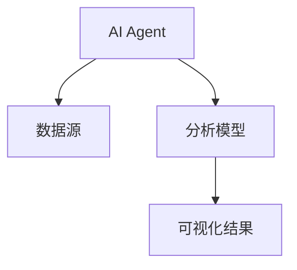
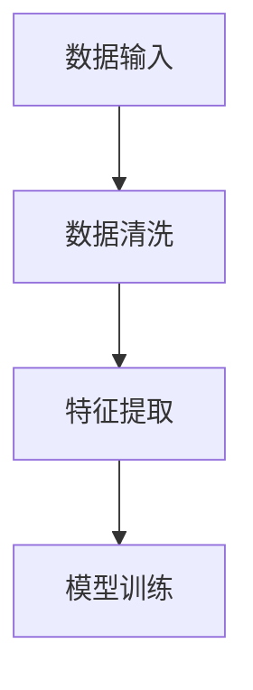
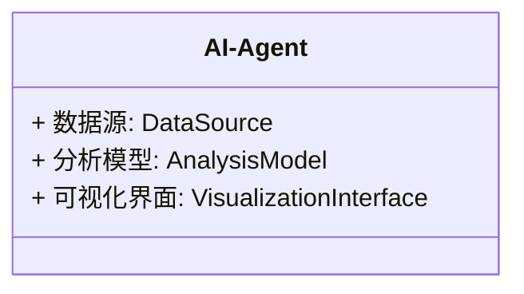
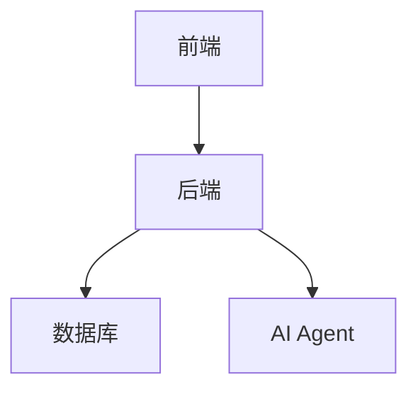
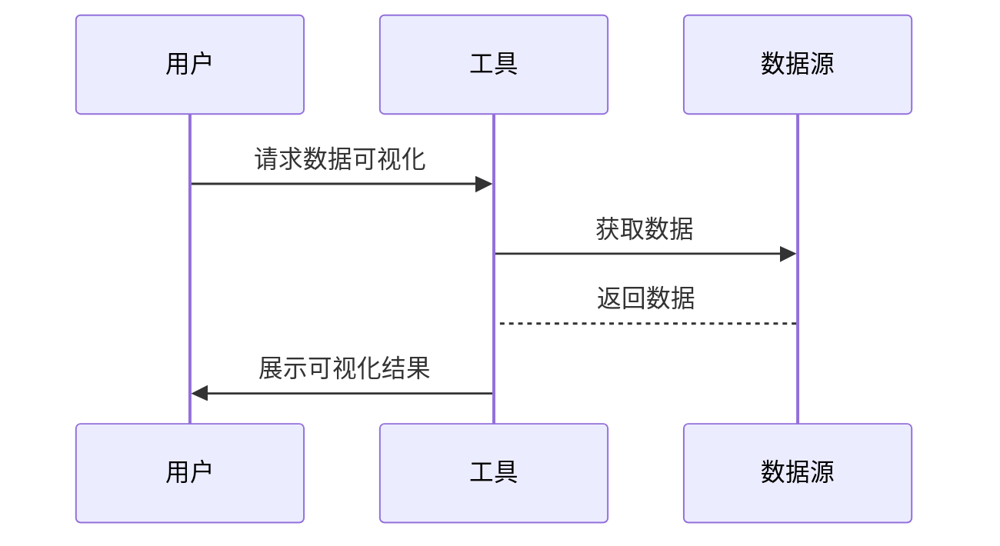

                 


# 《企业AI Agent的可视化分析工具》

> 关键词：企业AI Agent、可视化分析工具、数据可视化、人工智能、决策支持系统、算法原理

> 摘要：本文深入探讨了企业AI Agent的可视化分析工具的设计与实现，从核心概念、算法原理、系统架构到实际应用，全面分析了该工具在企业智能化管理中的重要性与应用价值。通过详细的理论阐述与实际案例分析，本文为读者提供了从理解到实践的完整指南。

---

# 第一部分: 企业AI Agent的背景与概念

## 第1章: 企业AI Agent的背景与概念

### 1.1 问题背景
#### 1.1.1 企业AI Agent的定义与特点
企业AI Agent是一种能够理解、推理、学习和执行复杂任务的智能体，它通过与企业系统和数据的交互，提供自动化决策和执行能力。其特点包括智能性、自主性、反应性和协作性。

#### 1.1.2 可视化分析工具的必要性
随着AI Agent在企业中的广泛应用，如何直观展示其运行状态、决策过程和结果成为关键问题。可视化分析工具能够将复杂的AI Agent行为转化为易于理解的图形和交互界面，帮助企业用户快速获取洞察。

#### 1.1.3 企业AI Agent与传统数据分析的对比
传统数据分析依赖人工解读，而AI Agent结合了数据处理和智能决策，能够自动化地发现问题、提出解决方案并执行操作。可视化分析工具进一步将这些决策过程可视化，使得企业用户能够更高效地监控和管理AI Agent。

### 1.2 问题描述
#### 1.2.1 AI Agent在企业中的应用场景
企业AI Agent广泛应用于智能客服、供应链优化、风险预警等领域。例如，在智能客服中，AI Agent能够通过自然语言处理技术为用户提供个性化服务。

#### 1.2.2 可视化分析工具的核心功能
可视化分析工具需要具备数据可视化、AI Agent行为监控、决策过程展示、交互式分析等功能，能够帮助用户实时了解AI Agent的状态和表现。

#### 1.2.3 企业AI Agent面临的挑战与痛点
企业在使用AI Agent时面临数据孤岛、决策过程不透明、用户缺乏技术背景等挑战。可视化分析工具需要解决这些问题，提高AI Agent的可解释性和可用性。

### 1.3 问题解决
#### 1.3.1 可视化分析工具如何解决AI Agent的问题
通过将AI Agent的决策过程和结果可视化，用户可以更直观地理解AI Agent的行为，发现潜在问题并优化其性能。

#### 1.3.2 工具的核心功能与优势
可视化分析工具通过直观的图表和交互式界面，降低了用户使用AI Agent的门槛，提高了企业管理和决策效率。

#### 1.3.3 企业的实际需求与解决方案的匹配
企业需要实时监控AI Agent的运行状态，快速响应问题。可视化分析工具通过实时数据更新和警报功能，满足了企业的实际需求。

### 1.4 边界与外延
#### 1.4.1 工具的适用范围与限制
可视化分析工具适用于企业内部的AI Agent管理，但其功能受限于数据质量和AI Agent的复杂度。

#### 1.4.2 相关概念的对比与区分
与数据可视化工具相比，企业AI Agent的可视化分析工具更注重AI Agent行为的展示和交互。

#### 1.4.3 未来发展的可能性与趋势
随着AI技术的进步，可视化分析工具将更加智能化，具备自适应和预测功能，进一步提升企业的智能化管理水平。

### 1.5 核心概念与组成
#### 1.5.1 AI Agent的核心要素
AI Agent由感知层、决策层和执行层组成，分别负责数据采集、决策制定和任务执行。

#### 1.5.2 可视化分析工具的功能模块
包括数据可视化模块、AI Agent监控模块、交互式分析模块等，每个模块协同工作，实现功能互补。

#### 1.5.3 两者之间的关系与协同
AI Agent通过提供数据和决策信息，可视化分析工具将其转化为直观的展示，帮助用户更好地理解和管理AI Agent。

---

## 第2章: AI Agent的核心概念与原理

### 2.1 AI Agent的原理与机制
#### 2.1.1 AI Agent的基本工作流程
AI Agent通过感知环境、分析数据、制定决策并执行操作，实现智能化管理。其工作流程包括数据采集、模型训练、决策制定和任务执行四个阶段。

#### 2.1.2 数据处理与分析的详细步骤
数据预处理、特征提取、模型训练和结果分析是AI Agent的核心步骤，每个步骤都需要高效的数据处理算法支持。

#### 2.1.3 决策与执行的逻辑关系
AI Agent根据分析结果制定决策，并通过执行层将决策转化为具体行动，实现闭环管理。

### 2.2 可视化分析工具的原理
#### 2.2.1 数据可视化的基本原理
通过将数据转化为图表、图形等视觉元素，帮助用户快速理解数据特征和趋势。

#### 2.2.2 AI Agent分析结果的可视化方法
使用实时图表、热力图等可视化手段展示AI Agent的运行状态和决策结果，提供直观的反馈。

#### 2.2.3 工具如何辅助用户理解AI Agent的行为
通过交互式界面和动态更新的可视化元素，用户可以实时跟踪AI Agent的行为，发现潜在问题并优化其性能。

### 2.3 核心概念对比表
| 概念 | 描述 | 对比点 |
|------|------|--------|
| AI Agent | 自动化决策与执行的智能体 | 数据处理能力 |
| 可视化工具 | 展示数据与分析结果的界面 | 易用性与直观性 |

### 2.4 ER实体关系图


---

## 第3章: 算法原理与实现

### 3.1 数据处理算法
#### 3.1.1 数据清洗与预处理
数据清洗是去除噪声数据，确保数据质量的关键步骤。预处理包括数据转换、缺失值处理和异常值剔除。

#### 3.1.2 数据特征提取
特征提取是将原始数据转化为有意义的特征向量，常用的方法包括主成分分析（PCA）和拉普拉斯特征映射。

#### 3.1.3 算法流程图


### 3.2 AI Agent决策算法
#### 3.2.1 决策树算法
决策树是一种常用的分类和回归算法，通过构建树状结构进行决策。ID3、C4.5和CART是常见的决策树算法。

#### 3.2.2 支持向量机（SVM）
SVM通过构建超平面实现数据分类，适用于高维数据的处理。

#### 3.2.3 神经网络算法
神经网络通过多层感知机模拟人脑神经网络，适用于复杂的非线性分类任务。

### 3.3 算法实现
#### 3.3.1 数据处理代码
```python
import pandas as pd
from sklearn.preprocessing import StandardScaler

# 数据清洗
data = pd.read_csv('data.csv')
data.dropna(inplace=True)
data = data[~data.duplicated()]
```

#### 3.3.2 决策树实现
```python
from sklearn.tree import DecisionTreeClassifier
from sklearn.model_selection import train_test_split

# 数据分割
X_train, X_test, y_train, y_test = train_test_split(X, y, test_size=0.2)
# 模型训练
model = DecisionTreeClassifier()
model.fit(X_train, y_train)
```

### 3.4 数学模型与公式
#### 3.4.1 线性回归模型
$$ y = \beta_0 + \beta_1x_1 + \beta_2x_2 + \ldots + \beta_nx_n + \epsilon $$

#### 3.4.2 决策树模型
决策树的构建过程可以通过信息增益率公式来衡量特征的选择：
$$ \text{信息增益率} = \frac{\text{信息增益}}{\text{特征的熵}} $$

---

## 第4章: 系统分析与架构设计方案

### 4.1 问题场景介绍
企业AI Agent的可视化分析工具需要支持多用户同时访问，具备高可用性和可扩展性。

### 4.2 项目介绍
本项目旨在开发一款企业级AI Agent可视化分析工具，帮助用户实时监控和管理AI Agent的运行状态。

### 4.3 系统功能设计
#### 4.3.1 领域模型


#### 4.3.2 系统架构设计


### 4.4 系统接口设计
#### 4.4.1 API接口
API接口包括数据获取接口、模型训练接口和结果展示接口，确保系统的模块化和可扩展性。

#### 4.4.2 交互流程


---

## 第5章: 项目实战

### 5.1 环境安装
安装Python、Jupyter Notebook、Pandas、Matplotlib等工具，配置开发环境。

### 5.2 核心代码实现
#### 5.2.1 数据可视化
```python
import matplotlib.pyplot as plt

# 绘制柱状图
plt.bar(x, y)
plt.xlabel('X轴') 
plt.ylabel('Y轴')
plt.show()
```

#### 5.2.2 AI Agent监控
```python
import requests

# 获取AI Agent状态
response = requests.get('http://localhost:8000/api/status')
print(response.json())
```

### 5.3 案例分析
通过具体案例展示可视化分析工具在企业中的应用，分析其优缺点，并提出改进建议。

### 5.4 项目小结
总结项目开发过程中的经验教训，提出改进建议和未来发展方向。

---

## 第6章: 最佳实践与小结

### 6.1 最佳实践
#### 6.1.1 小结
可视化分析工具在企业AI Agent管理中的重要性不可忽视，通过直观的展示和高效的交互，能够显著提升企业的管理效率。

#### 6.1.2 注意事项
在实际应用中，需要注意数据隐私和安全问题，确保系统的稳定性和可靠性。

#### 6.1.3 拓展阅读
推荐相关书籍和论文，进一步深入学习AI Agent和可视化分析工具的知识。

### 6.2 作者信息
作者：AI天才研究院/AI Genius Institute & 禅与计算机程序设计艺术 /Zen And The Art of Computer Programming

---

通过以上目录结构，您可以逐步展开每个章节的内容，撰写一篇详细且专业的技术博客文章。

