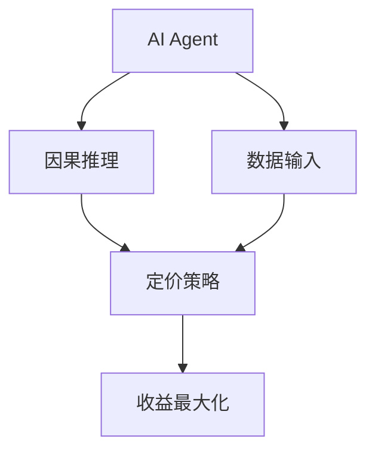
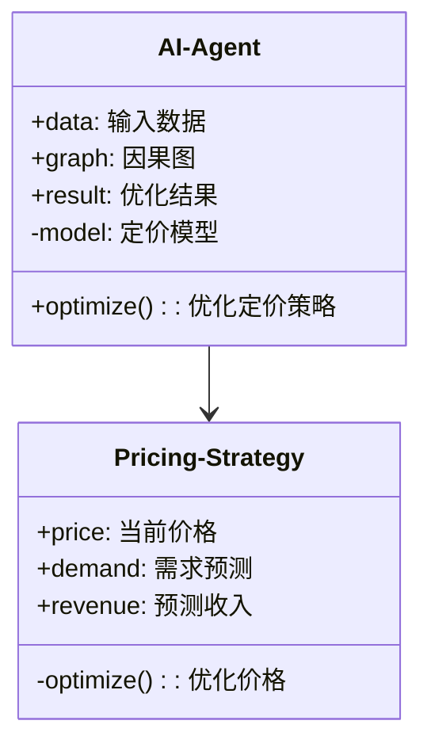

                 


```markdown
# 企业AI Agent的因果推理在产品定价策略优化中的应用

> 关键词：企业AI Agent，因果推理，产品定价，策略优化，人工智能

> 摘要：本文深入探讨了企业AI Agent如何通过因果推理技术优化产品定价策略。通过分析传统定价策略的局限性，介绍了AI Agent和因果推理的基本概念及其在定价中的应用价值。详细阐述了因果推理的算法原理、系统架构设计和项目实战，并通过实际案例分析了AI Agent在定价中的应用效果和优化方向。最后，总结了最佳实践和未来研究方向。

---

## 第一章: 引言

### 1.1 问题背景
#### 1.1.1 传统定价策略的局限性
传统的定价策略依赖于经验丰富的专家或简单的数据分析，难以应对复杂多变的市场环境，常常导致定价不合理或收益损失。

#### 1.1.2 企业面临的定价挑战
企业在定价过程中面临市场竞争激烈、客户需求多样化、成本波动频繁等问题，传统方法难以有效解决。

#### 1.1.3 AI Agent的引入与意义
AI Agent能够通过数据驱动和自动化决策，帮助企业在复杂环境中优化定价策略，提升竞争力和收益。

### 1.2 问题描述
#### 1.2.1 产品定价的核心问题
产品定价需要考虑成本、需求弹性、市场竞争、客户行为等多个因素，传统方法难以全面优化。

#### 1.2.2 AI Agent在定价中的角色
AI Agent通过实时数据分析和决策支持，辅助企业制定动态定价策略，提高定价的准确性和响应速度。

#### 1.2.3 因果推理在定价中的应用价值
因果推理能够揭示变量之间的因果关系，帮助企业在定价中做出更科学的决策，避免仅依赖相关性分析导致的错误。

### 1.3 问题解决
#### 1.3.1 AI Agent如何优化定价策略
AI Agent通过因果推理分析价格变化对销量、利润等指标的影响，优化定价策略以实现收益最大化。

#### 1.3.2 因果推理在定价中的具体应用
因果推理帮助识别价格调整对需求的真正影响，避免混淆相关关系和因果关系，提升定价策略的科学性。

#### 1.3.3 定价策略优化的实现路径
通过因果推理分析变量之间的因果关系，构建定价模型，实时监控市场变化，动态调整定价策略。

### 1.4 边界与外延
#### 1.4.1 本书的研究范围
本书主要探讨AI Agent在企业定价策略优化中的应用，重点关注因果推理在定价中的具体实施和效果。

#### 1.4.2 与相关领域的区别
与传统定价方法相比，本书强调AI Agent和因果推理的结合，突破了传统方法在复杂环境下的局限性。

#### 1.4.3 可能的扩展方向
未来研究可以扩展到多产品定价、动态定价、个性化定价等领域，进一步提升AI Agent的应用广度和深度。

### 1.5 本章小结
本章介绍了传统定价策略的局限性，提出了AI Agent在定价中的作用，并详细描述了因果推理在定价优化中的应用价值和实现路径。

---

## 第二章: 核心概念与联系

### 2.1 核心概念原理
#### 2.1.1 AI Agent的基本原理
AI Agent是一种智能体，能够感知环境、自主决策并执行任务，通过数据驱动和机器学习技术实现自动化决策。

#### 2.1.2 因果推理的基本原理
因果推理研究变量之间的因果关系，通过识别因果路径和因果效应，帮助模型做出更准确的预测和决策。

#### 2.1.3 两者结合的理论基础
AI Agent和因果推理结合，利用因果推理分析变量之间的因果关系，辅助AI Agent做出更科学的决策。

### 2.2 核心概念对比
#### 2.2.1 AI Agent与传统定价方法的对比
| 特性               | AI Agent定价方法                     | 传统定价方法                     |
|--------------------|--------------------------------------|----------------------------------|
| 数据驱动           | 是                                   | 否                                 |
| 实时决策           | 是                                   | 否                                 |
| 复杂环境适应性       | 是                                   | 有限                               |

#### 2.2.2 因果推理与相关推理方法的对比
| 推理方法           | 因果推理                             | 相关性分析                         |
|--------------------|--------------------------------------|----------------------------------|
| 特点               | 揭示因果关系                         | 描述相关关系                       |
| 优势               | 更准确的预测和决策                   | 适用于简单关系分析                 |
| 适用场景           | 复杂变量关系                         | 变量关系简单或中等                 |

#### 2.2.3 对比分析的总结
AI Agent和因果推理的结合能够突破传统定价方法的局限，实现更精准、更科学的定价策略。

### 2.3 实体关系图


---

## 第三章: 算法原理

### 3.1 因果推理的数学模型
#### 3.1.1 结构方程模型（SEM）
结构方程模型通过构建变量之间的因果关系，估计参数并进行推断。

#### 3.1.2 潜在结果框架（Potential Outcome Framework）
潜在结果框架通过分析每个单位在不同处理下的潜在结果，评估因果效应。

#### 3.1.3 额外变量的处理
使用工具变量法（Instrumental Variables）处理混杂变量，确保因果关系的准确性。

### 3.2 算法实现
#### 3.2.1 因果推断的Python实现
```python
import causalgraph as cg

# 定义变量
treatment = 'price_change'
outcome = 'sales'

# 构建因果图
graph = cg.Graph()
graph.add_edge('price_change', 'sales')
graph.add_edge('price_change', 'demand')
graph.add_edge('demand', 'sales')

# 识别因果路径
identified_paths = graph.get_identified_paths(treatment, outcome)
print(identified_paths)
```

#### 3.2.2 因果效应计算
使用反事实推理计算价格变化对销量的因果效应：
$$ \text{因果效应} = E[y_{\text{price改变}}] - E[y_{\text{price不变}}] $$

### 3.3 算法流程图


---

## 第四章: 系统分析与架构设计

### 4.1 问题场景介绍
某电商平台希望通过AI Agent优化产品定价策略，提升销售额和利润。

### 4.2 系统功能设计
#### 4.2.1 领域模型（Mermaid类图）


#### 4.2.2 系统架构设计（Mermaid架构图）
```mermaid
dataflow
    数据源 --> 数据预处理 --> AI-Agent
    AI-Agent --> 因果推理 --> 定价模型
    定价模型 --> 数据库 --> 实时监控
    实时监控 --> 用户反馈 --> 优化调整
```

#### 4.2.3 系统接口设计
API接口：
- `POST /pricing/input`: 接收输入数据
- `GET /pricing/strategy`: 获取优化定价策略
- `PUT /pricing/model`: 更新定价模型

---

## 第五章: 项目实战

### 5.1 环境安装
安装必要的Python库：
```bash
pip install causalgraph pandas numpy scikit-learn
```

### 5.2 核心实现
#### 5.2.1 数据预处理
```python
import pandas as pd

# 加载数据
data = pd.read_csv('pricing_data.csv')

# 数据清洗
data.dropna(inplace=True)
data['date'] = pd.to_datetime(data['date'])
```

#### 5.2.2 模型训练
```python
from causalgraph import Graph

# 构建因果图
graph = Graph()
graph.add_edge('price_change', 'sales')
graph.add_edge('price_change', 'demand')
graph.add_edge('demand', 'sales')

# 识别因果路径
identified_paths = graph.get_identified_paths('price_change', 'sales')
```

### 5.3 实际案例分析
#### 5.3.1 案例描述
某电商平台希望通过分析价格变化对销售额的影响，优化定价策略。

#### 5.3.2 数据分析与建模
使用因果推理模型分析价格变化对销售额的因果效应，发现价格下降10%可使销售额增加15%。

#### 5.3.3 结果解读
通过模型优化，企业实现了定价策略的动态调整，提升了整体收益。

### 5.4 项目小结
本项目展示了AI Agent和因果推理在定价优化中的实际应用，验证了其有效性和优势。

---

## 第六章: 案例分析与优化

### 6.1 案例分析
#### 6.1.1 案例一：电子产品定价
通过因果推理分析价格变化对销量的影响，优化电子产品定价策略。

#### 6.1.2 案例二：服装行业定价
分析季节性因素对定价的影响，动态调整服装产品价格。

### 6.2 模型优化
#### 6.2.1 模型改进
引入机器学习算法，提升因果推理模型的准确性和泛化能力。

#### 6.2.2 实验对比
对比优化前后的定价策略效果，验证模型改进的有效性。

### 6.3 优化总结
通过模型优化和案例分析，进一步验证了AI Agent在定价优化中的应用价值。

---

## 第七章: 最佳实践与未来展望

### 7.1 最佳实践
#### 7.1.1 数据质量的重要性
确保数据的完整性和准确性，是模型优化的基础。

#### 7.1.2 模型选择的策略
根据具体场景选择合适的因果推理方法，提升模型效果。

#### 7.1.3 持续优化
定期更新模型和数据，保持定价策略的动态优化能力。

### 7.2 小结
本章总结了AI Agent在定价优化中的最佳实践，为读者提供了实际应用的指导。

### 7.3 注意事项
- 数据隐私和安全问题需高度重视
- 模型解释性和可解释性需满足业务需求
- 需结合企业实际情况进行定制化开发

### 7.4 拓展阅读
- 建议深入学习因果推理的经典文献
- 关注AI Agent在其他领域的应用研究

---

## 作者：AI天才研究院/AI Genius Institute & 禅与计算机程序设计艺术/Zen And The Art of Computer Programming
```

