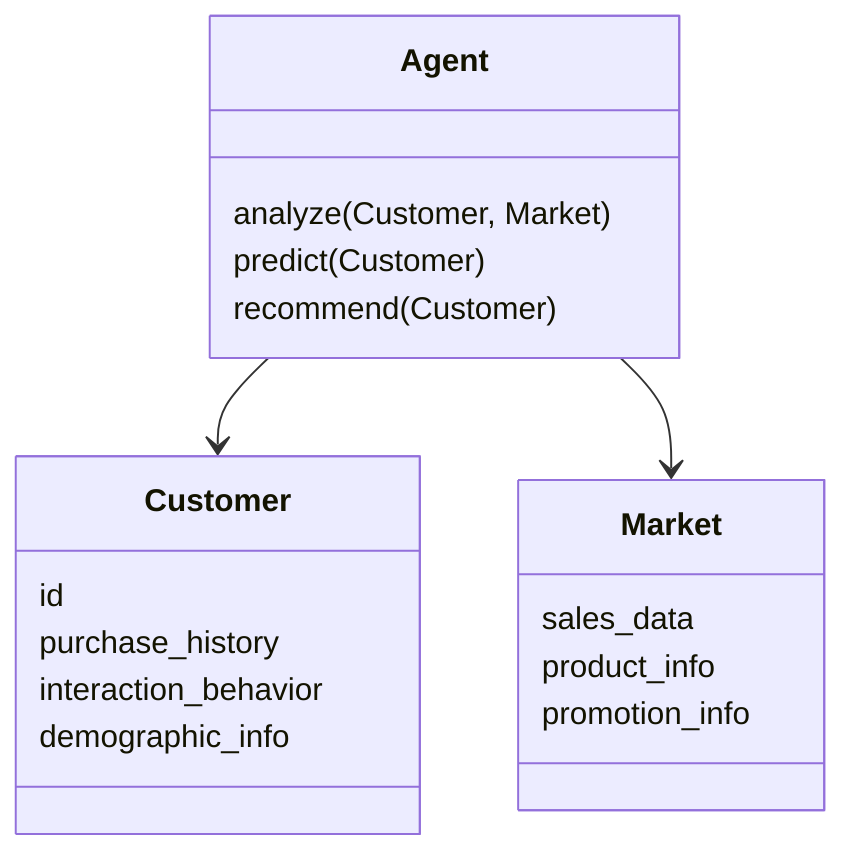
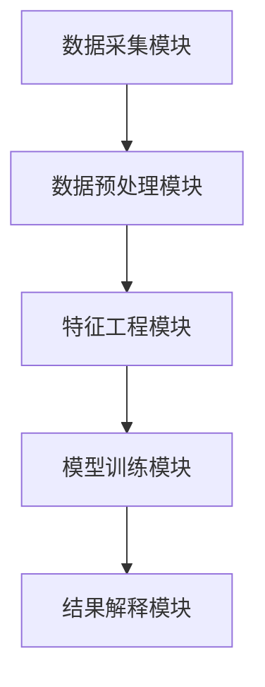

                 


# 企业AI Agent的因果推理在商业决策分析中的应用

> 关键词：企业AI Agent，因果推理，商业决策，因果图，潜在结果，因果推断

> 摘要：本文深入探讨了企业AI Agent在因果推理中的应用，分析了因果推理在商业决策中的重要性，详细讲解了因果推理的基本理论、算法实现、系统架构设计以及实际案例分析。通过本文，读者将了解如何利用因果推理提升商业决策的准确性和可靠性。

---

# 第一部分: 企业AI Agent的背景与基础

## 第1章: AI Agent与因果推理概述

### 1.1 AI Agent的基本概念

#### 1.1.1 AI Agent的定义
AI Agent（人工智能代理）是指能够感知环境、自主决策并采取行动以实现特定目标的智能实体。它可以在企业中用于自动化决策、优化资源分配、预测市场趋势等场景。

#### 1.1.2 AI Agent的核心特征
- **自主性**：能够独立感知环境并采取行动。
- **反应性**：能够实时响应环境变化。
- **目标导向性**：基于目标进行决策和行动。
- **学习能力**：通过数据和经验不断优化自身行为。

#### 1.1.3 AI Agent在企业中的作用
- **自动化决策**：在销售、营销、供应链等领域实现自动化决策。
- **优化资源分配**：通过数据驱动的方式优化企业资源分配。
- **预测与预警**：利用AI Agent预测市场趋势和潜在风险。

### 1.2 因果推理的基本概念

#### 1.2.1 因果关系的定义
因果关系是指一个事件（原因）导致另一个事件（结果）的发生。与相关性不同，因果关系强调“原因导致结果”的内在联系。

#### 1.2.2 因果推理与相关性的区别
- **相关性**：仅表示两个变量之间的统计关联，无法确定因果关系。
- **因果关系**：表明一个变量的变化是由于另一个变量的特定因果作用。

#### 1.2.3 因果推理在商业决策中的重要性
在商业决策中，因果推理能够帮助企业在复杂环境中识别真正的因果关系，避免被表面的相关性误导，从而做出更科学的决策。

### 1.3 企业AI Agent的应用场景

#### 1.3.1 商业决策分析
通过AI Agent分析市场数据、客户行为等，帮助企业在销售、定价、促销等决策中实现最优选择。

#### 1.3.2 客户行为预测
利用因果推理分析客户行为，预测客户流失、购买意愿等，从而制定更精准的营销策略。

#### 1.3.3 市场趋势分析
通过因果推理分析市场趋势，识别影响市场的主要因素，帮助企业提前做出应对策略。

### 1.4 本章小结
本章介绍了AI Agent的基本概念和核心特征，以及因果推理的基本定义和在商业决策中的重要性。通过分析企业AI Agent的应用场景，为后续的因果推理算法实现奠定了基础。

---

# 第二部分: 因果推理的理论基础

## 第2章: 因果推理的基本理论

### 2.1 因果关系的数学模型

#### 2.1.1 随机变量与条件概率
- 随机变量：表示可能取值的变量，例如客户购买行为。
- 条件概率：P(Y|X) 表示在X发生的情况下，Y发生的概率。

#### 2.1.2 因果关系的图表示
因果关系可以通过图模型（如因果图）进行表示，其中节点表示变量，边表示因果关系。

#### 2.1.3 潜在结果框架
潜在结果框架（Potential Outcome Framework）是因果推理的重要理论基础。它假设每个个体在不同的处理情况下会有不同的潜在结果。

### 2.2 因果图的构建与分析

#### 2.2.1 因果图的基本结构
因果图由节点（变量）和边（因果关系）组成。例如，广告投放（X）可能因果影响销售额（Y）。

#### 2.2.2 调整因果图的方法
- 删除不可观测的变量
- 调整后门条件
- 调整前门条件

#### 2.2.3 因果图在商业中的应用
通过因果图分析客户行为、市场趋势等，识别因果关系，优化商业策略。

### 2.3 因果推理的算法基础

#### 2.3.1 随机森林与因果推断
随机森林是一种强大的非参数方法，可以用于因果推断。通过构建多个决策树，随机森林能够捕捉复杂的因果关系。

#### 2.3.2 回归分析与因果关系
线性回归可以用于因果推断，但需要注意控制混杂变量。

#### 2.3.3 图模型与因果推理
图模型（如贝叶斯网络）可以用于因果推理，通过分析图的结构识别因果关系。

### 2.4 本章小结
本章详细介绍了因果关系的数学模型、因果图的构建与分析方法，以及因果推理的算法基础。这些内容为后续的算法实现和系统设计奠定了理论基础。

---

# 第三部分: 企业AI Agent的因果推理算法

## 第3章: 因果推理算法的实现

### 3.1 结构学习算法

#### 3.1.1 基于评分的结构学习
- 基于评分的结构学习通过评估不同的因果图结构，选择最优的因果图。

#### 3.1.2 基于搜索的结构学习
- 基于搜索的结构学习通过遍历可能的因果图结构，找到最优的因果图。

#### 3.1.3 基于分数的结构学习
- 基于分数的结构学习通过定义一个评分函数，评估因果图的优劣。

### 3.2 参数估计方法

#### 3.2.1 最大似然估计
最大似然估计是一种常用的方法，用于估计因果模型的参数。

#### 3.2.2 贝叶斯估计
贝叶斯估计通过先验分布和观测数据，推导出参数的后验分布。

#### 3.2.3 其他估计方法
包括矩估计、最小二乘法等。

### 3.3 因果推断的Python实现

#### 3.3.1 使用DoWhy库进行因果推断
```python
from dowhy import CausalGraph, DoWhy

# 定义因果图
graph = CausalGraph("Y", ["X", "Z"])
graph.add_edge("X", "Y")
graph.add_edge("Z", "Y")

# 初始化DoWhy
do = DoWhy(graph, treatment="X", outcome="Y")
do.run_causal_inference()
```

#### 3.3.2 使用Dowhy库实现潜在结果分析
```python
from dowhy import CausalGraph, DoWhy

# 定义因果图
graph = CausalGraph("Y", ["X", "Z"])
graph.add_edge("X", "Y")
graph.add_edge("Z", "Y")

# 初始化DoWhy
do = DoWhy(graph, treatment="X", outcome="Y")
do.run_potential_outcome_analysis()
```

#### 3.3.3 使用Dowhy库进行因果图构建
```python
from dowhy import CausalGraph, DoWhy

# 定义因果图
graph = CausalGraph("Y", ["X", "Z"])
graph.add_edge("X", "Y")
graph.add_edge("Z", "Y")

# 初始化DoWhy
do = DoWhy(graph, treatment="X", outcome="Y")
do.run_causal_graph_inference()
```

### 3.4 本章小结
本章详细介绍了因果推理的算法实现，包括结构学习和参数估计方法，并通过Python代码展示了如何使用DoWhy库进行因果推断。

---

# 第四部分: 企业AI Agent的系统架构与设计

## 第4章: 系统架构设计

### 4.1 问题场景介绍
假设我们有一个电商企业，希望通过AI Agent进行客户流失预测，识别客户流失的因果因素，并制定相应的挽留策略。

### 4.2 系统功能设计

#### 4.2.1 领域模型设计


#### 4.2.2 系统架构设计


### 4.3 系统接口设计

#### 4.3.1 数据接口
- 数据输入接口：接收客户数据、市场数据等。
- 数据输出接口：输出分析结果、预测结果等。

#### 4.3.2 模型接口
- 模型输入接口：接收特征向量。
- 模型输出接口：输出预测结果。

### 4.4 系统交互设计

#### 4.4.1 交互流程
1. 数据采集模块采集客户数据和市场数据。
2. 数据预处理模块清洗数据。
3. 特征工程模块提取特征。
4. 模型训练模块训练因果推理模型。
5. 结果解释模块解释模型结果。

### 4.5 本章小结
本章详细介绍了企业AI Agent的系统架构设计，包括领域模型、系统架构、接口设计和交互流程。

---

# 第五部分: 项目实战与案例分析

## 第5章: 项目实战

### 5.1 环境安装

#### 5.1.1 安装Python环境
```bash
python -m pip install --upgrade pip
pip install python-dotenv
pip install dowhy
pip install graphviz
```

### 5.2 系统核心实现

#### 5.2.1 数据准备
```python
import pandas as pd

# 读取数据
data = pd.read_csv("customer_data.csv")
```

#### 5.2.2 特征工程
```python
from sklearn.preprocessing import StandardScaler

# 标准化特征
scaler = StandardScaler()
X_scaled = scaler.fit_transform(data.drop(columns=["customer_id", "churn"]))
```

#### 5.2.3 模型训练
```python
from dowhy import CausalGraph, DoWhy

# 定义因果图
graph = CausalGraph("churn", ["advertisement", "price"])
graph.add_edge("advertisement", "churn")
graph.add_edge("price", "churn")

# 初始化DoWhy
do = DoWhy(graph, treatment="advertisement", outcome="churn")
do.run_causal_inference()
```

#### 5.2.4 结果解释
```python
# 查看因果效应
do.get_treatment_effect()
```

### 5.3 项目小结
本章通过一个实际项目展示了如何利用因果推理提升商业决策的准确性。通过数据准备、特征工程、模型训练和结果解释，读者可以掌握因果推理在实际项目中的应用。

---

# 第六部分: 总结与展望

## 第6章: 总结与展望

### 6.1 本章总结
本文深入探讨了企业AI Agent在因果推理中的应用，分析了因果推理在商业决策中的重要性，并详细讲解了因果推理的算法实现和系统架构设计。通过实际案例分析，读者可以掌握如何利用因果推理提升商业决策的准确性和可靠性。

### 6.2 未来展望
未来的研究方向包括更复杂的因果图构建方法、更高效的因果推断算法以及因果推理在更多商业场景中的应用。

---

# 作者

作者：AI天才研究院/AI Genius Institute & 禅与计算机程序设计艺术 /Zen And The Art of Computer Programming

---

本文通过系统化的分析和详细的案例展示，帮助读者全面理解企业AI Agent的因果推理在商业决策中的应用。从理论到实践，从基础到高级，本文为读者提供了一个完整的知识框架。希望本文能够为企业的智能化转型和商业决策的优化提供有价值的参考。

